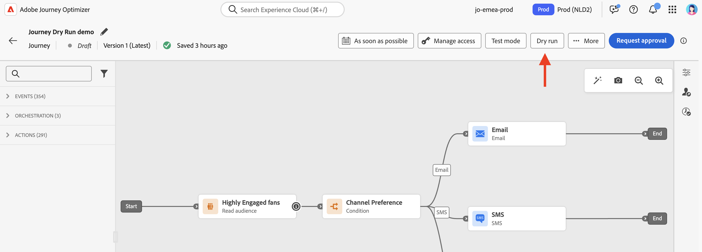
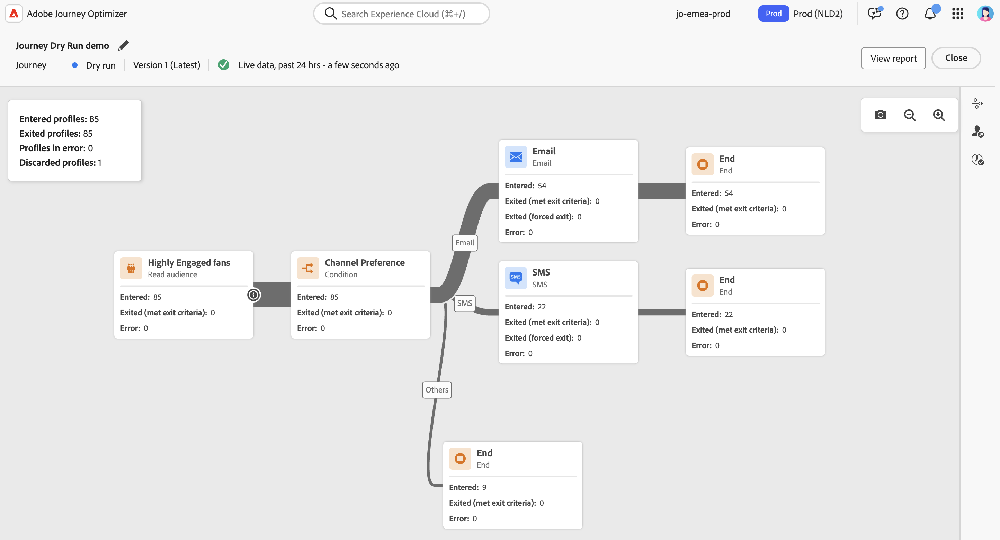
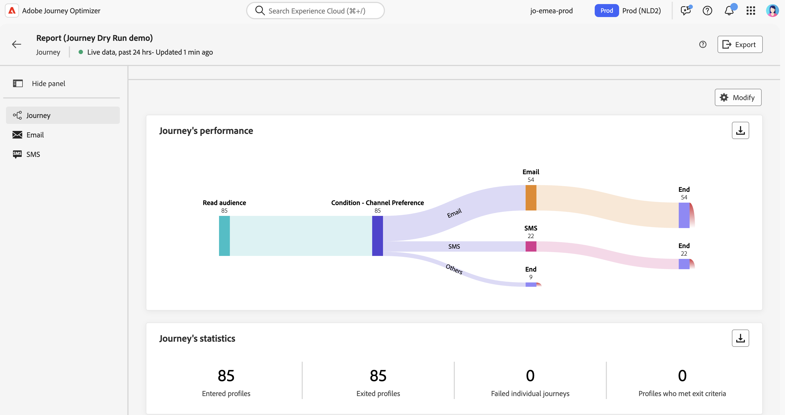

# Journey Dry run {#journey-dry-run}

>[!CONTEXTUALHELP]
>id="ajo_journey_dry_run"
>title="Dry run your journey"
>abstract="Once you designed your journey, execute a dry run to confirm it is functional and ensure steps are correct. This publication mode lets you smoke test a journey, without sending communication to any profile."

Journey Dry run is a special journey publication mode in Adobe Journey Optimizer that allows marketers to test a journey using real production data without contacting real customers or updating profile information.  This feature helps marketers gain confidence in their journey design and audience targeting before publishing it live. 

>[!AVAILABILITY]
>
>This capability is only available for a set of organizations (Limited Availability). To gain access, contact your Adobe representative.

## Key benefits {#journey-dry-run-benefits}

Journey Dry run boosts practitioner confidence and journey success by enabling safe, data-driven testing of customer journeys using real production data—without the risk of contacting customers or altering profile information. This feature empowers marketers to validate audience reach and branch logic before going live, ensuring that journeys align with their intended business goals.

With Journey Dry run, you gain the ability to identify issues early, optimize targeting strategies, and improve journey design based on actual data—not assumptions. Integrated directly into the journey canvas, Dry run delivers intuitive reporting and visibility into key performance indicators, allowing teams to iterate confidently and streamline approval workflows. This enhances operational efficiency, reduces launch risk, and drives better customer engagement outcomes.

Ultimately, this feature improves time-to-value, reduces journey failures, and strengthens Adobe's position as the trusted platform for orchestrating personalized, high-impact journeys.

Journey Dry run brings:

1. **Safe testing environment**: Profiles in Dry run mode are not contacted, ensuring no risk of sending communications or impacting live data. 
1. **Audience insights**: Marketers can predict audience reachability at various journey nodes, including opt-outs, exclusions, and other conditions. 
1. **Real-Time feedback**: Metrics are displayed directly in the journey canvas, similar to live reporting, enabling marketers to refine their journey design. 

## Start a Dry run {#journey-dry-run-start}

You can use the Dry run capability in any Draft journey with no error.

To activate Dry run, follow these steps:

1. Open the journey you want to test. 
1. Click on the **Dry run** button.

    

1. Confirm the publication

    A status message, **Activating Dry run**, appears while the transition is happening.

1. Once activated, the journey enters Dry run mode. 

During the Dry run, the journey is executed with the following specificities:

* **Channel action** nodes with Email, SMS or Push notifications are not executed.
* **Custom actions** are disabled during Dry run, and their responses are set to null. 
* **Wait nodes** are bypassed during Dry run. 
    You can override the wait block timeouts, then if you have wait blocks duration longer than allowed dry run journey duration, then that branch will not execute completely.
* **External data sources** are executed by default. 

>[!NOTE]
>
> * Profiles in Dry run mode are counted towards engageable profiles. 
> * Dry run journeys do not impact business rules. For example, a profile in a Dry run journey will not be excluded from other journeys due to rules like `1 journey per day`.

## Monitor a Dry run {#journey-dry-monitor}

Once the Dry mode publication is launched, you can visualize the journey execution and how profiles progress through journey branches and nodes.

Metrics are displayed directly in the journey canvas.

For each activity, you can check:

* **[!UICONTROL Entered]**: Total number of individuals who entered this activity.
* **[!UICONTROL Exited (met exit criteria)]**: Total number of individuals who exited the journey from that activity, due to an exit criteria.
* **[!UICONTROL Exited (forced exit)]**: Total number of individuals who exited.
* **[!UICONTROL Error]**: Total number of individuals who had an error on that activity.

At the journey level, you can check: 

* The total number of **Entered profiles**
* The total number of **Exited profiles**
* The total number of **Profiles in error**
* The total number of **Discarded profiles** in the journey

You can also access the **Last 24-hours reports** and **All-time reports** for the Dry run. To access these reports, click the **View report** button  on the upper-right corner of the journey canvas.

>[!CAUTION]
>
> Reporting data is available only when the Dry run is **active**.  Once stopped, reporting data will no longer be accessible. Use the **Export** button above the reports to download them if needed.

## Stop a Dry run {#journey-dry-run-stop}

Dry run journeys must be stopped manually. Click the **Close** button to end the test, and confirm.

After 14 days, Dry run journeys automatically transition to the Draft status.
