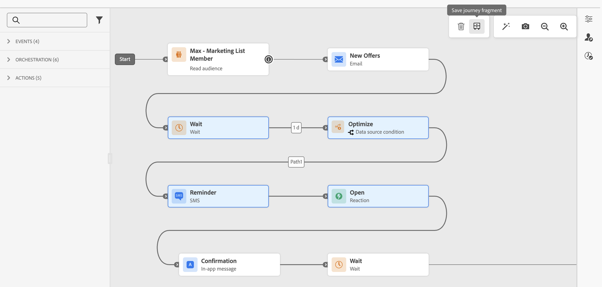
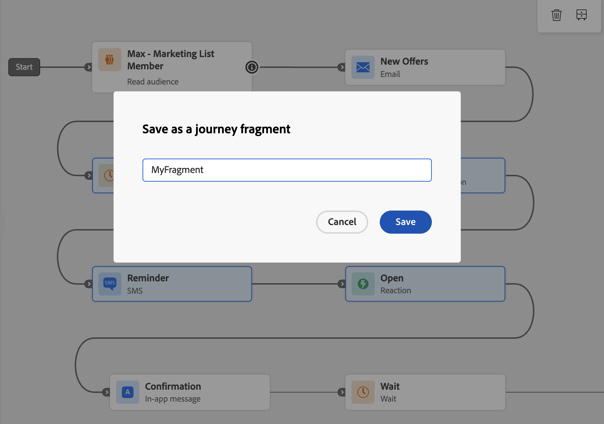
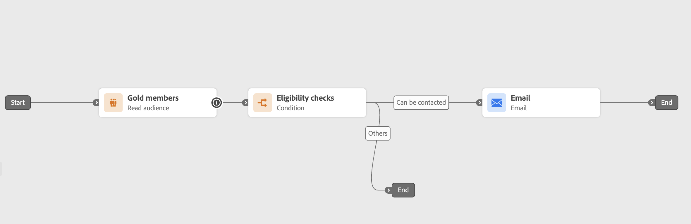
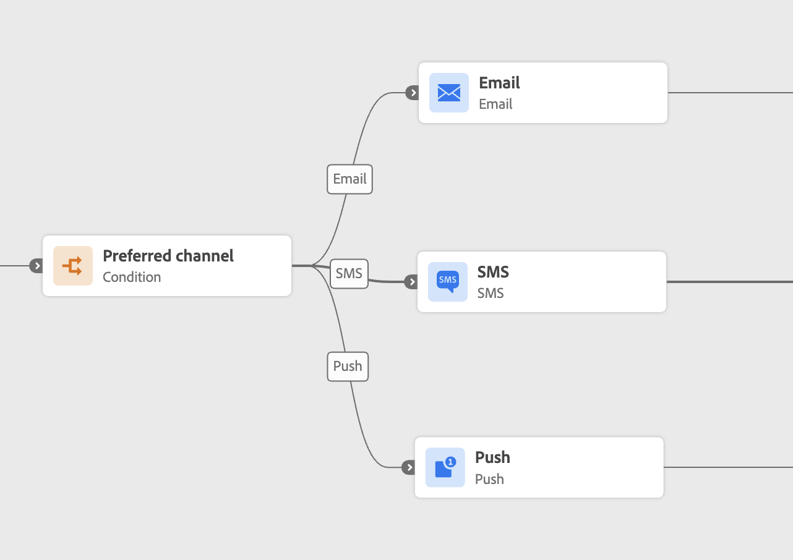
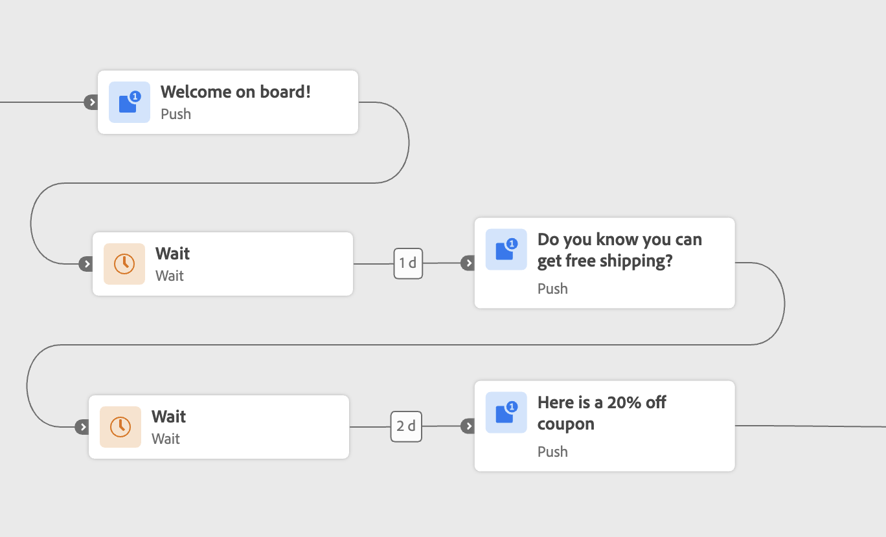
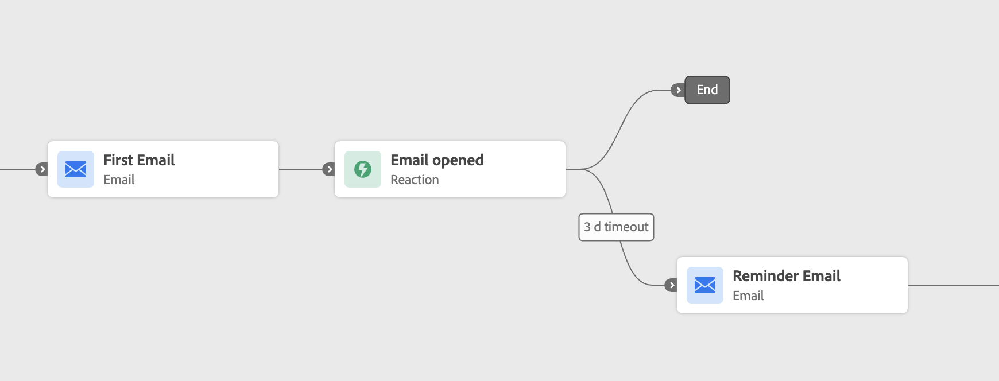

# Journey Fragments {#journey-fragments}

Journey Fragments are reusable sets of journey nodes that you can build once and drop into any journey across your sandbox. Whether it's an eligibility check, a preferred channel routing logic, or a welcome sequence, fragments help teams move faster and stay consistent — without rebuilding the same logic from scratch every time. [See use case examples.](#examples)

Once created, fragments are stored in a dedicated **[!UICONTROL Fragment Inventory]** and can be inserted into any journey using the **[!UICONTROL Journey fragments]** activity.

>[!NOTE]
>Journey fragments use a **copy behavior**: inserting a fragment into a journey creates a static copy of the original nodes. Any updates made to the original fragment are not reflected in journeys that have already used it.

## Permissions {#journey-fragments-permissions}

To work with journey fragments, you need the following [permissions](../administration/permissions.md):

* **Manage Journeys** — required to create, edit, and delete fragments.
* **Publish Journeys** — required to activate a fragment.

## Access the Fragment Inventory {#journey-fragments-inventory}

Journey fragments are accessible from the **[!UICONTROL Journeys]** section. Open the **[!UICONTROL Fragments]** tab to browse all available fragments in your sandbox.

You can filter the list by fragment name, status, creation date, creator, last modified date, or tag.

## Create a journey fragment {#create-journey-fragment}

>[!CONTEXTUALHELP]
>id="ajo_journey_fragment_create_canvas"
>title="Save as a journey fragment"
>abstract="A unique fragment name is entered before saving. The selected nodes are saved as a reusable fragment available in the Fragment Inventory."

You can create a journey fragment in two ways: directly from the journey canvas (recommended), or from the Fragment Inventory.

>[!BEGINTABS]

>[!TAB From the journey canvas]

To save journey nodes as a fragment directly from the journey canvas:

1. Open a journey and select one or more connected nodes on the canvas.
1. Click the **[!UICONTROL Save as Fragment]** icon in the toolbar.

    

1. Enter a unique name for the fragment within your sandbox.

    

1. Click **[!UICONTROL Save]**. The fragment is saved as a draft.

>[!TIP]
>
>If you create a fragment from a journey, [test or simulate your journey](testing-the-journey.md) **before** saving the fragment to ensure the selected nodes behave as expected.

>[!TAB From the fragment inventory]

To create a fragment directly from the inventory:

1. Navigate to **[!UICONTROL Journeys]** > **[!UICONTROL Journey fragments]** tab.
1. Click **[!UICONTROL Create journey fragment]**.
1. In the fragment authoring canvas, add and configure journey activities.
1. When done, click **[!UICONTROL Save]** to save the fragment as a draft.

>[!CAUTION]
>
>Test mode and simulation are not available in the fragment editor. This means you cannot validate the behavior of the configured activities before the fragment is activated and inserted into a journey. For fragments where logic accuracy is critical, consider [building and testing or simulating the nodes in a full journey](testing-the-journey.md) first, then saving them as a fragment from the canvas tab above.

>[!ENDTABS]

## Edit a fragment {#edit-journey-fragment}

>[!CONTEXTUALHELP]
>id="ajo_journey_fragment_properties"
>title="Journey fragment properties"
>abstract="Opening a fragment from the inventory allows its nodes, properties, tags, or labels to be modified. Active fragments must be deactivated before they can be edited."

To edit a fragment, open it from the **[!UICONTROL Fragment Inventory]** by clicking its name. In the fragment authoring UI, you can:

* Add, remove, or modify activities.
* Set or update fragment properties: name, tags, and labels.

>[!NOTE]
>
>* Only **[!UICONTROL Draft]** fragments can be edited. To modify an **[!UICONTROL Active]** fragment, deactivate it first.
>
>* Test mode and simulation are not available in the fragment editor. Test or simulate any journey-level logic in the full journey before saving nodes as a fragment.
>
>* [Jump](jump.md) activities are not allowed inside a fragment.

## Manage your fragments {#manage-journey-fragments}

### Fragment statuses {#fragment-statuses}

Journey fragments follow a lifecycle with the following statuses:

| Status | Description |
|---|---|
| **[!UICONTROL Draft]** | The fragment is being authored and is not yet available for use in journeys. |
| **[!UICONTROL Active]** | The fragment is ready to be used in journeys. |
| **[!UICONTROL Archived]** | The fragment has been archived and is no longer available for use in journeys. |

The following rules apply to fragment status transitions:

* Only **[!UICONTROL Draft]** fragments can be activated. Open a draft fragment and use the **[!UICONTROL Activate]** icon.
* Only **[!UICONTROL Active]** fragments can be deactivated or archived.
* Only **[!UICONTROL Archived]** fragments can be unarchived. Unarchiving a fragment returns it to **[!UICONTROL Draft]** state.
* Only **[!UICONTROL Draft]** fragments can be deleted.

>[!NOTE]
>When activating a fragment, most of the same validation checks that run during journey publication are applied. However, **contextual attributes are not validated** and **governance policies are not enforced** at activation time — both are evaluated when the fragment is inserted and used in a journey.

### Fragment actions {#fragment-actions}

From the fragment inventory, you can perform the following actions on a fragment:

* **[!UICONTROL Open]**: edit the fragment by clicking on its name.
* **[!UICONTROL Duplicate]**: create a copy of the fragment, from the **[!UICONTROL More actions]** (...) icon.
* **[!UICONTROL Archive]**: archive a fragment (available for **[!UICONTROL Active]** fragments only), from the **[!UICONTROL More actions]** (...) icon. Archived fragments are no longer available in the fragment picker.
* **[!UICONTROL Unarchive]**: restore an archived fragment (available for **[!UICONTROL Archived]** fragments only), from the **[!UICONTROL More actions]** (...) icon. The fragment returns to **[!UICONTROL Draft]** state.
* **[!UICONTROL Delete]**: permanently delete a fragment (available for **[!UICONTROL Draft]** fragments only), from the **[!UICONTROL More actions]** (...) icon.
* **[!UICONTROL Edit tags]**: add or remove tags of a fragment, from the **[!UICONTROL More actions]** (...) icon.

## Use a fragment in a journey {#use-journey-fragment}

>[!CONTEXTUALHELP]
>id="ajo_journey_fragment_add"
>title="Add a journey fragment"
>abstract="Only **[!UICONTROL Active]** fragments are available in the picker. Inserting a fragment creates a **static copy** of its nodes — updates to the original fragment are not reflected in the journey."

To insert a fragment into a journey:

1. Open your journey and drag the **[!UICONTROL Journey fragments]** activity from the left rail.
1. Drop it into an existing branch, or onto an empty canvas. A fragment picker appears.
1. Browse or search for the fragment you want to use. You can preview a fragment or open it in another tab before inserting it.
1. Select the fragment. Its nodes are copied into the canvas at the drop point.

>[!NOTE]
>Only **[!UICONTROL Active]** fragments are available in the picker. Inserting a fragment creates a **static copy** of its nodes — any subsequent updates to the original fragment are not reflected in the journey.
>
>When dropping a fragment onto an empty canvas, the fragment must start with a **[!UICONTROL Read Audience]**, **[!UICONTROL Audience Qualification]**, or **[!UICONTROL Event]** node (same rule as when starting any journey).

## Guardrails and limitations {#guardrails}

The following guardrails apply to journey fragments:

**Fragment creation**

* Fragment names must be **unique per sandbox**.
* A fragment can only have **one entry path**. Selections with more than one entry point cannot be saved as a fragment.
* Only **connected nodes** can be saved together as a fragment.
* A fragment **cannot contain a [Jump](jump.md) activity**.
* A fragment can contain a **maximum of 20 nodes**.
* A sandbox can have a **maximum of 200 active fragments**.

**Fragment usage**

* Only **[!UICONTROL Active]** fragments can be inserted into a journey.
* Inserting a fragment creates a **static copy** of its nodes. Updates to the original fragment are not propagated to journeys where it has been used.
* A fragment can be dropped into an existing branch or onto an empty canvas. When dropped onto an empty canvas, the fragment must start with a **[!UICONTROL Read Audience]**, **[!UICONTROL Audience Qualification]**, or **[!UICONTROL Event]** node.

**General**

* Fragments can be found using the [Unified Search](../start/search-filter-categorize.md) bar under the **[!UICONTROL Journey Fragments]** category.
* [Tags](tags.md) and **Labels** are supported on fragments.
* [Audit Logs](../privacy/audit-logs.md) are supported.
* Journeys running on the old stack (using Inline Campaigns) do not support journey fragments. Duplicate such a journey to move to the new stack before using this feature.
* Journey fragments support [Sandbox tooling](../configuration/copy-objects-to-sandbox.md). Fragments can be packaged and exported to another sandbox.

## Use case examples {#examples}

The following examples illustrate common journey patterns that can be saved and reused as journey fragments.

**Eligibility checks**

A standard entry pattern — such as a [Read Audience](read-audience.md) node followed by eligibility filters — can be encapsulated into a fragment. This allows teams to maintain consistency in how profiles enter journeys while reducing setup time. The fragment can be the [Optimize](optimize.md) activity only, or the Read Audience and Optimize activity together.

**Preferred channel**

A fragment can evaluate a profile's preferred communication channel — email, push, or SMS — and route the profile accordingly. This logic can be reused across any journey involving outbound messaging, ensuring consistent channel preference management. The fragment can include the [Optimize](optimize.md) activity and all three channel branches.

**Onboarding welcome sequence**

A timed welcome sequence — such as a series of three messages introducing a product or service — can be saved as a fragment. This is useful for onboarding new users across different audience segments or product lines. The fragment can include the [Wait](wait-activity.md) activities and the message nodes.

**Reaction-based wait and reminder**

A fragment can encapsulate an Email activity followed by a [Reaction](reaction-events.md), waiting for the profile to open the email within a set number of days and sending a reminder if they did not. This logic is commonly reused in nurturing journeys and trial conversion flows. The fragment can include the Email and Reaction activities.

## Frequently asked questions {#faq}

**How is a Journey Fragment different from a Fragment (content fragment)?**

**Journey Fragments** are reusable sets of journey nodes — such as eligibility checks or channel routing logic — that you insert into a journey using the **[!UICONTROL Journey fragments]** activity. **[Fragments](../content-management/fragments.md)** are reusable content components (for example, a header or footer) used inside emails across campaigns and journeys. In short, Journey Fragments are reusable *logic*, while content Fragments are reusable *content*.

**How is a Journey Fragment different from an AEM Content Fragment?**

**[AEM Content Fragments](../integrations/aem-fragments.md)** are content authored in Adobe Experience Manager and reused in [!DNL Journey Optimizer] messages. They are not journey logic. Journey Fragments, by contrast, are built and stored within [!DNL Journey Optimizer] and represent sets of connected journey nodes.

**If I update a Journey Fragment, do existing journeys update too?**

No. Journey fragments use a **copy behavior**: inserting a fragment creates a static copy of its nodes. Any updates made to the original fragment are not reflected in journeys that have already used it.
