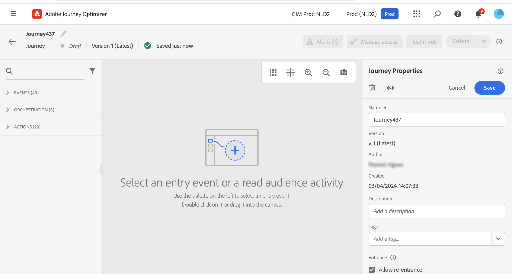
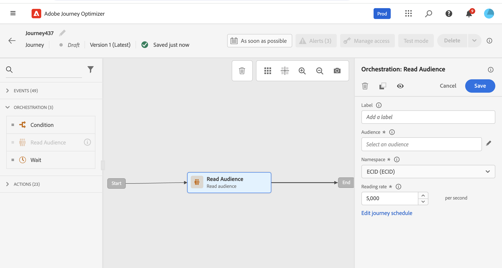
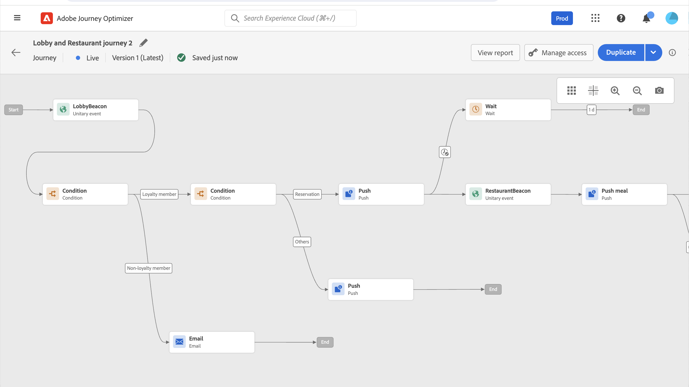
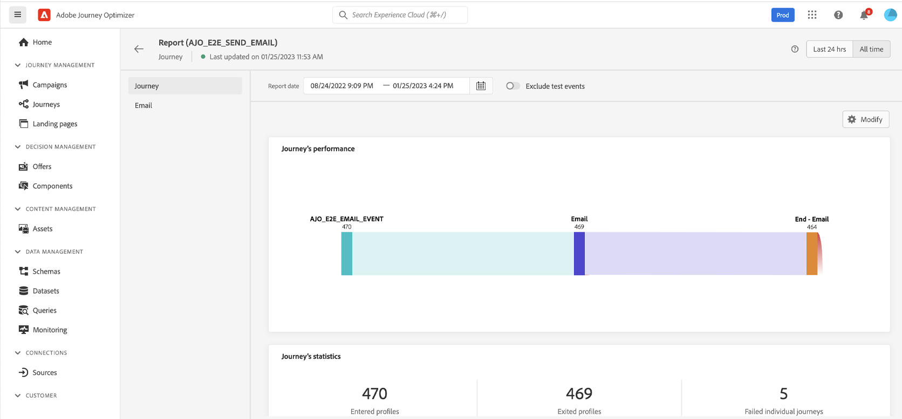

# Create your first journey {#jo-quick-start}

>[!CONTEXTUALHELP]
>id="ajo_homepage_card2"
>title="Create journeys"
>abstract="Use **[!DNL Adobe Journey Optimizer]** to build real-time orchestration use cases using contextual data stored in events or data sources."

>[!CONTEXTUALHELP]
>id="ajo_journey_create"
>title="Journeys"
>abstract="Design customer journeys to deliver personalized, contextual experiences. Journey Optimizer allows you to build real-time orchestration use cases with contextual data stored in events or data sources. The **Overview** tab displays a dashboard with key metrics related to your journeys. The **Browse** tab displays the list of existing journeys."

[!DNL Adobe Journey Optimizer] includes an omnichannel orchestration canvas which allows marketers to harmonize marketing outreach with one-to-one customer engagement. The user interface allows you to easily drag and drop activities from the palette into the canvas to build your journey. The journey user interface is detailed on [this page](journey-ui.md).

The main steps to create a journey are detailed on this page. They are streamlined as follows:

In this guide, you will:

* Define a journey entry point — an audience segment or a real-time event
* Add message actions across channels (email, push, or SMS)
* Test your journey with test profiles before activation
* Publish your journey and monitor its performance

Build multi-step customer journeys to initiate a sequence of interactions, offers, and messages across channels in real time. This approach ensures customers are engaged at the optimal moments based on their actions and relevant business signals. Target audiences are defined based on behavior, contextual data, and business events. Prerequisites depend on your use case and the [type of journey](entry-management.md#types-of-journeys) you are building.

Learn more about how profiles flow through journeys and journey processing rates in [this section](entry-management.md#journey-processing-rate).

<!--
>[!TIP]
>
>Not sure whether to use a journey or a campaign? [Learn how to choose the right approach](../start/journeys-vs-campaigns.md).
-->

## Before you start {#prerequisites}

What you need to configure before building depends on how your journey is triggered. Most journeys start from one of these two entry points:

* **Audience-based entry** — The journey runs for a defined set of profiles at a scheduled time. [Create an audience](../audience/about-audiences.md) in Adobe Experience Platform before building your journey. This is the recommended starting point if you are new to Journey Optimizer.

* **Event-based entry** — The journey is triggered in real time when an individual performs an action, such as a purchase or a sign-up. [Configure an event](../event/about-events.md) to define the trigger and the data it carries.

The following elements are optional, but may be required depending on your use case:

* **Data source** — To enrich journey conditions or personalization with data from an external system, set up a [data source](../datasource/about-data-sources.md).

* **Custom action** — If you deliver messages through a third-party system rather than the built-in channels, configure a [custom action](../action/action.md).

>[!NOTE]
>
>If you are a data engineer responsible for the technical setup (events, data sources, and actions), refer to [this section](../configuration/about-data-sources-events-actions.md).

>[!NOTE]
>
>Journey guardrails and limitations are detailed on [this page](../start/guardrails.md).

## Create a journey {#jo-build}

To create a multi-step journey, follow these steps:

1. In the JOURNEY MANAGEMENT menu section, click **[!UICONTROL Journeys]**.

1. Click the **[!UICONTROL Create Journey]** button to create a new journey.

1. Edit the journey's configuration pane to define the name of the journey and set its properties. Learn how to set your journey's properties on [this page](journey-properties.md).

   >[!TIP]
   >
   >**Which journey type should I choose?** If you are new to Journey Optimizer, start with an audience-based journey using a **[!UICONTROL Read Audience]** activity — it requires no prior event configuration and is the easiest way to get familiar with the canvas. For real-time, event-triggered experiences (for example, reacting to a purchase or a form submission), configure an event first and use an event-based entry. Learn more about [journey types](entry-management.md#types-of-journeys).

    

You can then start designing your journey.

## Design the journey {#jo-design}

The journey designer lets you build multi-step journeys using an intuitive drag-and-drop interface. Activities in the left palette are organized into three categories: **Events**, **Orchestration**, and **Actions**. For a full overview of the canvas and its controls, refer to [this page](using-the-journey-designer.md).

Follow these steps to design your journey:

1. **Add an entry point** — Drag an event or a **[!UICONTROL Read Audience]** activity from the palette onto the canvas. This defines how profiles enter the journey: individually in real time (event-based) or all at once from a defined audience (audience-based).

    

1. **Add message actions** — From the **[!UICONTROL Actions]** section of the palette, drag a channel action onto the canvas to send messages to profiles flowing through the journey. Actions are available for email, push notifications, SMS, and more.

1. **Add orchestration activities** — Use a **[!UICONTROL Condition]** activity to branch the journey into multiple paths based on profile attributes or behavior. Use a **[!UICONTROL Wait]** activity to introduce a time delay between steps.

>[!TIP]
>
>For journeys with multiple phases or many touchpoints, consider breaking the end-to-end flow into smaller sub-journeys connected with the **[!UICONTROL Jump]** activity. This reduces complexity and makes each sub-journey easier to test independently. Learn more in [Design strategy: bite-sized sub-journeys](jump.md#jump-strategy).

## Test the journey {#jo-test}

Once you have built your journey, test it before publishing. Journey Optimizer offers a **Test mode** as a way to view test profiles as they move along the journey, detecting potential errors before activation. Running quick tests ensures that journeys operate correctly so that you can publish them with confidence. Learn how to test your journey [in this section](testing-the-journey.md)

You can also execute your journey in **Dry run**. Journey Dry run is a special journey publication mode in Adobe Journey Optimizer that allows journey practitioners to test a journey using real production data without contacting real customers or updating profile information. This feature helps journey practitioners gain confidence in their journey design and audience targeting before publishing it live. Learn how to publish a journey in Dry run mode [in this section](journey-dry-run.md).

## Publish the journey {#jo-pub}

You must publish a journey to activate it and make it available for new profiles to enter it. Before publishing your journey, verify that it is valid and that there are no errors. You cannot publish a journey with errors. Learn more about journey publication in this [section](publish-journey.md).

Once published, you can monitor your journey using the dedicated reporting tools to measure your journey's effectiveness. 

Learn more about journey reports in this [section](../reports/live-report.md).

## Common use cases {#use-cases}

Not sure where to start? Here are three typical scenarios where journeys deliver the most value:

<table style="table-layout:fixed">
  <tr style="border: 0;">
    <td>
      
      
<strong>Welcome series</strong> Automatically onboard new users with a sequence of messages after sign-up, guiding them through your product or service.

    </td>
    <td>
      
      
<strong>Cart abandonment</strong> Re-engage customers who left without completing a purchase by sending a timely reminder with personalized content.

    </td>
    <td>
      
      
<strong>Re-engagement</strong> Win back inactive users with targeted offers or updates based on their last known behavior.

    </td>
  </tr>
  <tr style="border: 0;">
    <td align="center"></td>
    <td align="center"></td>
    <td align="center"></td>
  </tr>
</table>

## Additional resources

* **[Journey designer overview](using-the-journey-designer.md)** - Master the journey canvas interface to design and orchestrate customer journeys.
* **[Journey activities](about-journey-activities.md)** - Discover all available activities including events, actions, and orchestration components.
* **[Testing journeys](testing-the-journey.md)** - Learn how to test your journeys using test mode before publishing to production.
* **[Publishing journeys](publish-journey.md)** - Understand the journey publication process and how to manage live journeys.
* **[Journey reporting](report-journey.md)** - Track and analyze journey performance with detailed metrics and insights.
* **[Troubleshooting journeys](troubleshooting.md)** - Find solutions to common journey issues and best practices for debugging.
* **[Journey tutorials](https://experienceleague.adobe.com/en/docs/journey-optimizer-learn/tutorials/journeys/introduction-to-building-a-journey){target="_blank"}** - Explore step-by-step video tutorials on journey building and best practices.

