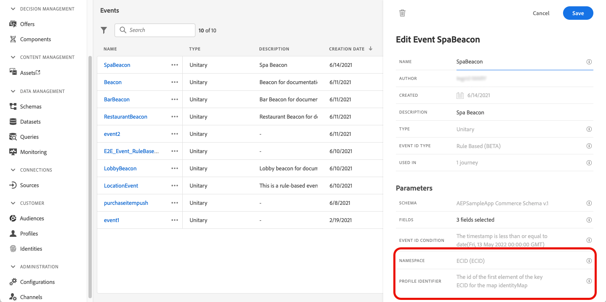
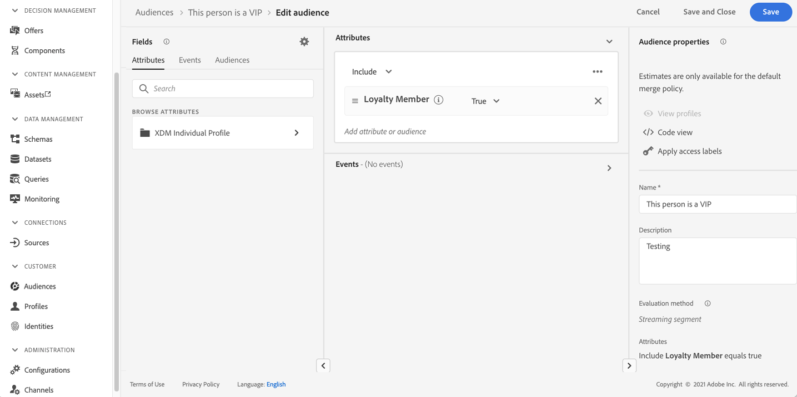
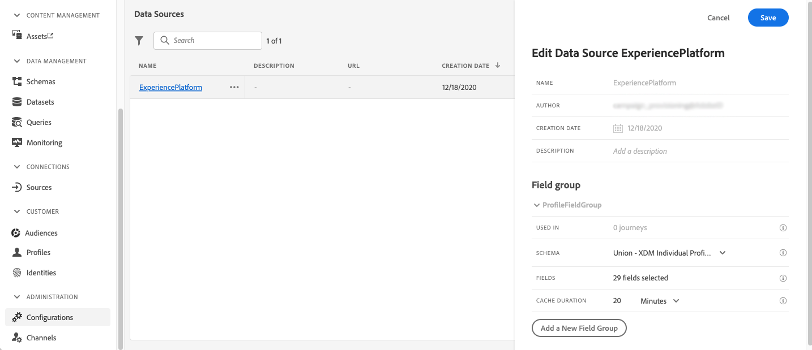
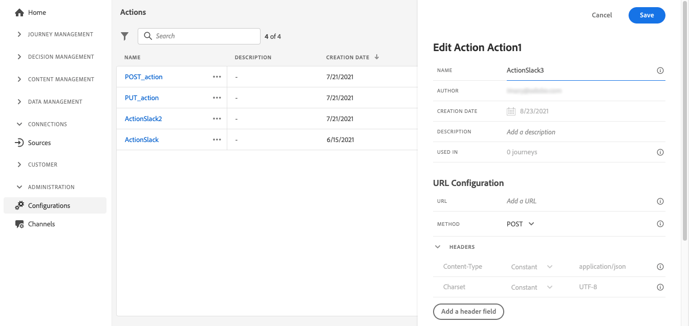

# Create your first journey {#jo-quick-start}

>[!CONTEXTUALHELP]
>id="ajo_homepage_card2"
>title="Create journeys"
>abstract="Use **Adobe Journey Optimizer** to build real-time orchestration use cases using contextual data stored in events or data sources."

>[!CONTEXTUALHELP]
>id="ajo_journey_create"
>title="Journeys"
>abstract="Design customer journeys to deliver personalized, contextual experiences. Journey Optimizer allows you to build real-time orchestration use cases with contextual data stored in events or data sources. The **Overview** tab displays a dashboard with key metrics related to your journeys. The **Browse** tab displays the list of existing journeys."

Adobe Journey Optimizer includes an omnichannel orchestration canvas which allows marketers to harmonize marketing outreach with one-to-one customer engagement. The user interface allows you to easily drag and drop activities from the palette into the canvas to build your journey. The journey user interface is detailed on [this page](journey-ui.md).

The main steps to create a journey are detailed on this page. They are streamlined as follows:

Build multi-step customer journeys to initiate a sequence of interactions, offers, and messages across channels in real time. This approach ensures customers are engaged at the optimal moments based on their actions and relevant business signals. Target audiences are defined based on behavior, contextual data, and business events. Prerequisites depend on your use case and the [type of journey](entry-management.md#types-of-journeys) you are building.

Learn more about how profiles flow through journeys and journey processing rates in [this section](entry-management.md#journey-processing-rate).

Before starting to build your journey, ensure the relevant configuration steps are completed:

* If you want to trigger your journeys individually when an event is received, **configure an event**. Define the expected information and how to process it. [Read more](../event/about-events.md).

<!--     -->
 
* Your journey can also listen to Adobe Experience Platform audiences to send messages in batches to a specified set of profiles. For this, **create audiences**. [Read more](../audience/about-audiences.md).

<!--     -->

* Define a connection to a system to retrieve additional information that will be used in your journeys, for example, in your conditions. This connection relies on a **data source**. [Read more](../datasource/about-data-sources.md).

<!--     -->

* Journey Optimizer comes with [built-in message](../building-journeys/journeys-message.md) capabilities. If you are using a third-party system to send your messages, you can **create a custom action**. Learn more in this [section](../action/action.md). 

<!--      -->

As a data engineer, steps to configure your journeys, including Data Sources, Events and Actions are detailed in [this section](../configuration/about-data-sources-events-actions.md).

>[!NOTE]
>
>Journey guardrails and limitations are detailed on [this page](../start/guardrails.md)

## Create a journey {#jo-build}

To create a multi-step journey, follow these steps:

1. In the JOURNEY MANAGEMENT menu section, click **[!UICONTROL Journeys]**.

1. Click the **[!UICONTROL Create Journey]** button to create a new journey.

1. Edit the journey's configuration pane to define the name of the journey and set its properties. Learn how to set your journey's properties on [this page](journey-properties.md).

    

You can then start designing your journey.

## Design the journey {#jo-design}

The omnichannel journey designer helps you build multi-step journeys with targeted audiences, updates based on real-time customer or business interactions, and omnichannel messages using an intuitive drag-and-drop interface.

1. Start by drag and dropping an event or a **Read Audience** activity from the palette into the canvas. To learn more about journey design, refer to [this section](using-the-journey-designer.md).

    

1. Drag and drop an event or a **Read Audience** activity from the palette into the canvas. To learn more about journey design, refer to [this section](using-the-journey-designer.md).

## Test the journey {#jo-test}

Once you have built your journey, test it before publishing. Journey Optimizer offers a **Test mode** as a way to view test profiles as they move along the journey, detecting potential errors before activation. Running quick tests ensures that journeys operate correctly so that you can publish them with confidence. Learn how to test your journey [in this section](testing-the-journey.md)

You can also execute your journey in **Dry run**. Journey Dry run is a special journey publication mode in Adobe Journey Optimizer that allows journey practitioners to test a journey using real production data without contacting real customers or updating profile information. This feature helps journey practitioners gain confidence in their journey design and audience targeting before publishing it live. Learn how to publish a journey in Dry run mode [in this section](journey-dry-run.md).

## Publish the journey {#jo-pub}

You must publish a journey to activate it and make it available for new profiles to enter it. Before publishing your journey, verify that it is valid and that there are no errors. You cannot publish a journey with errors. Learn more about journey publication in this [section](publish-journey.md).

Once published, you can monitor your journey using the dedicated reporting tools to measure your journey's effectiveness. 

Learn more about journey reports in this [section](../reports/live-report.md).

## Additional resources

* **[Journey designer overview](using-the-journey-designer.md)** - Master the journey canvas interface to design and orchestrate customer journeys.
* **[Journey activities](about-journey-activities.md)** - Discover all available activities including events, actions, and orchestration components.
* **[Testing journeys](testing-the-journey.md)** - Learn how to test your journeys using test mode before publishing to production.
* **[Publishing journeys](publish-journey.md)** - Understand the journey publication process and how to manage live journeys.
* **[Journey reporting](report-journey.md)** - Track and analyze journey performance with detailed metrics and insights.
* **[Troubleshooting journeys](troubleshooting.md)** - Find solutions to common journey issues and best practices for debugging.
* **[Journey tutorials](https://experienceleague.adobe.com/en/docs/journey-optimizer-learn/tutorials/journeys/introduction-to-building-a-journey){target="_blank"}** - Explore step-by-step video tutorials on journey building and best practices.

>[!NOTE]
>
>If you need to modify a **live** journey, [create a new version](journey-ui.md#journey-versions) of your journey.
