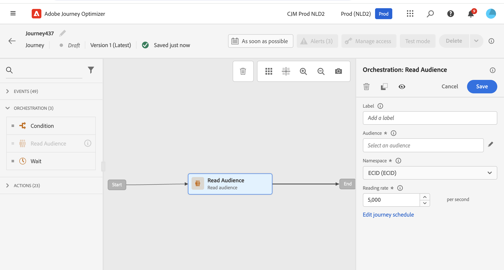
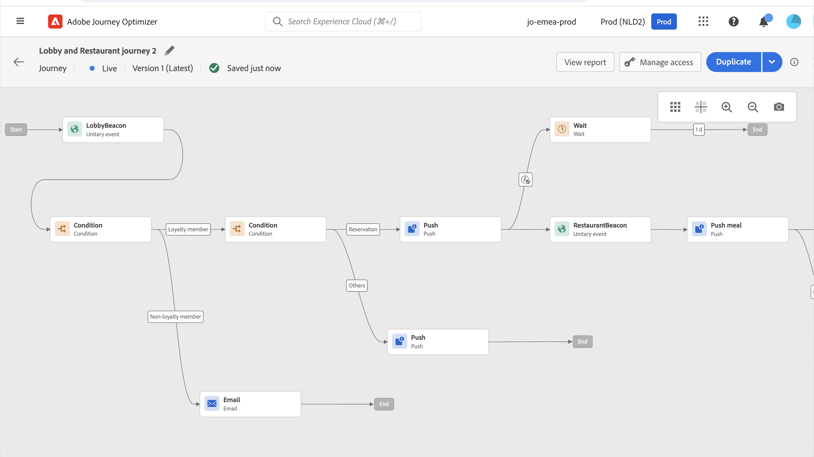

# Create your first journey{#jo-quick-start}

>[!CONTEXTUALHELP]
>id="ajo_homepage_card2"
>title="Create journeys"
>abstract="Use **Adobe Journey Optimizer** to build real-time orchestration use cases using contextual data stored in events or data sources."

## Prerequisites{#start-prerequisites}

In order to send messages with journeys, the following configurations are required:

1. **Configure an event**: if you want to trigger your journeys unitarily when an event is received, you need to configure an event. You define the expected information and how to process it. This step is performed by a **technical user**. [Read more](../event/about-events.md).

     
 
1. **Create an audience**: your journey can also listen to Adobe Experience Platform audiences in order to send messages in batch to a specified set of profiles. For this, you need to create audiences. [Read more](../audience/about-audiences.md).

     

1. **Configure the data source**: you can define a connection to a system to retrieve additional information that will be used in your journeys, for example in your conditions. A built-in Adobe Experience Platform data source is also configured at provisioning time. This step is not required if you only leverage data from the events in your journey. This step is performed by a **technical user**. [Read more](../datasource/about-data-sources.md) 

     

1. **Configure an action**: If you're using a third-party system to send your messages, you can create a custom action. Learn more in this [section](../action/action.md). This step is performed by a **technical user**. If you're using Journey Optimizer built-in message capabilities, you just need to add a channel action to your journey and design your content.

    

## Access journeys {#journey-access}

>[!CONTEXTUALHELP]
>id="ajo_journey_create"
>title="Journeys"
>abstract="Design customer journeys to deliver personalized, contextual experiences. Journey Optimizer allow you to build real-time orchestration use cases with contextual data stored in events or data sources. The **Overview** tab displays a dashboard with key metrics related to your journeys. The **Browse** tab displays the list of existing journeys."

### Key metrics & journeys' list {#access-metrics}

In the JOURNEY MANAGEMENT menu section, click **[!UICONTROL Journeys]**. Two tabs are available:

**Overview**: this tab displays a dashboard with key metrics related to your journeys:

* **Profiles processed**: total number of profiles processed over the last 24 hours
* **Live journeys**: total number of live journeys with traffic over the last 24 hours. Live journeys include **Unitary journeys** (event-based) and **Batch journeys** (read audience).
* **Error rate**: ratio of all profiles in error compared with the total number of profiles who entered over the last 24 hours. 
* **Discard rate**: ratio of all profiles discarded compared with the total number of profiles who entered over the last 24 hours. A discarded profile represents someone who is not eligible to enter the journey, for example because of an incorrect namespace or because of re-entrance rules.

>[!NOTE]
>
>This dashboard takes into account the journeys with traffic over the last 24 hours. Only the journeys you have access to are displayed. Metrics are refreshed every 30 minutes and only when new data is available. 

  

**Browse**: this tab displays the list of existing journeys. You can search for journeys, use filters and perform basic actions on each element. For example, you can duplicate or delete an item. For more information, refer to [this section](../start/user-interface.md#filter-lists).

  

### Filter journeys {#filter}

In the list of journeys, you can leverage various filters to refine the list of journeys for better readability.

Here are the various filtering operations that you can perform:

Filter journeys according to their status, type, version and assigned tags from the **[!UICONTROL Status and version filters]**.

The type can be: **[!UICONTROL Unitary event]**, **[!UICONTROL Audience qualification]**, **[!UICONTROL Read audience]** or **[!UICONTROL Business event]**.

The status can be: 

* **Closed**: the journey has been closed using the **Close to new entrances** button. The journey stops letting new individuals enter the journey. Persons already in the journey can finish the journey normally.
* **Draft**: the journey is in its first stage. It has not been published yet.
* **Draft (Test)**: the test mode has been activated using the **Test mode** button.
* **Finished**: the journey automatically switches to this status after the 91-day [default timeout](journey-gs.md#global_timeout). Profiles already in the journey finish the journey normally. New profiles can no longer enter the journey.
* **Live**: the journey has been published using the **Publish** button.
* **Stopped**: the journey has been switched off using the **Stop** button. All individuals instantly exit the journey.

>[!NOTE]
>
>The Journey authoring lifecycle also includes a set of intermediate statuses which are not available for filtering: "Publishing" (between "Draft" and "Live"), "Activating test mode" or "Deactivating test mode" (between "Draft" and "Draft (test)"), and "Stopping" (between "Live" and "Stopped"). When a journey is in an intermediate state, it is read-only.

Use the **[!UICONTROL Creation filters]** to filter journeys according to their creation date or the user who created them.

Display journeys which use a specific event, field group or action from the **[!UICONTROL Activity filters]** and **[!UICONTROL Data filters]**. 

Use the **[!UICONTROL Publication filters]** to select a publication date or a user. You can choose, for example, to display the latest versions of live journeys that were published yesterday.

To filter journeys based on a specific date range, select **[!UICONTROL Custom]** from the **[!UICONTROL Published]** drop-down list.

Additionally, in the Event, Data source and Action configuration panes, the **[!UICONTROL Used in]** field displays the number of journeys that use that particular event, field group or action. You can click the **[!UICONTROL View journeys]** button to display the list of corresponding journeys.

## Build your journey{#jo-build}

This step is performed by the **business user**. This is where you create your journeys. Combine the different event, orchestration and action activities to build your multi-step cross-channel scenarios.

➡️ [Discover this feature in video](journey.md#video)

Here are the main steps to send messages through journeys:

1. From the **Browse** tab, click **[!UICONTROL Create Journey]** to create a new journey.

1. Edit the journey's properties in the configuration pane displayed on the right side. Learn more in this [section](journey-gs.md#change-properties).

    

1. Start by drag and dropping an event or a **Read Audience** activity from the palette into the canvas. To learn more about journey design, refer to [this section](using-the-journey-designer.md).

    

1. Drag and drop the next steps that the individual will follow. For example, you can add a condition followed by a channel action. To learn more about activities, refer to [this section](using-the-journey-designer.md).

1. Test your journey using test profiles. Learn more in this [section](testing-the-journey.md)

1. Publish your journey to activate it. Learn more in this [section](publishing-the-journey.md).

    

1. Monitor your journey using the dedicated reporting tools to measure your journey's effectiveness. Learn more in this [section](../reports/live-report.md).

    

## Define your journey properties {#change-properties}

>[!CONTEXTUALHELP]
>id="ajo_journey_properties"
>title="Journey properties"
>abstract="This section shows the journey properties. By default, read-only parameters are hidden. Available settings depend on the status of the journey, on your permissions and product configuration."

>[!CONTEXTUALHELP]
>id="ajo_journey_exit_criterias"
>title="Journey exit criterias"
>abstract="This section shows the exit criteria options. You can create one or multiple exit criteria rules for your journey."

Click on the pencil icon, next to the journey's name, to access its properties.

You can change the name of the journey, add a description, allow re-entrance, choose start and end dates and, as an Admin user, define a **[!UICONTROL Timeout and error]** duration. You can also assign Adobe Experience Platform Unified Tags to your journey. This allows you to easily classify them and improve search from the campaigns list. [Learn how to work with tags](../start/search-filter-categorize.md#tags)

For live journeys, this screen displays the publication date and the name of the user who published the journey.

The **Copy technical details** allows you to copy technical information about the journey which the support team can use to troubleshoot. The following information is copied: JourneyVersion UID, OrgID, orgName, sandboxName, lastDeployedBy, lastDeployedAt.

 

### Entrance and re-entrance {#entrance}

By default, new journeys allow re-entrance. You can uncheck the **Allow re-entrance** option for "one shot" journeys, for example if you want to offer a one-time gift when a person enters a shop. 

When the **Allow re-entrance** option is activated, the **Re-entrance wait period** field is displayed. This field allows you to define the time to wait before allowing a profile to enter the journey again in unitary journeys (starting with an event or an audience qualification). This prevents journeys from being erroneously triggered multiple times for the same event. By default the field is set to 5 minutes. The maximum duration is 29 days.

Learn more about profile entrance and re-entrance management, in [this section](entry-management.md).

### Manage access {#manage-access}

To assign custom or core data usage labels to the journey, click the **[!UICONTROL Manage access]** button. [Learn more on Object Level Access Control (OLA)](../administration/object-based-access.md)

### Journey and profile timezones {#timezone}

Timezone is defined at journey level. You can enter a fixed time zone or use Adobe Experience Platform profiles to define the journey time zone. If a time zone is defined in Adobe Experience Platform profile, it can be retrieved in the journey.

For more information on timezone management, see [this page](../building-journeys/timezone-management.md).

### Start and end dates {#dates}

You can define a **Start date**. If you haven't specified one, it will be automatically defined at publication time. 

You can also add an **End date**. This allows profiles to exit automatically when the date is reached. If no end date is specified, profiles can stay until the [global journey timeout](#global_timeout) (which is generally 91 days, and reduced to 7 days with Healthcare Shield add-on offering). The only exception is recurring read audience journeys with **Force re-entrance on recurrence** activated, which end at the start date of the next occurrence. 

### Timeout and error in journey activities {#timeout_and_error}

When editing an action or condition activity, you can define an alternative path in case of error or timeout. If the processing of the activity interrogating a third-party system exceeds the timeout duration defined in the journey's properties (**[!UICONTROL Timeout and error]** field), the second path will be chosen to perform a potential fallback action.

Authorized values are between 1 and 30 seconds.

We recommend that you define a very short **[!UICONTROL Timeout and error]** value if your journey is time sensitive (example: reacting to the real-time location of a person) because you cannot delay your action for more than a few seconds. If your journey is less time sensitive, you can use a longer value to give more time to the system called to send a valid response.

Journeys also uses a global timeout. See the [next section](#global_timeout).

### Global journey timeout {#global_timeout}

In addition to the [timeout](#timeout_and_error) used in journey activities, there is also a global journey timeout which is not displayed in the interface and cannot be changed. 

This global timeout stops the progress of individuals in the journey **91 days** after they enter. This timeout is reduced to **7 days** with Healthcare Shield add-on offering. This means that an individual's journey cannot last longer than 91 days (or 7 days). After this timeout period, the individual's data is deleted. Individuals still flowing in the journey at the end of the timeout period will be stopped and they will not be taken into account in reporting. You could therefore see more people entering the journey than exiting.

>[!NOTE]
>
>Journeys do not directly react to privacy opt-out, access or delete requests. However, the global timeout ensures that individuals never stay more than 91 days in any journey.

Due to the 91-day journey timeout, when journey re-entrance is not allowed, we cannot make sure the re-entrance blocking will work more than 91 days. Indeed, as we remove all information about persons who entered the journey 91 days after they enter, we cannot know the person entered previously, more than 91 days ago.

An individual can enter a wait activity only if he or she has enough time left in the journey to complete the wait duration before the 91 days journey timeout. See [this page](../building-journeys/wait-activity.md).

#### Time-to-Live (TTL) and data rentention FAQ {#timeout-faq}

**For Unitary Journeys**
<table style="table-layout:auto">
  <tr style="border: 1;">
    <td>
      
What happens to journey published after the TTL extension rolled out?

    </td>
    <td>
      
Profiles entering the new journey will automatically have a TTL of 91 days.

    </td>
  </tr>
  <tr style="border: 1;">
    <td>
      
What happens to a profile entering a journey that was published before the TTL extension launch?

    </td>
    <td>
      
The profile will have a TTL of 91 days (7 days for HIPAA), consistent with the time the journey was originally published.

    </td>
  </tr>
  <tr style="border: 1;">
    <td>
      
What happens to a profile which have already entered a journey when the TTL extension is launched?

    </td>
    <td>
      
The profile will retain a TTL of 91 days (7 days for HIPAA), as per the original publication time of the journey.

    </td>
  </tr>
  <tr style="border: 1;">
    <td>
      
What happens to a profile in a previous journey version that is republished after the TTL extension launch?

    </td>
    <td>
      
The profile will maintain a TTL of 91 days (7 days for HIPAA), aligned with the original journey version's publication time.

    </td>
  </tr>
  <tr style="border: 1;">
    <td>
      
What happens to a new profile entering a republished journey version after the TTL extension launch?

    </td>
    <td>
      
The profile will have a TTL of 91 days, matching the TTL of the newly republished journey version.

    </td>
  </tr>
</table>

**For Segment Trigger Journeys**

<table style="table-layout:auto">
  <tr style="border: 1;">
    <td>
      
What happens to new one-time journeys published after the TTL extension?

    </td>
    <td>
      
Profiles entering the new journey will have a TTL of 91 days automatically.

    </td>
  </tr>
  <tr style="border: 1;">
    <td>
      
What happens to new recurring journeys without forced reentrance published after the TTL extension?

    </td>
    <td>
      
Profiles entering the new journey will have a TTL of 91 days automatically.

    </td>
  </tr>
  <tr style="border: 1;">
    <td>
      
What happens to new recurring journeys with forced reentrance published after the TTL extension?

    </td>
    <td>
      
Profiles entering the new journey will have a TTL equal to the recurrence period. For example, if the journey runs daily, the TTL will be 1 day.

    </td>
  </tr>
  <tr style="border: 1;">
    <td>
      
What happens to a profile entering a journey that was published before the TTL extension launch?

    </td>
    <td>
      
The profile will have a TTL of 91 days (7 days for HIPAA), consistent with the original publication time. For recurring journeys with forced reentrance, the TTL will match the recurrence period.

    </td>
  </tr>
  <tr style="border: 1;">
    <td>
      
What happens to a profile running through a journey when the TTL extension is launched?

    </td>
    <td>
      
The profile will retain a TTL of 91 days (7 days for HIPAA), as per the original publication time of the journey. For recurring journeys with forced reentrance, the TTL will match the recurrence period.

    </td>
  </tr>
  <tr style="border: 1;">
    <td>
      
What happens to a running profile in a previous journey version that is republished after the TTL extension launch?

    </td>
    <td>
      
The profile will maintain a TTL of 91 days (7 days for HIPPA), aligned with the original journey version's publication time. For recurring journeys with forced reentrance, the TTL will match the recurrence period.

    </td>
  </tr>
  <tr style="border: 1;">
    <td>
      
What happens to a new profile entering a republished journey version after the TTL extension launch?

    </td>
    <td>
      
The profile will have a TTL of 91 days, matching the TTL of the newly republished journey version. For recurring journeys with forced reentrance, the TTL will match the recurrence period.

    </td>
  </tr>
</table>

### Merge policies {#merge-policies}

Journey uses merge policies while retrieving profile data from Adobe Experience Platform. Depending on the journey type, different merge policies are used:

* In Read audience or audience qualification journeys: the merge policy from the audience is used
* In Event-triggered journeys: the default merge policy is used
* In Business event journeys: the merge policy from the targeted audience in the following Read audience activity is used

Journey will honour the merge policy used throughout the entire journey. Therefore, if multiple audiences are used in a journey (eg: in "inAudience" functions), creating inconsistencies with the merge policy used by the journey, an error is raised and publication is blocked. However, if an inconsistent audience is used in message personalisation, an alert is not raised, despite the inconsistency. For this reason, it is highly recommended to check the merge policy associated with your audience, when this audience is used in message personalisation.

To learn more on merge policies, refer to [Adobe Experience Platform documentation](https://experienceleague.adobe.com/en/docs/experience-platform/profile/merge-policies/overview){target="_blank"}.

## Duplicate a journey {#duplicate-a-journey}

You can duplicate an existing journey from the **Browse** tab. All objects and settings are duplicated to the journey copy.

To perform this, follow the steps below:

1. Navigate to the journey you want to copy, click the **More actions** icon (the three dots next to the journey name).
1. Select **Duplicate**.

    

1. Enter the name of the journey and confirm. You can also change the name in the journey properties screen. By default, the name is set as follows: `[JOURNEY-NAME]_copy`

    

1. The new journey is created and available in the journey list.
