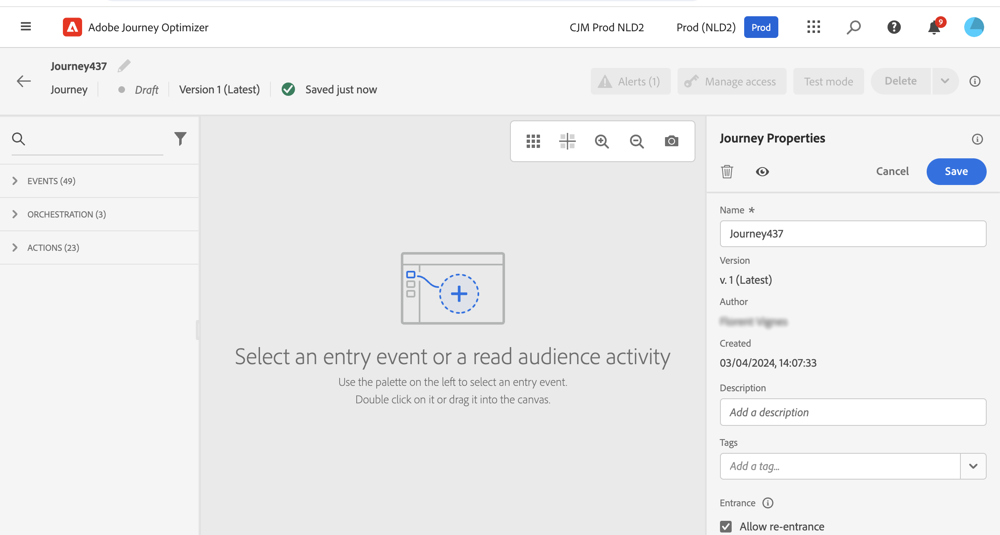

# Create your first journey{#jo-quick-start}

>[!CONTEXTUALHELP]
>id="ajo_homepage_card2"
>title="Create journeys"
>abstract="Use **Adobe Journey Optimizer** to build real-time orchestration use cases using contextual data stored in events or data sources."

## Prerequisites{#start-prerequisites}

In order to send messages with journeys, the following configurations are required:

1. **Configure an event**: if you want to trigger your journeys unitarily when an event is received, you need to configure an event. You define the expected information and how to process it. This step is performed by a **technical user**. [Read more](../event/about-events.md).

     
 
1. **Create an audience**: your journey can also listen to Adobe Experience Platform audiences in order to send messages in batch to a specified set of profiles. For this, you need to create audiences. [Read more](../audience/about-audiences.md).

     

1. **Configure the data source**: you can define a connection to a system to retrieve additional information that will be used in your journeys, for example in your conditions. A built-in Adobe Experience Platform data source is also configured at provisioning time. This step is not required if you only leverage data from the events in your journey. This step is performed by a **technical user**. [Read more](../datasource/about-data-sources.md) 

     

1. **Configure an action**: If you're using a third-party system to send your messages, you can create a custom action. Learn more in this [section](../action/action.md). This step is performed by a **technical user**. If you're using Journey Optimizer built-in message capabilities, you just need to add a channel action to your journey and design your content.

    

## Access journeys {#journey-access}

>[!CONTEXTUALHELP]
>id="ajo_journey_create"
>title="Journeys"
>abstract="Design customer journeys to deliver personalized, contextual experiences. Journey Optimizer allow you to build real-time orchestration use cases with contextual data stored in events or data sources. The **Overview** tab displays a dashboard with key metrics related to your journeys. The **Browse** tab displays the list of existing journeys."

### Key metrics & journeys' list {#access-metrics}

In the JOURNEY MANAGEMENT menu section, click **[!UICONTROL Journeys]**. Two tabs are available:

**Overview**: this tab displays a dashboard with key metrics related to your journeys:

* **Profiles processed**: total number of profiles processed over the last 24 hours
* **Live journeys**: total number of live journeys with traffic over the last 24 hours. Live journeys include **Unitary journeys** (event-based) and **Batch journeys** (read audience).
* **Error rate**: ratio of all profiles in error compared with the total number of profiles who entered over the last 24 hours. 
* **Discard rate**: ratio of all profiles discarded compared with the total number of profiles who entered over the last 24 hours. A discarded profile represents someone who is not eligible to enter the journey, for example because of an incorrect namespace or because of re-entrance rules.

>[!NOTE]
>
>This dashboard takes into account the journeys with traffic over the last 24 hours. Only the journeys you have access to are displayed. Metrics are refreshed every 30 minutes and only when new data is available. 

  

**Browse**: this tab displays the list of existing journeys. You can search for journeys, use filters and perform basic actions on each element. For example, you can duplicate or delete an item. For more information, refer to [this section](../start/user-interface.md#filter-lists).

  

### Filter journeys {#filter}

In the list of journeys, you can leverage various filters to refine the list of journeys for better readability.

Here are the various filtering operations that you can perform:

Filter journeys according to their status, type, version and assigned tags from the **[!UICONTROL Status and version filters]**.

The type can be: **[!UICONTROL Unitary event]**, **[!UICONTROL Audience qualification]**, **[!UICONTROL Read audience]** or **[!UICONTROL Business event]**.

The status can be: 

* **Closed**: the journey has been closed using the **Close to new entrances** button. The journey stops letting new individuals enter the journey. Persons already in the journey can finish the journey normally.
* **Draft**: the journey is in its first stage. It has not been published yet.
* **Draft (Test)**: the test mode has been activated using the **Test mode** button.
* **Finished**: the journey automatically switches to this status after the 91-day [default timeout](journey-gs.md#global_timeout). Profiles already in the journey finish the journey normally. New profiles can no longer enter the journey.
* **Live**: the journey has been published using the **Publish** button.
* **Stopped**: the journey has been switched off using the **Stop** button. All individuals instantly exit the journey.

>[!NOTE]
>
>The Journey authoring lifecycle also includes a set of intermediate statuses which are not available for filtering: "Publishing" (between "Draft" and "Live"), "Activating test mode" or "Deactivating test mode" (between "Draft" and "Draft (test)"), and "Stopping" (between "Live" and "Stopped"). When a journey is in an intermediate state, it is read-only.

Use the **[!UICONTROL Creation filters]** to filter journeys according to their creation date or the user who created them.

Display journeys which use a specific event, field group or action from the **[!UICONTROL Activity filters]** and **[!UICONTROL Data filters]**. 

Use the **[!UICONTROL Publication filters]** to select a publication date or a user. You can choose, for example, to display the latest versions of live journeys that were published yesterday.

To filter journeys based on a specific date range, select **[!UICONTROL Custom]** from the **[!UICONTROL Published]** drop-down list.

Additionally, in the Event, Data source and Action configuration panes, the **[!UICONTROL Used in]** field displays the number of journeys that use that particular event, field group or action. You can click the **[!UICONTROL View journeys]** button to display the list of corresponding journeys.

## Build your journey {#jo-build}

Design journeys to deliver personalized, contextual experiences. [!DNL Journey Optimizer] allow you to build real-time orchestration use cases with contextual data stored in events or data sources. Design multistep advanced scenarios powered by following capabilities:

  * Send real-time **unitary delivery** triggered when an event is received, or **in batch** using Adobe Experience Platform audiences.

  * Leverage **contextual data** from events, information from Adobe Experience Platform, or data from third-party API services.

  * Use the **built-in channel actions** (Email, SMS, Push, InApp) to send messages designed in [!DNL Journey Optimizer] or create **custom actions** if you're using a third-party system to send your messages.

  * With the **journey designer**, build your multistep use cases: easily drag and drop an entry event or a read audience activity, add conditions and send personalized messages.

➡️ [Discover this feature in video](journey.md#video)

Steps to send messages through journeys are listed below. 

1. From the **Browse** tab, click **[!UICONTROL Create Journey]** to create a new journey.

1. Edit the journey's properties in the configuration pane displayed on the right side. Learn how to set your journey's properties in this [this page](journey-properties.md).

    

1. Start by drag and dropping an event or a **Read Audience** activity from the palette into the canvas. To learn more about journey design, refer to [this section](using-the-journey-designer.md).

    

1. Drag and drop the next steps that the individual will follow. For example, you can add a condition followed by a channel action. To learn more about activities, refer to [this section](using-the-journey-designer.md).

1. Test your journey using test profiles. Learn more in this [section](testing-the-journey.md)

1. Publish your journey to activate it. Learn more in this [section](publishing-the-journey.md).

    

1. Monitor your journey using the dedicated reporting tools to measure your journey's effectiveness. Learn more in this [section](../reports/live-report.md).

    

## Duplicate a journey {#duplicate-a-journey}

You can duplicate an existing journey from the **Browse** tab. All objects and settings are duplicated to the journey copy.

To perform this, follow the steps below:

1. Navigate to the journey you want to copy, click the **More actions** icon (the three dots next to the journey name).
1. Select **Duplicate**.

    

1. Enter the name of the journey and confirm. You can also change the name in the journey properties screen. By default, the name is set as follows: `[JOURNEY-NAME]_copy`

    

1. The new journey is created and available in the journey list.
