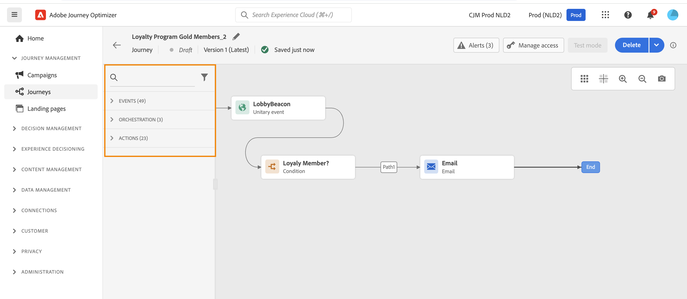
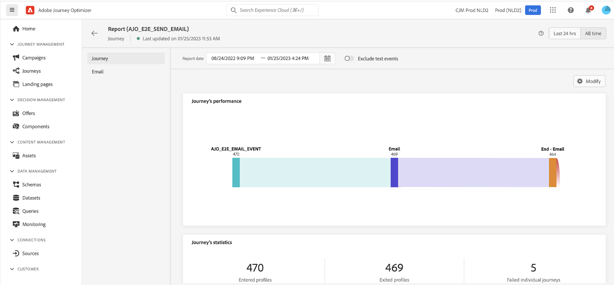

# Create your first journey {#jo-quick-start}

>[!CONTEXTUALHELP]
>id="ajo_homepage_card2"
>title="Create journeys"
>abstract="Use **Adobe Journey Optimizer** to build real-time orchestration use cases using contextual data stored in events or data sources."

>[!CONTEXTUALHELP]
>id="ajo_journey_create"
>title="Journeys"
>abstract="Design customer journeys to deliver personalized, contextual experiences. Journey Optimizer allow you to build real-time orchestration use cases with contextual data stored in events or data sources. The **Overview** tab displays a dashboard with key metrics related to your journeys. The **Browse** tab displays the list of existing journeys."

Build multi-step customer journeys that initiate a sequence of interactions, offers, and messages across channels in real time. This approach ensures customers are engaged at the optimal moments based on their actions and relevant business signals.

Adobe Journey Optimizer includes an omnichannel orchestration canvas which allows marketers to harmonize marketing outreach with one-to-one customer engagement. The user interface allows you to easily drag and drop activities from the palette into the canvas to build your journey. The journey user interface is detailed in [this page](journey-ui.md).

The main steps to create a journey are detailed in this page. They are streamlined as follows:

## Prerequisites {#start-prerequisites}

In order to send messages with journeys, the following prerequisites are needed:

1. **Configure an event**: if you want to trigger your journeys unitarily when an event is received, you need to configure an event. You define the expected information and how to process it. This step is performed by a **technical user**. [Read more](../event/about-events.md).

     
 
1. **Create an audience**: your journey can also listen to Adobe Experience Platform audiences in order to send messages in batch to a specified set of profiles. For this, you need to create audiences. [Read more](../audience/about-audiences.md).

     

1. **Configure the data source**: you can define a connection to a system to retrieve additional information that will be used in your journeys, for example in your conditions. A built-in Adobe Experience Platform data source is also configured at provisioning time. This step is not required if you only leverage data from the events in your journey. This step is performed by a **technical user**. [Read more](../datasource/about-data-sources.md) 

     

1. **Configure an action**: If you're using a third-party system to send your messages, you can create a custom action. Learn more in this [section](../action/action.md). This step is performed by a **technical user**. If you're using Journey Optimizer built-in message capabilities, you just need to add a channel action to your journey and design your content.

    

As a data engineer, steps to configure your journeys, including Data Sources, Events and Actions are detailed in [this section](../configuration/about-data-sources-events-actions.md).

>[!NOTE]
>
>Journey guardrails and limitations are detailed in [this page](../start/guardrails.md)

## Create a multi-step journey {#jo-build}

To create a multi-step journey, follow these steps:

1. In the JOURNEY MANAGEMENT menu section, click **[!UICONTROL Journeys]**.

1. Click the **[!UICONTROL Create Journey]** button to create a new journey.

1. Edit the journey's configuration pane to define the name of the journey and set its properties. Learn how to set your journey's properties in [this page](journey-properties.md).

    

You can then start designing your journey.

## Design the journey {#jo-design}

The omnichannel journey designer helps you build multi-step journeys with targeted audiences, updates based on real-time customer or business interactions, and omnichannel messages using an intuitive drag-and-drop interface.

1. Start by drag and dropping an event or a **Read Audience** activity from the palette into the canvas. To learn more about journey design, refer to [this section](using-the-journey-designer.md).

    

1. Drag and drop the next steps that the individual will follow. For example, you can add a condition followed by a channel action. To learn more about activities, refer to [this section](about-journey-activities.md).

## Test the journey {#jo-test}

Once you have built your journey, you can test it before publishing. Journey Optimizer offers "Test mode" as a way to view test profiles as they move along the journey, detecting potential errors before activation. Running quick tests allows you to check that journeys operate correctly so that you can publish them with confidence.

Learn more in this [section](testing-the-journey.md)

## Publish the journey {#jo-pub}

You must publish a journey to activate it and make it available for new profiles to enter it. Before publishing your journey, verify that it is valid and that there is no error. You cannot publish a journey with errors. Learn more about the journey publication in this [section](publishing-the-journey.md).

Once published, you can monitor your journey using the dedicated reporting tools to measure your journey's effectiveness. 

Learn more about journey reports in this [section](../reports/live-report.md).

Note that you can duplicate an existing journey or create new version of a journey. Learn how in [this page](journey-ui.md)