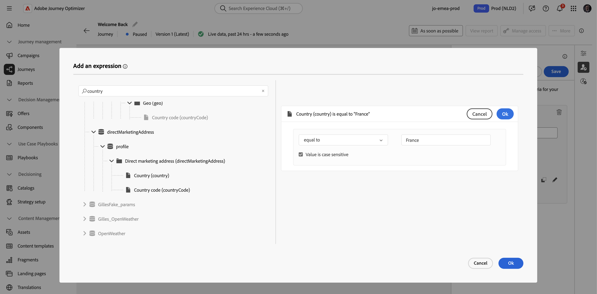
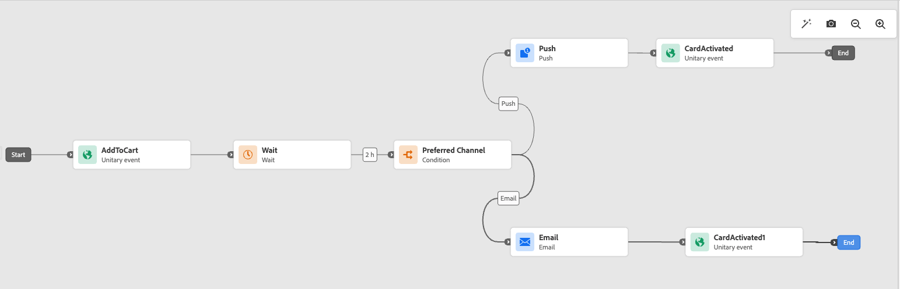

# Pause a journey {#journey-pause}

>[!BEGINSHADEBOX]

**On this page:** Learn how to pause and resume a live journey to safely make changes or stop sends, stop or close a paused journey without resuming it first, and apply profile attribute exit criteria during the pause.

>[!ENDSHADEBOX]

>[!CONTEXTUALHELP]
>id="ajo_journey_pause"
>title="Pause your journey"
>abstract="Pausing a live journey prevents new profiles from entering. Profiles currently in the journey can be discarded or kept in place. If retained, they will resume execution at the next action activity once the journey is restarted. Perfect for updates or emergency stops without losing progress."

You can pause your live journeys, perform all changes needed, and resume them again at any time.<!--You can choose whether the journey is resumed at the end of the pause period, or whether it stops completely. --> During the pause, you can [apply profile attribute exit criteria](#journey-exit-criteria) to exclude profiles based on their attributes. The journey is automatically resumed at the end of the pause period. You can also [resume it manually](#journey-resume-steps), or [stop the journey](#stop-close-paused) from the **Paused** state without resuming it first.

## Key benefits {#journey-pause-benefits}

Pause and resume journeys give journey practitioners greater control and flexibility by allowing live journeys to be temporarily suspended without disrupting customer experience. When paused, no communications are sent, and profiles remain in a suspended state until the journey is resumed.

This capability reduces the risk of sending unintended messages during errors or updates (eg: change on message content), supports safer journey management, and increases practitioner confidence. Visibility into paused journeys and their status directly in the UI further enhances transparency and operational agility.

>[!CAUTION]
>
>* Permissions to pause and resume journeys are restricted to users with the **[!DNL Publish journeys]** high-level permission. Learn more about managing [!DNL Journey Optimizer] users' access rights in [this section](../administration/permissions-overview.md).
>
>* Before starting using the pause/resume capability, [read out the Guardrails and limitations](#journey-pause-guardrails).


## How to pause a journey {#journey-pause-steps}

You can pause any **Live** journey.

To pause your journey, follow these steps:

1. Open the journey you want to pause. 
1. Click the **...More** button on the upper-right section of the journey canvas, and select **Pause**.

    

1. Select how to manage profiles which are currently in the journey. 

    {width="50%"}

    You can:

    * **Hold** profiles - Profiles will wait on the next **Action** node for the journey to be resumed
    * **Discard** profiles - Profiles will be excluded from the journey on the next **Action** node

    When you pause a journey, it is assumed that you plan to resume it at some point. However, a journey cannot remain paused indefinitely. To prevent this, you can define how long the journey should stay paused (between 1 and 14 days). After the selected number of days, the journey automatically resumes.

1. Click the **Pause** button to confirm.

The maximum number of profiles that can be held in paused journeys for your Organization is visible in the journey inventory. It is only visible when at least one journey is paused. This indicator also shows the total number of paused journeys. It is refreshed every 30 minutes. Learn more in the [Guardrails and Limitations](#guardrails-and-limitations).

{width="50%"}

From the list of your journeys, you can pause one or several **Live** journeys. To pause a group of journeys (_bulk pause_), select them in the list and click the **Pause** button in the blue bar at the bottom of the screen. The **Pause** button is only available when **Live** journeys are selected.


## Paused journeys execution logic {#journey-pause-exec}

When a journey is paused, fresh entrances are always discarded, irrespective of Hold / Discard mode.

When a journey is paused, profile management and activity execution depends on the activity. Behaviors are detailed below. For a complete understanding, see also this [End to end sample](#journey-pause-sample).


| Journey Activity          | When the journey is in pause                        |
|-------------------------|--------------------------------------------------|
| [Audience Qualification](audience-qualification-events.md)        | <ul> <li>At the first node in the canvas: Any profile qualification to the audience is discarded </li><li>In other nodes: Same behavior as in a live journey, however if the audience qualification is after an <strong>Action</strong> activity and the user is paused on that action, the audience qualification is discarded. </li></ul>                |
| [Unitary Event](general-events.md)      | <ul> <li>At the first node in the canvas: The event is discarded</li><li>In other nodes: Same behavior as in a live journey, however if the event is after an <strong>Action</strong> activity and the user is paused on that action, the event is discarded. </li></ul>|
| [Read Audience](read-audience.md)     |   Same behavior as in a live journey, with a few specificities: <ol> <li> If <strong>Pause</strong> was pressed after the <strong>Read audience</strong> activity had started, profiles which have entered the journey will continue (until the next <strong>Action</strong> activity). As journey reads audiences at a certain speed, if the complete audience has not entered yet, remaining profiles in the queue will be discarded.</li><li> For single executions: No error will be shown at resume time if the scheduled date was before the resume date. That schedule would be ignored.</li><li>For incremental journeys: <ul><li>If pause happens before the first occurence then on resume the complete audience would be played. </li><li>If pause happens, for instance, on the 4th day of a daily recurrence and journey remains paused until the 9th day then on resume all the profiles that have entered from 4th-9th would be included  </li></ul></ol>|
| [Reaction](reaction-events.md)      | Same behavior as in a live journey, however if the reaction is after an <strong>Action</strong> activity and the user is paused on that action, the reaction event is discarded.    |
| [Wait](wait-activity.md)             | Same behavior as in a live journey |
| [Optimize](optimize.md)  | Same behavior as in a live journey |
| [Content Decision](content-decision.md)  | Profiles are parked or discarded based on what the user has chosen when the journey has been paused |
| [Channel Action](journey-action.md)  | Profiles are parked or discarded based on what the user has chosen when the journey has been paused |
| [Custom Action](../action/action.md)   | Profiles are parked or discarded based on what the user has chosen when the journey has been paused |
| [Update Profile](update-profiles.md) & [Jump](jump.md) | Profiles are parked or discarded based on what the user has chosen when the journey has been paused  |
| [External Data Source](../datasource/external-data-sources.md)  | Same behavior as in a live journey |
| [Exit Criteria](journey-properties.md#exit-criteria)  | Same behavior as in a live journey |


Learn how to troubleshoot discards in [this section](#discards-troubleshoot). 

## How to resume a paused journey {#journey-resume-steps}

>[!CONTEXTUALHELP]
>id="ajo_journey_resume"
>title="Resume your journey"
>abstract="Resuming a paused journey allows new profiles to enter again. If profiles were waiting during the pause, they will continue their journey. Ideal for safely restarting journeys after updates or pauses."

Paused journeys are automatically resumed at the end of the maximum pause period of 14 days. They can be resumed manually at any time. Resume a paused journey allows new profiles to enter again. If profiles were waiting during the pause, they will continue their journey. Ideal for safely restarting journeys after updates or pauses.

To resume a paused journey, and start listening to journey events again, follow these steps:

1. Open the journey you want to resume. 
1. Select the **...More** button on the upper-right section of the journey canvas, and then **Resume**. 

    The journey switches to the **Resuming** status. When the journey resumes, fresh entrances start within a minute. Resuming profiles that were held can take some time - profiles are resumed at a 5k tps rate.  As all profiles have to be resumed for the journey to be **Live** again, the transition from the **Resuming** to **Live** status can take some time. 

1. Click the **Resume** button to confirm.


From the list of your journeys, you can resume one or several **Paused** journeys. To resume a group of journeys (_bulk resume_), select them and click the **Resume** button located in the blue bar at the bottom of the screen. Please note that the **Resume** button will only be available when **Paused** journeys are selected.

## Stop a paused journey {#stop-close-paused}

If you decide not to resume a paused journey, you can end it from the **Paused** state. This ends all journey processing immediately and stops every profile still in the journey. [Learn more about stopping a journey](end-journey.md#stop-journey).

To stop a paused journey from the journey canvas, follow these steps:

1. Open the **Paused** journey you want to stop or close.
1. Click the **...More** button on the upper-right section of the journey canvas.
1. Select **[!UICONTROL Stop]**, and confirm in the dialog box.

From the list of your journeys, you can also click the **[!UICONTROL Ellipsis]** button to the right of the paused journey name and select **[!UICONTROL Stop]**.

>[!IMPORTANT]
>
>You cannot restart or delete a [closed](end-journey.md#close-journey) or [stopped](end-journey.md#stop-journey) journey. You can [create a new version](publish-journey.md#journey-versions) of it or [duplicate it](journey-ui.md#duplicate-a-journey).
>
>Stopping a journey requires the **[!DNL Manage journeys]** permission. If the journey includes inline campaigns or messaging nodes, users also need **Campaigns > Publish Campaigns** permissions. [Learn more about stop permissions](end-journey.md#stop-journey).

## View when a journey was paused or resumed {#view-pause-resume-info}

To see when a journey was last paused or resumed, and by whom, open the journey and go to its **properties** (click the pencil icon next to the journey name). Use the **Copy technical details** button to copy technical information that includes:

* The date and time of the last pause and resume
* The display name and identifier of the user who performed the last pause and the last resume
* Paused journey settings (pause behavior, max pause duration, auto-resume state, pause ID)

This information is useful for troubleshooting, auditing, or sharing with support. For the complete list of copied fields, see [Access the properties of a journey](journey-properties.md#access-properties).

## Apply an exit criteria in a paused journey {#journey-exit-criteria}

When a journey is paused, you can apply an exit criteria based on profile attributes. This filter enables the exclusion of profiles that match the defined expression at resume time. Once the Profile Attribute-based exit criteria is set, it will be enforced on action nodes, even for new profiles entrance. Existing profiles matching the criteria and new profiles entering the journey will be excluded from the journey **on the next action node** they encounter. 

For example, to exclude all French customers from a paused journey, follow these steps:

1. Browse to the paused journey you want to modify.

1. Select the **Exit criteria** icon.

    

1. In the **Exit Criteria** settings, click **Add exit criteria** to define a filter based on profile attributes.

1. Set the expression to exclude profiles where the country attribute equals France.

    

1. Save your filter and click the **Update journey** button to apply your changes.

1. [Resume the journey](#journey-resume-steps).
    
    At resume time, all profiles with the country attribute set to France will automatically be excluded from the journey at the next action node. Any new profiles with the country attribute set to France trying to enter the journey is also blocked at the next action node.

Be aware that profile exclusions for profiles currently in the journey and for new profiles will only occur **when they reach an action node**.

>[!CAUTION]
>
>* You can only set **one** Profile Attribute-based exit criteria per journey.
>
>* You can only create, update or delete a Profile Attribute-based exit criteria in **Paused** journeys.
>
>* Learn more about the Profile Attribute-based exit criteria [in this section](journey-properties.md#profile-exit-criteria).

## Guardrails and limitations {#journey-pause-guardrails}

* A journey version can be paused for up to **14 days**, with a maximum of **10 million profiles** allowed in paused journeys across your organization.
    This limit counts the total number of profiles held across all paused journeys, not distinct profiles. For example, if the same 5M profiles are held in two paused journeys, the 10M limit is reached.
    This limit is checked every 30 minutes. This means you might temporarily exceed the 10 million threshold, but once the system detects it, any additional profiles will be automatically discarded.
    
    If you resume journeys to bring the number of held profiles back under the limit, the journey resumes immediately — but it can take up to 30 minutes for the profile count to update. During that time, the system may still consider those profiles as paused.

* For journeys that include [inbound activities](../channels/gs-channels.md#inbound-channels) (e.g., in-app, web, etc.), pausing the journey does not interrupt communications that have already been triggered. If a profile has qualified for an inbound activity before the pause, the corresponding message will still be delivered. To fully stop all inbound communications, you must stop the journey.
* Paused journeys are counted towards live journey quota
* Profiles that had entered journey but were discarded during the pause would still be counted as engageable profiles
* Paused journeys are considered in all business rules, in the same way as if they were live
* Journey global timeout still applies for paused journeys. For instance, if a profile was in a journey for 90 days and the journey is paused, this profile will still exit the journey on the 91th day
* Profiles are **discarded** in a paused journey when they reach an action activity. If they stay on a wait during the time a journey is paused and exit that wait after it has resumed, they will continue the journey and not be discarded. [See the end-to-end sample](#journey-pause-sample)
* Even after the pause, as events continue to be processed, these events would be counted towards the number of Journey Events per second quota after which throttling comes to picture for unitary
* When profiles hold in a paused journey, at resume time, profile attributes are refreshed
* Conditions are still executed in paused journeys so if a journey has been paused because of data quality issues, any condition prior to an action node can be evaluated with wrong data
* For incremental audience based **Read audience** journeys, paused duration is taken into consideration. This is not the case for audience qualification or event-based journeys (if an audience qualification or an event are received during a pause, and they are the first activity in the journey, those events are discarded)
* If profiles are held in a journey and this journey automatically resumes after a few days, profiles continue the journey and are not dropped. If you want to drop them, you must stop the journey
* In paused journeys, alerts do not fire for [batch segment alerting](../reports/alerts.md#alert-read-audiences)
* There are no audit logs in the system when after 14 days pause state of the journey is terminated
* Some discarded profiles can be visible in the Journey Step Event but not visible in the reporting. For example: 
    * Discard business events for **Read Audience**
    * **Read Audience** jobs getting dropped due to paused journey
    * Discarded events when the **Event** activity was after an action one where the profile was waiting


## End-to-end sample {#journey-pause-sample}

Let's take the example of the journey below:

{zoomable="yes"}

When pausing this journey, you select if profiles are **Discarded** or **Hold**, and then profile management is the following:

1. **AddToCart** activity:  all new profiles entrances are blocked. If a profile has already entered the journey before a pause, they continue up to the next action node.
1. **Wait** activity: profiles continue to wait normally on the node and will exit it, even if the journey is in pause.
1. **Condition**: profiles continue to go through conditions and move to the right branch, based on the expression defined on the condition.
1. **Push**/**Email** activities: during a paused journey, profiles start waiting or get discarded (based on the choice made by the user at the time of pause) on the next action node. So profiles will start waiting or get discarded there.
1. **Events** after **Action** nodes: if a profile is waiting on an **Action** node and there is an **Event** activity after it, if that event is fired, the event is discarded.

As per this behavior, you can see profile numbers increasing on paused journey, mostly in activities before **Action** activities. For instance, in that example, the **Wait** activity is still enabled, increasing the number of profiles going through the **Condition** activity, as they exit it.

When you resume this journey:

1. Fresh journey entrances start within a minute.
1. Profiles that were currently waiting in the journey on **Action** activities get resumed at a 5k tps rate. They can then enter the **Action** they were waiting for, and continue the journey.

## Troubleshoot profile discards in paused journeys {#discards-troubleshoot}

You can use the [[!DNL Adobe Experience Platform] Query Service](https://experienceleague.adobe.com/docs/experience-platform/query/api/getting-started.html){target="_blank"} to query step events, which can provide more information about profile discards, depending on when they happened.

* For discards happening before the profile enters the journey, use the following code:

    ```sql
    SELECT
    TIMESTAMP,
    _experience.journeyOrchestration.profile.ID,
    to_json(_experience.journeyOrchestration)
    FROM
    journey_step_events
    WHERE
    _experience.journeyOrchestration.serviceEvents.dispatcher.eventType = 'PAUSED_JOURNEY_VERSION'
    AND _experience.journeyOrchestration.journey.versionID=<jvId>  
    ```

    This will list the discards that occurred at the point of journey entrance:

    1. When an audience journey is running and the first node is still processing, if the journey is paused, all unprocessed profiles are discarded.

    1. When a new unitary event arrives for the start node (to trigger an entrance) while the journey is paused, the event is discarded.

* For discards happening when the profile is already in the journey, use the following code:

    ```sql
    SELECT
    TIMESTAMP,
    _experience.journeyOrchestration.profile.ID,
    to_json(_experience.journeyOrchestration)
    FROM
    journey_step_events
    WHERE
    _experience.journeyOrchestration.serviceEvents.stateMachine.eventType = 'JOURNEY_IN_PAUSED_STATE'
    AND _experience.journeyOrchestration.journey.versionID=<jvId> 
    ```

    This command lists discards which happened when profiles are in a journey:

    1. If the journey is paused with the discard option enabled and a profile has already entered before the pause, that profile will be discarded when it reaches the next action node.

    1. If the journey was paused with the hold option selected but profiles were discarded due to exceeding the 10-million quota, those profiles will still be discarded when they reach the next action node.

+++ AI Knowledge Reference

This section contains structured knowledge intended to support interpretation, retrieval, and question answering related to this topic.

For complete understanding, this information should be combined with the documentation on this page. Neither source is intended to stand alone; the page describes the feature, while this section provides additional context that helps disambiguate terminology, intent, applicability, and constraints.

* **TL;DR:** This page explains how to pause and resume a live journey in Adobe Journey Optimizer, including profile hold or discard behavior during the pause, how to apply profile attribute exit criteria while paused, and how to troubleshoot profile discards using Query Service.

**Intents:**
* Pause a live journey to prevent new profile entries and hold or discard in-flight profiles at the next action node
* Resume a paused journey manually or understand when it auto-resumes after the maximum pause period
* Apply a profile attribute exit criteria to exclude specific profiles (e.g., by country) when a journey is paused
* Bulk-pause or bulk-resume multiple live journeys from the journey inventory list
* Troubleshoot profile discards in a paused journey using Adobe Experience Platform Query Service step event queries
* View the audit trail of who paused or resumed a journey and when

**Glossary:**
* **Pause (journey)**: A state that temporarily suspends a live journey, preventing new entrances and halting profile progress at the next action node; no communications are sent while paused *(product-specific)*
* **Hold mode**: A pause option that keeps in-flight profiles waiting at the next action node until the journey resumes *(product-specific)*
* **Discard mode**: A pause option that exits in-flight profiles from the journey when they reach the next action node *(product-specific)*
* **Profile Attribute-based exit criteria**: A filter applied to a paused journey that excludes profiles matching a defined expression at the next action node upon resume *(product-specific)*
* **Bulk pause / Bulk resume**: The ability to pause or resume multiple live or paused journeys simultaneously from the journey inventory list *(product-specific)*

**Guardrails:**
* Only users with the **Publish journeys** permission can pause and resume journeys; stopping a paused journey requires **Manage journeys** (and **Campaigns > Publish Campaigns** if inline campaigns or messaging nodes are present)
* Pause duration is configurable from 1 to 14 days; after that the journey auto-resumes
* Profiles held during pause resume at up to 5,000 TPS; the journey remains in Resuming until all held profiles have resumed
* Maximum of 10 million profiles can be held across all paused journeys in an organisation; excess profiles are automatically discarded
* Only one Profile Attribute-based exit criteria can be set per journey
* Profile Attribute-based exit criteria can only be created, updated, or deleted while the journey is paused
* Paused journeys count towards the live journey quota
* Journey global timeout (91 days) still applies during a pause
* Inbound activity communications already triggered before the pause continue to be delivered; to stop them, the journey must be stopped entirely
* Alerts for batch segment do not fire in paused journeys
* Fresh entrances are always discarded when a journey is paused, regardless of Hold or Discard mode

**Terminology:**
* Canonical name: Pause a journey — Acronym: none — variants: journey pause, pause/resume
* Synonyms: "Hold" = "park profiles"; "Discard" = "exit profiles"
* Do not confuse: "Pause" ≠ "Stop" — Pause is temporary and allows resume; Stop immediately exits all profiles and cannot be undone to a live state
* Do not confuse: "Pause" ≠ "Close to new entrances" — Close to new entrances lets existing profiles finish but does not suspend them; Pause suspends all in-flight profiles at the next action node

**FAQ:**
* **Q: What happens to profiles already in a journey when it is paused?** — Depending on the option chosen at pause time, profiles are either held (waiting at the next action node) or discarded (exited from the journey at the next action node).
* **Q: How long can a journey remain paused?** — Between 1 and 14 days (chosen at pause time); after that it automatically resumes.
* **Q: Can I exclude certain profiles while a journey is paused?** — Yes; apply a Profile Attribute-based exit criteria (one per journey) while the journey is paused to exclude matching profiles at the next action node upon resume.
* **Q: Does pausing a journey stop in-app or web messages already triggered?** — No; inbound communications already triggered before the pause continue to be delivered. To stop all inbound communications, you must stop the journey entirely.
* **Q: How do I find out which profiles were discarded during a pause?** — Query the `journey_step_events` dataset in Adobe Experience Platform Query Service using the `PAUSED_JOURNEY_VERSION` or `JOURNEY_IN_PAUSED_STATE` event type filters with the journey version ID.

+++
