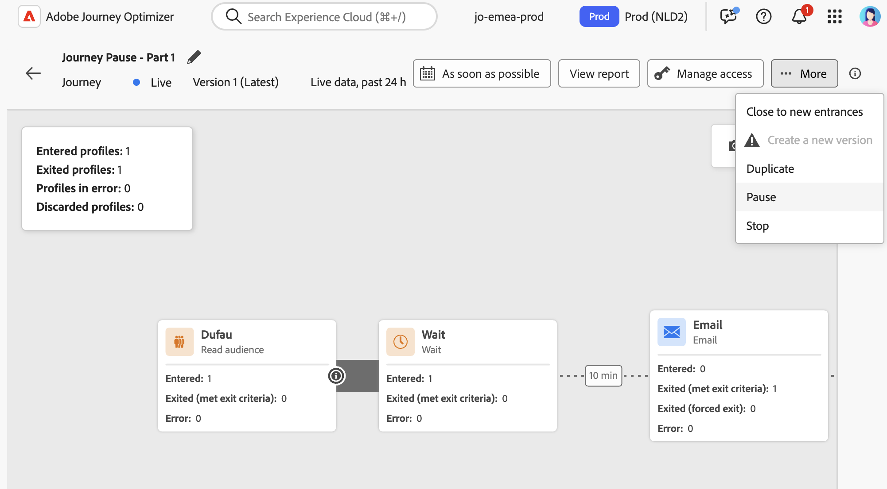
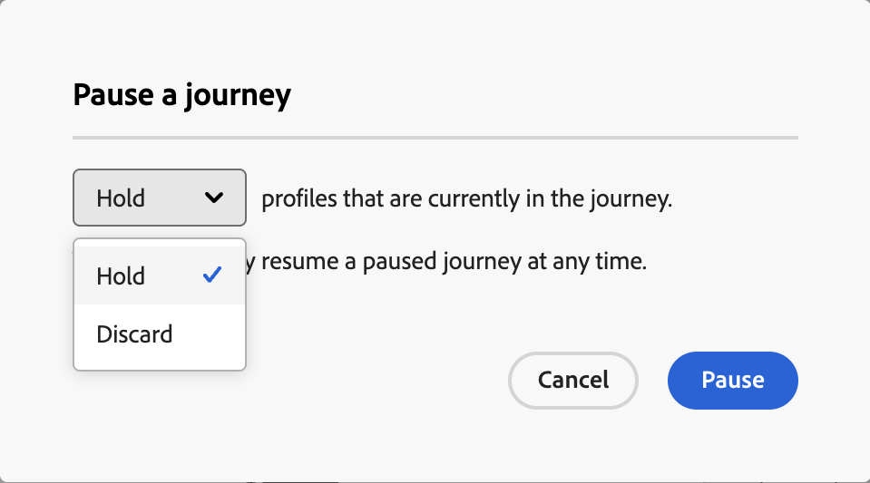

# Pause a journey {#journey-pause}

You can pause your live journeys, perform all changes needed, and resume them again at any time.<!--You can choose whether the journey is resumed at the end of the pause period, or whether it stops completely. --> During the pause, you can [apply global filters](#journey-global-filters) to exclude profiles based on their attributes. The journey is automatically resumed at the end of the pause period. You can also [resume it manually](#journey-resume-steps).

>[!AVAILABILITY]
>
>This capability is only available for a set of organizations (Limited Availability). To gain access, contact your Adobe representative.

## Key benefits {#journey-dry-run-benefits}

Pause and resume journeys give journey practitioners greater control and flexibility by allowing live journeys to be temporarily suspended without disrupting customer experience. When paused, no communications are sent, and profiles remain in a suspended state until the journey is resumed.

This capability reduces the risk of sending unintended messages during errors or updates (eg: change on message content), supports safer journey management, and increases practitioner confidence. Visibility into paused journeys and their status directly in the UI further enhances transparency and operational agility.

>[!CAUTION]
>
>Permissions to pause and resume journeys are restricted to users with the **[!DNL Publish journeys]** high-level permission. Learn more about managing [!DNL Journey Optimizer] users' access rights in [this section](../administration/permissions-overview.md).

## Guardrails and recommendations

* A journey version can be paused for a maximum of 14 days.
* Paused journeys are considered in all business rules, in the same way as if they were live.
* Profiles are "discarded" in a paused journey when they reach an action activity. If they stay on a wait during the time a journey is paused and exit that wait after it has resumed, they will continue the journey and not be discarded.
* Even after the pause, as events continue to be processed, these events would be counted towards the number of Journey Events per second quota after which throttling comes to picture for unitary.
* Profiles that had entered journey but were discarded during the pause would still be counted as engageable profiles.
* When profiles hold in a paused journey, at resume time, profile attributes are refreshed
* Conditions are still executed in paused journeys so if a journey has been paused because of data quality issues, any condition prior to an action node can be evaluated with wrong data.
* For incremental audience based read audience journey, paused duration is taken into consideration. For example, for a daily journey, if it was paused on 2nd and resumed on 5th of the month, then the run on 6th will take all the profiles that have qualified from 1st to 6th. This is not the case for audience qualification or event-based journeys (if an audience qualification or an event are received during a pause, those events are discarded).
* Paused journeys are counted towards live journey quota.
* Journey global timeout still applies for paused journeys. For instance, if a profile was in a journey for 90 days and the journey is paused, this profile will still exit the journey on the 91th day.
* If profiles are held in a journey and this journey automatically resumes after a few days, profiles continue the journey and are not dropped. If you want to drop them, you must stop the journey.
<!--* There is a guardrail (at an org level) on the max number of profiles that can be held in paused journeys. This guardrail is per org, and is visible in the journey inventory on a new bar (only visible when there are paused journeys).-->

## How to pause a journey {#journey-pause-steps}

You can pause any **Live** journey.

To pause your journey, follow these steps:

1. Open the journey you want to pause. 
1. Click on the **...More** button on the upper-right section of the journey canvas, and select **Pause**.

    {width="80%" align="left"}

1. Select the how to manage profiles which are currently in the journey. 

    {width="50%" align="left"}

    You can:

    * Hold profiles - Profiles will wait for the journey to be resumed
    * Discard profiles - Profiles will be excluded from the journey on the next action node

1. Click the **Pause** button to confirm.

From the list of your journeys, you can pause one or several **Live** journeys. To pause a group of journeys (_bulk pause_), select them in the list and click the **Pause** button in the blue bar at the bottom of the screen. The **Pause** button is only available when **Live** journeys are selected.

{width="80%" align="left"}

## How to resume a paused journey {#journey-resume-steps}

Paused journeys are automatically resumed at the end of the maximum pause period of 14 days. They can be resumed manually at any time.

To resume a paused journey, and start listening to journey events again, follow these steps:

1. Open the journey you want to resume. 
1. Click on the **...More** button on the upper-right section of the journey canvas, and select **Resume**. 

    The journey switches to the **Resuming** status. The transition from the **Resuming** to **Live** status can take some time: all profiles have to be resumed for the journey to be **Live** again.

1. Click the **Resume** button to confirm.

From the list of your journeys, you can resume one or several **Paused** journeys. To resume a group of journeys (_bulk resume_), select them and click the **Resume** button located in the blue bar at the bottom of the screen. Please note that the **Resume** button will only be available when **Paused** journeys are selected.

## Apply a global filter to profiles in a paused journey  {#journey-global-filters}

When a journey is paused, you can apply a global filter based on profile attributes. This filter enables the exclusion of profiles that match the defined expression at resume time. Profiles matching the criteria which are currently in the journey will exit it, and new profiles attempting to enter will be blocked.

For example, to exclude all French customers from marketing communications to France, follow these steps:

1. Browse to the paused journey you want to modify.

1. Click on the **Exit criteria & Global filter** icon.

1. In the Global Filter settings, define a filter based on profile attributes.

1. Set the expression to exclude profiles where the country attribute equals France.

1. Resume the journey.
    
    At resume time, all profiles with the country attribute set to France will automatically be excluded from the journey. Any new profiles with the country attribute set to France trying to enter the journey will be blocked.

Be aware that profile exclusions for profiles currently in the journey and for new profiles will only occur when they reach an action node.