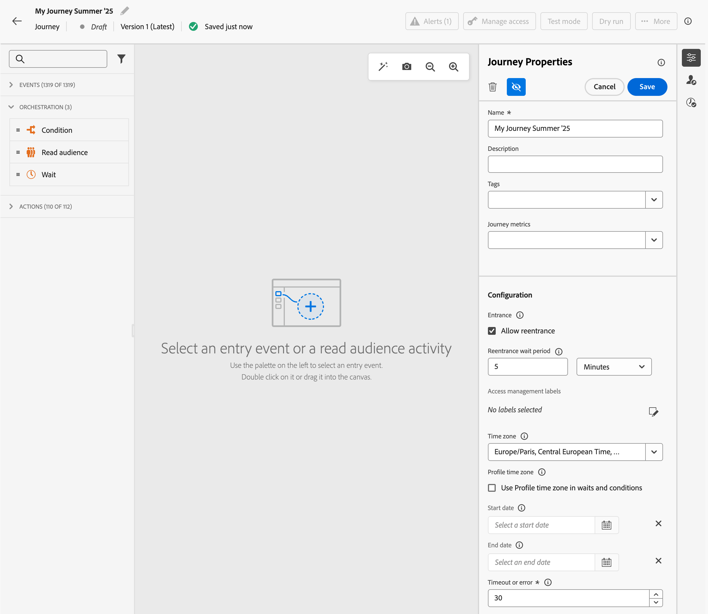

# Set your journey properties {#jo-properties}

>[!BEGINSHADEBOX]

**On this page:** Learn how to set a journey's global properties — including its name, entrance rules, time zone, start and end dates, timeout, exit criteria, and conflict management — from the right rail during authoring.

>[!ENDSHADEBOX]

Use journey properties to configure global settings for your journey, including its name, entrance rules, timezone, start and end dates, timeout duration, exit criteria, and conflict management. Properties are accessible from the right rail at any stage of journey authoring.

>[!CONTEXTUALHELP]
>id="ajo_journey_properties"
>title="Journey properties"
>abstract="The journey properties hold global settings for this journey, including name, tags, entrance rules, time zone, dates, timeout, and conflict management. Read-only parameters are hidden by default. Available options vary based on journey status, your permissions, and product configuration."

## Access the properties of a journey {#access-properties}

The properties of a journey are centralized in the right rail. This section is displayed by default when creating a new journey. For existing journeys, click the pencil icon next to the journey's name to open it. 

From this section, define the name of the journey, add a description, and set your journey global properties.

You can:

* Assign [!DNL Adobe Experience Platform] Unified Tags to your journey, to easily classify them and improve search from the campaigns list. [Learn how to work with tags](../start/search-filter-categorize.md#tags)
* Select your journey metrics. [Learn how to configure and track your journey metrics](success-metrics.md)
* Manage [entrance and reentrance](#entrance). Profile entrance management depends on the type of journey. Details are available on [this page](entry-management.md)
* Manage [access to data](#manage-access)
* Select the journey and profile [timezones](#timezone)    
* Choose custom [start and end dates](#dates)
* Define a [timeout duration](#timeout) in journey activities (for Admin users only)
* Monitor the [current journey payload size](#journey-payload-size) to avoid publishing errors
* Monitor conflicts and prioritize your journeys using [conflict management tools](#conflict)

{width="80%"}{zoomable="yes"}

>[!NOTE]
>
>For live journeys, this screen displays only the publication date and the name of the user who published the journey.

The **Copy technical details** option allows you to copy technical information about the journey which the support team can use to troubleshoot. The following information is copied:

**General**

* `JourneyVersion UID` – Unique identifier of this version of the journey
* `OrgID` – Your organization's (IMS) identifier
* `orgName` – Your organization's name
* `sandboxName` – Name of the sandbox where the journey runs
* `lastDeployedBy` – User who last published the journey
* `lastDeployedAt` – Date and time of the last publication

**Pause and resume** (included when the journey has been paused at least once)

* `lastPausedAt` – Date and time of the last time the journey was paused
* `lastPausedBy` – Display name of the user who performed the last pause
* `lastPausedById` – Internal identifier of the user who performed the last pause
* `lastResumedAt` – Date and time of the last time the journey was resumed
* `lastResumedBy` – Display name of the user who performed the last resume
* `lastResumedById` – Internal identifier of the user who performed the last resume

**Paused journey settings** (in `pausedJourneySettings`, when the journey is or has been paused)

* `pauseBehavior` – What happens to profiles in the journey when it is paused (for example, discard them or keep them in place)
* `maxPauseDurationInMinutes` – Maximum pause duration in minutes, after which the journey auto-resumes (for example, 20160 = 14 days)
* `transitionStateForAutoResume` – State applied when the journey auto-resumes at the end of the pause period (for example, stop or continue)
* `pauseId` – Unique identifier for the current pause instance

Learn more about technical fields related to a journey for a given profile, and how to use them [on this page](expression/journey-properties.md).

## Entrance and reentrance {#entrance}

The profile entry mode is defined at the journey level, in the right configuration pane. Settings are described below.

Profile entrance management depends on the type of journey. Learn more about profile entrance and reentrance management, on [this page](entry-management.md). Learn more about journey processing rates and how profiles flow through journeys in [this section](entry-management.md#journey-processing-rate).

### Allow reentrance  {#allow-reentrance}

>[!CONTEXTUALHELP]
>id="ajo_journey_properties_entrance"
>title="Allow reentrance"
>abstract="By default, new journeys allow reentrance. Unchecking the **Allow reentrance** option prevents a person from entering the journey again, for example to offer a one-time gift when a person enters a shop."
>additional-url="https://experienceleague.adobe.com/en/docs/journey-optimizer/using/orchestrate-journeys/manage-journey/entry-management" text="Profile entrance management"

By default, new journeys allow reentrance. You can uncheck the **Allow reentrance** option for "one shot" journeys, for example if you want to offer a one-time gift when a person enters a shop. 

### Reentrance wait period  {#reentrance-wait}

>[!CONTEXTUALHELP]
>id="ajo_journey_properties_re-entrance_wait"
>title="Reentrance wait period"
>abstract="The reentrance wait period is the time to wait before a profile can enter the journey again in unitary journeys. It prevents users from reentering the journey for a chosen duration. Maximum duration: 90 days."
>additional-url="https://experienceleague.adobe.com/en/docs/journey-optimizer/using/orchestrate-journeys/manage-journey/entry-management" text="Profile entrance management"

When the **Allow reentrance** option is activated, the **Reentrance wait period** field is displayed. This field allows you to define the time to wait before allowing a profile to enter the journey again in unitary journeys (starting with an event or an audience qualification). This prevents journeys from being erroneously triggered multiple times for the same event. By default the field is set to 5 minutes. The maximum duration is 90 days.

## Manage access {#manage-access}

You can limit access to a journey based on access labels. 

To assign custom data usage labels to the journey, click the **[!UICONTROL Manage access labels]** icon and select one or several labels. 

[Learn more about Object Level Access Control (OLAC)](../administration/object-based-access.md)

## Journey payload size {#journey-payload-size}

>[!CONTEXTUALHELP]
>id="ajo_journey_properties_payload_size"
>title="Current journey payload size"
>abstract="Displays the current size of the journey payload compared to the configured limit. This indicator helps monitor journey complexity before publishing and avoid errors caused by the payload size limit being exceeded."

The **[!UICONTROL Current journey payload size]** field in the journey properties panel displays the current size of your journey's payload in relation to the configured limit — for example, *1.5 MB (out of 2 MB)*. This read-only indicator is visible at any stage of journey authoring.

{width="50%" zoomable="yes"}

Use this information to monitor the complexity of your journey before publishing. If the payload size approaches or exceeds the limit, journey publication fails. To reduce the size, consider simplifying the journey logic or reducing the number of activities.

The default limit is 4 MB. Contact Adobe Customer Care if you need to request a higher limit for your organization.

For full details on thresholds, warning and error messages, and troubleshooting steps, refer to [Journey payload size validation](../start/guardrails.md#journey-payload-size) and [General journey guardrails](../start/guardrails.md#journeys-guardrails-journeys).

## Journey and profile timezones {#timezone}

The timezone is defined at journey level. You can enter a fixed time zone or use [!DNL Adobe Experience Platform] profiles to define the journey time zone. If a time zone is defined in [!DNL Adobe Experience Platform] profile, it can be retrieved in the journey.

[Learn more about timezone management](../building-journeys/timezone-management.md)

## Start and end dates {#dates}

>[!CONTEXTUALHELP]
>id="ajo_journey_properties_start_date"
>title="Start date"
>abstract="The start date is when profiles can begin entering the journey. If no start date is set, it defaults to the journey's publication date."

>[!CONTEXTUALHELP]
>id="ajo_journey_properties_end_date"
>title="End date"
>abstract="The end date is when the journey ends. On this date, active profiles automatically exit the journey, and no new entry is allowed."

By default, profiles can enter your journey as soon as it is published, and can stay until the [global journey timeout](#global_timeout) is reached. The only exception is recurring read audience journeys with **Force reentrance on recurrence** activated, which end at the start date of the next occurrence. 

If needed, you can define custom **Start date** and **End date**. This allows profiles to enter your journey on a specific date, and exit automatically when the end date is reached. 

## Timeout {#timeout}

Timeout settings control how long a journey waits for activity execution and how long profiles can remain in a journey.

### Timeout in journey activities {#timeout_and_error}

>[!CONTEXTUALHELP]
>id="ajo_journey_action_timeout"
>title="Timeout or error"
>abstract="The **Timeout or error** option defines an alternative path in the journey when the action times out or returns an error, so profiles continue through a fallback path rather than stopping at this step. Recommended values are between 1 and 30 seconds."

When editing an action or condition activity, you can define an alternative path in case of error or timeout. If the processing of the activity interrogating a third-party system exceeds the timeout duration defined in **[!UICONTROL Timeout or error]** field of the journey's properties, the second path will be chosen to perform a potential fallback action.

Recommended values are between 1 and 30 seconds.

We recommend that you define a very short **[!UICONTROL Timeout or error]** value if your journey is time sensitive (example: reacting to the real-time location of a person) because you cannot delay your action for more than a few seconds. If your journey is less time sensitive, you can use a longer value to give more time to the system called to send a valid response.

Journeys also uses a global timeout as detailed below.

### Global journey timeout {#global_timeout}

In addition to the [timeout](#timeout_and_error) used in journey activities, a global journey timeout is applied. It is not displayed in the interface and cannot be changed. 

This global timeout stops the progress of individuals in the journey **91 days** after they enter. This means that an individual's journey cannot last longer than 91 days. After this timeout period, the individual's data is deleted. Individuals still flowing in the journey at the end of the timeout period will be stopped and they will not be taken into account in reporting. You could therefore see more people entering the journey than exiting.

>[!NOTE]
>
>The exact definition of when a journey is considered "finished" varies by journey type. [See detailed criteria](end-journey.md#journey-finished-definition).

Due to the 91-day journey timeout, when journey reentrance is not allowed, we cannot make sure the reentrance blocking will work more than 91 days. Indeed, as we remove all information about persons who entered the journey 91 days after they enter, we cannot know the person entered previously, more than 91 days ago.

An individual can enter a wait activity only if he or she has enough time left in the journey to complete the wait duration before the 91 days journey timeout. See [this page](../building-journeys/wait-activity.md).

### Time-to-Live (TTL) and data retention FAQ {#timeout-faq}

Starting [!DNL Adobe Journey Optimizer] June 2024 release, the journey global timeout has moved from 30 to 91 days. Impacts are listed in the FAQ below:

**For Unitary Journeys**

<table style="table-layout:auto">
  <tr style="border: 1;">
    <td>
      
What happens to journey published after the TTL extension rolled out?

    </td>
    <td>
      
Profiles entering the new journey will automatically have a TTL of 91 days.

    </td>
  </tr>
  <tr style="border: 1;">
    <td>
      
What happens to a profile entering a journey that was published before the TTL extension launch?

    </td>
    <td>
      
The profile will have a TTL of 30 days (7 days for HIPAA), consistent with the time the journey was originally published.

    </td>
  </tr>
  <tr style="border: 1;">
    <td>
      
What happens to a profile which have already entered a journey when the TTL extension is launched?

    </td>
    <td>
      
The profile will retain a TTL of 30 days (7 days for HIPAA), as per the original publication time of the journey.

    </td>
  </tr>
  <tr style="border: 1;">
    <td>
      
What happens to a profile in a previous journey version that is republished after the TTL extension launch?

    </td>
    <td>
      
The profile will maintain a TTL of 30 days (7 days for HIPAA), aligned with the original journey version's publication time.

    </td>
  </tr>
  <tr style="border: 1;">
    <td>
      
What happens to a new profile entering a republished journey version after the TTL extension launch?

    </td>
    <td>
      
The profile will have a TTL of 91 days, matching the TTL of the newly republished journey version.

    </td>
  </tr>
</table>

**For Segment Trigger Journeys**

<table style="table-layout:auto">
  <tr style="border: 1;">
    <td>
      
What happens to new one-time journeys published after the TTL extension?

    </td>
    <td>
      
Profiles entering the new journey will have a TTL of 91 days automatically.

    </td>
  </tr>
  <tr style="border: 1;">
    <td>
      
What happens to new recurring journeys without forced reentrance published after the TTL extension?

    </td>
    <td>
      
Profiles entering the new journey will have a TTL of 91 days automatically.

    </td>
  </tr>
  <tr style="border: 1;">
    <td>
      
What happens to new recurring journeys with forced reentrance published after the TTL extension?

    </td>
    <td>
      
Profiles entering the new journey will have a TTL equal to the recurrence period. For example, if the journey runs daily, the TTL will be 1 day.

    </td>
  </tr>
  <tr style="border: 1;">
    <td>
      
What happens to a profile entering a journey that was published before the TTL extension launch?

    </td>
    <td>
      
The profile will have a TTL of 30 days (7 days for HIPAA), consistent with the original publication time. For recurring journeys with forced reentrance, the TTL will match the recurrence period.

    </td>
  </tr>
  <tr style="border: 1;">
    <td>
      
What happens to a profile running through a journey when the TTL extension is launched?

    </td>
    <td>
      
The profile will retain a TTL of 30 days (7 days for HIPAA), as per the original publication time of the journey. For recurring journeys with forced reentrance, the TTL will match the recurrence period.

    </td>
  </tr>
  <tr style="border: 1;">
    <td>
      
What happens to a running profile in a previous journey version that is republished after the TTL extension launch?

    </td>
    <td>
      
The profile will maintain a TTL of 30 days (7 days for HIPAA), aligned with the original journey version's publication time. For recurring journeys with forced reentrance, the TTL will match the recurrence period.

    </td>
  </tr>
  <tr style="border: 1;">
    <td>
      
What happens to a new profile entering a republished journey version after the TTL extension launch?

    </td>
    <td>
      
The profile will have a TTL of 91 days, matching the TTL of the newly republished journey version. For recurring journeys with forced reentrance, the TTL will match the recurrence period.

    </td>
  </tr>
  <tr style="border: 1;">
    <td>
      
Will my always-on recurring Read Audience journey stop after 91 days?

    </td>
    <td>
      
No. A recurring Read Audience journey with no end date remains <strong>Live</strong> as long as it is published. It moves to <strong>Finished</strong> status only 91 days after the execution of its <strong>last occurrence</strong>. The 91-day global timeout applies to individual profiles flowing through the journey (maximum active duration per profile), not to the journey's Live status.

    </td>
  </tr>
  <tr style="border: 1;">
    <td>
      
What is the difference between the 91-day journey timeout and the 91-day reporting window?

    </td>
    <td>
      
These are two separate concepts. The <strong>journey global timeout</strong> (91 days) is the maximum time an individual profile can remain active within a journey — after 91 days, the profile is exited and its data deleted. The <strong>reporting window</strong> (approximately 91 days) is a display limit in the UI: performance data older than ~91 days is no longer visible in reporting, but the journey itself continues to run and new profiles continue to enter.

    </td>
  </tr>
</table>

## Merge policy {#merge-policies}

>[!CONTEXTUALHELP]
>id="ajo_journey_properties_merge_policy"
>title="Merge policy"
>abstract="The merge policy is automatically retrieved based on your selected event or audience. This merge policy is used throughout the entire journey."

[!DNL Adobe Journey Optimizer] uses merge policies while retrieving profile data from [!DNL Adobe Experience Platform]. Depending on the journey type, different merge policies are used:

* In **[Read audience](read-audience.md)** or **[Audience qualification](audience-qualification-events.md)** journeys: the merge policy from the audience is used
* In **[Unitary event](../event/about-events.md)** journeys: the default merge policy is used
* In **[Business event](../event/about-creating-business.md)** journeys: the merge policy from the targeted audience in the following Read audience activity is used

[!DNL Adobe Journey Optimizer] applies the merge policy used throughout the entire journey. Therefore, if multiple audiences are used in a journey (for example using the in [`inAudience` functions](functions/functioninaudience.md)), this creates inconsistencies with the merge policy used by the journey, an error is raised and publication is blocked. However, if an inconsistent audience is used in message personalization, an alert is not raised, despite the inconsistency. For this reason, it is highly recommended to check the merge policy associated with your audience, when this audience is used in message personalization.

To learn more about merge policies, refer to [[!DNL Adobe Experience Platform] documentation](https://experienceleague.adobe.com/en/docs/experience-platform/profile/merge-policies/overview){target="_blank"}.

>[!NOTE]
>
>When an audience merge policy is updated, any active journey referencing that audience must be republished (or duplicated). Changing the merge policy effectively creates a 'new' audience that the ongoing journey cannot access, ensuring data consistency.

## Exit criteria {#exit-criteria}

>[!CONTEXTUALHELP]
>id="ajo_journey_exit_criterias"
>title="Exit criteria"
>abstract="This section shows the exit criteria options, where one or multiple exit criteria rules and filters can be defined for the journey."

### Journey Exit criteria {#exit-criteria-desc}

By adding exit criteria, you make the profiles exit the journey as soon as an event happens (e.g., Purchase) or they qualify for an audience. This will prevent the user from getting any further communications from the journey.

You may want to remove profiles from a journey when they do not meet the journey's purpose anymore. This can be achieved by **global exit criteria**, which are closely associated with goal management.

>[!TIP]
>
>Looking for practical guidance with real-world examples? See our [comprehensive guide to journey entry and exit criteria](entry-exit-criteria-guide.md), which includes complete use cases with both entry and exit configurations, best practices, and optimization strategies.

**Sample use case**

A marketer has a promotional journey that has a series of communications. Each of this communication is aimed at driving the customer to make a purchase. As soon as the purchase is made the customer should not receive rest of the messages in the series. By defining an exit criteria, any profiles who made a purchase is removed from the journey.

### Configuration and usage {#exit-criteria-config}

Exit criteria are set at journey level. One journey can have multiple exit criteria. If you have set multiple exit criteria, the evaluation happens from top to bottom with an `OR` logic. Hence, if you have Exit Criteria A and Exit Criteria B, it is evaluated as A **OR** B. The criteria are evaluated at every step of the journey.

To **create** an exit criteria, follow these steps:

1. Open your journey.

1. Click the  **[!UICONTROL Show Exit Criteria]** icon located in the upper-right section of the journey canvas.

1. Select **[!UICONTROL Add exit criteria]**.
  
1. Enter a **Label** and select if your exit criteria is based on an **Event** or an **Audience**.

    * For Exit criteria based on an event, like for example downloading an app or adding a product to a cart, pick only unitary event. 
    * For Exit criteria based on an audience,like for example an audience that checks if a customer has purchased in the last 24 hours, select an audience. Note: Exit criteria using an audience can take up to 10 mins to be effective.

You can add multiple exit criteria. The exit criteria is now active and will be evaluated at each step of the journey.

{width="40%"}

### Profile Attribute-based exit criteria {#profile-exit-criteria}

Profile Attribute–Based Exit Criteria gives you greater control over paused journeys by allowing you to define rules that automatically remove specific profiles before the journey resumes. You can set exit conditions based on profile attributes—such as location, status, or preferences—to ensure that only relevant profiles continue in the journey after it is resumed.

For example, you can [pause a journey](journey-pause.md), add an exit condition to remove all profiles located in France, and resume the journey knowing that those profiles will be excluded at the next action step. This logic applies both to profiles already in the journey and to any new profiles that qualify after the journey resumes.

This feature works alongside the Pause/Resume functionality, helping you manage journeys more safely and flexibly. It minimizes manual intervention, reduces the risk of sending irrelevant or non-compliant communications, and keeps your journey logic aligned with current business requirements.

Refer to this section to learn how to [use profile attribute exit criteria in paused journeys](journey-pause.md#journey-pause-sample).

### Guardrails and limitations {#exit-criteria-guardrails}

The following guardrails and limitations apply to the [Journey Exit Criteria](#exit-criteria-desc) capability:

* Exit criteria are defined in draft state only
* Journey namespace coherence between events and event-based exit criteria

The following guardrails apply when using the [Profile Attribute–Based Exit Criteria](#profile-exit-criteria) capability:

* **Exit criteria apply at the action level**  
  The "Profile Attribute" exit criteria are evaluated at action steps only. Unlike other exit criteria types, they do not apply globally across the journey.  
  If you resume a journey and some profiles meet the exit condition, those profiles will be excluded at the next action node.  
  New profiles entering the journey after resume will also be evaluated and excluded at their first action node, if they meet the condition.

* **One profile-based exit rule per journey**  
  You can define only one "Profile Attribute" exit criteria per journey. This limitation helps maintain clarity and avoids conflicts in journey logic.

* **Available in paused journeys only**  
  You can add or edit "Profile Attribute" exit criteria only when the journey is paused.  

  * In a **draft journey**, the *Profile Attribute* option appears disabled (read-only), while *Event* and *Audience* options remain active.  
  * In a **paused journey**, the *Profile Attribute* option becomes editable, and *Event* and *Audience* options become read-only.

### Related topics {#exit-criteria-related}

* [Journey entry and exit criteria guide](entry-exit-criteria-guide.md) - Complete guide with real-world examples and best practices
* [Profile entrance management](entry-management.md) - Configure how profiles enter journeys
* [How journeys end](end-journey.md) - Understand natural journey completion
* [Pause a journey with profile attribute exit criteria](journey-pause.md#journey-exit-criteria) - Use exit criteria when pausing journeys

## Journey schedule {#schedule}

The **[!UICONTROL Schedule]** section is only available when a **[!UICONTROL Read Audience]** activity has been dropped in the canvas. It allows you to define a specific date/time and frequency at which the journey should run. [Learn how to schedule a Read-audience journey](read-audience.md#schedule)

>[!TIP]
>
>When scheduling the journey, you can also configure wave sending to deliver journey actions in batches over time. [Learn how to send using waves in journeys](send-using-waves.md)

## Conflict management {#conflict}

The **[!UICONTROL Conflict management]** section in the journey's properties allows you to monitor conflicts and prioritize your journeys. You can:

* Apply a **Rule Set** to exclude this journey to part of your audience based on capping rules. [Learn how to work with rule sets](../conflict-prioritization/rule-sets.md)

* Assign a **priority score** to the journey, ranging from 0 to 100. A higher number indicates a higher priority. The priority value inserted here is inherited by any inbound actions (such as In-App) contained in this journey. [learn how to work with priority scores](../conflict-prioritization/priority-scores.md)

  For situations where this same inbound channel configuration is used in other campaigns or journeys, the inbound action with the highest priority score is shown to the recipient. If multiple journeys or campaigns have the same score, the element that was most recently modified is chosen.

* **View conflicts** with other journeys, campaigns, or channel configurations. If you wish to identify overlap on audience, start & end date, channel configuration, channel, or rule set you can view potential conflicts here. [Learn how to identify potential conflicts in journey](../conflict-prioritization/conflicts.md)

## Frequently asked questions {#faq}

**Where do I find a journey's properties?**

Properties are in the right rail of the journey canvas. They appear by default when you create a new journey. For an existing journey, click the pencil icon next to the journey's name to open them. For live journeys, the panel shows only the publication date and the name of the user who published the journey. See [Access the properties of a journey](#access-properties).

**Can I change properties on a live journey?**

Most properties are read-only once a journey is live. To modify them, create a new journey version or duplicate the journey, make your changes in draft, and [publish](publish-journey.md) again.

**What is the difference between the reentrance setting and the reentrance wait period?**

**[Allow reentrance](#allow-reentrance)** controls whether a profile can enter the journey more than once at all. The **[Reentrance wait period](#reentrance-wait)** (displayed only when reentrance is allowed) defines how long to wait before the same profile can re-enter a unitary journey. The default is 5 minutes and the maximum is 90 days. For more details, see [Profile entrance management](entry-management.md).

**How long can a profile stay in a journey?**

A [global journey timeout](#global_timeout) stops a profile **91 days** after they enter — an individual's journey cannot last longer than that. This timeout is not displayed in the interface and cannot be changed. Because profile data is removed after 91 days, reentrance blocking cannot be guaranteed beyond that period. See also [How journeys end](end-journey.md#journey-finished-definition).

**Why does my journey fail to publish because of payload size?**

The **[!UICONTROL Current journey payload size]** indicator shows your journey's payload against the configured limit (4 MB by default). If the payload approaches or exceeds the limit, publication fails. Reduce the size by simplifying the journey logic or reducing the number of activities, or contact Adobe Customer Care to request a higher limit. See [Journey payload size](#journey-payload-size), [Journey payload size validation](../start/guardrails.md#journey-payload-size), and [General journey guardrails](../start/guardrails.md#journeys-guardrails-journeys).

**Which merge policy does my journey use?**

It depends on the journey type: [Read audience](read-audience.md) and [Audience qualification](audience-qualification-events.md) journeys use the audience's merge policy, [unitary event](../event/about-events.md) journeys use the default merge policy, and [business event](../event/about-creating-business.md) journeys use the merge policy of the targeted audience in the following Read audience activity. The same merge policy applies throughout the entire journey. If an audience merge policy is updated, any active journey referencing that audience must be republished or duplicated. See [Merge policy](#merge-policies).

**What is the difference between the 91-day journey timeout and the 91-day reporting window?**

These are separate concepts. The **[journey global timeout](#global_timeout)** (91 days) is the maximum time an individual profile can remain active in a journey, after which the profile exits and its data is deleted. The **reporting window** (approximately 91 days) is a UI display limit: performance data older than ~91 days is no longer visible, but the journey keeps running and new profiles keep entering. For TTL and data retention details, see the [Time-to-Live (TTL) and data retention FAQ](#timeout-faq).

## Related topics {#related-topics}

* [Profile entrance management](entry-management.md) - Configure how profiles enter and re-enter journeys
* [Journey entry and exit criteria guide](entry-exit-criteria-guide.md) - Complete guide with real-world examples and best practices
* [How journeys end](end-journey.md) - Understand natural journey completion and profile exit
* [Pause a journey](journey-pause.md) - Pause and resume journeys with profile attribute exit criteria
* [Timezone management](timezone-management.md) - Configure journey and profile timezones
* [Conflict management and prioritization](../conflict-prioritization/conflicts.md) - Identify and resolve conflicts across journeys and campaigns

+++ AI Knowledge Reference

This section contains structured knowledge intended to support interpretation, retrieval, and question answering related to this topic.

For complete understanding, this information should be combined with the documentation on this page. Neither source is intended to stand alone; the page describes the feature, while this section provides additional context that helps disambiguate terminology, intent, applicability, and constraints.

* **TL;DR:** This page explains how to configure and manage all global settings for a journey, including entrance rules, timezones, start/end dates, timeout behavior, exit criteria, payload size, and conflict management.

**Intents:**

* Configure journey entrance and reentrance rules for profiles
* Set start and end dates to control when profiles can enter or exit a journey
* Define exit criteria to automatically remove profiles when a business condition is met
* Manage access to a journey using object-level access control labels
* Monitor journey payload size to prevent publish failures
* Resolve conflicts and assign priority scores across journeys and campaigns

**Glossary:**

* **Journey properties**: The global settings panel (right rail) that controls name, entrance rules, timezone, dates, timeout, payload size, and conflict management for a journey. *(product-specific)*
* **Reentrance wait period**: The minimum time a profile must wait before being allowed to re-enter a unitary journey; maximum is 90 days. *(product-specific)*
* **Global journey timeout (TTL)**: The maximum duration a profile can remain active within a journey — currently 91 days, after which the profile is exited and its data deleted. *(product-specific)*
* **Exit criteria**: Rules defined at the journey level that automatically remove profiles from a journey when a specified event occurs or an audience condition is met. *(product-specific)*
* **Profile Attribute–Based Exit Criteria**: Exit rules based on profile attributes (e.g., location, status) that are evaluated at action steps and are only editable when a journey is paused. *(product-specific)*
* **Merge policy**: The rule set used by Adobe Experience Platform to combine profile data from multiple sources; applied consistently throughout the entire journey. *(product-specific)*
* **Conflict management**: Tools in journey properties for assigning priority scores, applying rule sets, and identifying overlapping journeys or campaigns. *(product-specific)*
* **Journey payload size**: The current size of the journey's definition payload compared to the configured limit; exceeding the limit blocks publication. *(product-specific)*
* **OLAC (Object Level Access Control)**: A permission model that restricts access to individual journeys using data usage labels.

**Guardrails:**

* Reentrance wait period maximum is 90 days
* Global journey timeout is 91 days; after this period, profile data is deleted and the profile is exited
* Journey payload default limit is 4 MB; exceeding it prevents publication — contact Adobe Customer Care for a higher limit
* Exit criteria are only configurable in draft state (event/audience types); Profile Attribute exit criteria are only editable when the journey is paused
* Only one Profile Attribute exit criteria rule is allowed per journey
* Profile Attribute exit criteria are evaluated at action steps only, not globally
* When an audience merge policy is updated, any active journey referencing that audience must be republished
* Inconsistent merge policies in a journey block publication; inconsistencies in message personalization do not raise an alert
* For live journeys, the properties panel shows only the publication date and publisher name

**Terminology:**

* Canonical name: Journey properties — Acronym: none — variants: journey settings, journey configuration panel
* Synonyms: "global journey timeout" = "TTL" = "Time-to-Live"
* Do not confuse: "global journey timeout (91 days)" ≠ "reporting window (~91 days)" — the timeout limits individual profile duration in a journey; the reporting window is a UI display limit for analytics data

**FAQ:**

* **Q: How long can a profile stay in a journey?** — A maximum of 91 days (the global journey timeout); after this period, the profile is automatically exited and its data deleted.
* **Q: Can I edit journey properties while the journey is live?** — For live journeys, the properties panel shows only the publication date and publisher name; structural changes require a new version.
* **Q: What happens when multiple exit criteria are configured?** — They are evaluated from top to bottom with OR logic at every step of the journey; a profile exits when any one criterion is met.
* **Q: How do I prevent a profile from re-entering a journey?** — Uncheck the "Allow reentrance" option in journey properties; this is suitable for one-time experiences such as a gift offer.
* **Q: What is the difference between journey timeout and end date?** — The end date stops all new entries and automatically exits active profiles on that specific date; the 91-day global timeout applies per profile from the moment they enter, regardless of the journey's end date.
* **Q: How is the merge policy determined for a journey?** — It depends on the journey type: Read Audience and Audience Qualification journeys use the audience's merge policy; Unitary event journeys use the default merge policy; Business event journeys use the merge policy from the targeted audience in the subsequent Read Audience activity.

+++
