# Browse & filter your journeys {#browse-journeys}

>[!CONTEXTUALHELP]
>id="ajo_journey_view"
>title="Journeys list and calendar views"
>abstract="In addition to the journeys list, [!DNL Journey Optimizer] provides a calendar view of your journeys, offering a clear visual representation of their schedules. You can switch between the list and calendar views at any times using these buttons."

## Journey dashboard {#dashboard-jo}

In the JOURNEY MANAGEMENT menu section, click **[!UICONTROL Journeys]**. Two tabs are available: **[!UICONTROL Overview]** and **[!UICONTROL Browse]**.

### Journeys overview

The **[!UICONTROL Overview]** tab displays a dashboard with key metrics related to your journeys.

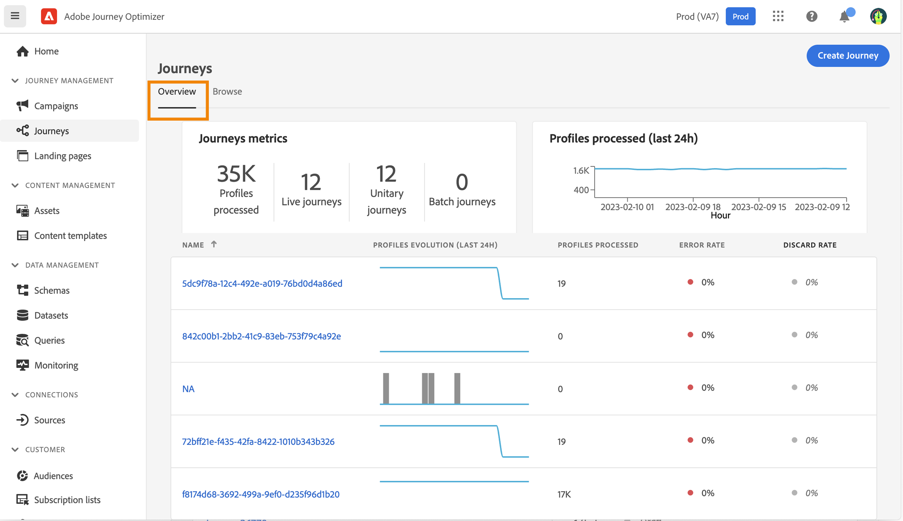  

* **Profiles processed**: total number of profiles processed over the last 24 hours
* **Live journeys**: total number of live journeys with traffic over the last 24 hours. Live journeys include **Unitary journeys** (event-based) and **Batch journeys** (read audience).
* **Error rate**: ratio of all profiles in error compared with the total number of profiles who entered over the last 24 hours. 
* **Discard rate**: ratio of all profiles discarded compared with the total number of profiles who entered over the last 24 hours. A discarded profile represents someone who is not eligible to enter the journey, for example, because of an incorrect namespace or reentrance rules.

>[!NOTE]
>
>This dashboard takes into account the journeys with traffic over the last 24 hours. Only the journeys you have access to are displayed. Metrics are refreshed every 30 minutes and only when new data is available. 

### Journeys list

The **[!UICONTROL Browse]** tab shows the list of existing journeys. You can search for journeys, use filters and perform basic actions on each element. For example, you can duplicate or delete an item. 

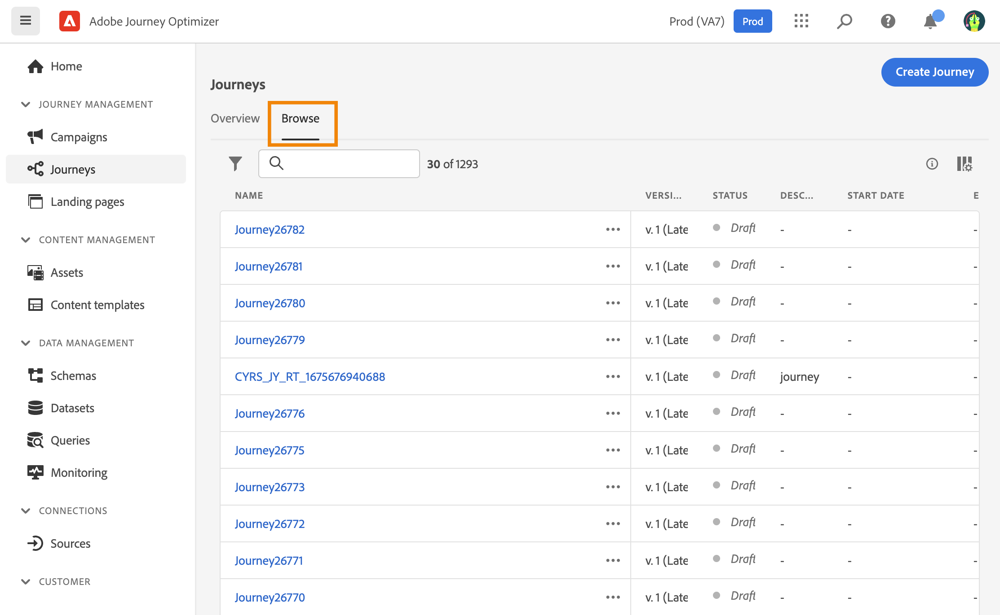  
 
In the journey list, all journey versions are displayed with the version number. When you search for a journey, newest versions appear at the top of the list the first time the application opens. Then, you can define the sorting you want and the application will keep it as a user preference. The journey's version is also displayed at the top of the journey edition interface, above the canvas. Learn more about [journey version management](publish-journey.md#journey-versions).

### Journeys calendar {#calendar}

In addition to the journeys list, [!DNL Journey Optimizer] provides a calendar view of your journeys, offering a clear visual representation of their schedules.

How journeys are represented:

* By default, the calendar grid shows all live and scheduled journeys for the selected week. Additional filter options can show completed, stopped and finished activations or activations.
* Draft journeys and journeys in test mode are not displayed.
* Journeys spanning multiple days appear at the top of the calendar grid.
* If no start time is specified, the closest manual activation time is used to position it in the calendar.
* Journeys are displayed as 1-hour timespans, but this does not reflect actual send or completion time.

To navigate in your Journeys calendar:

1. To access the calendar view, open the journeys list and click the  icon.

1. Use the arrow buttons or the date selector above the calendar to move between weeks.

    The calendar displays all journeys scheduled for the current week. 

    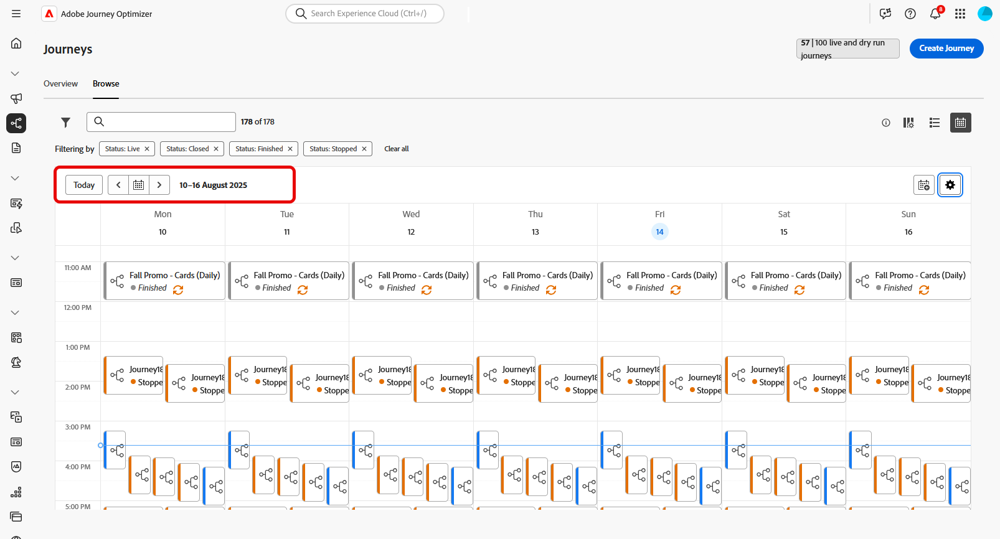

1. Click the  icon to toggle the display of items that span multiple days or weeks.

    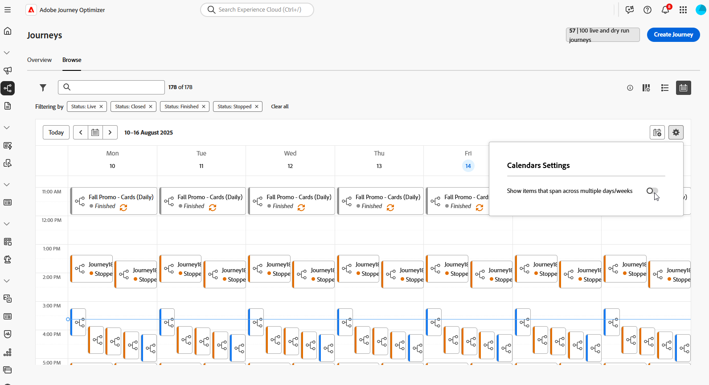

1. Click the  icon to manage and add up to three external calendars.

    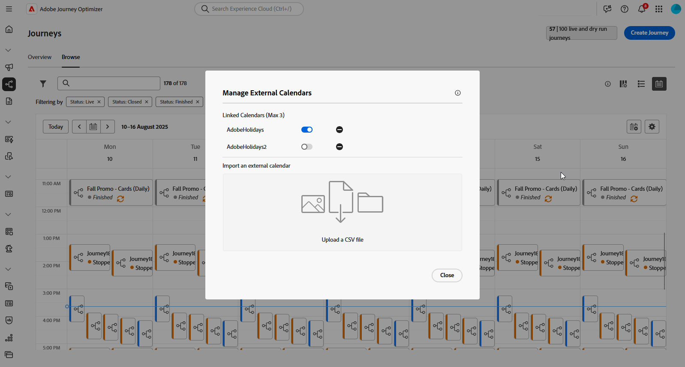

1. Drag and drop your CSV files containing event names, start dates, and end dates.

    Uploaded events appear for all users in your organization and display on both Journey and Campaign calendars.

    +++CSV format should be as follows:

    | Column1 | Column2 | Column3 |
    |-|-|-|
    | Event name | Start date in mm/dd/yy format | End date in mm/dd/yy format |
    
    +++

1. If needed, you can hide, unhide, or remove added external calendars.

    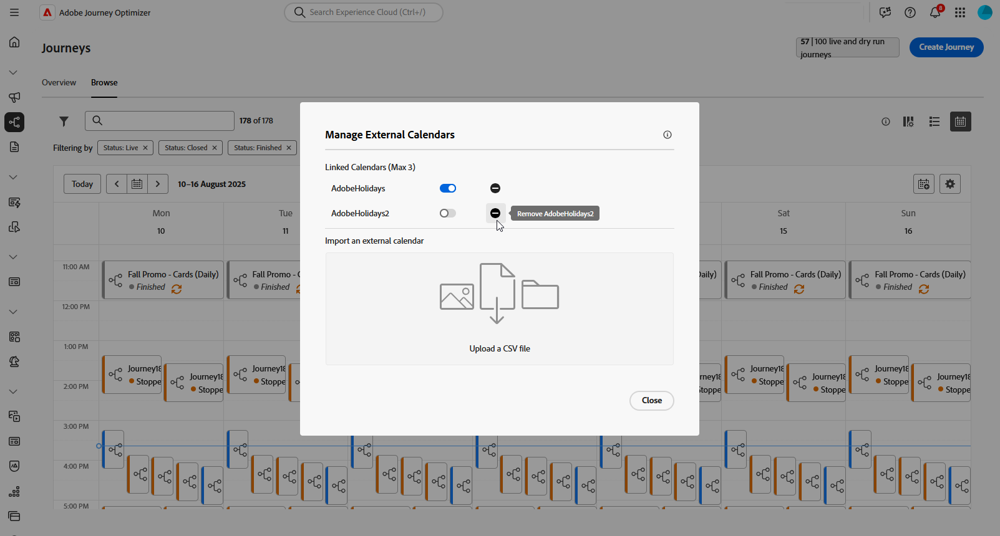

1. For more details on a journey, click its visual block to open and explore its details.

    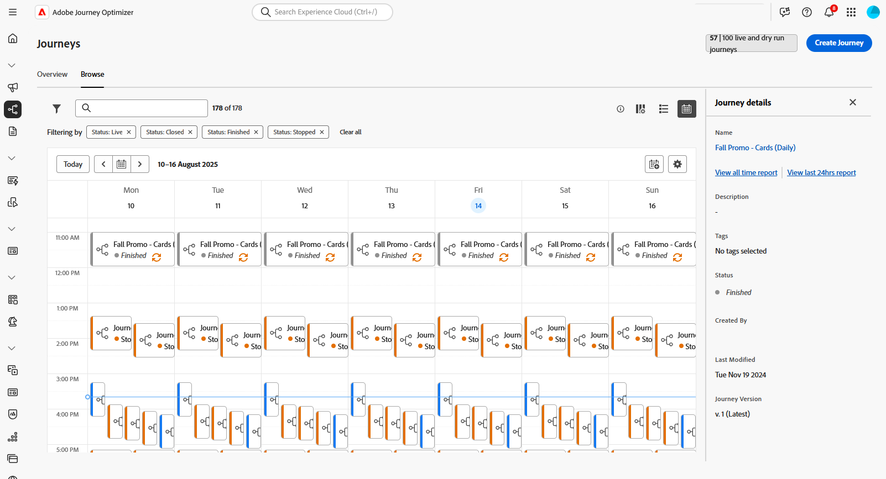

## Filter your journeys {#journey-filter}

In the list of journeys, use various filters to refine the list of journeys.

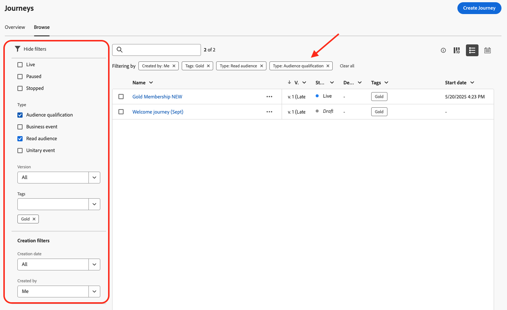

You can filter journeys according to their [status](#journey-statuses), [type](#journey-types), [version](publish-journey.md#journey-versions), and assigned [tags](../start/search-filter-categorize.md#tags) from the **[!UICONTROL Status and version filters]**.

Use the **[!UICONTROL Creation filters]** to filter journeys according to their creation date or the user who created them.

Display journeys that use a specific event, field group or action from the **[!UICONTROL Activity filters]** and **[!UICONTROL Data filters]**. 

Use the **[!UICONTROL Publication filters]** to select a publication date or a user. You can choose, for example, to display the latest versions of live journeys that were published yesterday.

To filter journeys based on a specific date range, select **[!UICONTROL Custom]** from the **[!UICONTROL Published]** drop-down list.

Additionally, in the Event, Data source and Action configuration panes, the **[!UICONTROL Used in]** field displays the number of journeys that use that particular event, field group or action. You can click the **[!UICONTROL View journeys]** button to display the list of corresponding journeys.

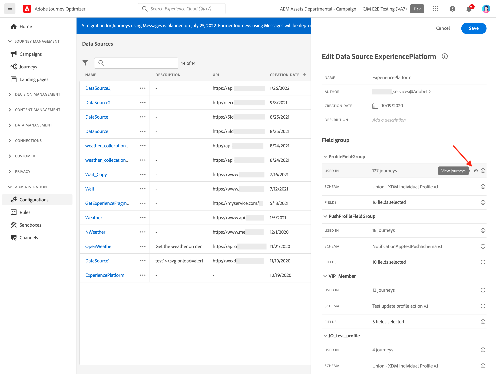

## Journey types {#journey-types}

The type of a journey depends on the activities used in that journey. It can be: 

* **[!UICONTROL Unitary event]** - Unitary events journeys are linked to a specific profile. Events relate to the behavior of a person or something happening linked to a person (for example, a person reached 10,000 loyalty points). [Learn more](../event/about-events.md).
* **[!UICONTROL Business event]**. Business events journey start with a non-profile-related event. The event configuration is performed by a technical user and cannot be edited. [Learn more](../event/about-events.md).
* **[!UICONTROL Audience Qualification]** - Audience Qualification journeys listen to the entrances and exits of profiles in [!DNL Adobe Experience Platform] audiences in order to make individuals enter or move forward in a journey. [Learn more](audience-qualification-events.md).
* **[!UICONTROL Read audience]** - In Read audience journeys, all individuals in the audience enter the journey and receive the messages included in your journey.  [Learn more](read-audience.md).

Learn more about journey types and associated entry management on [this page](entry-management.md).

## Journey statuses {#journey-statuses}

The journey status depends on its lifecycle. It can be: 

* **Draft**: the journey is in its first stage. It has not been published yet.
* **Draft (Test)**: the test mode has been activated using the **Test mode** button. [Learn more](../building-journeys/testing-the-journey.md)
* **Finished**: the journey automatically switches to this status based on the journey type and configuration. Profiles already in the journey finish the journey normally. New profiles can no longer enter the journey. [Learn when journeys are considered finished](end-journey.md#journey-finished-definition).
* **Live**: the journey has been published using the **Publish** button. [Learn more](../building-journeys/publish-journey.md)
* **Paused**: the live journey has been paused, using the **Pause** button. [Learn more](../building-journeys/journey-pause.md)
* **Stopped**: the journey has been switched off using the **Stop** button. All individuals instantly exit the journey. [Learn more](../building-journeys/end-journey.md#stop-journey)
* **Closed**: the journey has been closed using the **Close to new entrances** button. The journey stops letting new individuals enter the journey. Persons already in the journey can finish the journey normally. [Learn more](../building-journeys/end-journey.md)

>[!NOTE]
>
>* The Journey authoring lifecycle also includes a set of intermediate statuses that are not available for filtering: **Publishing** (between "Draft" and "Live"), **Activating test mode** or **Deactivating test mode** (between **Draft** and **Draft (test)**), **Stopping** (between **Live** and **Stopped**), **Resuming** (between **Paused** and **Live**), **Pausing** (between **Live** and **Paused**) When a journey is in an intermediate state, it is read-only.
>
>* If you need to modify to a **Live** journey, [create a new version](#journey-versions) of your journey. You can also pause your live journeys, perform all changes needed, and resume them again at any time. [Learn more about pausing journeys](../building-journeys/journey-pause.md)

## Duplicate a journey {#duplicate-a-journey}

You can duplicate an existing journey from the **Browse** tab. All objects and settings are duplicated to the journey copy.

To perform this, follow the steps below:

1. Navigate to the journey you want to copy, click the **More actions** icon (the three dots next to the journey name).
1. Select **Duplicate**.

    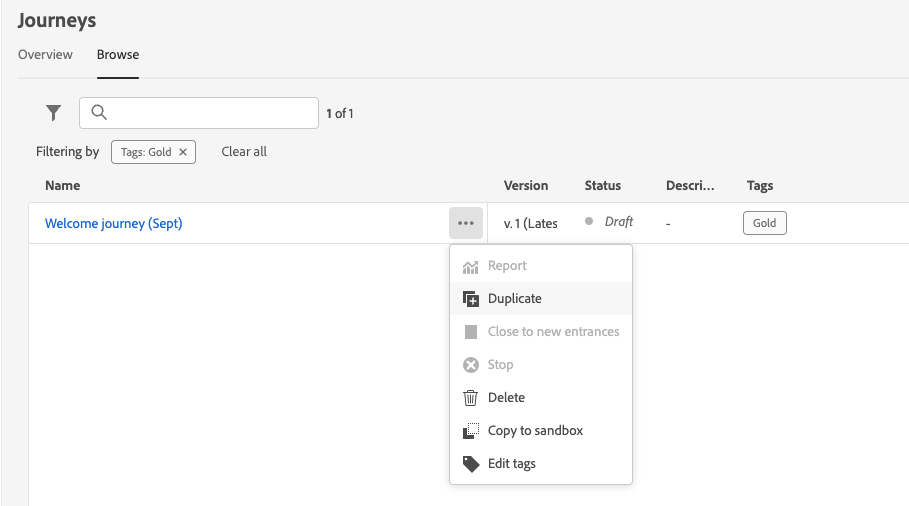

1. Enter the name of the journey and confirm. You can also change the name in the journey properties screen. By default, the name is set as follows: `[JOURNEY-NAME]_copy`

    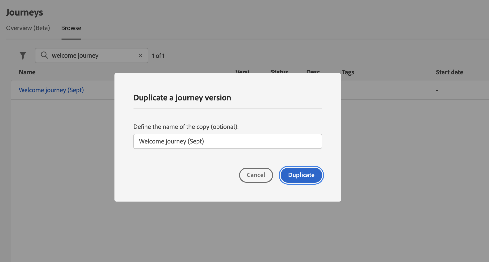

1. The new journey is created and available in the journey list.

## Bulk operations {#bulk-operations}

From the list of your journeys, you can pause multiple **Live** journeys. To pause a group of journeys (_bulk pause_), select them in the list and click the **Pause** button in the blue bar at the bottom of the screen. The **Pause** button is only available when **Live** journeys are selected.

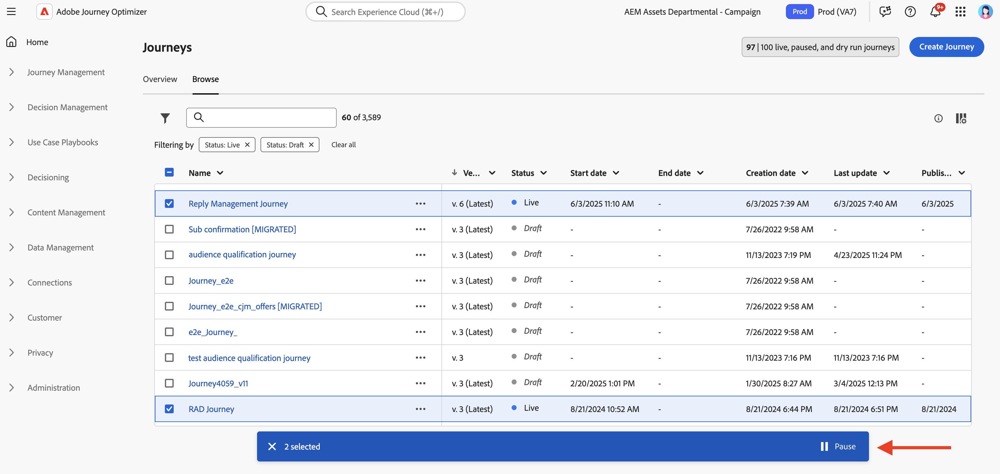

You can also resume one or several **Paused** journeys. To resume a group of journeys (_bulk resume_), select them and click the **Resume** button located in the blue bar at the bottom of the screen. Please note that the **Resume** button will only be available when **Paused** journeys are selected.

[Learn more about Pause/Resume journeys](journey-pause.md).

>[!NOTE]
>
>You can pause/resume until 10 journeys per operation.

