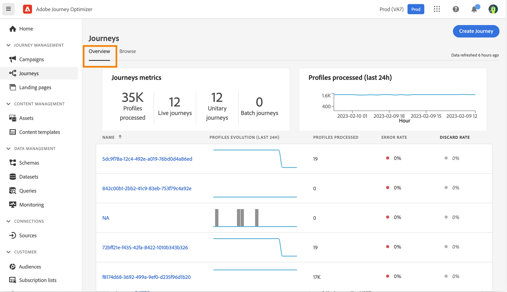
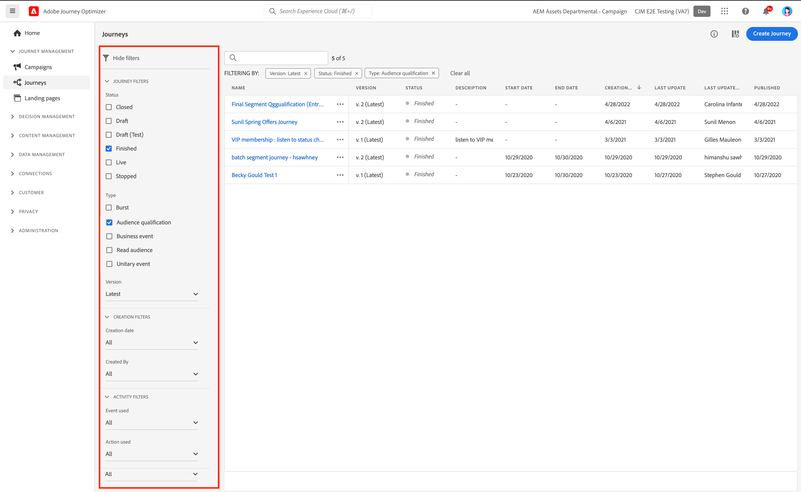

# Browse & filter your journeys {#browse-journeys}

## Journey dashboard {#dashboard-jo}

In the JOURNEY MANAGEMENT menu section, click **[!UICONTROL Journeys]**. Two tabs are available: **[!UICONTROL Overview]** and **[!UICONTROL Browse]**.

* The **[!UICONTROL Overview]** tab displays a dashboard with key metrics related to your journeys.

      

    * **Profiles processed**: total number of profiles processed over the last 24 hours
    * **Live journeys**: total number of live journeys with traffic over the last 24 hours. Live journeys include **Unitary journeys** (event-based) and **Batch journeys** (read audience).
    * **Error rate**: ratio of all profiles in error compared with the total number of profiles who entered over the last 24 hours. 
    * **Discard rate**: ratio of all profiles discarded compared with the total number of profiles who entered over the last 24 hours. A discarded profile represents someone who is not eligible to enter the journey, for example because of an incorrect namespace or because of reentrance rules.

    >[!NOTE]
    >
    >This dashboard takes into account the journeys with traffic over the last 24 hours. Only the journeys you have access to are displayed. Metrics are refreshed every 30 minutes and only when new data is available. 

* The **[!UICONTROL Browse]** tab shows the list of existing journeys. You can search for journeys, use filters and perform basic actions on each element. For example, you can duplicate or delete an item. 

      

## Filter your journeys {#journey-filter}

In the list of journeys, use various filters let you refine the list of journeys.

You can filter journeys according to their [status](#journey-statuses), [type](#journey-types), [version](#journey-versions), and assigned [tags](../start/search-filter-categorize.md#tags) from the **[!UICONTROL Status and version filters]**.

Use the **[!UICONTROL Creation filters]** to filter journeys according to their creation date or the user who created them.

Display journeys which use a specific event, field group or action from the **[!UICONTROL Activity filters]** and **[!UICONTROL Data filters]**. 

Use the **[!UICONTROL Publication filters]** to select a publication date or a user. You can choose, for example, to display the latest versions of live journeys that were published yesterday.

To filter journeys based on a specific date range, select **[!UICONTROL Custom]** from the **[!UICONTROL Published]** drop-down list.

Additionally, in the Event, Data source and Action configuration panes, the **[!UICONTROL Used in]** field displays the number of journeys that use that particular event, field group or action. You can click the **[!UICONTROL View journeys]** button to display the list of corresponding journeys.

## Journey types {#journey-types}

The type can be: **[!UICONTROL Unitary event]**, **[!UICONTROL Audience qualification]**, **[!UICONTROL Read audience]** or **[!UICONTROL Business event]**. 

## Journey statuses {#journey-statuses}

The journey status can be: 

* **Closed**: the journey has been closed using the **Close to new entrances** button. The journey stops letting new individuals enter the journey. Persons already in the journey can finish the journey normally.
* **Draft**: the journey is in its first stage. It has not been published yet.
* **Draft (Test)**: the test mode has been activated using the **Test mode** button.
* **Finished**: the journey automatically switches to this status after the 91-day [global timeout](journey-properties.md#global_timeout). Profiles already in the journey finish the journey normally. New profiles can no longer enter the journey.
* **Live**: the journey has been published using the **Publish** button.
* **Stopped**: the journey has been switched off using the **Stop** button. All individuals instantly exit the journey.

>[!NOTE]
>
>The Journey authoring lifecycle also includes a set of intermediate statuses which are not available for filtering: "Publishing" (between "Draft" and "Live"), "Activating test mode" or "Deactivating test mode" (between "Draft" and "Draft (test)"), and "Stopping" (between "Live" and "Stopped"). When a journey is in an intermediate state, it is read-only.

## Journey versions {#journey-versions}

In the journey list, all journey versions are displayed with the version number. When you search for a journey, newest versions appear at the top of the list the first time the application opens. Then, you can define the sorting you want and the application will keep it as a user preference. The journey's version is also displayed at the top of the journey edition interface, above the canvas.

>[!NOTE]
>
>Usually, a profile cannot be present multiple times in the same journey, at the same time. If reentrance is enabled, a profile can reenter a journey, but cannot do it until they fully exited that previous instance of the journey. [Read more](end-journey.md).

If you need to modify to a live journey, create a new version of your journey.

1. Open the latest version of your live journey, click **[!UICONTROL Create a new version]** and confirm.

    

    >[!NOTE]
    >
    >You can only create a new version from the latest version of a journey.

1. Make your modifications, click **[!UICONTROL Publish]** and confirm.

From the moment the journey is published, individuals will start to flow into the latest version of the journey. People who have already entered a previous version stay in it until they finish the journey. If they later reenter the same journey, they will go into the latest version.

Journey versions can be stopped individually. All versions of journeys have the same name.

When you publish a new version of a journey, the previous version automatically ends and switches to the **Closed** status. No entrance in the journey can happen. Even if you stop the latest version, the previous version stays closed.

## Duplicate a journey {#duplicate-a-journey}

You can duplicate an existing journey from the **Browse** tab. All objects and settings are duplicated to the journey copy.

To perform this, follow the steps below:

1. Navigate to the journey you want to copy, click the **More actions** icon (the three dots next to the journey name).
1. Select **Duplicate**.

    

1. Enter the name of the journey and confirm. You can also change the name in the journey properties screen. By default, the name is set as follows: `[JOURNEY-NAME]_copy`

    

1. The new journey is created and available in the journey list.
