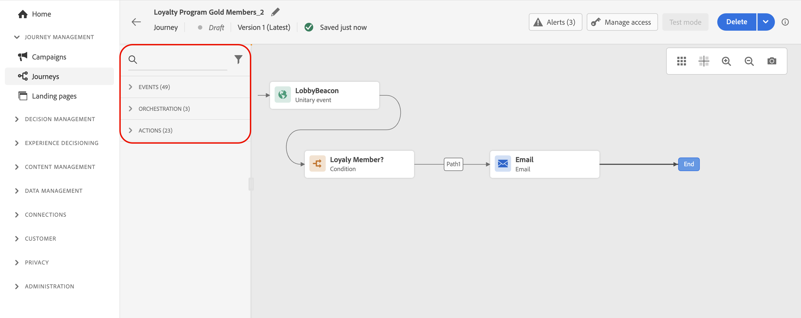

# Get started with journeys{#jo-general-principle}

Adobe Journey Optimizer empowers you to create personalized, multistep customer journeys that adapt in real-time to your audience's behavior and needs. Using an intuitive drag-and-drop canvas, you can orchestrate messages and actions across multiple channels, leveraging contextual data and audience targeting for maximum impact.

This guide provides a clear roadmap to help you understand journey fundamentals, choose the right journey type for your use case, and confidently design journeys that deliver meaningful, timely customer experiences.

## What are journeys?

**Journeys** are automated, multistep customer experiences that orchestrate personalized interactions across channels in response to customer behavior, business events, or scheduled campaigns. 

Use [!DNL Journey Optimizer] to:

* Build **real-time orchestration** use cases using contextual data stored in events or data sources
* Design **multistep advanced scenarios** that respond dynamically to customer behavior and business events
* Deliver **1:1 personalized experiences** at scale across email, push, SMS, in-app, web, and more

➡️ **Ready to start building?** [Create your first journey](journey-gs.md) in 5 minutes.

### Journeys vs Campaigns: When to use each {#journeys-vs-campaigns-intro}

Adobe Journey Optimizer offers three approaches to reach customers: **Journeys** (1:1 real-time orchestration), **Campaigns** (simple batch or API-triggered delivery), and **Orchestrated Campaigns** (batch canvas workflows with multi-entity data).

**Quick decision:**

* Use **Journeys** for multi-step, behavior-driven experiences where each customer progresses at their own pace
* Use **Action/API Campaigns** for simple, scheduled or triggered message delivery to audiences
* Use **Orchestrated Campaigns** for complex batch workflows requiring multi-entity segmentation and exact pre-send counts

<!-- waiting for DOCAC-13912
➡️ **[View detailed comparison: Journeys vs Campaigns](../start/journeys-vs-campaigns.md)** - Includes decision guide, use cases, and feature availability-->

## Choose your journey type {#journey-types}

Adobe Journey Optimizer supports four journey types, each designed for different entry mechanisms and business scenarios:

* **Unitary journeys**: Real-time, event-triggered experiences (order confirmations, welcome emails)
* **Read Audience journeys**: Scheduled batch communications to audience segments (newsletters, promotional campaigns)
* **Audience Qualification journeys**: Real-time responses to audience membership changes (VIP upgrades, re-engagement)
* **Business event journeys**: Business conditions affecting multiple customers (inventory alerts, flash sales)

<!-- waiting for DOCAC-13912 
➡️ **[Journey types and selection guide](journey-types-selection.md)** - Detailed comparison, decision tree, and feature compatibility matrix -->

## Build with the journey designer {#journey-designer}

The **[journey designer](using-the-journey-designer.md)** is your visual canvas for creating customer experiences. With an intuitive drag-and-drop interface, you can orchestrate every step of your journey without writing code.

### What you can do in the designer:

:::: landing-cards-container

:::

**Define entry points**

Choose how customers enter: through an event, audience segment, or audience qualification.

[Learn about entry management](entry-management.md)
:::

:::

**Send messages**

Use built-in channel actions for email, push, SMS/MMS, in-app, web, and more—all designed in Journey Optimizer.

[Send messages in journeys](journeys-message.md)
:::

:::

**Add logic & conditions**

Branch your journey based on profile attributes, audience membership, or real-time events.

[Use conditions](condition-activity.md)
:::

:::

**Leverage data**

Use contextual data from events, Adobe Experience Platform, or third-party API services.

[Work with data sources](../datasource/about-data-sources.md)
:::

:::

**Connect external systems**

Create custom actions to integrate third-party systems for sending messages or triggering workflows.

[Configure custom actions](../action/about-custom-action-configuration.md)
:::

:::

**Add orchestration activities**

Use wait times, jumps, profile updates, and audience management to create sophisticated flows.

[Explore all activities](about-journey-activities.md)
:::

::::

➡️ **Hands-on learning:** [Watch the journey designer video](#video) or [explore end-to-end use cases](jo-use-cases.md)

## Your journey creation workflow {#workflow}

Building successful journeys follows a clear, repeatable process. Here's your step-by-step workflow:

**1. Plan** → **2. Design** → **3. Test** → **4. Publish** → **5. Monitor** → **6. Optimize**

### 1. Plan your journey {#plan}

Before opening the designer, clarify your objectives:

* **What's the goal?** (e.g., onboard new customers, re-engage inactive users)
* **Who's the audience?** (specific segment, event-driven individuals)
* **Which journey type fits?** (See [journey types](#journey-types) above)
* **What channels will you use?** (email, push, SMS, etc.)

### 2. Design in the canvas {#design}

Use the journey designer to build your flow:

* **Set entry conditions** - Define how profiles enter (event, audience, qualification)
* **Add orchestration logic** - Include wait times, conditions, and decision points
* **Configure messages** - Design your communications or leverage existing templates
* **Set up actions** - Configure built-in or custom actions to execute
* **Define exit criteria** - Specify when and how profiles complete the journey

[Learn to use the journey designer →](using-the-journey-designer.md)

### 3. Test before going live {#test}

Always test your journey to catch issues before customers experience them:

* Use **test mode** to simulate the journey with test profiles
* Use **dry run** to preview journey execution without affecting real data or sending messages
* Verify all conditions, messages, and actions work as expected
* Check timing, data flows, and personalization

[Test your journey →](testing-the-journey.md) | [Learn about dry run →](journey-dry-run.md)

### 4. Publish your journey {#publish}

Once testing is complete, publish to make your journey live:

* Review final settings and properties
* Publish to activate for real customers
* Note: Live journeys can be stopped but not edited (you must create a new version)

[Publish your journey →](publish-journey.md)

### 5. Monitor performance {#monitor}

Track how your journey performs in the real world:

* View journey reports and analytics
* Monitor entry, completion, and error rates
* Set up alerts for critical issues

[Monitor and report →](report-journey.md) | [Set up alerts →](../reports/alerts.md)

### 6. Optimize and iterate {#optimize}

Use insights to improve:

* Analyze engagement metrics and conversion rates
* Test send-time optimization
* Create new journey versions with improvements
* Use AI-powered recommendations

[Optimize your journeys →](optimize.md) | [Send-time optimization →](send-time-optimization.md)

➡️ **Ready to start?** [Create your first journey now →](journey-gs.md)

## Real-world use cases {#use-cases}

Learn from practical examples that demonstrate how to apply journey concepts to solve common marketing challenges:

:::: landing-cards-container

:::

**Welcome new subscribers**

When a customer subscribes to your service, trigger a welcome journey that encourages them to complete onboarding steps.

[View use case →](message-to-subscribers-uc.md)
:::

:::

**Send-time optimization**

Use AI to deliver emails when each customer is most likely to engage, maximizing open and click rates.

[View use case →](send-time-optimization.md)
:::

:::

**Ramp up deliveries**

Gradually increase message volume to warm up your sending reputation and avoid deliverability issues.

[View use case →](ramp-up-deliveries-uc.md)
:::

:::

**Target by weekday**

Send different content based on the day of the week customers enter your journey for better relevance.

[View use case →](weekday-email-uc.md)
:::

:::

**Multi-channel campaigns**

Orchestrate seamless experiences across email, push, SMS, and web channels in a single journey.

[View use case →](journeys-uc.md)
:::

:::

**All use cases**

Explore the complete library of journey use cases with step-by-step implementations.

[Browse all →](jo-use-cases.md) | [Use case library →](/help/rp_landing_pages/journey-use-cases-landing-page.md)
:::

::::

## Explore journey capabilities {#capabilities}

As you get more comfortable with journey building, explore these powerful capabilities to create sophisticated customer experiences:

:::: landing-cards-container

:::

**Advanced Expressions**

Build dynamic conditions and personalization using the expression editor for data manipulation and complex logic.

[Learn about expressions](/help/rp_landing_pages/building-advanced-conditions-journeys-landing-page.md)
:::

:::

**Time zone management**

Handle global audiences with automatic time zone adjustments and optimal send times.

[Manage time zones](timezone-management.md)
:::

:::

**Test mode & dry run**

Validate journeys with test profiles before going live, and preview execution without affecting real data.

[Use dry run](journey-dry-run.md)
:::

:::

**Copy to sandbox**

Duplicate journeys across sandboxes to streamline testing and deployment workflows.

[Copy journeys](copy-to-sandbox.md)
:::

:::

**Tags & organization**

Use tags to categorize and filter journeys for better management at scale.

[Organize with tags](tags.md)
:::

:::

**Throughput control**

Limit message throughput to manage sending reputation and avoid overwhelming systems.

[Control throughput](limit-throughput.md)
:::

::::

[View all journey capabilities →](/help/rp_landing_pages/manage-journey-landing-page.md)

## Learn by watching {#video}

Get a visual introduction to journey components and learn the basics of building journeys in the canvas:

>[!VIDEO](https://video.tv.adobe.com/v/3424996?quality=12)

➡️ **Want more videos?** [Explore journey video tutorials](https://experienceleague.adobe.com/en/docs/journey-optimizer-learn/tutorials/journeys/journey-designer-overview){target="_blank"}

## Common questions {#common-questions}

+++ What is the difference between a journey and a campaign?

Adobe Journey Optimizer offers three approaches:

* **Journeys**: 1:1 real-time orchestration where each profile travels through steps at their own pace. Best for behavior-driven, multi-step experiences with conditional logic (e.g., onboarding, cart abandonment).

* **Campaigns (Action & API-triggered)**: Simple message delivery to audiences, executing simultaneously to all profiles either on schedule or via API trigger. Best for promotional campaigns, newsletters, transactional messages.

* **Orchestrated Campaigns**: Multi-step batch workflows with complex segmentation using relational data (profiles + products/stores/bookings). All profiles processed together with exact pre-send counts. Best for seasonal promotions, product launches, campaigns requiring multi-entity data.

**Key difference**: Journeys maintain individual customer state for real-time actions; Action/API Campaigns deliver simple messages in batch; Orchestrated Campaigns provide batch workflow canvas with multi-entity segmentation capabilities.

<!-- waiting for DOCAC-13912 - [See detailed comparison](#journeys-vs-campaigns) -->
[Learn about Orchestrated campaigns](../orchestrated/gs-orchestrated-campaigns.md)

+++

<!-- Waiting for DOCAC-13912
+++ Which journey type should I use?

Use the [decision guide](#decision-guide) or [comparison table](#journey-types-comparison) to choose between Unitary, Read Audience, Audience Qualification, and Business Event journeys based on your trigger mechanism and use case.

+++
-->

+++ Can I edit a live journey?

You can edit limited elements (name, message content), but structural changes require creating a new version. [Learn about journey versions](publish-journey.md#journey-versions)

+++

➡️ **More questions?** [View complete Journey FAQ](journey-faq.md) with 40+ detailed answers

## Need help? {#help}

### Quick links for common tasks

* **[Create your first journey](journey-gs.md)** - Step-by-step guide for beginners
* **[Journey FAQ](journey-faq.md)** - Common questions answered
* **[Troubleshooting](/help/rp_landing_pages/troubleshoot-journey-landing-page.md)** - Diagnose and fix issues
* **[Error codes reference](error-codes-reference.md)** - Understand error messages
* **[Guardrails & limitations](../start/guardrails.md)** - Technical boundaries and best practices

### Get notified about issues

Set up **[journey alerts](../reports/alerts.md)** to receive real-time notifications when journeys encounter errors or unusual patterns.

### Additional resources

* **[Journey management hub](/help/rp_landing_pages/manage-journey-landing-page.md)** - Tools for filtering, optimization, and profile management
* **[Journey activities reference](/help/rp_landing_pages/about-journey-building-landing-page.md)** - Complete guide to all activity types
* **[Troubleshooting execution issues](troubleshooting-execution.md)** - Debug journey execution problems
* **[Troubleshooting inbound activities](troubleshooting-inbound.md)** - Fix entry and qualification issues

**Ready to build your first journey?** [Get started now →](journey-gs.md)
