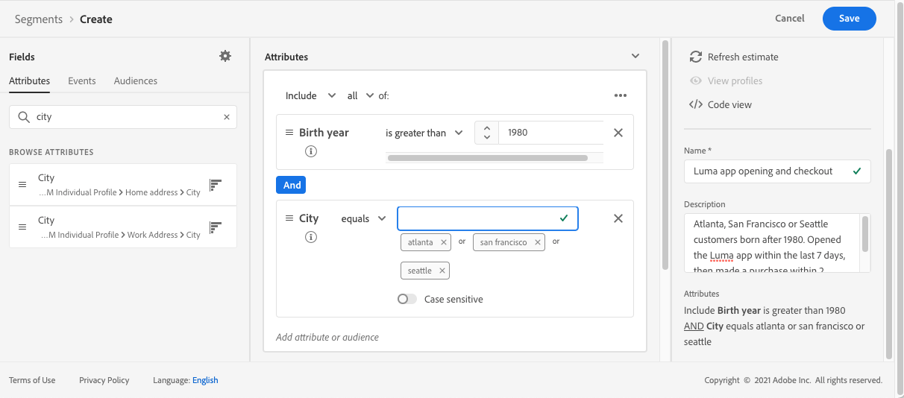
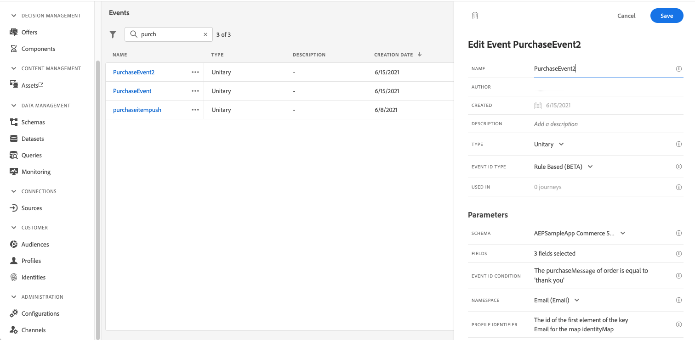
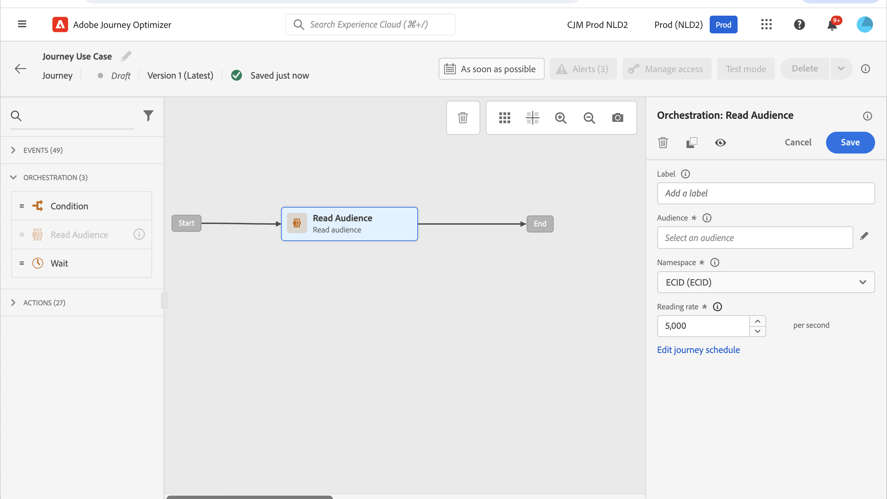
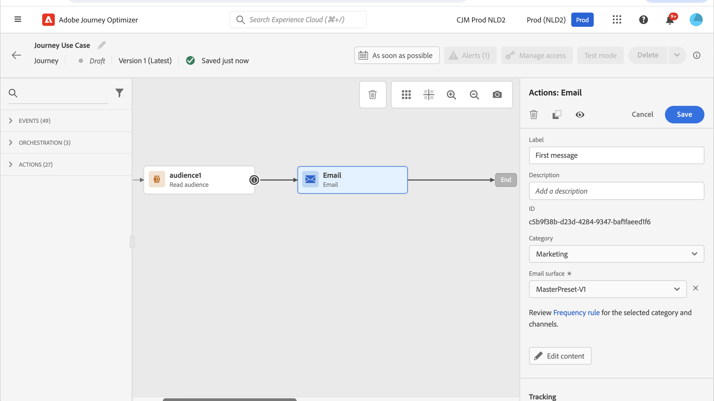

# Send multi-channel messages {#send-multi-channel-messages}

This section presents a use case that combines a Read Audience, an event, reaction events and email/push messages.

## Description of the use case

In this use case, the goal is to send a first email message to all customers belonging to a specific audience. 

Based on their reaction to the first message, specific follow-up messages are sent.

If the customer opens the email, the system waits for a purchase and sends a push message to thank the customer. 

If there is no reaction, a follow-up email is sent.

## Prerequisites

For this use case to work, configure the following:

* An audience for all customers living in Atlanta, San Francisco, or Seattle and born after 1980
* A purchase event

### Create the audience

In this journey, a specific audience of customers is leveraged. All individuals belonging to the audience enter the journey and follow the different steps. In this example, the audience targets all customers living in Atlanta, San Francisco, or Seattle and born after 1980. 

For more information on audiences, [refer to this page](../audience/about-audiences.md).

1. From the CUSTOMER menu section, select **[!UICONTROL Audiences]**.
1. Click the **[!UICONTROL Create audience]** button located at the top right of the audience list.
1. In the **[!UICONTROL Audience properties]** pane, enter a name for the audience.
1. Drag and drop the desired fields from the left pane into the center workspace, and configure them according to your needs. In this example, use the **City** and **Birth year** attribute fields.
1. Click **[!UICONTROL Save]**. 

   

The audience is now created and ready to be used in the journey. Using a **Read Audience** activity, all individuals belonging to the audience can enter the journey. 

### Configure the event

Configure an event that is sent to the journey when a customer makes a purchase. When the journey receives the event, it triggers the "thank you" message.

For this, use a [rule-based event](../event/about-events.md).

1. In the ADMINISTRATION menu section, select **[!UICONTROL Configurations]**, then click **[!UICONTROL Events]**. Click **[!UICONTROL Create event]** to create a new event. 

1. Enter the name of the event.

1. In the **[!UICONTROL Event ID type]** field, select **[!UICONTROL Rule Based]**. 

1. Define the **[!UICONTROL Schema]** and payload **[!UICONTROL Fields]**. Use several fields, for example, the product purchased, the purchase date, and the purchase ID. 

1. In the **[!UICONTROL Event ID condition]** field, define the condition used by the system to identify the events that trigger the journey. For example, add a `purchaseMessage` field and define the following rule: `purchaseMessage="thank you"`

1. Define the **[!UICONTROL Namespace]** and **[!UICONTROL Profile Identifier]**.

1. Click **[!UICONTROL Save]**. 

   

The event is now configured and ready to be used in the journey. Using the corresponding event activity, an action can be triggered every time a customer makes a purchase.

## Design the journey

1. Start the journey with a **Read Audience** activity. Select the audience created previously. All individuals belonging to the audience enter the journey.

   

1. Drop an **Email** action activity and define the content of the "first message." This message is sent to all individuals in the journey. Refer to this [section](../email/create-email.md) to learn how to configure and design an email.

   

1. Add a **Reaction** event and select **Email opened**. The event is triggered when an individual belonging to the audience opens the email.

1. Check the **Define the event timeout** box, define a duration (1 day in this example), and check **Set a timeout path**. This creates another path for individuals who do not open the push or email first message.

1. In the timeout path, drop an **Email** action activity and define the content of the "follow-up" message. This message is sent to the individuals who do not open the email or push first message within the next day. [Learn how to configure and design an email](../email/create-email.md).

1. In the first path, add the purchase event created previously. The event is triggered when an individual makes a purchase.

1. After the event, drop a **Push** action activity and define the content of the "thank you" message. Refer to this [section](../push/create-push.md) to learn how to configure and design a push.

## Test and publish the journey

1. Before testing the journey, verify that it is valid and that there is no error.

1. Use the **Test** toggle, located in the top right corner, to activate the test mode. Refer to this [section](testing-the-journey.md) to learn how to use the test mode.

1. When the journey is ready, publish it using the **Publish** button, located in the top right corner.

## Multi-phase loyalty journey {#multi-phase-loyalty}

This example illustrates a key journey architecture pattern: decomposing a complex, multi-phase journey into smaller, focused sub-journeys connected with the [**[!UICONTROL Jump]**](jump.md) activity. A loyalty program serves as the scenario, but this pattern applies to any journey that spans multiple milestones or business phases.

Complex multi-phase journeys quickly generate a large number of unique customer paths. Decomposing them into one sub-journey per phase keeps each journey manageable, testable, and independently maintainable.

### Scenario

Consider a loyalty program that guides customers through three milestones using two marketing channels ([email](../email/create-email.md) and [push](../push/create-push.md)):

1. **Phase 1 — Download the mobile app:** Initial communications encourage new loyalty members to download the app. A follow-up reminder is sent if the customer has not acted within a set period.
1. **Phase 2 — Make a first transaction:** Once the app is downloaded, targeted messages guide customers toward completing their first loyalty transaction.
1. **Phase 3 — Make a second transaction:** After the first transaction, a final set of communications drives a second transaction to deepen loyalty engagement.

Even with this straightforward strategy, this journey exposes more than 20 unique paths a customer can take. Complexity grows exponentially with each additional touchpoint or channel.

### Sub-journey decomposition

Break the end-to-end journey into three smaller, connected sub-journeys:

| Sub-journey | Entry condition | Business objective |
|---|---|---|
| Phase 1 — App download | Customer joins the loyalty program | Drive mobile app download |
| Phase 2 — First transaction | Customer downloads the app | Drive first loyalty transaction |
| Phase 3 — Second transaction | Customer completes first transaction | Drive second loyalty transaction |

Connect the sub-journeys using the [**[!UICONTROL Jump]**](jump.md) activity so that profiles pass seamlessly from one phase to the next. Each sub-journey remains simple, readable, and independently maintainable.

>[!TIP]
>
>Learn how to set up and connect sub-journeys using the [Jump activity](jump.md).

>[!NOTE]
>
>If your goal is to build a gamified loyalty program with challenges, tasks, and built-in reward tracking, Journey Optimizer also offers a dedicated **Loyalty Challenges** capability.
