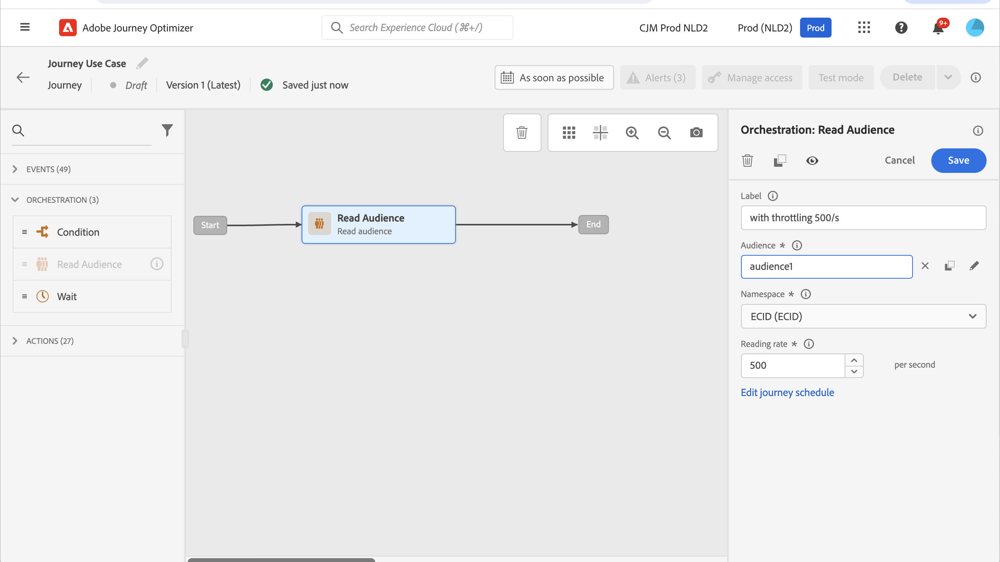
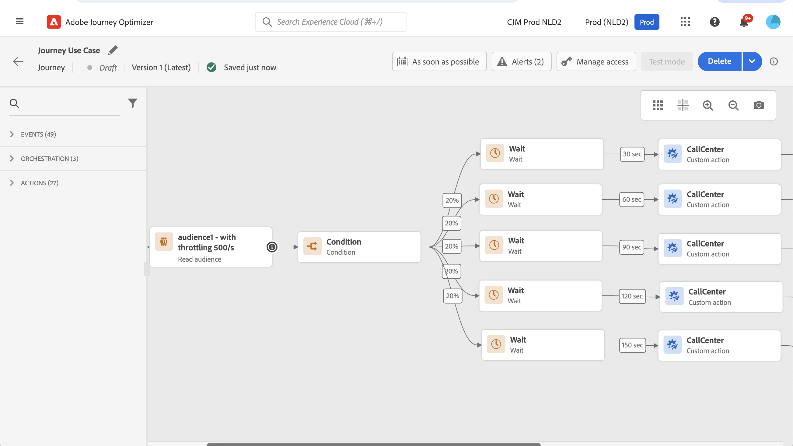

# Use case: limit throughput with external data sources & custom actions{#limit-throughput}

>[!BEGINSHADEBOX]

**On this page:** Learn how to throttle journey processing with custom actions and external data sources so that external systems are not overwhelmed beyond their supported number of requests per second.

>[!ENDSHADEBOX]

Use this use case to throttle journey processing when external systems must handle a capped number of requests per second.

## Description of the use case

[!DNL Adobe Journey Optimizer] allows practitioners to send API calls to external systems through the use of Custom Actions and Data Sources.

This can be done with :

* **Data Sources**: to gather information from external systems and use it in the journey context, for example to get weather information about the profile city and have a dedicated journey flow based on that.

* **Custom Actions**: to send information to external systems, for example to send emails through an external solution using Journey Optimizer's orchestration capabilities alongside profile information, audience data and journey context.

>[!NOTE]
>
>As the responses are now supported, you should use custom actions instead of data sources for external data sources use-cases. For more information on responses, see this [section](../action/action-response.md)

If you are working with external data sources or custom actions, you may want to protect your external systems by limiting journey throughput: up to 5,000 instances/second for unitary journeys and up to 20,000 instances/second for audience-triggered ones. Learn more about journey processing rates and throughput in [this section](entry-management.md#journey-processing-rate).

For custom actions, throttling capabilities are available at product level. Refer to this [page](../configuration/external-systems.md#capping).

For external data sources, you can define a capping limits at endpoint level to avoid overwhelming those external systems through Journey Optimizer's Capping APIs. However, all remaining requests after the limit is reached will be dropped. In this section, you will find workarounds that you can use to optimize your throughput. 

For more information on how to integrate with external systems, refer to this [page](../configuration/external-systems.md).

## Implementation

For **audience-triggered journeys**, you can define the reading rate of your Read Audience activity that will impact journey throughput. [Read more](../building-journeys/read-audience.md)

>[!NOTE]
>
> This is the maximum number of profiles that can enter the journey per second. This rate applies only to this activity and no others in the journey. [Read more](../building-journeys/read-audience.md)

You can modify this value from 500 to 20 000 instances per second. If you need to go lower than 500/s, you can also add "percentage split" conditions with wait activities to split your journey into multiple branches and have them execute at a specific time.

Let's take an example of a **audience-triggered journeys** working with a population of **10,000 profiles** and sending data to an external system supporting **100 requests/second**.

1. You can define your Read Audience to read profiles with a throughput of 500 profiles/second, meaning that it will take 20 seconds to read all your profiles. On second 1, you will read 500 of them, on second 2 500 more, etc. 

1. You can then add a "percentage split" Condition activity with a 20% split to have at each second 100 profiles in each branch.

1. After that, add Wait activities with a specific timer in each branch. Here we've set up a 30 seconds wait for each one. At every second, 100 profiles will flow into each branch.

    * On branch 1, they will wait for 30 seconds, meaning that:
         * on second 1, 100 profiles will wait for second 31
         * on second 2, 100 profiles will wait for second 32, etc.

    * On branch 2, they will wait for 60 seconds, meaning that:
         * On second 1, 100 profiles will wait for second 61 (1'01'')
         * On second 2, 100 profiles will wait for second 62 (1'02''), etc.

    * Knowing that we expect 20 seconds maximum to read all profiles, there will be no overlap between each branch, second 20 being the last one where profiles will flow into the condition. Between second 31 and second 51, all profiles in branch 1 will be processed. Between second 61 (1'01'') and second 81 (1'21''), all profiles in branch 2 will be processed, etc.

    * As a guardrail, you can also add a sixth branch to have less than 100 profiles per branch, especially if your external system only supports 100 requests/second. 

>[!IMPORTANT]
>
>As with any workaround, please test that solution thoroughly before going into production to make sure it does what you want.

As an additional guardrail, you can also use Capping capabilities.

>[!NOTE]
>
>Unlike Capping capabilities, which protect an endpoint by being global to all journeys of a sandbox, this workaround works only at journey level. This means that if multiple journeys are running in parallel and are targeting the same endpoint, you will need to take that into account while designing your journey. This workaround is therefore not suitable for every use case.

+++AI Assistant — Page context

* **TL;DR:** This page explains how to limit journey throughput when external data sources or custom actions have a capped number of requests per second, using Read Audience rate configuration, percentage splits, and wait activities.

**Intents:**

* Limit the throughput of an audience-triggered journey to protect an external system from being overwhelmed
* Configure the reading rate of a Read Audience activity to control how many profiles enter per second
* Combine percentage split conditions and wait activities to spread profile processing over time
* Understand the difference between journey-level throughput workarounds and sandbox-level capping capabilities
* Apply capping capabilities to custom actions at the product level

**Glossary:**

* **Throttling / throughput limiting**: Controlling the rate at which profiles flow through a journey to avoid exceeding the request capacity of an external system. *(product-specific)*
* **Read Audience reading rate**: A configurable parameter on the Read Audience activity that sets the maximum number of profiles entering the journey per second (range: 500–20,000 instances/second). *(product-specific)*
* **Capping API**: A Journey Optimizer API that defines a maximum request limit per endpoint for external data sources; requests beyond the cap are dropped. *(product-specific)*
* **Percentage split condition**: A condition activity that divides the profile flow into branches by percentage, used here to distribute profiles across time-staggered wait paths. *(product-specific)*

**Guardrails:**

* Read Audience reading rate can be set between 500 and 20,000 instances per second; values below 500/s require a workaround using percentage splits and wait activities
* Unitary journeys support up to 5,000 instances/second; audience-triggered journeys support up to 20,000 instances/second
* The percentage-split + wait workaround operates only at journey level, not across all journeys in the sandbox
* When multiple journeys target the same external endpoint in parallel, this workaround does not account for the combined load — capping capabilities should be used instead
* Remaining requests that exceed the capping limit on external data sources are dropped, not queued
* The workaround must be thoroughly tested before going to production

**Terminology:**

* Canonical name: Throughput limiting — Acronym: none — variants: throttling, rate limiting, journey throughput control
* Synonyms: "Capping" = "throttling" in the context of external endpoint protection
* Do not confuse: "Capping API (endpoint-level)" ≠ "reading rate (journey-level)" — The Capping API applies globally to all journeys in a sandbox targeting an endpoint; the reading rate and split/wait workaround apply only to the individual journey

**FAQ:**

* **Q: What is the maximum reading rate I can set on a Read Audience activity?** — Between 500 and 20,000 profiles per second; to go below 500/s, use a percentage split with wait activities.
* **Q: How do percentage splits and wait activities help limit throughput?** — By splitting profiles into branches (e.g., 20% each) and adding staggered wait timers per branch, you ensure that only a controlled number of profiles reach the external system per second.
* **Q: Does the percentage-split workaround protect all journeys targeting the same endpoint?** — No; it only works at the individual journey level. If multiple journeys run in parallel against the same endpoint, use sandbox-level Capping capabilities instead.
* **Q: What happens to requests that exceed the capping limit on an external data source?** — They are dropped; the Capping API does not queue excess requests.
* **Q: Should I use custom actions or data sources for external data use cases?** — Custom actions are preferred because they support response handling; data sources should be used only when the use case specifically requires them.

+++
