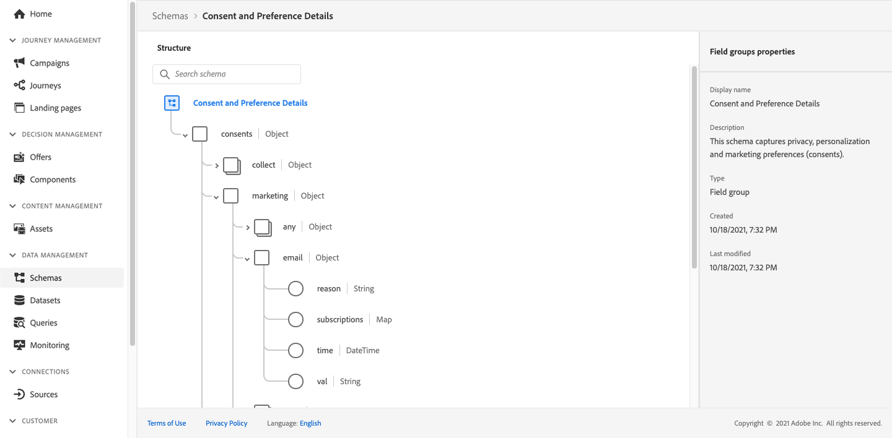
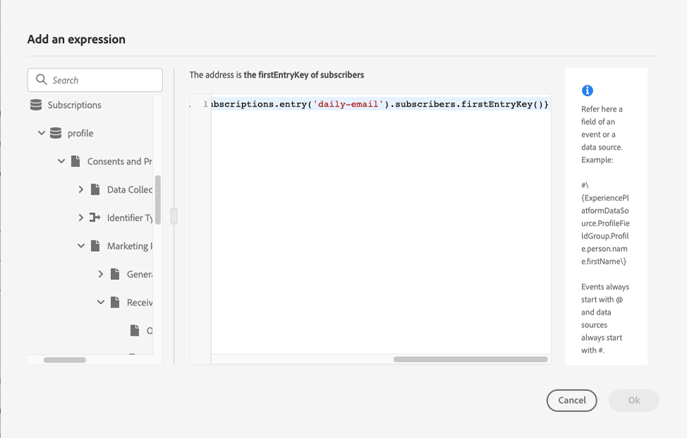

# Send a message to the subscribers of a list {#send-a-message-to-the-subscribers-of-a-list}

>[!BEGINSHADEBOX]

**On this page:** Learn how to build a journey that sends a message to the subscribers of a list using the Consent and Preference Details field group.

>[!ENDSHADEBOX]

The purpose of this use case is to create a journey to send a message to the subscribers of a list.

In this example, the **[!UICONTROL Consent and Preference Details]** field group from [!DNL Adobe Experience Platform] is used. To find this field group, from the **[!UICONTROL Data Management]** menu, choose **[!UICONTROL Schemas]**. On the **[!UICONTROL Field groups]** tab, enter the name of the field group in the search field.



To configure this journey, follow these steps:

1. Create a journey that starts with a **[!UICONTROL Read]** activity. Learn more in [Create your first journey](journey-gs.md).
1. Add an **[!UICONTROL Email]** action activity to the journey. Learn how to [Work with channel actions](journey-action.md).
1. In the **[!UICONTROL Email parameters]** section of the **[!UICONTROL Email]** activity settings, replace the default email address (`PersonalEmail.adress`) with the email address of the list subscribers:

   1. Click the **[!UICONTROL Enable parameter override]** icon at the right of the **[!UICONTROL Address]** field, then click the **[!UICONTROL Edit]** icon.

      

   1. In the expression editor, enter the expression to retrieve the subscribers' email addresses. [Read more](expression/expressionadvanced.md).

      This example shows an expression that includes references to map fields:

      ```json
      #{ExperiencePlatform.Subscriptions.profile.consents.marketing.email.subscriptions.entry('daily-email').subscribers.firstEntryKey()}
      ```
      
      In this example, these functions are used:

      | Function | Description | Example |
      | --- | --- | --- |
      | `entry` | Refers to a map element according to the selected namespace | Refer to a specific subscription list |
      | `firstEntryKey` | Retrieves the first entry key of a map | Retrieve the first email address of subscribers |

      In this example, the subscription list is named `daily-email`. Email addresses are defined as keys in the `subscribers` map, which is linked to the subscription list map.

      Read more about [references to fields](expression/field-references.md) in expressions.

      

   1. In the **[!UICONTROL Add an expression]** dialog box, click **[!UICONTROL Ok]**.

>[!CAUTION]
>
>Email address override should only be used for specific use cases. Most of the time, you do not need to change the email address because the value defined as the primary address in the **[!UICONTROL Execution fields]** is the one that should be used. [Learn more](../configuration/primary-email-addresses.md)

+++ AI Knowledge Reference

This section contains structured knowledge intended to support interpretation, retrieval, and question answering related to this topic.

For complete understanding, this information should be combined with the documentation on this page. Neither source is intended to stand alone; the page describes the feature, while this section provides additional context that helps disambiguate terminology, intent, applicability, and constraints.

* **TL;DR:** This page shows how to build a journey that sends an email to subscribers of a list by overriding the default email address parameter using an expression that reads subscriber addresses from a consent map field.

**Intents:**

* Build a journey that targets subscribers of a specific list using a Read Audience activity
* Override the default email address in an Email action activity using the expression editor
* Use the `entry` and `firstEntryKey` functions to retrieve subscriber email addresses from a consent map
* Reference the Consent and Preference Details field group to access subscription list data

**Glossary:**

* **Email address override (parameter override)**: A journey Email activity setting that replaces the default profile email address with a custom expression, used for special cases such as subscription list targeting. *(product-specific)*
* **Consent and Preference Details field group**: An Adobe Experience Platform schema field group that contains subscription and consent data, including the `subscriptions` map used to store subscriber email addresses. *(product-specific)*
* **`entry` function**: An expression function that refers to a map element by its namespace key — used here to reference a specific subscription list (e.g., `daily-email`). *(product-specific)*
* **`firstEntryKey` function**: An expression function that retrieves the first key of a map — used here to retrieve the first email address from the subscribers map of a subscription list. *(product-specific)*

**Guardrails:**

* Email address override should only be used for specific use cases such as subscription list targeting; in most cases the primary address defined in Execution fields should be used
* The Consent and Preference Details field group must be present in the schema for this use case to work
* The subscription list name used in the expression (e.g., `daily-email`) must match exactly the name configured in the data

**Terminology:**

* Canonical name: Email address override — Acronym: none — variants: parameter override, email parameter override
* Synonyms: "subscription list" = "subscriber list"
* Do not confuse: "email address override" ≠ "primary email address" — The primary email address is the default address used in all journeys; the override is a per-activity expression used only for special cases like subscription list sending

**FAQ:**

* **Q: How do I send an email to a subscription list's subscribers rather than profile email addresses?** — Enable the parameter override on the Address field of the Email activity and enter an expression using `entry` and `firstEntryKey` functions to retrieve addresses from the subscribers map of the target subscription list.
* **Q: What field group is required for this use case?** — The Consent and Preference Details field group from Adobe Experience Platform, which contains the `subscriptions` map structure used to store subscriber email addresses.
* **Q: Should I always use email address override when targeting subscribers?** — No; email address override is for specific use cases only. In most journeys, the primary address defined in Execution fields should be used.
* **Q: What does the `firstEntryKey` function do in this context?** — It retrieves the first email address key from the `subscribers` map associated with a specific subscription list, enabling the journey to address individual subscribers.

+++
