# Optimize activity {#journey-path-optimization}

>[!CONTEXTUALHELP]
>id="ajo_journey_optimize"
>title="Optimize activity"
>abstract="The **Optimize** activity lets you define how individuals progress through your journey by creating multiple paths based on specific criteria, including experimentation, targeting, and specific conditions."

>[!AVAILABILITY]
>
>This capability is available in Limited Availability. Contact your Adobe representative to gain access.

The **Optimize** activity lets you define how individuals progress through your journey by creating multiple **paths** based on specific criteria, including experimentation, targeting, and specific conditions - ensuring maximum engagement and success to create highly customized and effective journeys.

A journey **path** can consist of any of the following: sequencing of communications, time in between them, number of communications, or any combination of these three variables.

For example, one path could contain one email, another could contain two SMS messages, and a third could contain an email, a Wait node of two hours, and then an SMS message.

<!--With this feature, [!DNL Journey Optimizer] empowers you with the tools to deliver personalized and optimized paths to your audience, ensuring maximum engagement and success to create highly customized and effective journeys.-->

Through the **Optimize** activity, you can perform the following actions on the resulting paths:

* Run [path experiments](#experimentation)
* Leverage [targeting](#targeting) rules in each journey path
* Apply [conditions](#conditions) to your paths

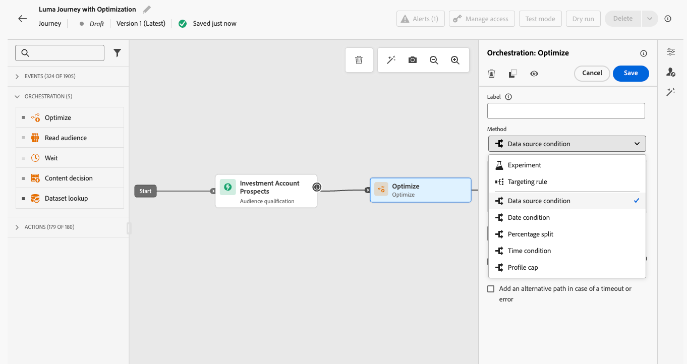

Once the journey is live, profiles are evaluated against the defined criteria, and based on matching criteria, they are sent down the appropriate path from the journey.

## Use experimentation {#experimentation}

>[!CONTEXTUALHELP]
>id="ajo_campaigns_path_experiment_success_metric"
>title="Success metric"
>abstract="Success metric is used to track and evaluate the best performing treatment in an experiment."

Experimentation allows you to test different paths based on a random split to determine which performs best based on predefined success metrics.

To set up path experimentation in a journey, follow the steps below.

Let's say you want to compare three paths:

* one path with one email;
* a second path with a **[!UICONTROL Wait]** node of two days and an email;
* a third path with an email and then an SMS message.

1. From the **[!UICONTROL Orchestration]** section, drag and drop the **[!UICONTROL Optimize]** activity into the journey canvas.

1. Add an optional label, which can be useful to identify the activity in reporting and test mode logs.

1. Select **[!UICONTROL Experiment]** from the **[!UICONTROL Method]** drop-down list.

    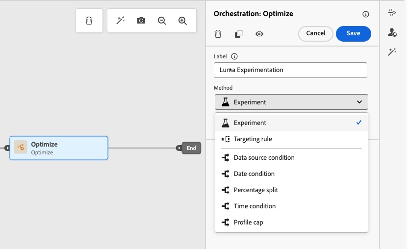{width=75%}

1. Click **[!UICONTROL Create experiment]**.

1. Select the **[!UICONTROL Success metric]** you want to set for your experiment.

    <!--Need to have the list of all default metrics + a description for each.
    Explain why the metric selection is important.
    Are there custom metrics? If so explain.
    If possible, add best practices and examples for each metrics (could even be a dedicated section).
    Consider adding an example in this step: For this example, select this metric to test xxx.
    -->

    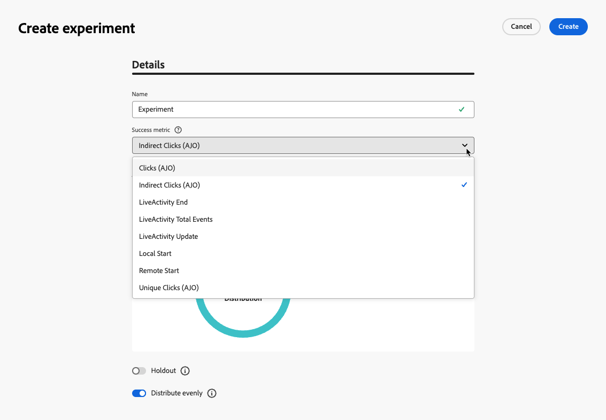{width=80%}

1. You can choose to add a **[!UICONTROL Holdout]** group to your delivery. This group will not enter any path from this experiment. 

    >[!NOTE]
    >
    >Switching on the toggle bar will automatically take 10% of your population. You can adjust this percentage if needed.

    <!--
    DOES THIS APPLY TO PATH EXPERIMENT?
    IMPORTANT: When a holdout group is used in an action for path experimentation, the holdout assignment only applies to that specific action. After the action is completed, profiles in the holdout group will continue down the journey path and can receive messages from other actions. Therefore, ensure that any subsequent messages do not rely on the receipt of a message by a profile that might be in a holdout group. If they do, you may need to remove the holdout assignment.-->

1. You can allocate a precise percentage to each **[!UICONTROL Treatment]**, or simply switch on the **[!UICONTROL Distribute evenly]** toggle bar.

    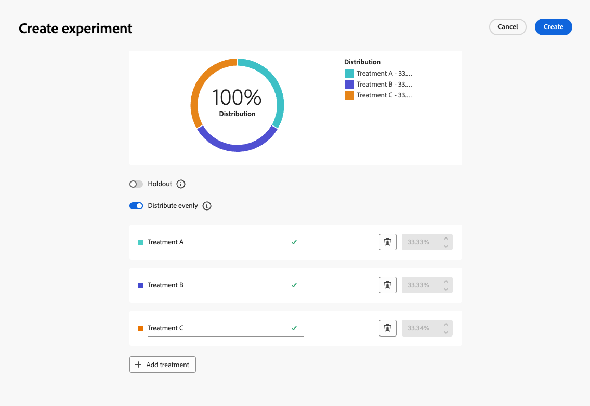{width=80%}

1. Click **[!UICONTROL Create]**.

1. Define the elements you want for each branch resulting from the Experiment, for example:

    * Drag and drop an [Email](../email/create-email.md) activity onto the first branch (**Treatment A**).

    * Drag and drop a [Wait](wait-activity.md) activity of two days onto the first branch, followed by an [Email](../email/create-email.md) activity (**Treatment B**).

    * Drag and drop an [Email](../email/create-email.md) activity onto the third branch, followed by an [SMS](../sms/create-sms.md) activity (**Treatment C**).

    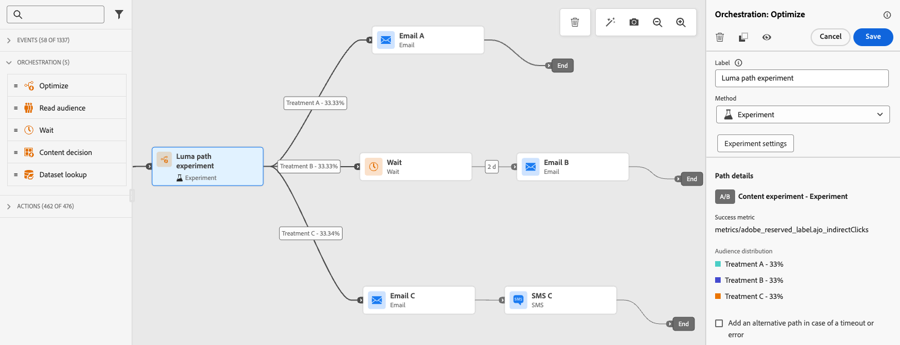{width=100%}

1. Optionnally, use the **[!UICONTROL Add an alternative path in case of a timeout or an error]** to define a fallback action. [Learn more](using-the-journey-designer.md#paths)

1. Select a channel action and use the **[!UICONTROL Edit content]** button to access the design tools.

    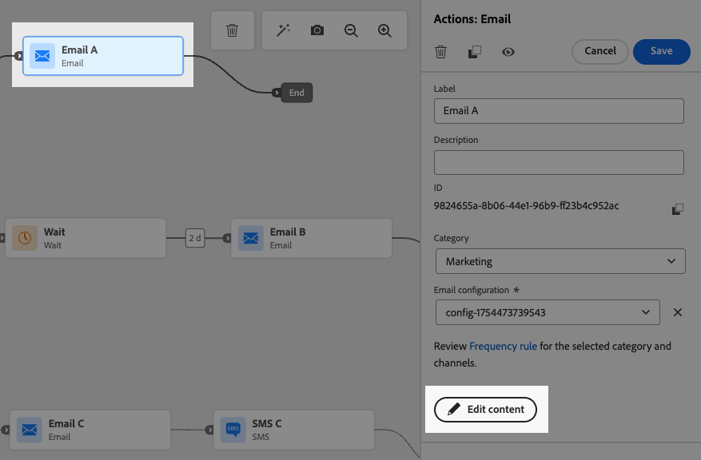{width=70%}

1. From there, using the left pane you can navigate between the different contents for each action in your experiment. Select each content and design it as needed.

    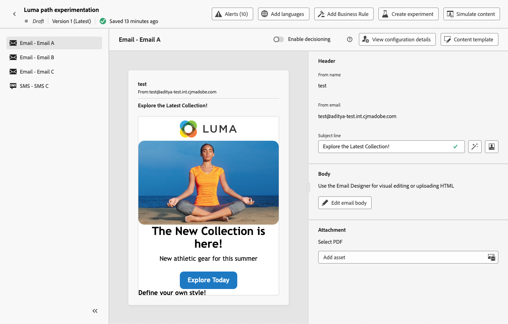{width=100%}

1. [Publish](publishing-the-journey.md) your journey.

Once the journey is live, users are randomly assigned to go down different paths. [!DNL Journey Optimizer] tracks which path performs best and provides actionable insights.

<!--Follow the success of your journey with the Journey Path Experiment report.Reporting page on Journey Path Experimentation to be created - such as what we have for [Experimentation campaign report](../reports/campaign-global-report-cja-experimentation.md)-->

### Experiment use cases {#uc-experiment}

The following examples show how to use the **[!UICONTROL Optimize]** activity with the **[!UICONTROL Experiment]** method to determine which path works best overall.

+++Channel effectiveness

Test whether sending the first message by email versus SMS drives higher conversions.

➡️ Use the conversion rate as the optimization metric (for example: purchases, sign-ups).

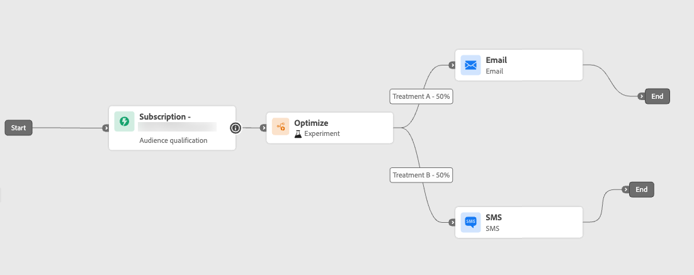

+++

+++Message frequency

➡️ Run an experiment to check if sending one email versus three emails over a week results in more purchases.

Use purchases or the unsubscribe rate as the optimization metric.

+++

+++Wait time between communications

Compare a 24-hour wait versus a 72-hour wait before a follow-up to determine which timing maximizes engagement.

➡️ Use the click-through rate or revenue as the optimization metric.

+++

## Leverage targeting {#targeting}

Targeting rules allow you to determine specific rules or qualifications that must be met for a customer to be eligible to enter one of the journey paths, based on specific audience segments<!-- depending on profile attributes or contextual attributes-->.

Unlike experimentation, which is a random assignment of a given path, targeting is deterministic in terms of ensuring the right audience or profile enters the specified path.

<!--With targeting, specific rules can be defined based on:

* **User profile attributes** such as location (eg. geo-targeting), age, or preferences. For example, users in the US receive a "Golden Gate" promotion, while users in France receive an "Eiffel Tower" promotion.

* **Contextual data** such as device type (eg. device-targeting), time of day, or session details. For example, desktop users receive desktop-optimized content, while mobile users receive mobile-optimized content.

* **Audiences** which can be used to include or exclude profiles that have a particular audience membership.-->

To set up targeting in a journey, follow the steps below.

1. From the **[!UICONTROL Orchestration]** section, drag and drop the **[!UICONTROL Optimize]** activity into the journey canvas.

1. Add an optional label, which can be useful to identify the activity in reporting and test mode logs.

1. Select **[!UICONTROL Targeting rule]** from the **[!UICONTROL Method]** drop-down list.

    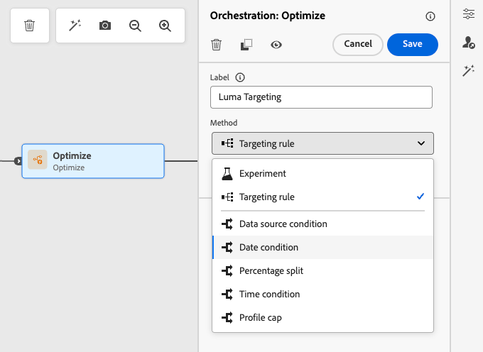{width=70%}

1. Click **[!UICONTROL Create targeting rule]**.

1. Use the rule builder to define your criteria. For example, define a rule for Gold members of the Loyalty program (`loyalty.status.equals("Gold", false)`), and a rule for the other members (`loyalty.status.notEqualTo("Gold", false)`).

    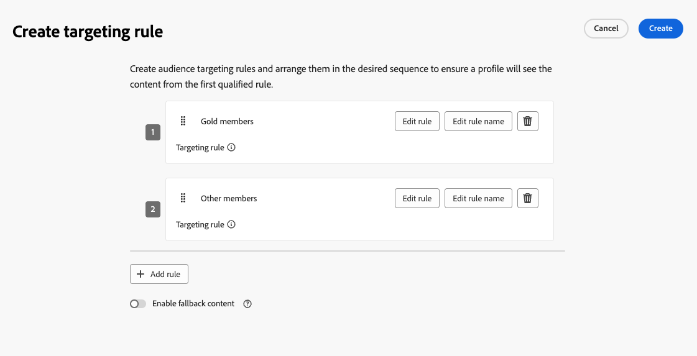

1. Select the **[!UICONTROL Enable fallback content]** as needed. Fallback content allows your audience to receive a default content when no targeting rules are qualified. If you do not select this option, any audience that doesn't qualify for a targeting rule defined above will not enter a fallback path.

1. Click **[!UICONTROL Create]** to save your targeting rule settings.

1. Back in the journey, drop specific actions to customize each path. For example, create an email with personalized offers for Gold Loyalty members, and an SMS reminder for all other members.

    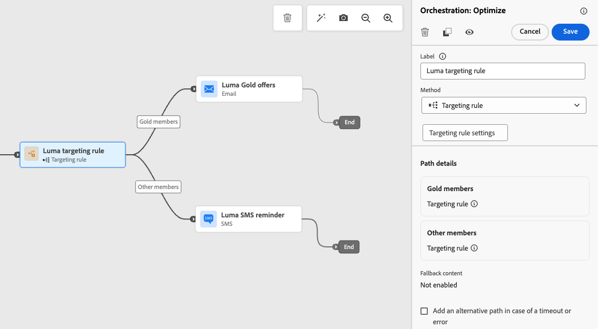

1. Optionnally, use the **[!UICONTROL Add an alternative path in case of a timeout or an error]** to define a fallback action. [Learn more](using-the-journey-designer.md#paths)

1. Design appropriate content for each action corresponding to each group defined by your targeting rule settings. You can seamlessly navigate between the different contents for each action.

    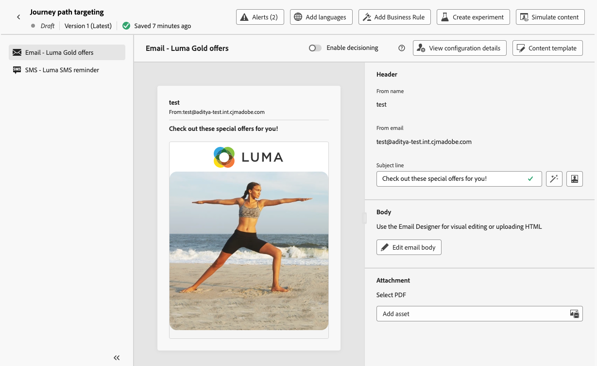

   In this example, design an email with special offers for Gold members, and an SMS reminder for the other members.

1. [Publish](publishing-the-journey.md) your journey.

Once the journey is live, the path that is specified for each segment is processed so that Gold members enter the path with the email offers, while the other members enter the path with the SMS reminder.

<!--Follow the success of your journey with the Journey Path Targeting report.Reporting page on Journey Path Targeting to be created - such as what we have for [Experimentation campaign report](../reports/campaign-global-report-cja-experimentation.md)-->

### Targeting rule use cases {#uc-targeting}

The following examples show how to use the **[!UICONTROL Optimize]** activity with the **[!UICONTROL Targeting rule]** method to personalize paths for different sub-audiences.

+++Segment-specific channels

Gold status loyalty members can receive personalized offers via email, while all other members are directed to SMS reminders.

➡️ Use the revenue per profile or conversion rate as the optimization metric.

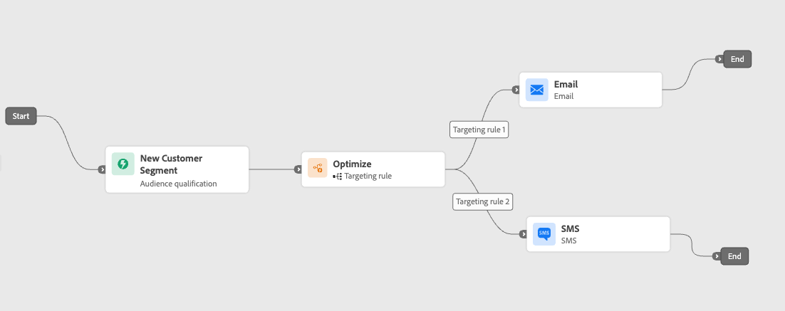

+++

+++Behavior-based targeting

Customers who opened an email but didn't click can be sent a push notification, while those who didn't open at all receive an SMS.

➡️ Use the click-through rate or downstream conversions as the optimization metric.

+++

+++Purchase history targeting

Customers who have recently purchased can go into a short "Thank you + Cross-sell" path, while those with no purchase history enter a longer nurture journey.

➡️ Use the repeat purchase rate or engagement rate as the optimization metric.

+++

## Add a condition {#conditions}

You can add a condition to define how individuals progress through your journey by creating multiple paths based on specific criteria. You can also configure an alternate path to handle timeouts or errors, ensuring a seamless experience.

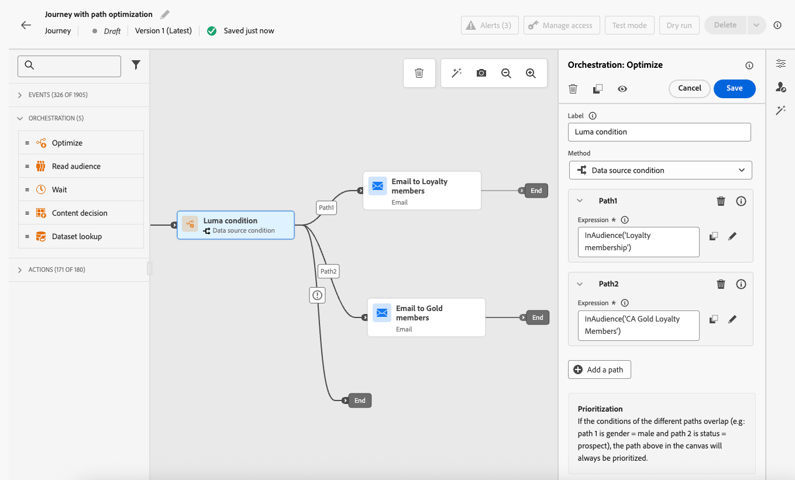

Learn how to define a condition in [this section](conditions.md).

The following types of conditions are available:

* [Data Source condition](condition-activity.md#data_source_condition)
* [Time condition](condition-activity.md#time_condition) 
* [Percentage split](condition-activity.md#percentage_split) 
* [Date condition](condition-activity.md#date_condition)
* [Profile cap](condition-activity.md#profile_cap)
