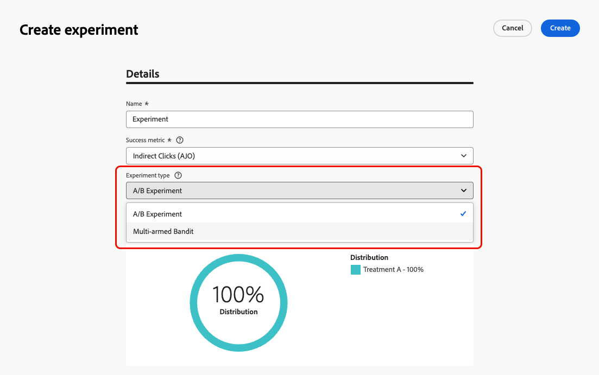
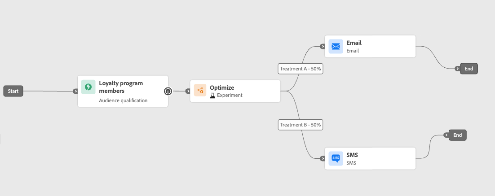
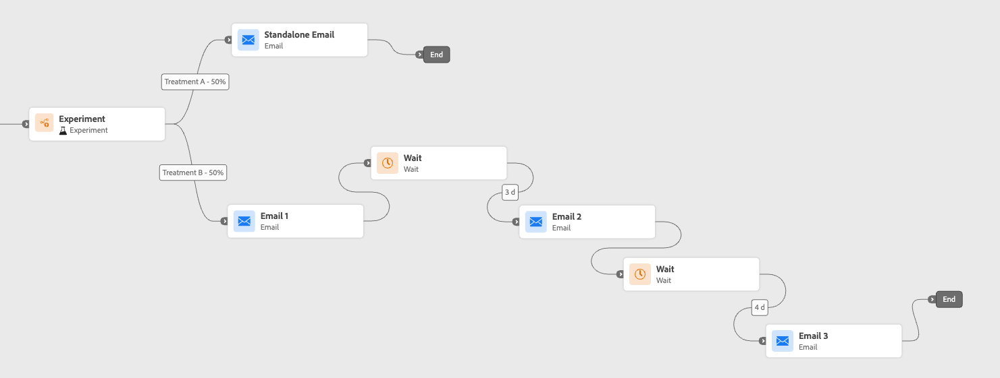
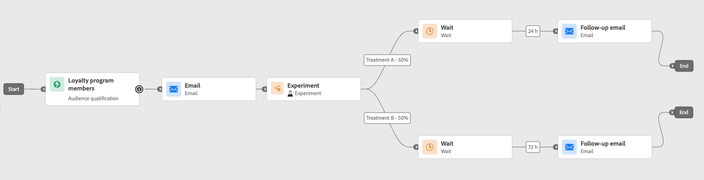
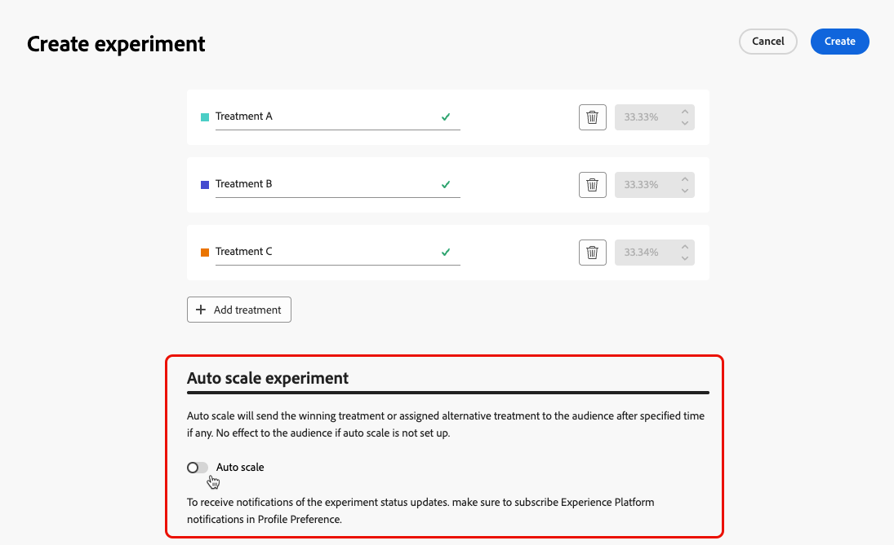
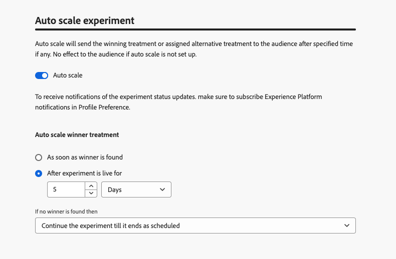
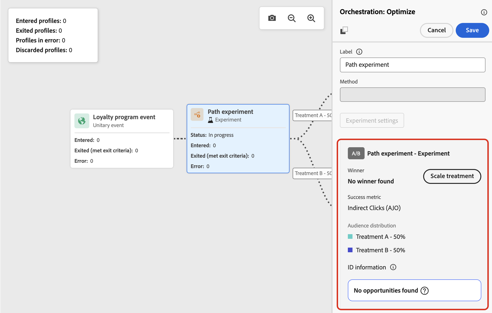
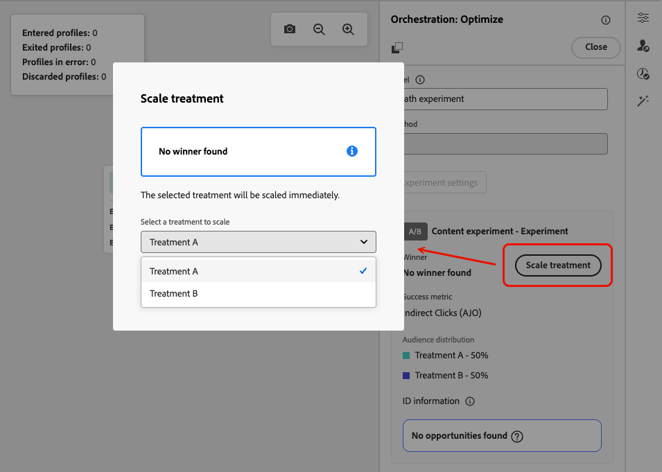

# Use path experimentation {#experimentation}

>[!CONTEXTUALHELP]
>id="ajo_path_experiment_success_metric"
>title="Success metric"
>abstract="Success metric is used to track and evaluate the best performing treatment in an experiment."
>additional-url="https://experienceleague.adobe.com/en/docs/journey-optimizer/using/orchestrate-journeys/create-journey/success-metrics" text="Configure and track your journey metrics"

Experimentation allows you to test different paths based on a random split to determine which performs best based on predefined success metrics.

To set up path experimentation in a journey, follow the steps below.

Let's say you want to compare three paths:

* one path with one email;
* a second path with a **[!UICONTROL Wait]** node of two days and an email;
* a third path with an email and then an SMS message.

1. From the **[!UICONTROL Orchestration]** section, drag and drop the **[!UICONTROL Optimize]** activity into the journey canvas.

1. Add an optional label, which can be useful to identify the activity in reporting and test mode logs.

1. Select **[!UICONTROL Experiment]** from the **[!UICONTROL Method]** drop-down list.

    {width=65%}

1. Click **[!UICONTROL Create experiment]**.

1. Select the **[!UICONTROL Success metric]** you want to set for your experiment. Learn more on the available metrics and how to configure the list in [this section](success-metrics.md).

    {width=80%}

1. Select the **[!UICONTROL Experiment type]** for your path experiment:

    * **[!UICONTROL A/B experiment]** — Define the traffic split between treatments at the start of the test. Performance is evaluated based on your chosen primary metric; reporting shows the observed lift between treatments.

    * **[!UICONTROL Multi-armed bandit]** — Traffic split between treatments is handled automatically. Every 7 days, performance on the primary metric is reviewed, and weights are adjusted accordingly. Reporting continues to show lift, as for A/B tests.

    {width=80%}

    ➡️ [Learn more about the difference between A/B and Multi-armed bandit experiments](../content-management/mab-vs-ab.md)

1. You can choose to add a **[!UICONTROL Holdout]** group to your delivery. This group will not enter any path from this experiment. 

    >[!NOTE]
    >
    >Switching on the toggle bar will automatically take 10% of your population. You can adjust this percentage if needed.

    
<!--
    DOES THIS APPLY TO PATH EXPERIMENT?
    IMPORTANT: When a holdout group is used in an action for path experimentation, the holdout assignment only applies to that specific action. After the action is completed, profiles in the holdout group will continue down the journey path and can receive messages from other actions. Therefore, ensure that any subsequent messages do not rely on the receipt of a message by a profile that might be in a holdout group. If they do, you may need to remove the holdout assignment.
-->

1. You can allocate a precise percentage to each **[!UICONTROL Treatment]**, or simply switch on the **[!UICONTROL Distribute evenly]** toggle bar.

    {width=80%}

1. Enable the auto-scale experiment to automatically roll out the winning variation of your experiment. [Learn more on how to scale the winner](#scale-winner)

1. Click **[!UICONTROL Create]**.

1. Define the elements you want for each branch resulting from the Experiment, for example:

    * Drag and drop an [Email](../email/create-email.md) activity onto the first branch (**Treatment A**).

    * Drag and drop a [Wait](wait-activity.md) activity of two days onto the first branch, followed by an [Email](../email/create-email.md) activity (**Treatment B**).

    * Drag and drop an [Email](../email/create-email.md) activity onto the third branch, followed by an [SMS](../sms/create-sms.md) activity (**Treatment C**).

    {width=100%}

1. Optionally, use the **[!UICONTROL Add an alternative path in case of a timeout or an error]** to define a fallback action. [Learn more](using-the-journey-designer.md#paths)

1. [Publish](publish-journey.md) your journey.

<!--
    Select a channel action and use the **[!UICONTROL Edit content]** button to access the design tools.

    {width=70%}

    From there, using the left pane you can navigate between the different contents for each action in your experiment. Select each content and design it as needed.

    {width=100%}
-->

Once the journey is live, users are randomly assigned to go down different paths. [!DNL Journey Optimizer] tracks which path performs best and provides actionable insights.

Follow the success of your journey with the Journey Path Experiment report. [Learn more](../reports/journey-global-report-cja-experimentation.md)

<!--
REMOVED WITH GA

>[!CAUTION]
>
>Do not edit the metadata of a path experiment once it has been published. Editing the metadata will disrupt the calculation and reporting of experiment results.
-->

## Experiment use cases {#uc-experiment}

The following examples show how to use the **[!UICONTROL Optimize]** activity with the **[!UICONTROL Experiment]** method to determine which path works best overall.

+++Channel effectiveness

Test whether sending the first message by email versus SMS drives higher conversions.

➡️ Use the conversion rate as the success metric (for example: purchases, sign-ups).

+++

+++Message frequency

Run an experiment to check if sending one email versus three emails over a week results in more purchases.

➡️ Use purchases or the unsubscribe rate as the success metric.

+++

+++Wait time between communications

Compare a 24-hour wait versus a 72-hour wait before a follow-up to determine which timing maximizes engagement.

➡️ Use the click-through rate or revenue as the success metric.

+++

## Scale the winner {#scale-winner}

>[!AVAILABILITY]
>
>For path experiments, the Scale the Winner feature is available only in unitary journeys (event-triggered and Audience qualifications).
>
>It is not available for Read audience journeys.

Scale the Winner enables you to automatically or manually roll out the winning variation of an experiment to your full audience. This feature ensures that, once a winner is determined, you can amplify its reach and effectiveness without constantly monitoring the experiment.

You can choose between two modes:

* **Auto-scaling**: Configure auto-scaling settings when creating your experiment by choosing the timing and conditions for scaling the winning treatment or a fallback option if no winner emerges.

* **Manual Scaling**: Manually review experiment results and initiate the rollout of the winning treatment, maintaining full control over timing and decisions.

### Auto-scaling {#autoscaling}

Auto-scaling lets you set predefined rules for when to roll out the winning treatment or a fallback—based on the experiment's results.

Note that once auto-scaling has occurred, manual scaling is no longer available.

To enable auto-scale in your experiments:

1. Set up your journey and configure your experiment as needed. [Learn more](#experimentation)

1. Enable the auto-scale option when setting up your experiment.

    

1. Select when the winner should be scaled:

    * As soon as winner is found.
    * After experiment is live for the selected time.
    
    The auto-scale time must be scheduled before the experiment's end date. If it is set for a time after the end date, a validation warning will appear, and the journey will not be published.

    

1. Choose the fallback behavior if no winner is found by scale time:

    * Continue experiment till its ends as scheduled.
    * Scale the alternative treatment after a specified time.

Once all parameters are met, your winning or alternative treatment is sent to your audience.

### Manual scaling {#manual-scaling}

Manual scaling gives you the ability to review experiment results and decide when to roll out the winning treatment on your own schedule.

Note that if you manually scale the winner before the scheduled auto-scale time, the auto-scale is canceled.

To manually scale the winner of your experiments:

1. Set up your journey and configure your experiment as needed. [Learn more](#experimentation)

1. Let the experiment run until a winner is identified or statistical significance is achieved.

1. Open your journey and select the **[!UICONTROL Optimize]** activity that contains the path experiment. 
    
    Review the results in the **[!UICONTROL Path experiment]** view to identify the top-performing treatment.

    

1. Click **[!UICONTROL Scale treatment]** to push the winning treatment to the rest of your audience.

    <!---->

1. Select the treatment you want to scale from the drop-down menu and click **[!UICONTROL Scale]**.

    {width=80%}

Note that scaling the treatment may take up to one hour. You will receive a notification once the manual scaling process is finished.
