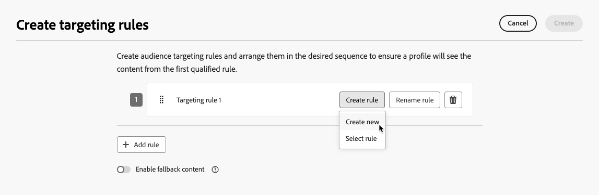
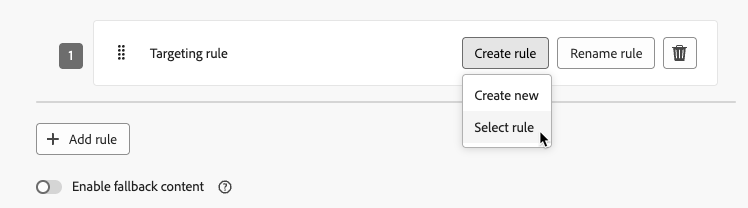
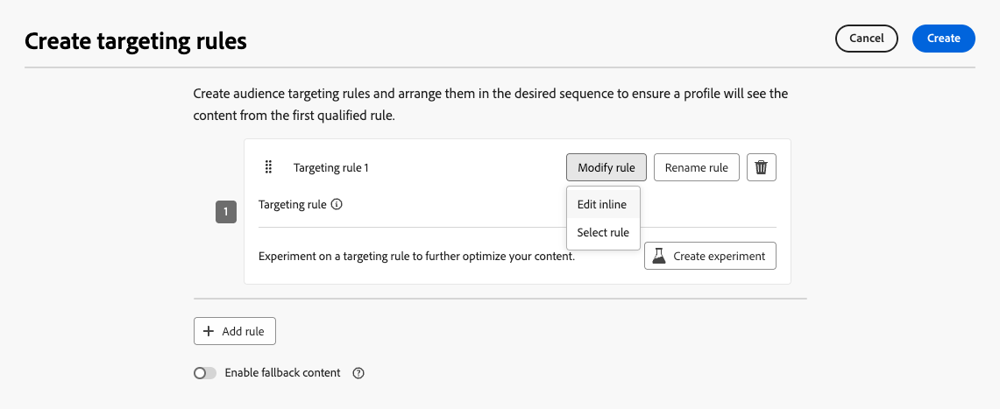
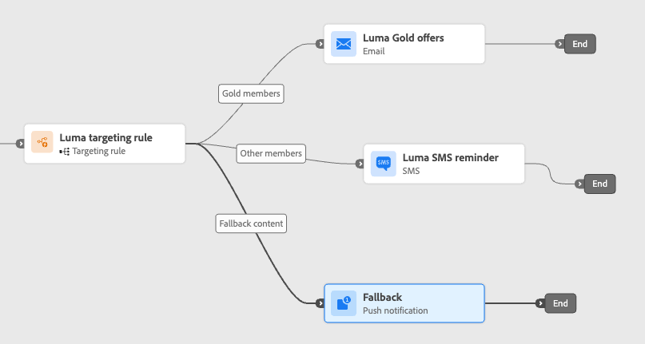
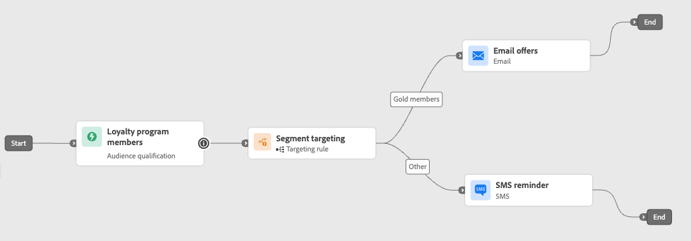
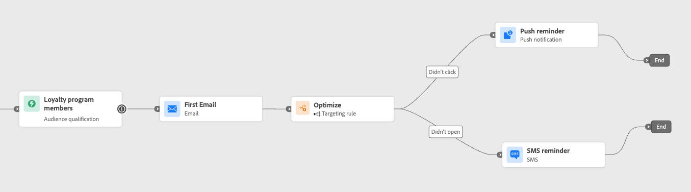
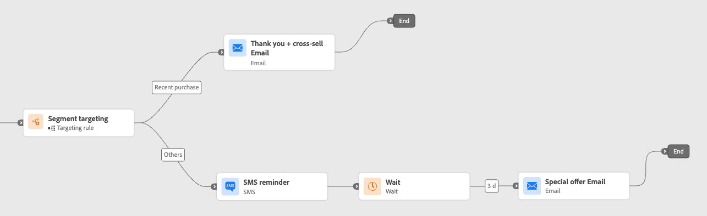

# Leverage path targeting {#targeting}

>[!CONTEXTUALHELP]
>id="ajo_path_targeting_fallback"
>title="What is fallback path?"
>abstract="Fallback paths allow your audience to enter an alternate path when no targeting rules are qualified.  If you do not select this option, any audience that doesn't qualify for a targeting rule will not enter the fallback path and exit the journey."

>[!AVAILABILITY]
>
>This capability is currently in Limited Availability. To request access, contact your Adobe representative.

Targeting rules allow you to determine specific rules or qualifications that must be met for a customer to be eligible to enter one of the journey paths, based on specific audience segments<!-- depending on profile attributes or contextual attributes-->.

Unlike experimentation, which is a random assignment of a given path, targeting is deterministic in terms of ensuring the right audience or profile enters the specified path.

<!--
With targeting, specific rules can be defined based on:

* **User profile attributes** such as location (eg. geo-targeting), age, or preferences. For example, users in the US receive a "Golden Gate" promotion, while users in France receive an "Eiffel Tower" promotion.

* **Contextual data** such as device type (eg. device-targeting), time of day, or session details. For example, desktop users receive desktop-optimized content, while mobile users receive mobile-optimized content.

* **Audiences** which can be used to include or exclude profiles that have a particular audience membership.
-->

To set up targeting in a journey, follow the steps below.

1. From the **[!UICONTROL Orchestration]** section, drag and drop the **[!UICONTROL Optimize]** activity into the journey canvas.

1. Add an optional label, which can be useful to identify the activity in reporting and test mode logs.

1. Select **[!UICONTROL Targeting rule]** from the **[!UICONTROL Method]** drop-down list.

    {width=60%}

1. Click **[!UICONTROL Create targeting rule]**.

1. Click **[!UICONTROL Create rule]** > **[!UICONTROL Create new]** and use the rule builder to define your criteria.

    {width=100%}

    For example, define a rule for Gold members of the Loyalty program (`loyalty.status.equals("Gold", false)`), and a rule for the other members (`loyalty.status.notEqualTo("Gold", false)`).

    

1. You can also click **[!UICONTROL Create rule]** > **[!UICONTROL Select rule]** to select an existing targeting rule created from the **[!UICONTROL Rules]** menu. [Learn more](../experience-decisioning/rules.md)

    {width=70%}

    In this case, the formula that makes up the rule is simply copied into the journey activity. Any subsequent changes to that rule from the **[!UICONTROL Rules]** menu will not affect the journey's copy.

    >[!AVAILABILITY]
    >
    >[Creating targeting rules](../experience-decisioning/rules.md#create) from the dedicated [!DNL Journey Optimizer] menu is currently available to organizations that have purchased the Decisioning add-on offering, and they are available on demand for the other organizations (Limited Availability).
    >
    >This capacity will be progressively rolled out to all customers. In the meantime, contact your Adobe representative to gain access.

1. After you added a rule, you can still modify it. Choose **[!UICONTROL Edit inline]** to update it on the go using the rule builder, or **[!UICONTROL Select rule]** to pick up another existing rule.

    {width=100%}

    >[!NOTE]
    >
    >Editing a rule inline does not affect the existing rule it originates from.

1. Select the **[!UICONTROL Enable fallback path]** option as needed. This action creates a fallback path for the audience that does not meet any of the targeting rules defined above.

    >[!NOTE]
    >
    >If you do not select this option, any audience that does not qualify for a targeting rule does not enter the fallback path and exits the journey.

1. Click **[!UICONTROL Create]** to save your targeting rule settings.

1. Back in the journey, drop specific actions to customize each path. For example, create an email with personalized offers for Gold Loyalty members, and an SMS reminder for all other members.

    

1. If you selected the **[!UICONTROL Enable fallback content]** option when defining the rule settings, define one or more actions for the fallback path that was automatically added.

    {width=70%}

1. Optionally, use the **[!UICONTROL Add an alternative path in case of a timeout or an error]** to define an alternate action if issues occur. [Learn more](using-the-journey-designer.md#paths)

1. Design appropriate content for each action corresponding to each group defined by your targeting rule settings.

   In this example, design an email with special offers for Gold members, and an SMS reminder for the other members.<!--You can seamlessly navigate between the different contents for each action. -->

1. [Publish](publish-journey.md) your journey.

Once the journey is live, the path that is specified for each segment is processed so that Gold members enter the path with the email offers, while the other members enter the path with the SMS reminder.

Follow the success of your journey with the Journey report. [Learn more](../reports/journey-global-report-cja.md#targeting)

## Targeting rule use cases {#uc-targeting}

The following examples show how to use the **[!UICONTROL Optimize]** activity with the **[!UICONTROL Targeting rule]** method to personalize paths for different sub-audiences.

+++Segment-specific channels

Gold status loyalty members can receive personalized offers via email, while all other members are directed to SMS reminders.

<!--➡️ Use the revenue per profile or conversion rate as the optimization metric.-->

+++

+++Behavior-based targeting

Customers who opened an email but didn't click can be sent a push notification, while those who didn't open at all receive an SMS.

<!--➡️ Use the click-through rate or downstream conversions as the optimization metric.-->

+++

+++Purchase history targeting

Customers who have recently purchased can go into a short "Thank you + Cross-sell" path, while those with no purchase history enter a longer nurture journey.

<!--➡️ Use the repeat purchase rate or engagement rate as the optimization metric.-->

+++
