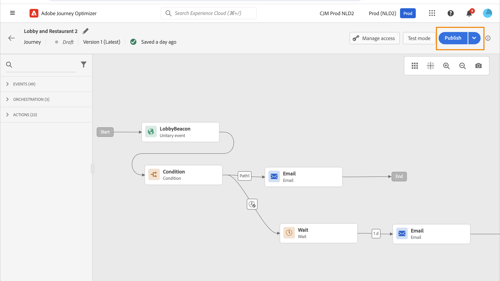
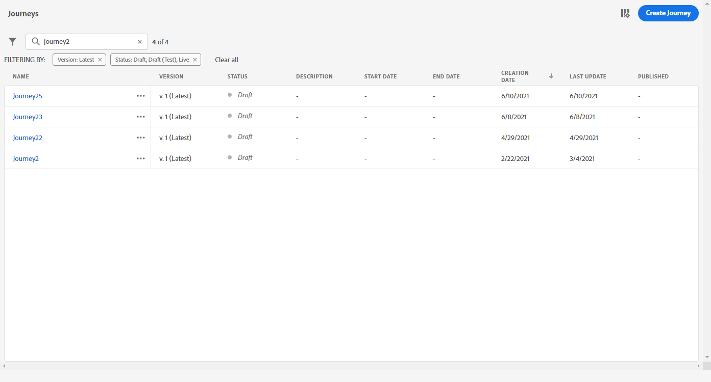
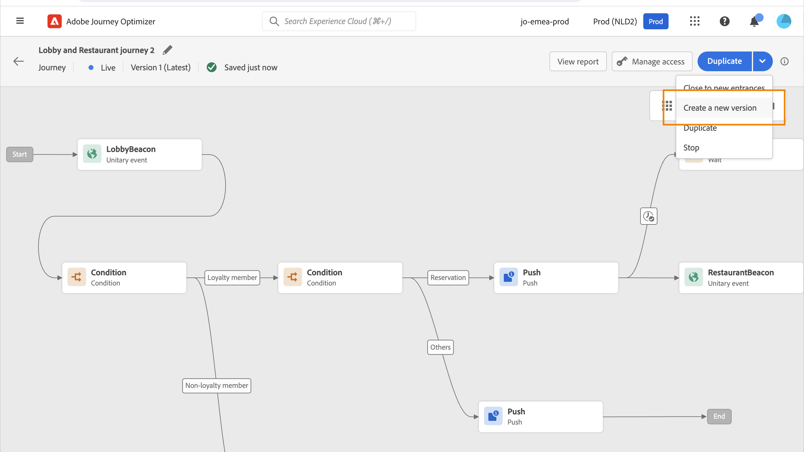

# Publish your journey {#publishing-the-journey}

You must publish a journey to activate it and make it available for new profiles to enter the journey. Before publishing your journey, verify that it is valid and that there are no errors. You cannot publish a journey with errors.

➡️ [Discover this feature in video](#video)

## Publication process {#journey-publication}

Steps to publish a journey are detailed below:

1. Before publishing your journey, verify that it is valid and that there are no errors. You cannot publish a journey with errors.

    * Learn how to test your journey on [this page](testing-the-journey.md).
    * Learn how to troubleshoot your journey errors in [this section](../building-journeys/troubleshooting.md#activity-errors).

1. To publish the journey, click on the **[!UICONTROL Publish]** option, located in the top-right drop-down menu.

    >[!NOTE]
    >
    > If your journey is subject to an approval policy, you must request approval to publish your journey. [Learn more](../test-approve/gs-approval.md)

    

When the journey is published, it is in **read-only** mode. In read-only mode, you can only modify the activity labels and descriptions, the journey's name, and the journey's description. If you need to make additional modifications to a published journey, create [a new version](journey-ui.md#journey-filter) of your journey.

When you stop a journey, it is permanently stopped. All the individuals flowing through the journey are permanently stopped, and the journey stops allowing new entries. If you need to run the journey again, duplicate it and publish the new journey.

>[!IMPORTANT]
>
>If changes are made to an offer decision used in a journey's message, you need to unpublish the journey and republish it. This ensures that the changes are incorporated into the journey's message and that the message is consistent with the latest updates.

## Journey versions {#journey-versions}

In the journey list, all journey versions are displayed with the version number. When you search for a journey, newest versions appear at the top of the list the first time the application opens. Then, you can define the sorting you want and the application will keep it as a user preference. The journey's version is also displayed at the top of the journey edition interface, above the canvas.

>[!NOTE]
>
>Usually, a profile cannot be present multiple times in the same journey, at the same time, for all active versions of the journey. If reentrance is enabled, a profile can reenter a journey, but cannot do it until they fully exited that previous instance of the journey. [Read more](entry-management.md).

### Create a new version of a journey {#journey-create-new-version}

If you need to modify to a live journey, create a new version of your journey. To create a new version of an existing journey, follow the steps below:

1. Open the latest version of your live journey, click **[!UICONTROL Create a new version]** and confirm.

    

    >[!NOTE]
    >
    >You can only create a new version from the latest version of a journey.

1. Make your modifications, click **[!UICONTROL Publish]** and confirm.

From the moment the journey is published, individuals will start to flow into the latest version of the journey. People who have already entered a previous version stay in it until they finish the journey. If they later reenter the same journey, they will go into the latest version.

Journey versions can be stopped individually. All versions of journeys have the same name.

When you publish a new version of a journey, the previous version automatically ends and switches to the **Closed** status. No entrance in the journey can happen. Even if you stop the latest version, the previous version stays closed.

>[!NOTE]
>
>Specific guardrails and limitation apply to the versioning of the journeys. Learn more on [this page](../start/guardrails.md#journey-versions-g).

## How-to video {#video}

Learn how to publish a journey in this video:

>[!VIDEO](https://video.tv.adobe.com/v/3424998?quality=12) 