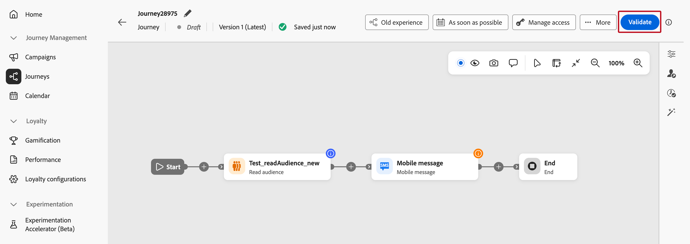
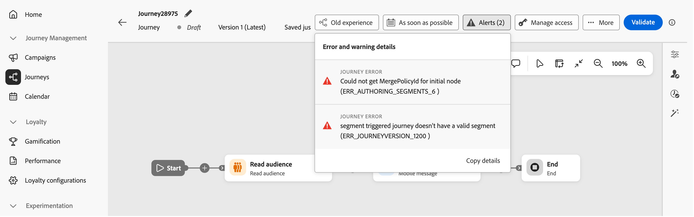
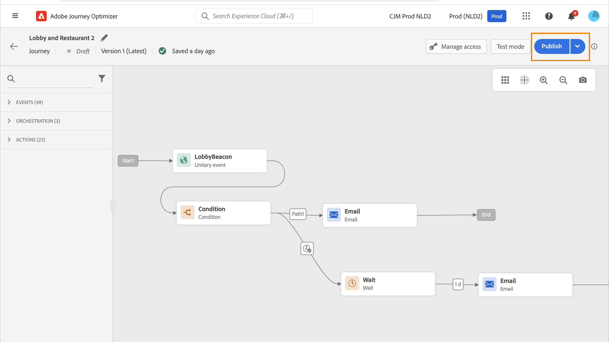
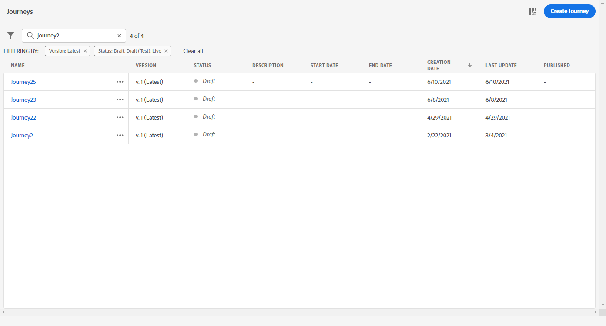
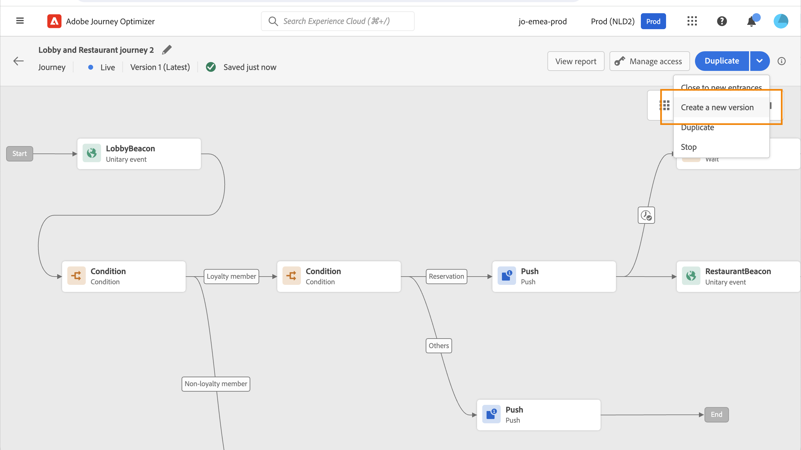

# Publish your journey {#publishing-the-journey}

>[!BEGINSHADEBOX]

**On this page:** Prepare your journey to go live: validate its configuration, test its behavior, and publish it. Learn what happens after publication and how to manage journey versions.

>[!ENDSHADEBOX]

Publishing a journey activates it: it moves to the **[!UICONTROL Live]** status, becomes available for new profiles to enter, and switches to read-only mode. You cannot publish a journey that contains errors.

When you have finished configuring your journey, follow these steps before going live:

1. **[Validate the journey](#validate)** with the **[!UICONTROL Validate]** button. If validation fails, fix the errors and validate again before continuing.
1. **[Test the journey](#choose-validation-method)** using simulation, test mode, or a dry run, depending on what you need to check.
1. **[Publish the journey](#journey-publication)** when testing is complete and the journey has a current, passed validation.

>[!NOTE]
>
>When you save or publish a journey, Journey Optimizer validates the total journey payload size and may warn or block publication if you approach or exceed the limit. Learn more in [Journey payload size validation](../start/guardrails.md#journey-payload-size).

➡️ [Discover this feature in video](#video)

## Step 1: Validate your journey {#validate}

The **[!UICONTROL Validate]** button in the journey header runs configuration checks across your journey, including every message. Run it when you are ready to publish, test, simulate, run a dry run, or request approval. Any errors and warnings appear in the Alerts panel. Basic checks related to journey activities run automatically while you build. Validation does not simulate the journey or replace testing.

Validation is available for journeys in **[!UICONTROL Draft]** status. It is not available in test, dry-run, or simulation mode, or while the journey is locked for approval.

>[!BEGINSHADEBOX]

**About the new validation flow**

Message configuration checks that previously ran automatically during autosave now run when you click **[!UICONTROL Validate]**. The checks themselves have not changed: errors and warnings still appear in the Alerts panel.

* **Smaller journeys:** On-demand message checks help keep the canvas responsive and free up capacity for faster, more consistent basic activity checks.
* **Larger journeys:** The benefit grows as you add activities and messages, and you choose when to run message checks rather than interrupting an edit.

>[!ENDSHADEBOX]

To validate your journey, follow these steps:

1. Click **[!UICONTROL Validate]** in the journey header before testing, publishing, or requesting approval. Until the journey has a current, passed validation, **[!UICONTROL Validate]** replaces **[!UICONTROL Publish]**.
1. Wait for validation to finish. The journey is temporarily locked during the checks. You can resume editing when they finish.
1. Review the errors and warnings in the Alerts panel.

  

  * **Errors** must be fixed before you publish or test the journey.
  * **Warnings** provide information about potential issues and do not prevent
    testing, simulation, or dry runs.

If you edit the journey after validation, the results are no longer current. Click **[!UICONTROL Validate]** again before performing a critical action so the results reflect the current journey.

When validation passes, proceed to testing. If it fails, [resolve the errors](troubleshooting.md#activity-errors) and click **[!UICONTROL Validate]** again. Validation does not rerun automatically after you fix an error.

## Step 2: Test your journey {#choose-validation-method}

After validation passes, choose the testing method that matches what you need to verify. These methods let you check journey behavior using different types of data. They are separate from the configuration checks performed by **[!UICONTROL Validate]**.

| Option | Data used | Best for | Sends real messages? |
| --- | --- | --- | --- |
| [Simulation](simulate-journey-gs.md) | Temporary simulated users, manually created or auto-generated | Fast iteration during journey design — no need to create or wait for AEP test profiles to propagate | Yes — to the execution addresses defined at the simulated user level |
| [Test mode](testing-the-journey.md) | Persistent AEP test profiles | Step-by-step manual validation of branch and message logic in a draft journey | Yes — to the test profiles' real inboxes, using the same delivery pipeline as production |
| [Dry run](journey-dry-run.md) | Real production audience data | Final pre-launch check of actual audience reach and targeting at scale, without contacting anyone | No |

Dry run never delivers real communications or updates live profile data. Simulation and Test mode do deliver real messages — Simulation to the execution addresses defined on the simulated users, and Test mode to the real inboxes of profiles you have explicitly flagged as test profiles.

For a full comparison of these three methods, see [Choose a validation method](choose-validation-method.md).

Fix any issues found during testing before publishing. If you change the journey, run **[!UICONTROL Validate]** again and repeat the relevant tests.

## Step 3: Publish your journey {#journey-publication}

### Before you publish {#before-you-publish}

Before publishing, make sure your journey meets the following prerequisites:

* **[Current, passed validation](#validate)** — The validation results reflect the latest changes, and all blocking errors have been resolved.
* **Testing complete** — You have checked the journey using the appropriate [testing methods](#choose-validation-method) and resolved any issues found.
* **Publish permission** — Publishing requires the **[!DNL Publish journeys]** high-level permission. Learn more about [managing access rights](../administration/permissions-overview.md).
* **Payload within limit** — The journey payload must be within the configured limit (4 MB by default). See [Journey payload size validation](../start/guardrails.md#journey-payload-size).
* **Approval policy compliance** — If your journey is subject to an approval policy, publishing submits it for approval instead of publishing it right away. Once an approver signs off, the journey is published automatically — there is no separate publish step to perform afterward. [Learn more](../test-approve/gs-approval.md).

### Publish the journey {#publish-steps}

After completing validation and testing:

1. When validation is current, testing is complete, and the journey meets the [prerequisites above](#before-you-publish), click **[!UICONTROL Publish]** in the journey header.

    >[!NOTE]
    >
    > If your journey is subject to an approval policy, clicking **[!UICONTROL Publish]** submits the journey for approval instead of publishing it right away. Once an approver signs off, the journey is published automatically — you do not need to publish it again. [Learn more](../test-approve/gs-approval.md)

    

When the journey is published, it is in **read-only** mode. In read-only mode, you can only modify the activity labels and descriptions, the journey's name, and the journey's description. If you need to make additional modifications to a published journey, create [a new version](journey-ui.md#journey-filter) of your journey.

### Journey statuses {#journey-statuses}

After publication, a journey moves through several statuses:

* **[!UICONTROL Live]** — The journey is published and profiles can enter it.
* **[!UICONTROL Closed]** — A previous version that was automatically ended when a new version was published. No entrance can happen.
* **[!UICONTROL Finished]** — The journey has completed according to its end criteria. For the exact definition of when a journey is considered finished, see [How journeys end](end-journey.md#journey-finished-definition).

### Stop a journey {#stop-journey}

When you stop a journey, it is permanently stopped. All the individuals flowing through the journey are permanently stopped, and the journey stops allowing new entries. If you need to run the journey again, duplicate it and publish the new journey. For more information on how journeys end, see [How journeys end](end-journey.md).

### Republishing requirements {#republishing}

In some cases, you must republish a journey for changes or assets to remain effective:

>[!IMPORTANT]
>
>* If changes are made to an offer decision used in a journey's message, you need to unpublish the journey and republish it. This ensures that the changes are incorporated into the journey's message and that the message is consistent with the latest updates.
>
>* Assets/Images are accessible in delivered content for up to 2 years (730 days) since their first publication in any fragment/inline message. Re-publishing is required after this expiry period (any time after 730 days) to keep them accessible for another 2 years. Any re-publication done within 730 days of the first publication will not extend the expiry of assets/images to the next 730 days.

## Journey versions {#journey-versions}

In the journey list, all journey versions are displayed with the version number. When you search for a journey, newest versions appear at the top of the list the first time the application opens. Then, you can define the sorting you want and the application will keep it as a user preference. The journey's version is also displayed at the top of the journey edition interface, above the canvas.

You can also use AI in Coworker to compare journey versions. For more details, see [Journey Version Comparison](journeys-coworker-skills.md#journey-version-comparison).

>[!NOTE]
>
>Usually, a profile cannot be present multiple times in the same journey, at the same time, for all active versions of the journey. If reentrance is enabled, a profile can reenter a journey, but cannot do it until they fully exited that previous instance of the journey. [Read more](entry-management.md).

### Create a new version of a journey {#journey-create-new-version}

If you need to modify a live journey, create a new version of your journey. To create a new version of an existing journey, follow the steps below:

1. Open the latest version of your live journey, click **[!UICONTROL Create a new version]** and confirm.

    

    >[!NOTE]
    >
    >You can only create a new version from the latest version of a journey.

1. Make your modifications, then [validate](#validate) and [test](#choose-validation-method) the new version before [publishing it](#publish-steps).

From the moment the journey is published, individuals will start to flow into the latest version of the journey. People who have already entered a previous version stay in it until they finish the journey. If they later reenter the same journey, they will go into the latest version.

Journey versions can be stopped individually. All versions of journeys have the same name.

When you publish a new version of a journey, the previous version automatically ends and switches to the **Closed** status. No entrance in the journey can happen. Even if you stop the latest version, the previous version stays closed.

>[!NOTE]
>
>Specific guardrails and limitation apply to the versioning of the journeys. Learn more on [this page](../start/guardrails.md#journey-versions-g).

## Frequently asked questions {#faq}

**Why cannot I publish my journey?**

The most common reason is that the journey contains validation errors — you cannot publish a journey with errors. Other blockers include exceeding the [payload size limit](../start/guardrails.md#journey-payload-size) or the [sandbox Audience Qualification limit](../start/guardrails.md#audience-qualif-g), missing the **[!DNL Publish journeys]** permission, or a pending [approval](../test-approve/gs-approval.md). See [Before you publish](#before-you-publish) and [troubleshoot activity errors](../building-journeys/troubleshooting.md#activity-errors).

**Can I edit a journey after it is published?**

A published journey is in read-only mode. You can only change activity labels and descriptions, the journey's name, and the journey's description. For any other change, [create a new version](#journey-create-new-version) of the journey.

**What happens to profiles already in the journey when I publish a new version?**

New profiles flow into the latest version. Profiles already in a previous version stay there until they finish; if they later reenter, they go into the latest version. The previous version automatically switches to **[!UICONTROL Closed]** and accepts no new entries. See [Journey versions](#journey-versions).

**How do I re-run a stopped journey?**

Stopping a journey is permanent. To run it again, duplicate it and publish the new journey. See [Stop a journey](#stop-journey).

**Do I need to republish after changing an offer decision or updating assets?**

Yes. If you change an offer decision used in a journey's message, unpublish and republish the journey so the change is applied. Assets and images expire 730 days after first publication; republish after that period to keep them accessible. See [Republishing requirements](#republishing).

**Can I publish a journey that requires approval?**

If your journey is subject to an approval policy, clicking **[!UICONTROL Publish]** submits it for approval instead of publishing it right away. The journey is published automatically once an approver signs off — there is no separate publish step to perform afterward. [Learn more about approval](../test-approve/gs-approval.md).

## Related topics {#related-topics}

* [Test your journey](testing-the-journey.md) - Validate your journey with test profiles before publishing
* [Journey simulation](simulate-journey-gs.md) - Validate your journey with simulated users before publishing
* [Journey Dry run](journey-dry-run.md) - Test with real production data without contacting profiles
* [Troubleshooting](../building-journeys/troubleshooting.md#activity-errors) - Resolve activity and publication errors
* [How journeys end](end-journey.md#journey-finished-definition) - Understand journey completion and statuses
* [Profile entrance management](entry-management.md) - Configure how profiles enter and re-enter journeys
* [Journey guardrails and limitations](../start/guardrails.md#journeys-guardrails-journeys) - Review publication and versioning guardrails

## How-to video {#video}

Learn how to publish a journey in this video:

>[!VIDEO](https://video.tv.adobe.com/v/3424998?quality=12)

{{$include /help/_includes/do-not-localize/building-journeys/ai-augmented-publish-journey.md}}
