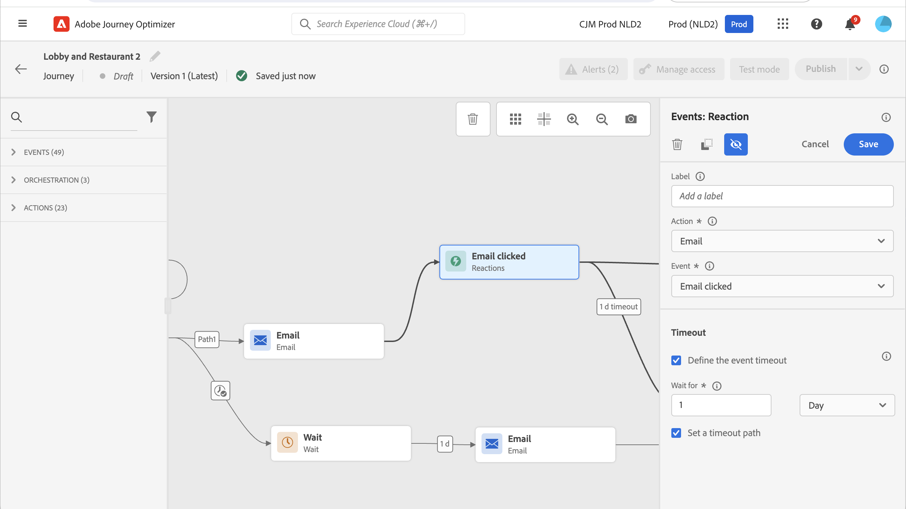

# Reaction events {#reaction-events}

>[!CONTEXTUALHELP]
>id="ajo_journey_event_reaction"
>title="Reaction events"
>abstract="This activity allows you to react to tracking data related to a message sent within the same journey. We capture this information in real-time at the moment it is shared with Adobe Experience Platform."

## Overview {#overview}

Among the different event activities available in the palette, you will find the built-in **[!UICONTROL Reactions]** event. This activity allows you to react to tracking data related to a message sent within the same journey. We capture this information in real-time at the moment it is shared with Adobe Experience Platform. 

You can react to clicked or opened messages. For example, you can send another message if an individual opened the previous email or clicked inside it, or send a different follow-up message if they did not engage with your communication.

See [Action activities](../building-journeys/about-journey-activities.md#action-activities).

You can use the **[!UICONTROL Reaction]** activity to perform an action when there is no reaction to your messages. To do this, create a second path parallel to the **[!UICONTROL Reaction]** activity and add a **[!UICONTROL Wait]** activity. If there is no reaction during the period defined in the **[!UICONTROL Wait]** activity, the second path will be chosen. You can choose to send, for example, a follow-up message. 

## How to configure reaction events {#configure}

Follow these steps to configure the reaction events:

1. Place a **[!UICONTROL Reaction]** activity **immediately** after a [channel action activity](journeys-message.md) on the journey canvas.
1. Add a **[!UICONTROL Label]** to the reaction. This step is optional.
1. From the drop-down list, select the action activity you want to react to. You can select any action activity positioned in the previous steps of the path.
1. Depending on the action you selected, choose what you want to react to. 
1. You can define an event timeout (between 40 seconds and 90 days) and a timeout path. This creates a second path for individuals who did not react within the defined duration. When testing a journey that uses a reaction event, the test mode **[!UICONTROL Wait time]** default and minimum value is 40 seconds. See [this section](../building-journeys/testing-the-journey.md).

## Guardrails and limitations {#guardrails-limitations}

* A **[!UICONTROL Reaction]** activity must be placed **immediately** after a [channel action activity](journeys-message.md) in the journey canvas. 
* You cannot use a **[!UICONTROL Reaction]** activity if there is no channel action activity before it.
* Placing a **[!UICONTROL Wait]** activity or any other activity between the channel action and the **[!UICONTROL Reaction]** activity is not supported and may result in the Reaction not working as expected.
* Reaction events can only track messages sent within the same journey. They cannot track messages that take place in a different journey.
* Reaction events track clicks on links of the type "tracked". Unsubscription and mirror page links are not taken into account.
* Email opens are tracked using a 0-pixel image included in the email. If email clients (such as Gmail) block images, email opens will not be taken into account.
