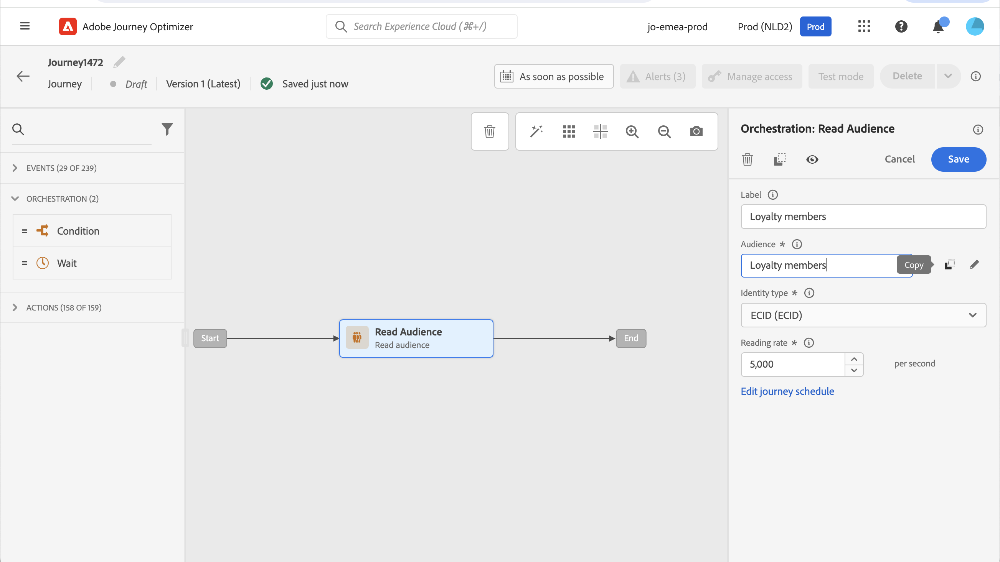
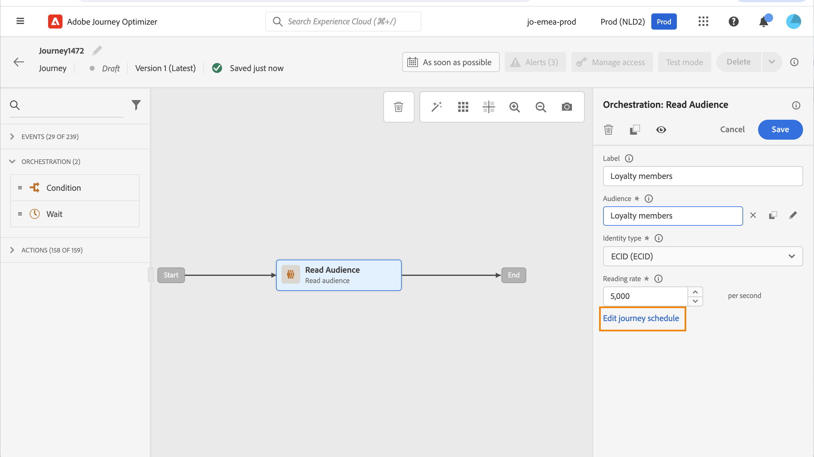
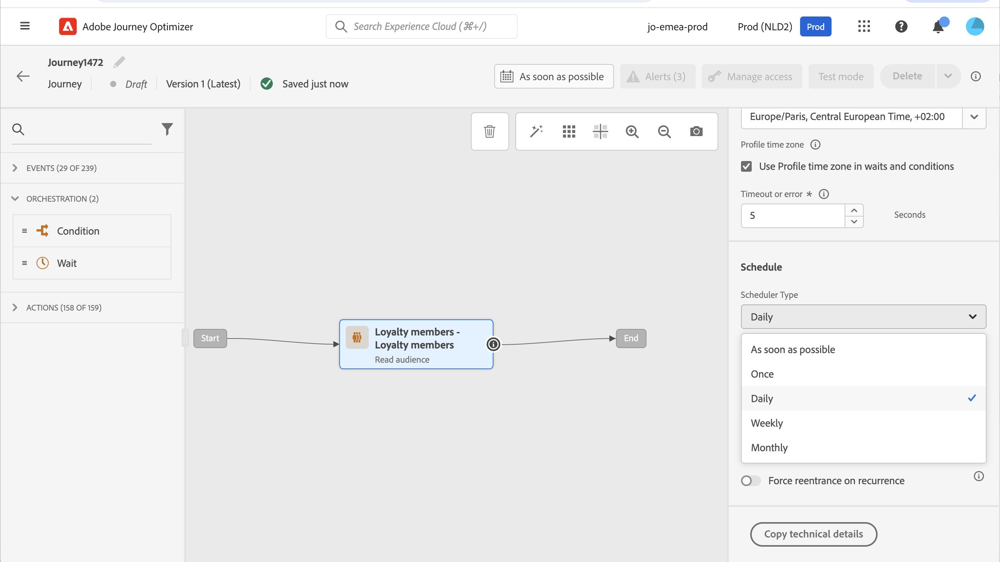
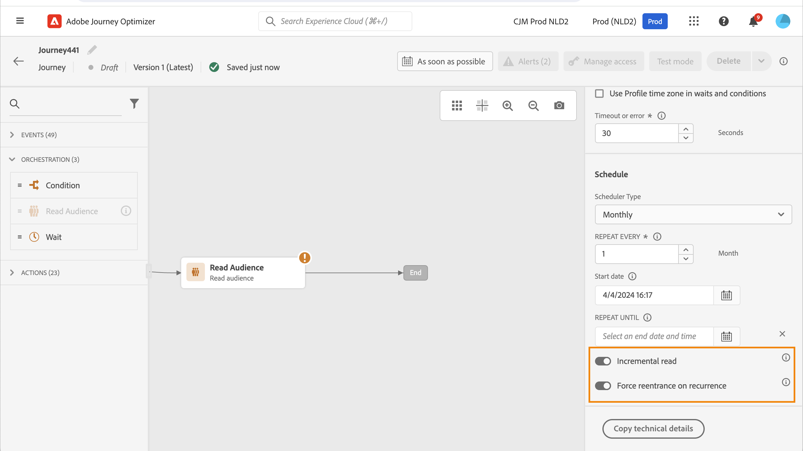
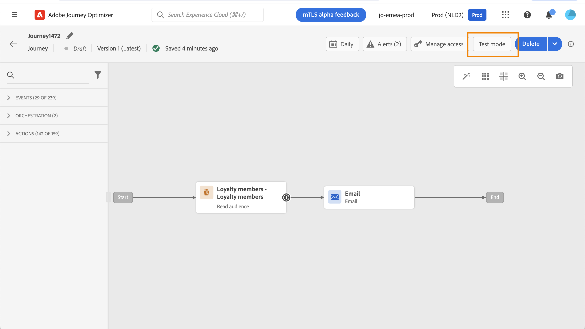
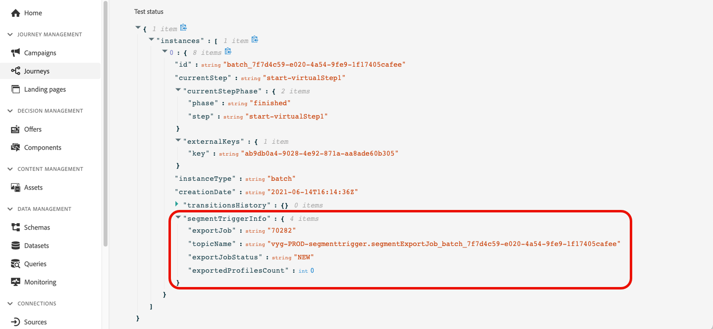
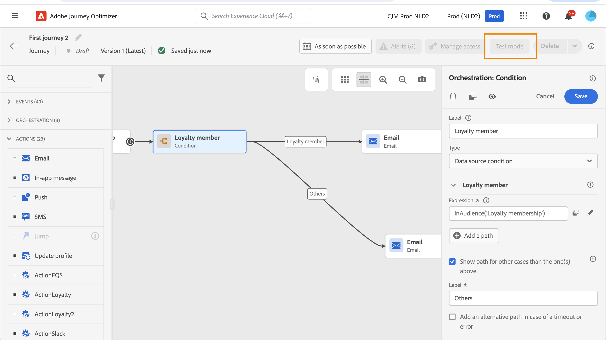
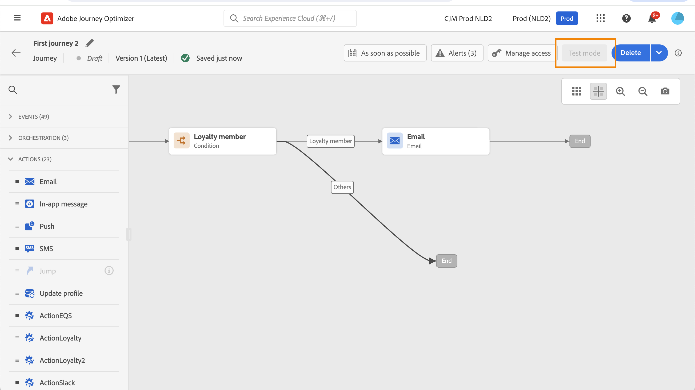
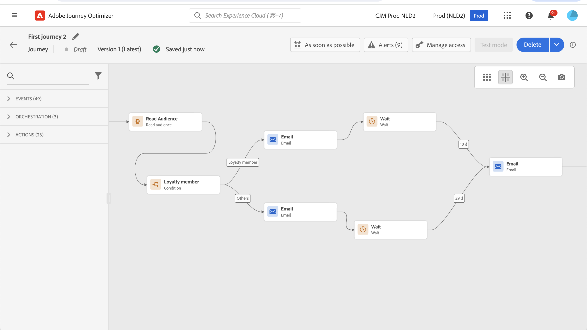

# Use an audience in a journey {#segment-trigger-activity}

Use the Read Audience activity to start journeys with defined audiences.

## About the Read Audience activity {#about-segment-trigger-actvitiy}

>[!CONTEXTUALHELP]
>id="ajo_journey_read_segment"
>title="Read Audience activity"
>abstract="The Read Audience activity allows you to make all individuals belonging to an [!DNL Adobe Experience Platform] audience enter a journey. Entrance into a journey can be executed either once, or on a regular basis."

Use the **Read Audience** activity to make all individuals of an audience enter the journey. Entrance into a journey can be executed either once, or on a regular basis.

Let's take as an example the "Luma app opening and checkout" audience created in the [Build audiences](../audience/about-audiences.md) use case. With the Read Audience activity, you can make all individuals belonging to this audience enter a journey. They will flow into individualized journeys that leverage all journey functionalities: conditions, timers, events, actions.

➡️ [Discover this feature in video](#video)

>[!NOTE]
>
>When a Read Audience activity executes, the system generates internal events (called `segmentExportJob` events) to track the lifecycle of the audience export operation. These events are recorded at the activity level, not per individual profile, and can be queried for monitoring and troubleshooting purposes. Learn more about [querying Read Audience events](../reports/query-examples.md#read-segment-queries).

>[!CAUTION]
>
>* Before using the Read audience activity, [read the Guardrails and Limitations](#must-read).

## Configure the activity {#configuring-segment-trigger-activity}

The steps to configure the Read Audience activity are as follows.

### Add a Read audience activity and select the audience

1. Unfold the **[!UICONTROL Orchestration]** category and drop a **[!UICONTROL Read Audience]** activity into your canvas.

    The activity must be positioned as the first step of a journey.

1. Add a **[!UICONTROL Label]** to the activity (optional).

1. In the **[!UICONTROL Audience]** field, choose the [!DNL Adobe Experience Platform] audience that will enter the journey, then click **[!UICONTROL Save]**. You can select any [!DNL Adobe Experience Platform] audience generated using [segment definitions](../audience/creating-a-segment-definition.md).

   >[!NOTE]
   >
   >In addition, you can target [!DNL Adobe Experience Platform] audiences created using [audience compositions](../audience/get-started-audience-orchestration.md).
   >You can also target audiences [uploaded from a CSV file](https://experienceleague.adobe.com/docs/experience-platform/segmentation/ui/overview.html#import-audience){target="_blank"}.
   >[Learn more about how to generate and target audiences in Journey Optimizer](../audience/about-audiences.md).

    Note that you can customize the columns displayed in the list and sort them.

    ![Audience selection interface showing available [!DNL Adobe Experience Platform] audiences](assets/read-segment-selection.png)

    Once the audience is added, the **[!UICONTROL Copy]** button allows you to copy its name and ID:

    `{"name":"Luma app opening and checkout","id":"8597c5dc-70e3-4b05-8fb9-7e938f5c07a3"}`

   

    >[!NOTE]
    >
    >Only the individuals with the **Realized** audience participation status will enter the journey. For more on how to evaluate an audience, refer to the [Segmentation Service documentation](https://experienceleague.adobe.com/docs/experience-platform/segmentation/tutorials/evaluate-a-segment.html#interpret-segment-results){target="_blank"}.

1. In the **[!UICONTROL Namespace]** field, choose the namespace to use in order to identify the individuals. By default, the field is pre-filled with the last used namespace. [Learn more about namespaces](../event/about-creating.md#select-the-namespace).

    >[!NOTE]
    >
    >Individuals belonging to an audience that does not have the selected identity (namespace) among their different identities cannot enter the journey. You can only select a people-based identity namespace. If you have defined a namespace for a lookup table (for example: ProductID namespace for a Product lookup), it will not be available in the **Namespace** dropdown list.

### Guardrails and recommendations {#must-read}

* Only one **[!UICONTROL Read Audience]** activity can be used in a journey, and it has to be the first activity in the canvas.

* The **[!UICONTROL Read audience]** activity can target only one audience. If multiple audiences are required, consider merging those audiences into a single one before use. [Learn how to combine audiences using composition workflows](../audience/get-started-audience-orchestration.md)

* For journeys using a **Read Audience** activity, there is a maximum number of journeys that can start at the exact same time. Retries will be performed by the system. However, avoid having more than five journeys (with **Read Audience**, scheduled or starting "as soon as possible") starting at the exact same time. Best practice is to spread them over time, for example 5 to 10 minutes apart.

* Experience event field groups can not be used in journeys starting with a **Read audience** activity, an **[Audience qualification](audience-qualification-events.md)** activity, or a business event activity.

* As a best practice, we recommend you only use batch audiences in a **Read audience** activity. This will provide reliable and consistent count for the audiences used in a journey. Read audience is designed for batch use cases. If your use case needs real time data please use **[Audience qualification](audience-qualification-events.md)** activity.

* Audiences [imported from a CSV file](https://experienceleague.adobe.com/docs/experience-platform/segmentation/ui/overview.html#import-audience) or resulting from [composition workflows](../audience/get-started-audience-orchestration.md) can be selected in the **Read Audience** activity. These audiences are not available in the **Audience Qualification** activity.

* Concurrent Read Audience Limit per Organization: Each organization can run up to five Read Audience instances concurrently. This includes both scheduled runs and those triggered by business events. The limit applies across all sandboxes and journeys. This limit is enforced to ensure fair and balanced resource allocation across all organizations.

* Sandbox throughput management: The system dynamically manages processing throughput per sandbox with a maximum limit of 20,000 profiles per second shared across all Read Audience activities. Individual Read Audience activities can be configured with a minimum rate of 500 profiles per second. If sandbox-level throughput limits are reached, jobs may be queued to ensure fair resource allocation.

* Job processing timeout: Read Audience jobs that cannot be processed within 12 hours due to guardrail limits will be automatically cleaned up and will never execute. This prevents job accumulation and ensures system stability.

* When using batch segments, ensure your ingestion and daily snapshot updates complete well before the journey starts. Consider an additional wait period if segments must reflect data ingested the same day. If immediate profile freshness is critical, use an event-based or streaming approach instead of a daily batch approach. Alternatively, insert a waiting mechanism to allow updated data to propagate before the journey evaluation.

Guardrails related to the **Read Audience** activity are listed in [this page](../start/guardrails.md#read-segment-g).

>[!CAUTION]
>
>[Guardrails for Real-time Customer Profile data and segmentation](https://experienceleague.adobe.com/docs/experience-platform/profile/guardrails.html){target="_blank"} also apply to [!DNL Adobe Journey Optimizer].

### Manage profiles entry in the journey

Set the **[!UICONTROL Reading rate]**. This is the maximum number of profiles that can enter the journey per second. This rate applies only to this activity and no others in the journey. If you want to define a throttling rate on custom actions, for example, you need to use the throttling API. Refer to this [page](../configuration/throttling.md).

This value is stored in the journey version payload. The default value is 5,000 profiles per second. You can modify this value from 500 to 20,000 profiles per second.

>[!NOTE]
>
>The overall reading rate per sandbox is set to 20,000 profiles per second. Therefore, the reading rate of all the read audiences that run simultaneously in the same sandbox add up to at most 20,000 profiles per second. You cannot modify this cap. Learn more about journey processing rates and throughput in [this section](entry-management.md#journey-processing-rate).

### Schedule the journey {#schedule}

>[!CONTEXTUALHELP]
>id="ajo_journey_read_segment_scheduler_start_date"
>title="Start date / time"
>abstract="Define the date and time you want to trigger this journey."

>[!CONTEXTUALHELP]
>id="ajo_journey_read_segment_scheduler_repeat_until"
>title="Repeat until"
>abstract="Define the end date of recurring."

>[!CONTEXTUALHELP]
>id="ajo_journey_read_segment_scheduler_repeat_every"
>title="Repeat every"
>abstract="Define a frequency of recurring scheduler."

>[!CONTEXTUALHELP]
>id="ajo_journey_read_segment_scheduler_incremental_read"
>title="Incremental read"
>abstract="Only allow new profiles since last read to enter the journey."

>[!CONTEXTUALHELP]
>id="ajo_journey_read_segment_scheduler_force_reentrance"
>title="Force reentrance"
>abstract="Drop all journey participants before each audience read."

>[!CONTEXTUALHELP]
>id="ajo_journey_read_segment_scheduler_synchronize_audience"
>title="Trigger after batch audience evaluation"
>abstract="Toggle on this option to trigger journey execution after a fresh evaluation of the batch audience."

>[!CONTEXTUALHELP]
>id="ajo_journey_read_segment_scheduler_synchronize_audience_wait_time"
>title="Wait time for fresh audience evaluation"
>abstract="Specify the time duration the journey will wait for the batch audience to be freshly evaluated. Wait period is limited to integer values, can be specified in minutes or hours, and must be between 1 and 6 hours."

By default, journeys are configured to run once. To define a specific date/time and frequency at which the journey should run, follow the steps below.

>[!NOTE]
>
>One-shot Read audience journeys move to the **Finished** status 91 days ([journey global timeout](journey-properties.md#global_timeout)) after the journey execution. For scheduled Read audiences, it is 91 days after the execution of the last occurrence.

1. In the **[!UICONTROL Read audience]** activity properties, select **[!UICONTROL Edit journey schedule]**.

    

1. The journey's properties display. In the **[!UICONTROL Scheduler type]** drop-down list, select the frequency at which you want the journey to run.

    

For recurring journeys, specific options are available to help you manage the entry of profiles into the journey. Expand the sections below for more information on each option.

+++**[!UICONTROL Incremental read]**

When a journey with a recurring **Read audience** executes for the first time, all the profiles in the audience enter the journey. This option allows you to target, after the first occurrence, only the individuals who entered the audience since the last execution of the journey.

When using this option, the system looks back **24 hours** from the time of the last audience evaluation job performed by [!DNL Adobe Experience Platform]'s segmentation service.

After segmentation completes, a profile snapshot export job begins which allows Journey Optimizer to detect and process new profiles. If the journey is scheduled between these two jobs, the incremental read will not pick up profiles that became members of the audience since the last execution of the journey.

To minimize the risk of missing profiles:
* Enable the **[!UICONTROL Trigger after batch audience evaluation]** option to extend the look-back period to the time of the last successful journey execution, regardless of how long ago it occurred
* Schedule journeys to run well after daily batch segmentation jobs complete (typically 2-3 hours buffer)
* For time-critical use cases requiring immediate profile inclusion, consider using [Audience Qualification](audience-qualification-events.md) activities with streaming audiences instead

>[!CAUTION]
>
>If you are targeting a [custom upload audience](../audience/about-audiences.md#about-segments) in your journey, profiles are only retrieved on the first recurrence when this option is enabled in a recurring journey. These audiences are fixed.

+++

+++**[!UICONTROL Force reentrance on recurrence]**

This option allows you to make all profiles still present in the journey automatically exit it on the next execution.

For example, if you have a 2-day wait in a daily recurring journey, activating this option moves profiles to the next journey execution. This happens the day after, whether they are in the next run audience or not.

If the lifespan of your profiles in this journey may be longer than the recurrence frequency, do not activate this option to make sure that profiles can finish their journey.

+++

+++**[!UICONTROL Trigger after batch audience evaluation]**

For journeys scheduled daily and targeting batch audiences, you can define a time window of up to 6 hours for the journey to wait for fresh audience data from batch segmentation jobs. If the segmentation job completes within the time window, the journey triggers. Otherwise, it skips the journey until its next occurrence. This option ensures journeys run with accurate and up-to-date audience data.

For example, if a journey is scheduled for 6 PM daily, you can specify a number of minutes or hours to wait before the journey runs. When the journey wakes up at 6 PM, it checks for a fresh audience, meaning an audience newer than the one used in the previous journey execution. During the specified time window, the journey will execute immediately upon detecting the fresh audience. If no fresh audience is detected, the journey execution will be skipped for that day.

+++

<!--

### Segment filters {#segment-filters}

[!CONTEXTUALHELP]
>id="jo_segment_filters"
>title="About segment filters"
>abstract="You can choose to target only the individuals who entered or exited a specific segment during a specific time window. For example, you can decide to only retrieve all the customers who entered the VIP segment since last week."

You can choose to target only the individuals who entered or exited a specific segment during a specific time window. For example, you can decide to only retrieve all the customers who entered the VIP segment since last week. Only the new VIP customers will be targeted. All the customers who were already part of the VIP segment before will be excluded.

To activate this mode, click the **Segment Filters** toggle. Two fields are displayed:

**Segment membership**: choose whether you want to listen to segment entrances or exits. 

**Lookback window**: define when you want to start to listen to entrances or exits. This lookback window is expressed in hours, starting from the moment the journey is triggered.  If you set this duration to 0, the journey will target all members of the segment. For recurring journeys, it will take into account all entrances/exits since the last time the journey was triggered.

-->

## Test and publish the journey {#testing-publishing}

The **[!UICONTROL Read Audience]** activity allows you to test the journey on a unitary profile.

To do this, activate the test mode.

Configure and run the test mode as usual. [Learn how to test a journey](testing-the-journey.md).

Once the test is running, the **[!UICONTROL Show logs]** button allows you to see the test results. For more on this, refer to [this section](testing-the-journey.md#viewing_logs)

Once the tests are successful, you can publish your journey (see [Publishing the journey](../building-journeys/publish-journey.md)). Individuals belonging to the audience will enter the journey on the date/time specified in the journey's properties **[!UICONTROL Scheduler]** section.

>[!NOTE]
>
>For recurring audience-based journeys, the journey will automatically close once its last occurrence is executed. If no end date/time has been specified, you will have to close the journey to new entrances manually to end it.

## Audience targeting in audience-based journeys

Audience-based journeys always start with a **Read Audience** activity to retrieve individuals belonging to an [!DNL Adobe Experience Platform] audience.

The audience belonging to the audience is retrieved once or on a regular basis.

After entering the journey, you can create audience orchestration use cases, making individuals from the initial audience flow into different branches of the journey.

**Segmentation**

You can use conditions to perform segmentation using the **Condition** activity. For example, you can make VIP persons take a particular path and non-VIP flow in another path.

The segmentation can be based on:

* data source data
* the context of events part of the journey data, for example: did a person click on the message received an hour ago?
* a date, for example: are we in June when a person goes through the journey?
* a time, for example: is it morning in the person's timezone?
* an algorithm splitting the audience flowing in the journey based on a percentage, for example: 90% - 10% to exclude a control group

>[!NOTE]
>
>When using the "Daily" scheduler type with a **[!UICONTROL Read Audience]** activity, you can define a time window for the journey to wait for fresh audience data. This ensures accurate targeting and prevents issues caused by delays in batch segmentation jobs. [Learn how to schedule a journey](#schedule)

**Exclusion**

The same **Condition** activity used for segmentation (see above) also allows you to exclude part of the population. For example, you can exclude VIP persons by making them flow into a branch with an end step right after.

This exclusion could happen right after audience retrieval, for population counting purposes or along a multistep journey.

**Union**

Journeys allow you to create N branches and join them together after a segmentation. As a result, you can make two audiences return to a common experience.

For example, after following a different experience during ten days in a journey, VIP and non-VIP customers can return to the same path. After a union, you can split the audience again by performing a segmentation or an exclusion.

## Troubleshooting audience count mismatches {#audience-count-mismatch}

If you notice discrepancies between estimated audience counts, qualified profiles, and actual profiles entering your journey, consider the following:

### Timing and data propagation

* **Batch segmentation job completion**: For batch audiences, ensure that the daily batch segmentation job has completed and snapshots are updated before the journey runs. Batch audiences become ready for use approximately **2 hours** after segmentation job completion. Learn more about [audience evaluation methods](https://experienceleague.adobe.com/docs/experience-platform/segmentation/home.html#evaluate-segments){target="_blank"}.

* **Data ingestion timing**: Verify that profile data ingestion has fully completed before the journey execution. If profiles were ingested shortly before the journey starts, they may not be reflected in the audience yet. Learn more about [data ingestion in [!DNL Adobe Experience Platform]](https://experienceleague.adobe.com/docs/experience-platform/ingestion/home.html){target="_blank"}.

* **Use "Trigger after batch audience evaluation" option**: For daily scheduled journeys using batch audiences, consider enabling the **[!UICONTROL Trigger after batch audience evaluation]** option. This ensures the journey waits for fresh audience data (up to 6 hours) before executing. [Learn more about scheduling](#schedule)

* **Add a Wait activity**: For streaming audiences with recently ingested data, consider adding a **Wait** activity at the beginning of the journey to allow time for data propagation and profile qualification. [Learn more about the Wait activity](wait-activity.md)

### Data validation and monitoring

* **Check segmentation job status**: Monitor batch segmentation job completion times in the [!DNL Adobe Experience Platform] [monitoring dashboard](https://experienceleague.adobe.com/docs/experience-platform/dataflows/ui/monitor-segments.html){target="_blank"}. Use it to verify when audience data is ready.

* **Verify merge policies**: Ensure that the merge policy configured for your audience matches the expected behavior for combining profile data from different sources. Learn more about [merge policies in [!DNL Adobe Experience Platform]](https://experienceleague.adobe.com/docs/experience-platform/profile/merge-policies/overview.html){target="_blank"}.

* **Review segment definitions**: Confirm that segment definitions are configured correctly and include all expected qualification criteria. Learn more about [building audiences](../audience/creating-a-segment-definition.md). Pay special attention to:
    * Time-based conditions that may exclude profiles based on event timestamps
    * Attribute qualifications that depend on recently updated data
    * Streaming vs. batch evaluation methods

* **Validate namespace configuration**: Ensure the namespace selected in the **Read Audience** activity matches the primary identity used by profiles in your audience. Profiles without the selected namespace will not enter the journey. Learn more about [identity namespaces](../event/about-creating.md#select-the-namespace).

### Best practices to prevent mismatches

* **Schedule journeys after segmentation**: For batch audiences, schedule journey execution at least 2-3 hours after the typical batch segmentation job completion time. [Learn more about journey scheduling](#schedule)

* **Use streaming audiences for real-time use cases**: If you need immediate profile qualification and journey entry, use [Audience Qualification](audience-qualification-events.md) activities with streaming audiences instead of **Read Audience** with batch audiences.

* **Test with smaller audiences first**: Before launching large-scale journeys, test with a smaller subset to validate that counts match expectations. [Learn how to test a journey](testing-the-journey.md)

* **Monitor regularly**: Set up regular monitoring of audience sizes and journey entry metrics to detect discrepancies early. Learn more about [journey processing rates and entry management](entry-management.md).

If count mismatches persist after following these steps, contact Adobe support with details about your audience, journey configuration, and observed discrepancies.

## Retries {#read-audience-retry}

Retries are applied by default on audience-triggered journeys (starting with a **Read Audience** or a **Business Event**) while retrieving the export job. If an error occurs during the export job creation, retries will be made every 10mn, for 1 hour max. After that, we will consider it as a failure. Those types of journeys can therefore be executed up to 1 hour after the scheduled time.

Unsuccessful **Read Audience** triggers are captured and displayed in **Alerts**. The **Read Audience alert** warns you if a **Read Audience** activity has not processed any profile 10 minutes after the scheduled execution time. This failure can be caused by technical issues or an empty audience. If the failure is due to technical issues, retries can still occur depending on the issue type. For example, if export job creation fails, we retry every 10 minutes for up to 1 hour. [Learn more](../reports/alerts.md#alert-read-audiences)

## Related topics

* [Build audiences](../audience/about-audiences.md)
* [Audience Qualification activity](audience-qualification-events.md)
* [Journey properties and guardrails](../start/guardrails.md#read-segment-g)
* [Test a journey](testing-the-journey.md)
* [Publish a journey](../building-journeys/publish-journey.md)

## How-to video {#video}

Understand the applicable use cases for a journey that is triggered by the read audience activity. Learn how to build batch-based journeys and which best practices to apply.

>[!VIDEO](https://video.tv.adobe.com/v/3424997?quality=12)
