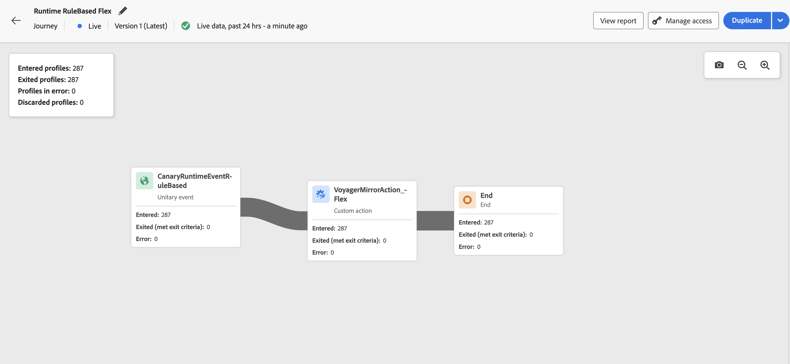

# Live report in the journey canvas {#report-journey}

>[!BEGINSHADEBOX]

**On this page:** Learn how to use Live Reporting to monitor key journey metrics from the last 24 hours directly within the journey canvas.

>[!ENDSHADEBOX]

After your journey is published, on once the [Dry run mode](journey-dry-run.md) is activated, **Live Reporting** provides metrics from the last 24 hours, directly within the journey canvas.

>[!AVAILABILITY]
>
>If you cannot see data in your journey live report, your access rights must be extended to include the **[!UICONTROL View journeys report]** permission. [Learn more](../administration/permissions.md)

The displayed events occurred within the past 24 hours, with a minimum interval of two minutes between the event and its display, typically within five minutes.

For your journeys in Live or [Dry run mode](journey-dry-run.md), you can check:

* **[!UICONTROL Entered profiles]**: Total number of individuals who entered the journey.
* **[!UICONTROL Exited profiles]**: Total number of individuals who exited the journey (including errors).
* **[!UICONTROL Profiles in error]**: Total number of individuals who encountered an error during their journey.
* **[!UICONTROL Discarded profiles]**: Total number of individuals who were discarded from the journey for one of the following reasons:

    * For **Audience Qualification** activities, a discard can happen if the expected verb for audience qualification mismatch what journey has received (e.g. "exited" instead of "realized").
    * For **event-triggered** journeys, a discard can happen if the individual attempted to reenter the journey too soon or when reentry was not allowed.
    * On **recurring** journeys, a discard is counted on each recurrence if the individual is already in the journey and the reentry policy is not set to "force reentrance".
    * On **Read Audience** activities, a discard occurs if no identity is set for the exported individual, or if the received identity namespace does not match the expected one for the journey.

For each activity within every journey in Live or [Dry run mode](journey-dry-run.md), you have access to:

* **[!UICONTROL Entered]**: Total number of individuals who entered this activity. For **Action** activities, as they are not executed in Dry run mode, this metric indicates profiles passing through.
* **[!UICONTROL Exited (met exit criteria)]**: Total number of individuals who exited the journey from that activity, due to an exit criteria (including errors).
* **[!UICONTROL Exited (forced exit)]**: Total number of individuals who exited the journey while it was paused due to a journey practitioner configuration. This metric is always equals to zero for journeys in Dry run mode.
* **[!UICONTROL Error]**: Total number of individuals who had an error on that activity.

## Troubleshooting missing reporting data {#troubleshooting-missing-data}

If you do not see expected data in your journey reports, consider the following:

* **Journey name synchronization**: Verify that the journey name in [!DNL Adobe Journey Optimizer] matches the name stored in the reporting dataset. A mismatch between these names can prevent reporting data from appearing correctly.

* **Data refresh timing**: After updating a journey name or configuration, allow sufficient time for the data to refresh. Reporting data typically appears within a few minutes, but in some cases may take longer.

* **Access permissions**: Ensure you have the necessary permissions to view journey reports. If you see no data, check with your administrator that you have the **[!UICONTROL View journeys report]** permission enabled. [Learn more about permissions](../administration/permissions.md)

* **Journey status**: Reporting data is only available for published journeys or journeys running in [Dry run mode](journey-dry-run.md). Draft journeys do not generate reporting data.

If issues persist after verifying these items, contact your Adobe administrator or [Adobe support](../start/user-interface.md#support-ticket-guidelines) for assistance.

>[!MORELIKETHIS]
>
>* [Get started with reporting](../reports/gs-reports.md)
>* [Publish your journey](publish-journey.md)
>* [Journey Dry run](journey-dry-run.md)
>* [Configure and track your journey metrics](success-metrics.md)
>* [Custom journey reports](../reports/sharing-overview.md)
