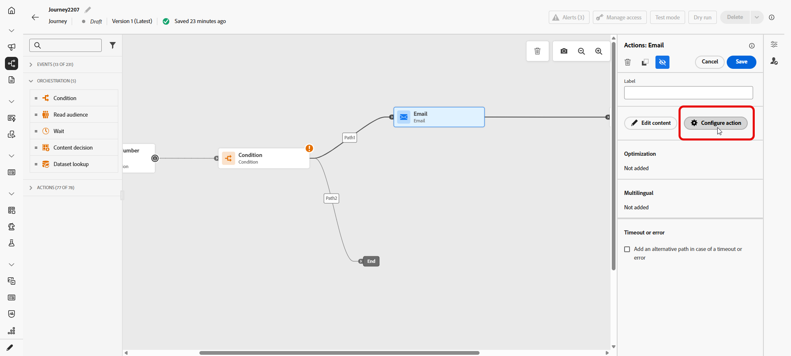
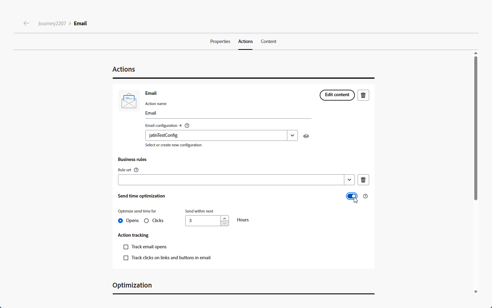
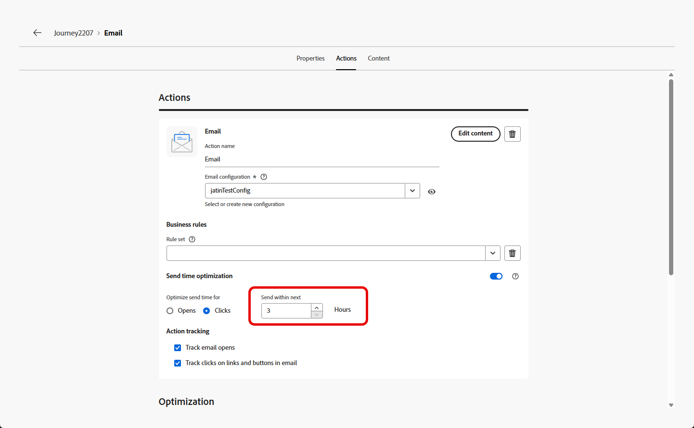
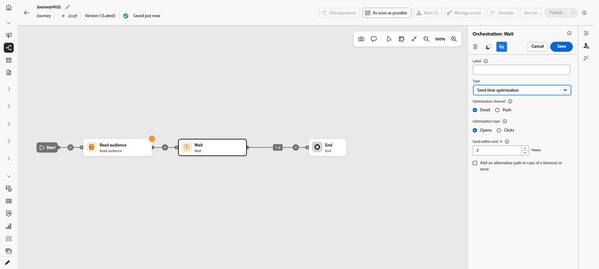
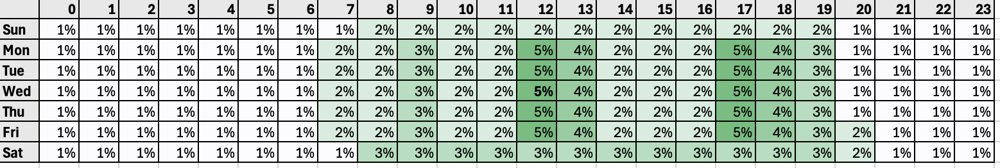
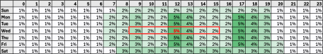

# Send-Time Optimization{#send-time-optimization}

>[!BEGINSHADEBOX]

**On this page:** Learn how to enable Send-Time Optimization so Adobe's AI predicts the best time to deliver email and push messages based on each customer's historical open and click behavior.

>[!ENDSHADEBOX]

>[!CONTEXTUALHELP]
>id="jo_bestsendtime_disabled"
>title="About Sent time optimization"
>abstract="[!DNL Adobe Journey Optimizer]'s Send-Time Optimization feature, powered by Adobe's AI services, can predict the best time to send an email or push message to maximize engagement based on historical open and click rates."

>[!CONTEXTUALHELP]
>id="jo_bestsendtime_email"
>title="Activate Send-Time Optimization"
>abstract="A radio button determines whether to optimize on email opens or email click-throughs. The send times used by the system can also be bracketed with a value for the Send within the next option."

>[!CONTEXTUALHELP]
>id="jo_bestsendtime_push"
>title="Activate Send-Time Optimization"
>abstract="Push messages defaults to the opens option, as clicks are not applicable for push messaging. The send times used by the system can also be bracketed with a value for the Send within the next option."

>[!NOTE]
>
>Send-Time Optimization is available for built-in Email and Push actions within journeys, and for the [Wait activity](wait-activity.md#sto-wait), where it determines the optimal time to continue to the next activity. It is not currently available for messages sent through campaigns or for other action types.

[!DNL Adobe Journey Optimizer]'s Send-Time Optimization feature, powered by Adobe's Journey AI services, chooses the optimal send time for email and push messages to maximize customer engagement, based on your customers' historical open and click behavior.

>[!AVAILABILITY]
>
>* The Send-Time Optimization feature is enabled for [!DNL Adobe Journey Optimizer] customers upon request. Contact Adobe Customer Care or your Adobe representative to activate the feature for your organization.
>
>* Send-Time Optimization only applies to **Email** and **Push notification** channels, and to the **[!UICONTROL Wait]** activity.
>
>* Send-Time Optimization is supported in the following AEP Hub regions: **VA7, NLD2, AUS5, CAN2, GBR9, IND2, CHE2**. These are Adobe deployment region codes, contact your Adobe representative if you are unsure which region your organization uses.
>

## Use send-time optimization{#use-send-time-optimization}

To enable and configure Send-Time Optimization on an email or push action, follow the steps below.

Before starting, csonsider which messages are a good fit before you turn it on. Send-Time Optimization should not be used for urgent, time-sensitive operational messages, for example, an order confirmation, a password reset notification, or a flight gate change notification. It works best for less-urgent marketing communications, such as a weekly ad, promotional information on a new product, or information about a month-long sale.

1. From your Journey, open the **[!UICONTROL Configure action]** menu.

   

1. Turn on the **[!UICONTROL Send-Time Optimization]** switch in the Send time optimization menu.

   

1. For Email messages, choose whether to optimize for opens or for click-throughs by selecting the appropriate option. Push messages are always optimized for opens.

   For best results, optimize most emails for **Clicks**. Choose **Opens** when the message is informational and not meant to drive a specific action.

1. For both Email and Push messages, set **[!UICONTROL Send within next]** to the maximum number of hours (2–100) the system will wait before sending the message.

   For best results, choose a value between 6 and 24 hours. A lower value reduces the number of available send times and can limit the benefit of Send-Time Optimization. A higher value may mean the message is outdated or less relevant by the time it is sent.

   

1. For Email messages, choose how your action tracking is configured. You can track Email opens and track clicks on links and buttons in the Email.

When your journey is activated and a customer reaches the Email or Push action in the journey, Send-Time Optimization will choose the best predicted send time available for each user within your specified limits.

To monitor your journey's performance, refer to the [Overview page](../reports/channel-report-cja.md). 

## Send-Time Optimization in the Wait activity {#sto-wait-activity}

Besides the Email and Push actions, you can also apply Send-Time Optimization to a **[!UICONTROL Wait]** activity. It relies on the same Send-Time Optimization model to work out each profile's optimal wait time, but here the wait is decoupled from the send: instead of being tied only to an Email or Push action, it can be followed by any activity, such as a Custom action.

[Learn how to configure Send-Time Optimization in a Wait activity](wait-activity.md#sto-wait).

## How send-time optimization works {#how-send-time}

The Send-Time Optimization model ingests your organization's [!DNL Adobe Journey Optimizer] customer behavior data and looks at user-level open and click events to determine when your customers are most likely to engage with your messaging.

Send-Time Optimization makes predictions for each hour of the week, for each user, based on three types of behavioral data:

1. The behavior of your users overall
1. The behavior of lookalike users in the same time zone
1. The behavior of that individual user

These predictions are weighted and combined using a Bayesian approach, resulting in a "heat map" for each metric (email opens, email clicks, and push opens), for each customer, that indicates the hours of the week that contacting that user is most and least likely to result in the desired engagement outcome (open/click), as illustrated in the below example heatmap:

If a user with the above predicted probabilities is targeted for a message at 9 AM Wednesday with Send-Time Optimization turned on and a 7 hour maximum wait time, the selected send time for the message will be 12 PM:

## Send-Time Optimization model training and scoring details  {#model-send-time}

Once the Send-Time Optimization feature is enabled for your organization, the Journey AI model is trained on email and push send, open and click events across all your organization's journeys and actions over the last 16 weeks – regardless of whether those actions use Send-Time Optimization. This allows Send-Time Optimization to benefit from all data generated by your customers.

Models are initially trained and scored weekly. After 16 weeks, models are retrained and rescored monthly. Model scoring includes all customer profiles – both existing and new since the last scoring run.

Messages sent by Send-Time Optimization receive either an "exploration" message send time selected to test different send times and observe how customers respond, or an "optimized" message send times selected to maximize click/open rates. 5% of send events receive an "exploration" send time and 95% of send events are "optimized".

Exploration send times are selected at random from the send times made available by your configured maximum wait time. For example, in the case that a message is selected at 9 AM Wednesday with Send-Time Optimization turned on and a 3 hour maximum wait time, Exploration send times for the message will be split evenly between 9 AM, 10 AM, 11 AM and 12 PM.

## Frequently asked questions {#faq-send-time}

You will find below Frequently Asked Questions about Send-Time Optimization.

Need more details? Use the feedback options at the bottom of this page to raise your question, or connect with [[!DNL Adobe Journey Optimizer] community](https://experienceleaguecommunities.adobe.com/t5/adobe-journey-optimizer/ct-p/journey-optimizer?profile.language=en){target="_blank"}.

+++How long do I need to wait before using Send-Time Optimization?

Your organization should use the Email action within Journey Optimizer for a minimum of 30 days before using Send-Time Optimization within Email to allow for the collection of some email send, open, and click events.

Your organization should use the Push action within Journey Optimizer for a minimum of 30 days before using Send-Time Optimization within Push to allow for the collection of some push send and open events.

If your organization has already been using the Email and/or Push action types for at least 30 days, your organization does not need to wait longer to use Send-Time Optimization after it has been enabled by Adobe. Results will continue to improve as your organization gathers data for up to 16 weeks.

+++

+++How can I see the send time a particular user will receive a message at?

In order to minimize the model's impact on profile richness, model scores are stored compressed in 3 Profile attributes stored in `_experience.intelligentServices.journeyAI.sendTimeOptimization`, and are not designed to be human readable.

+++

+++What is the average benefit of Send-Time Optimization?

Send-Time Optimization may increase email click rate and push open rate in the range of approximately 2% to 10% across all messages optimized by an organization.

For example, if an organization sending email without send time optimization has a 5.0% click rate on average, the same set of emails with send time optimization might result in as much as a 5.5% click rate on average (5.0% * (1+10%) = 5.5%).

Due to variability within small sample sizes, a benefit from Send-Time Optimization may not be observable on single message sends.

Organizations are more likely to experience greater benefits from using Send-Time Optimization when:

* Existing journeys use send times that are fixed and not well-optimized
* Variability in customer behavior (clicks and opens) corresponds to customer location and customer preferences
* Organizations use Send-Time Optimization on a larger fraction of email & push messages
* Organizations choose maximum wait times within the recommended range of 6-12 hours

+++

+++I always click on emails or push messages at 12pm, why didn't the algorithm send a message to me at 12pm?

This may occur for multiple reasons:

* Your message was selected as an "Exploration" message send time instead of an "Optimized" message send time.
* The behavior of lookalike users influenced the model to recommend another send time.

+++

+++How does Send-Time Optimization know a user's time zone?

Send-Time Optimization uses the `timeZone` profile field to determine a user's time zone. If not available for that user, Send-Time Optimization attempts to infer a user's time zone from other geographic information in the user's profile such as country and state.

+++

+++Will Send-Time Optimization send Push messages to users during the night in their local time zone?

Send-Time Optimization may send Push messages to users during the night in their local time zone in the following circumstances:

* When users exhibit behavior that indicates they are likely to interact with a message sent at night
* When the model chooses an "Exploration" send time

To avoid sending Push messages to customers during night time hours, schedule batch Push message sends to occur in the morning or early afternoon and choose a shorter duration for Send-Time Optimization. (For example, a 9 AM send time and 8 hour maximum wait time.)

+++

+++ AI Knowledge Reference

This section contains structured knowledge intended to support interpretation, retrieval, and question answering related to this topic.

For complete understanding, this information should be combined with the documentation on this page. Neither source is intended to stand alone; the page describes the feature, while this section provides additional context that helps disambiguate terminology, intent, applicability, and constraints.

* **TL;DR:** This page explains how to configure and use Send-Time Optimization in Adobe Journey Optimizer, an AI-powered feature that predicts the best time to send email or push messages to each individual to maximize engagement.

**Intents:**

* Enable Send-Time Optimization on an email or push action in a journey
* Choose whether to optimize for opens or click-throughs on email messages
* Set the maximum wait window (Send within next) for delayed delivery
* Understand how the AI model predicts optimal send times using behavioral data
* Determine whether Send-Time Optimization is appropriate for a given message type
* Use Send-Time Optimization within a Wait activity to delay before any downstream activity, decoupled from the message send

**Glossary:**

* **Send-Time Optimization (STO)**: An AI-powered feature that delays message delivery to each profile until the predicted optimal engagement hour within a configured time window *(product-specific)*
* **Journey AI**: Adobe's AI services powering Send-Time Optimization within Journey Optimizer *(product-specific)*
* **Exploration send time**: A randomly selected send time (used for 5% of sends) to test different times and improve model accuracy *(product-specific)*
* **Optimized send time**: A model-predicted send time selected to maximize click or open rates (used for 95% of sends) *(product-specific)*
* **Send within next**: The maximum number of hours (2–100) the system will wait before sending the message to a given profile *(product-specific)*

**Guardrails:**

* Send-Time Optimization must be enabled by Adobe for the organization; contact Adobe Customer Care or your Adobe representative to activate it.
* Send-Time Optimization applies to Email and Push notification channels within Journeys, and to the Wait activity; it is not available for Campaigns or custom actions.
* Send-Time Optimization has no visibility into quiet hours rules; a Send-Time Optimization Wait activity can select a time inside a quiet-hours window for a downstream channel action, which may then queue or discard the message depending on the quiet hours rule configuration.
* The organization must have used Email or Push actions in Journey Optimizer for at least 30 days before Send-Time Optimization produces meaningful results.
* Do not use Send-Time Optimization for urgent or time-sensitive operational messages (e.g., order confirmations, password resets, flight gate changes).
* Maximum wait time range is 2–100 hours; recommended range is 6–24 hours for best results.
* Model scores are stored in profile attributes at `_experience.intelligentServices.journeyAI.sendTimeOptimization` and are not human-readable.
* Models are trained weekly initially, then retrained and rescored monthly after 16 weeks.

**Terminology:**

* Canonical name: Send-Time Optimization — Acronym: STO — variants: best send time, send time AI, intelligent send time
* Synonyms: "Send-Time Optimization" = "optimal send time" = "AI send time"
* Do not confuse: "Exploration send time" ≠ "Optimized send time" (exploration is random for model testing; optimized is model-predicted for engagement)

**FAQ:**

* **Q: Which channels support Send-Time Optimization?** — Email and Push notification channels within Journeys, and the Wait activity; Campaigns and custom actions are not supported.
* **Q: Does Send-Time Optimization know about quiet hours?** — No. Quiet hours are only evaluated when a profile reaches a message action, so a Send-Time Optimization Wait activity can pick a time inside a quiet-hours window. Depending on the quiet hours rule, the message is then queued until quiet hours end, or discarded and the profile exits the journey. [Learn more](wait-activity.md#sto-wait).
* **Q: Should I optimize for opens or clicks on email?** — Optimize for Clicks for most emails. Choose Opens when the message is informational and not intended to drive a specific action.
* **Q: How long does the organization need to wait before enabling STO?** — At least 30 days of Email or Push usage in Journey Optimizer is needed to collect sufficient behavioral data. Results continue to improve for up to 16 weeks.
* **Q: Can STO send push notifications at night?** — Yes, if a user's behavior suggests night-time engagement or if an exploration send time is selected. To avoid this, use a morning send time with a short maximum wait window.
* **Q: What is the expected benefit of Send-Time Optimization?** — Approximately 2–10% improvement in email click rate or push open rate across all optimized messages, though benefits may not be observable on individual small-volume sends.

+++
