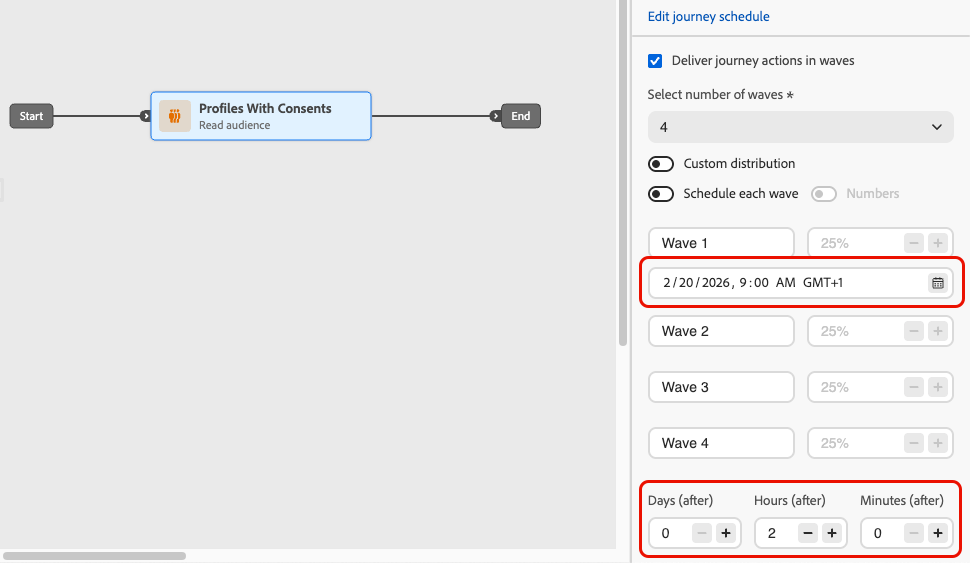
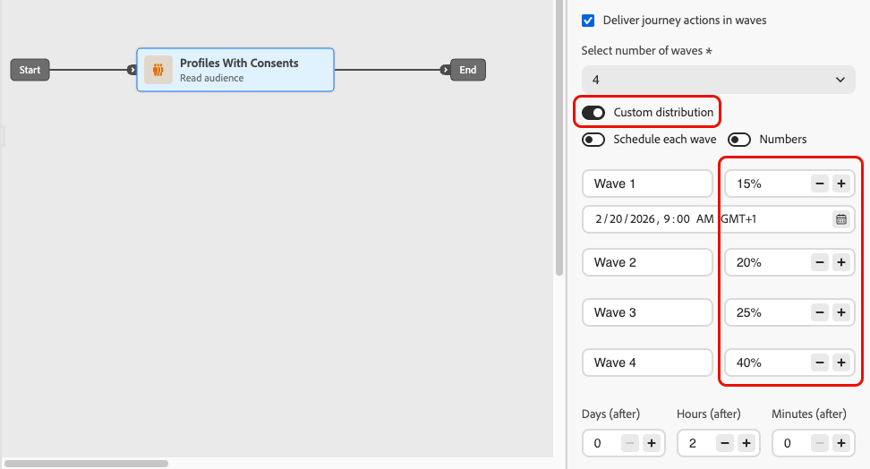
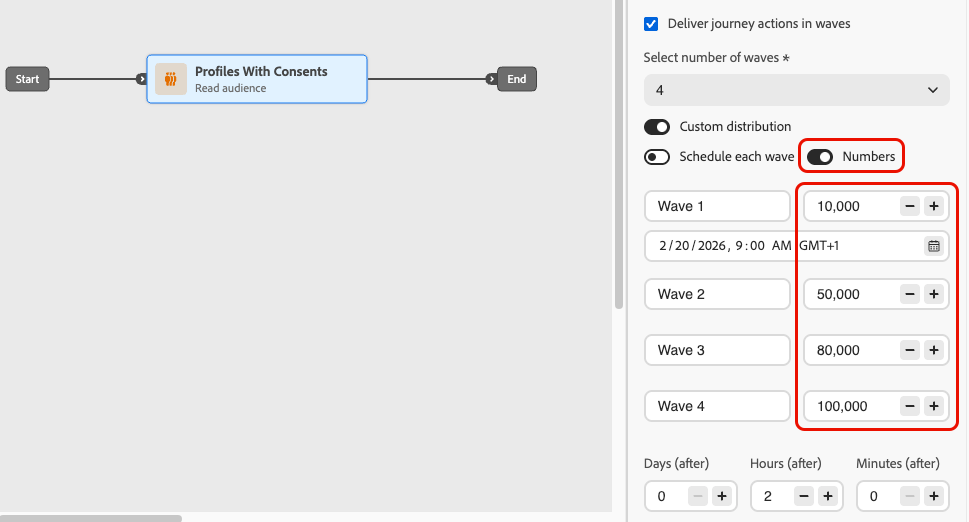
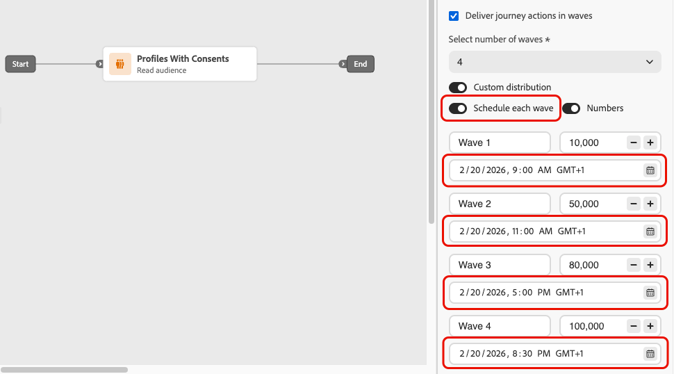

# Send using waves in journeys {#send-using-waves-journeys}

You can deliver outbound messages from a journey in batches (waves) over time instead of all at once. Wave sending helps balance load, avoid overwhelming downstream systems (such as call centers or landing pages), and support deliverability and sender reputation—especially for high-volume read audience journeys.

<!--
>[!CAUTION]
>
>Wave sending is available for read audience journeys only and applies to **outbound** actions only (Email, SMS, Push, Direct mail).
-->

You configure it at the journey level when you define how the audience enters and how actions are scheduled. You define the number of waves, their size (as a percentage of the audience or as absolute numbers), and when each wave runs.

## Limitations and guardrails {#limitations-guardrails}

* Wave sending is only available for read audience journeys with the **[!DNL As soon as possible]** and **[!UICONTROL Once]** scheduler types. Learn more on the [journey schedule](read-audience.md#schedule).
* Wave sending is not available for recurring, event-triggered, business-event, test mode or dry-run journeys.
* You must define at least **2 waves** and you can add up to **10 waves**.
* The minimum interval between the start of two waves is **30 minutes**.
* A wave start cannot be before the journey start or in the past.
* Splitting the audience into waves can take up to 1 hour. Profiles may not enter the journey until then.
* Within a single journey version, two waves never run at the same time. The next wave starts only after the previous wave has finished. For example, if waves are scheduled 1 hour apart but the first wave runs for 2 hours, the second wave starts when the first wave ends, not at its scheduled time.
* Wave starts can be delayed when the platform applies quota limits or when the system capacity is under heavy load.

## Configure wave sending in a journey {#configure-wave-sending}

1. Start your journey with a [Read Audience](read-audience.md) activity.

1. Double-click the **[!UICONTROL Read Audience]** activity to open its properties and select the **[!UICONTROL Deliver journey action in waves]** option.

    {width="100%"}

1. Set the **number of waves** (for example, 4).

    {width="80%"}

   >[!NOTE]
   >
   >You must define at least 2 waves and can add up to 10 waves.

1. Choose how to define wave size and timing as detailed below.

### Equal waves {#equal-waves}

By default, the audience is split into waves of equal size. Set a fixed interval between the start of each wave (for example, 2 hours).

{width="70%"}

>[!NOTE]
>
>The minimum interval between the start of two waves is **30 minutes**.

 The system then schedules subsequent waves automatically (for example, first wave at 9:00 AM, second at 11:00 AM, third at 1:00 PM, fourth at 3:00 PM).

### Custom distribution {#custom-distribution}

Select the **[!UICONTROL Custom distribution]** option to define the size of each wave as a percentage of the total audience (for example, 15%, 20%, 25%, 40%).

{width="70%"}

Select **[!UICONTROL Numbers]** to define the size of each wave as an absolute number of profiles (for example, 10,000; 50,000).

{width="70%"}

>[!NOTE]
>* When using percentages, all waves must total 100%. A warning is displayed if this is not the case.
>* When using numbers, the system does not validate coverage — ensure your wave sizes cover the intended audience. [Learn more](#faq)

### Custom schedule {#custom-schedule}

Select **[!UICONTROL Schedule each wave]** to define a specific start date and time for each wave. Waves do not need to be evenly spaced (for example, 9:00 AM, 11:00 AM, 5:00 PM, 8:30 PM).

{width="70%"}

>[!NOTE]
>
>The minimum interval between the start of two waves is **30 minutes**.

## Use cases {#use-cases}

Wave sending helps you control when and how many messages go out, which can improve deliverability, protect sender reputation, and align sends with your operational capacity. Consider using waves in these scenarios:

* **Call center or response management:** Limit how many messages go out per day or per hour so that downstream teams (e.g., customer care) can handle responses. For example, send 20 messages per day to match call center capacity.

   {width="55%"}

* **High volume and deliverability:** Avoid sending a very large journey send in one shot. Spread delivery over time to help maintain sender reputation and reduce the risk of being flagged as spam.

   {width="55%"}

* **Ramp-up:** When using a new platform or IP, progressively increase volume (for example, 10% in the first wave, then 15%, 20%, and so on) to build reputation gradually.

   {width="55%"}

## Frequently asked questions {#faq}

+++ What happens if the sum of the wave sizes does not equal your total audience?

* If the sum of your wave sizes **exceeds** the audience (for example, you schedule 100,000 in the first wave for an audience of 100,000), the first wave will send to the full audience and the remaining waves will have no one left to send to—they will not execute.
* If the sum **is less** than the audience (for example, you define four waves totaling 40,000 profiles for an audience of 100,000), only the profiles included in those waves will receive the message. The rest of the audience will not receive the communication and will not be retried in later waves.

+++

+++ Can I assign different segments or criteria to individual waves?

You can only define the size and timing of waves. The same audience flows through the journey; you cannot assign different segments or criteria to individual waves.

+++

## See also {#see-also}

* [Use an audience in a journey](read-audience.md)—configure the Read Audience activity.
