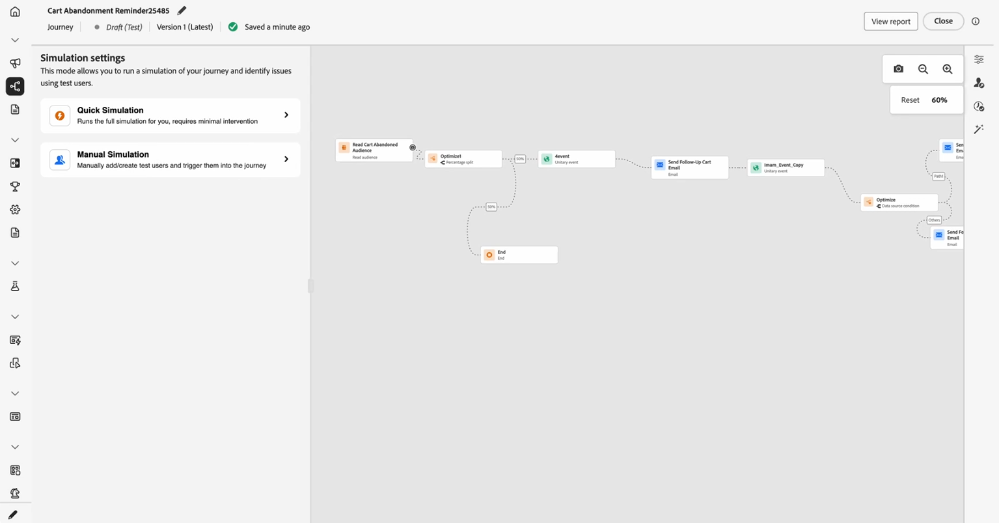

# Get started with Journey simulation {#simulate-journey-gs}
  
You can set the journey to **[!UICONTROL Simulation]** in addition to **Draft**, **Test mode**, and **Live**. In Simulation, you test with **simulated users**: temporary profile-like entities you add, without using persistent test profiles in Adobe Experience Platform.
   
Adobe Journey Optimizer offers two ways to test and validate your journey:

* **[Simulation](#test-users)**: Use the **[!UICONTROL Simulation]** journey feature and simulated users without pre-created profiles in Adobe Experience Platform, supporting both AI-powered and manually created users.

* **[Test mode](testing-the-journey.md)**: Use persistent profiles flagged as test profiles in Adobe Experience Platform, reusable across sessions. Choose this approach when you need consistent, predefined data. [Learn how to create test profiles](../audience/creating-test-profiles.md).

## Simulation by journey type {#by-journey-type}

The **[!UICONTROL Simulation]** panel shows only the steps your journey needs. That depends on how profiles enter the journey. From these factors, Adobe Journey Optimizer surfaces different simulation experiences. Expand each type below to see how the run differs and which panels you use.

For details, see [Simulate your journey](simulate-journey.md).

+++ Batch journey with a read audience

The journey is triggered by a **read audience**. The canvas has no unitary event activities, profiles move through conditions, waits, and channel actions only.

With **Batch journey with a read audience**, you can access Quick simulation or Manual simulation.

+++

+++ Batch journey with a read audience and unitary events

A segment-trigger journey that includes one or more unitary events along the path. After sending users in, you trigger events for the users that wait at an event node.

With **Batch journey with a read audience and unitary events**, you can access Quick simulation or Manual simulation.

+++

+++ Unitary journey

The journey **starts** with a unitary event, not a read audience. A simulated user does not enter the journey until that start event is fired for them.

With **Unitary journey**, you access directly the Manual simulation menu.

+++

## Launch Simulation {#launch}

Switch the journey to **[!UICONTROL Simulation]** to test with simulated users. Step-by-step tasks are detailed in [Simulate your journey](simulate-journey.md).

1. From your journey, click **[!UICONTROL Simulate]** and choose **[!UICONTROL Simulation]**.

    

1. Wait for activation to complete. While the journey switches to **[!UICONTROL Simulation]**, the controls in the panel are disabled and re-enable automatically once activation finishes.

## Limitations {#limitations}

In this release, **[!UICONTROL Simulation]** may not support every activity, channel, or integration that **[!UICONTROL Test mode]** or a live journey supports, and behavior may change as the capability matures. Use this article for supported workflows.

Refer to the drop-downs below to learn more on Simulation limitations.

+++ Node-level restrictions

If a journey contains any of the following nodes, it cannot be started in **[!UICONTROL Simulation]**. The journey must be modified, or the relevant node removed, before simulation can run.

| Restricted node | Notes |
| --- | --- |
| Business Events | Journeys that start with a business event cannot be run in **[!UICONTROL Simulation]**. |
| Supplemental ID (multiple re-entrance) | Concurrent re-entrance (several active instances for the same simulated user) prevents **[!UICONTROL Simulation]** from starting. |
| Content Decision node | This activity must be removed or changed before you can simulate the journey. |
| Dataset Lookup | Customer dataset lookups by key are not supported; journeys that include this activity cannot be run in **[!UICONTROL Simulation]**. |
| **[!UICONTROL Optimize]** activity | The following **[!UICONTROL Optimize]** methods are not supported in **[!UICONTROL Simulation]**: **[!UICONTROL Experiment]**, **[!UICONTROL Targeting rule]**, **[!UICONTROL Percentage split]**, **[!UICONTROL Time condition]**, **[!UICONTROL Condition]**, **[!UICONTROL Date condition]**, **[!UICONTROL Profile cap]**, and **[!UICONTROL External Data Source]**. Remove or change the node before you simulate. |
| External audience attribute enrichment | Journeys that use personalized attributes from external audience sources will not start in **[!UICONTROL Simulation]** when this validation is active. |

+++

 

+++ Functional limitations

The following capabilities are not supported in **[!UICONTROL Simulation]**.

| Capability | Notes |
| --- | --- |
| Exit criteria | Exit criteria are not applied when you run **[!UICONTROL Simulation]**. |
| [!DNL Adobe Journey Optimizer] decisioning inside an action (for example, email content with Adobe Journey Optimizer decisioning) | Action proofs for content that uses [!DNL Adobe Journey Optimizer] decisioning are not generated. |
| Mock custom action response | [!UICONTROL Custom actions] perform a real outbound call by default. Mocking the response so no external call runs is not supported. |
| Consent policy evaluation | Consent cannot be mocked at the simulated-user level. |
| Journey capping and arbitration | Not supported in **[!UICONTROL Simulation]**. |
| Frequency capping (by channel or communication type) | Not supported in **[!UICONTROL Simulation]**. |
| Opt-out management, suppression, and allow lists | Follows messaging routing configuration where it applies. |
| Dynamic subdomain and dynamic attributes in channel configurations | Follows messaging routing configuration where it applies. |
| Send Time Optimization (STO) | Not supported in **[!UICONTROL Simulation]**. |
| Sandbox tooling (copy simulated users across sandboxes) | Not supported. |
| Wave sending in journeys | Not supported. |
| Quiet hours | Not supported. |
| Opt-out management, suppression, and allow lists | Not supported. |
| Dynamic subdomain and dynamic attributes in channel configurations | Not supported. |
| Privacy service | Simulated users are not GDPR-compliant persistent profiles. Do not include real customer data in simulated users. |

+++

 

+++ Quantitative guardrails 

These guardrails apply to **[!UICONTROL Simulation]**. Numeric caps are enforced in the journey interface and at runtime. Limits may change in a later release; if you run near a ceiling, verify behavior in your sandbox.

| Guardrail | Limit | Notes |
| --- | --- | --- |
| Maximum simulated users that can be selected and triggered in one batch (batch journeys, event-triggered flows, and audience-qualification flows) | 20 | Counted for each **[!UICONTROL Send all]** or **[!UICONTROL Trigger selected events]**; not a cumulative cap for the whole journey. |
| Maximum unique simulated users tested in a single simulation run | 100 | Reaching **100** unique users in one run blocks **[!UICONTROL Select simulated users]** for new simulated users. If you are at **90**, you can add at most **10** more before the same block. |
| Maximum journeys that can run in **[!UICONTROL Simulation]** at the same time in one sandbox | 20 | Cap is shared by every **[!UICONTROL Simulation]** journey in that sandbox at once. |
| Maximum active simulated users in one sandbox | 2,000 | Maximum simulated users that can exist in the sandbox at one time. Adobe may adjust this limit based on customer feedback. |
| Event Pre-fill (Browser Only) | — | You can pre-fill event payload fields only in the browser-based simulation UI. Pre-filled values stay in that browser and are not synced to other browsers, devices, or sessions, so you may see different pre-fill data in each place you test. |

+++
