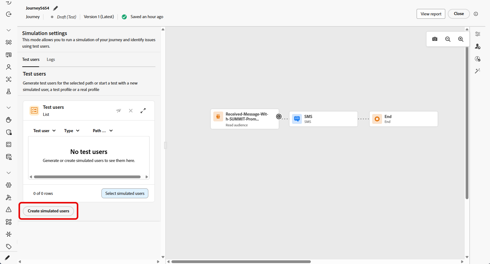
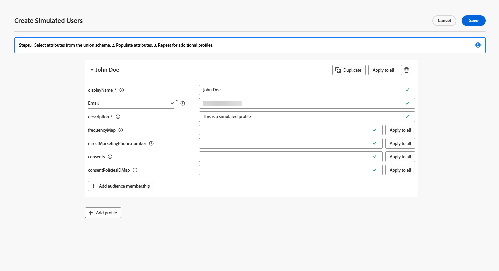
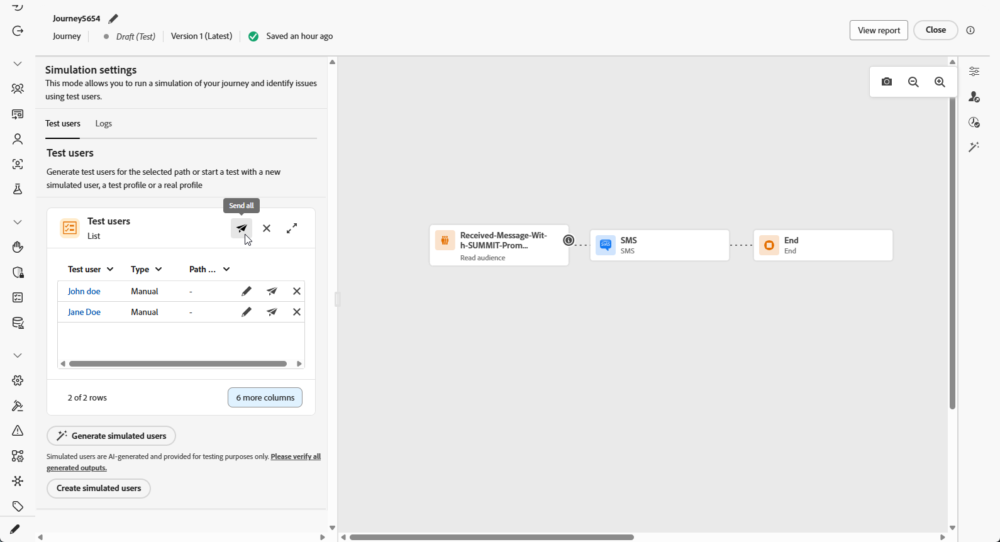
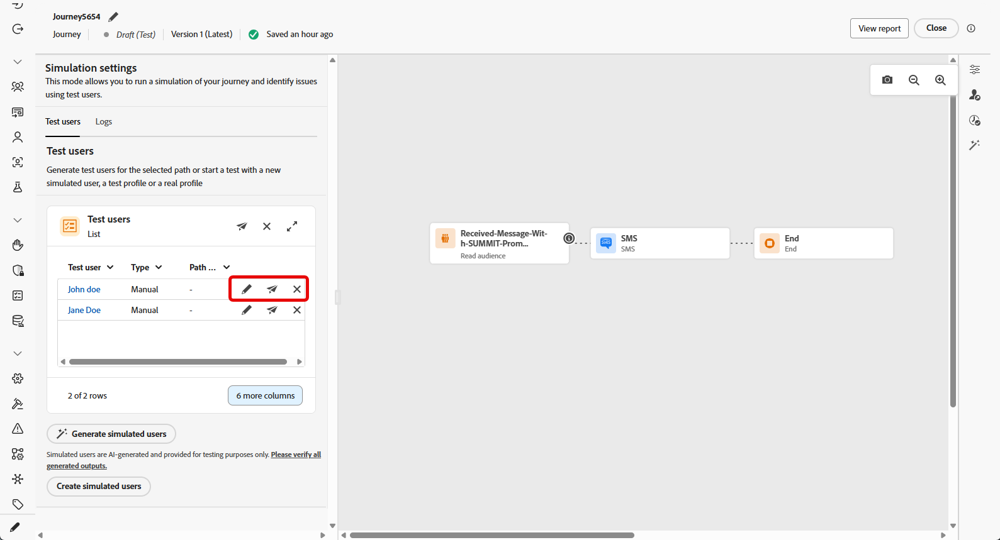
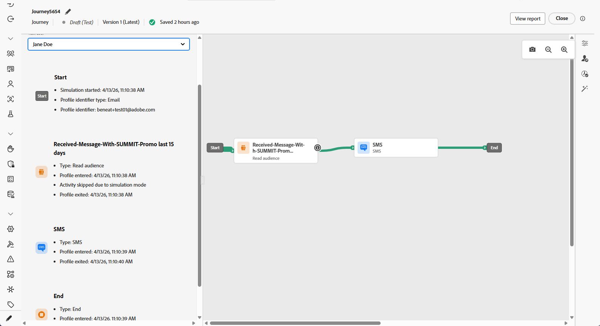

# Simulate your journey{#testing_the_journey}

>[!IMPORTANT]
>
> The use of Journey Simulation is currently unavailable for use with Healthcare Shield or Privacy and Security Shield.

You can set the journey to **[!UICONTROL Simulation]** in addition to **Draft**, **Test mode**, and **Live**. In Simulation, you test with **simulated users**: temporary profiles you add or generate on the fly, without using persistent test profiles in Adobe Experience Platform.

Adobe Journey Optimizer offers two ways to test and validate your journey:

* **[Simulation](#test-users)**: Use the **[!UICONTROL Simulation]** journey status and simulated users for quick runs without pre-created profiles in Adobe Experience Platform.

* **[Test mode](testing-the-journey.md)**: Use persistent profiles flagged as test profiles in Adobe Experience Platform, reusable across sessions. Choose this approach when you need consistent, predefined data. [Learn how to create test profiles](../audience/creating-test-profiles.md).

## Create and manage simulated users {#test-users}

>[!IMPORTANT]
>
>You need the **Simulate journeys** permission to use the **[!UICONTROL Simulate]** menu. [Learn more](../administration/permissions.md)

Simulated users are temporary profiles you define in **[!UICONTROL Simulation settings]**. This section covers how to create them, from the UI or a JSON file, save them for reuse, adjust or remove them from the list, and send them into the journey.

### Create simulated users

The following steps show you how to create simulated users from the UI or by importing a JSON file.

1. From your Journey, open **[!UICONTROL Simulate]** and choose **[!UICONTROL Simulation]**.

    
    
1. Click **[!UICONTROL Create Simulated Users]** to create new users and select whether to create users from the UI or import them from JSON.

    

1. If you create simulated users from JSON, update the corresponding fields with your simulated user data.

1. If you create simulated users from UI, enter a **[!UICONTROL Display name]** and **[!UICONTROL Description]** to identify this simulated user. Then, select the attributes from the Union schema that you want to populate for this user.

    

1. Click add **[!UICONTROL Audience membership]** to simulate segment memberships.

1. Click **[!UICONTROL Add profile]** to create multiple simulated users in a single session.

1. For each simulated user you added in this session, you can use the following actions:

    * **[!UICONTROL Duplicate]**: Adds a new simulated user that replicates the completed configuration of an existing entry, you can then edit the duplicate as needed.
    * **[!UICONTROL Apply all]**: Propagates the attribute values or settings from one simulated user to every other simulated user in the list.
    * **[!UICONTROL Delete]**: Removes the selected simulated user from the list.

1. Click **[!UICONTROL Save]** to store one or more simulated users for future use.

1. After you save, the simulated users you created appear in the **[!UICONTROL Test users]** list. For each entry, open the options menu and select one of the following:

    * : Update the simulated user's details.
    * : Run the simulation for this simulated user only.
    * : Remove the user from this list. The simulated user is not deleted and remains available in the Simulated Users selection.

    

1. Click **[!UICONTROL Send all]** to send every simulated users in the list into the journey. A `Simulated users entered the journey successfully.` confirmation message appears when the profiles successfully enter the journey.

    

1. Click **[!UICONTROL Show log]** to open the execution log and review how each step ran. For more information, see [View logs](#viewing_logs).

1. When errors appear in the log, leave **Simulation**, apply the required changes to the journey, and run **Simulation** again. After validation succeeds, publish the journey. See [Publish your journey](../building-journeys/publish-journey.md).

### Select simulated users

Simulated users that you create manually are stored and can be selected from this list when Simulation is enabled on other journeys.

1. Set the journey to **[!UICONTROL Simulation]**. Open the **[!UICONTROL Simulate]** entry point and choose **[!UICONTROL Simulation]** so the journey uses the Simulation status, for example alongside Test mode or Live, depending on your workspace.

    

1. In the **[!UICONTROL Simulation settings]** panel, you can either select previously created simulated users clicking Select simulated users.

1. Select from the list of simulated users that were previously created and saved.

1. Once you have selected your simulated users, they are now available in the **[!UICONTROL Test users]** list. From the options menu, choose between the following option:

    *  to edit users and change its details.
    *  to send your simulation to only one simulated user.
    *  to clear your simulated users from the list. Note that clearing it does not delete it, it can still be selectable from the Simulated users list.

    

1. Click **[!UICONTROL Send all]** to send every simulated users in the list into the journey. A `Simulated users entered the journey successfully.` confirmation message appears when the profiles successfully enter the journey.

    

1. Click **[!UICONTROL Show log]** to open the execution log and review how each step ran. For more information, see [View logs](#viewing_logs).

1. When errors appear in the log, leave **Simulation**, apply the required changes to the journey, and run **Simulation** again. After validation succeeds, publish the journey. See [Publish your journey](../building-journeys/publish-journey.md).

## Trigger your events {#firing_events}

If your journey includes one or more events, you can trigger them while Simulation is active.

1. In **[!UICONTROL Select event type]**, select the event to fire for this simulation.

    

1. Click  to adjust the event for this simulated user.

    

1. In the simulated user drop-down, select the profile and finish configuring the event and how it is generated.

    

1. Click **[!UICONTROL Trigger selected events]**. 
    
    A `Events triggered successfully` confirmation message appears when the profiles successfully enter the journey.

1. Click **[!UICONTROL Show log]** to open the execution log and review how each step ran. For more information, see [View logs](#viewing_logs).

## View logs {#viewing-logs}

The **[!UICONTROL Show log]** button allows you to view the test results. In the **[!UICONTROL Test user]** drop-down, select the profile whose execution you want to inspect.

For each activity, the log can show whether the profile entered or exited the step, and errors that occurred during the simulation.

For **Wait** activities, the log includes two duration-related values:

* **Defined duration**: The duration specified on the **Wait** activity for the published journey and applied once the journey is live. The log records whether Simulation applies an override from the test settings, for example 10 seconds, rather than relying solely on the value defined on the journey.
* **Actual duration**: The elapsed time the simulated user remained on the **Wait** activity. This value typically approximates the override duration but may vary, as it represents end-to-end processing time for the step, including service latency.

When errors appear in the log, leave **Simulation**, apply the required changes to the journey, and run **Simulation** again. After validation succeeds, publish the journey. See [Publish your journey](../building-journeys/publish-journey.md).
