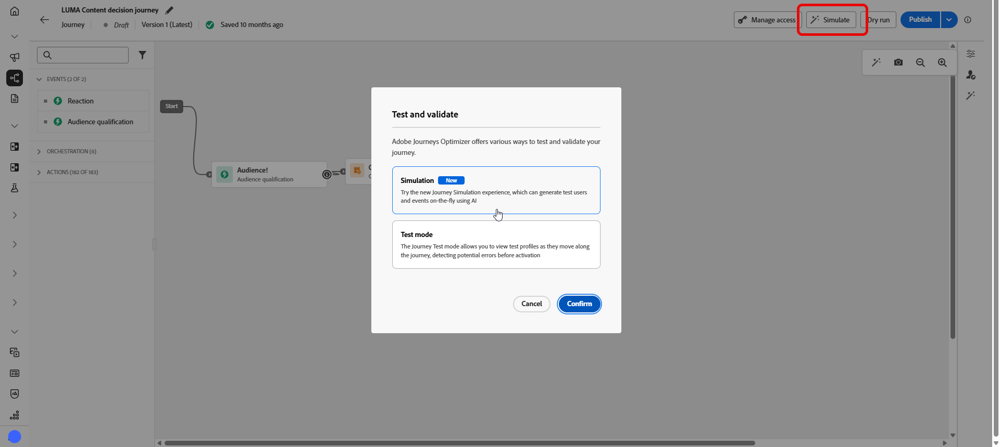
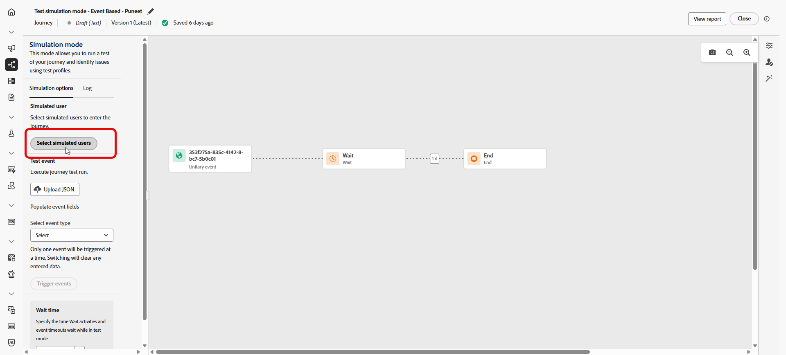
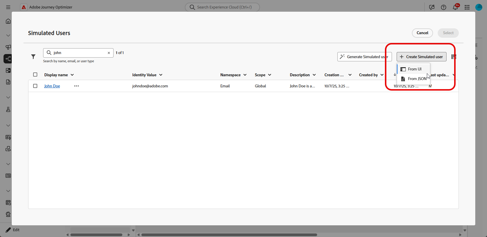
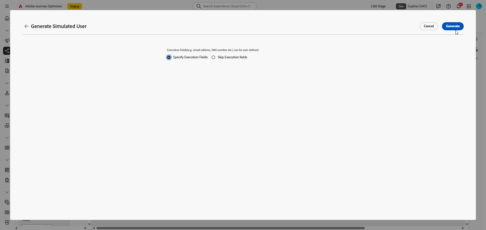
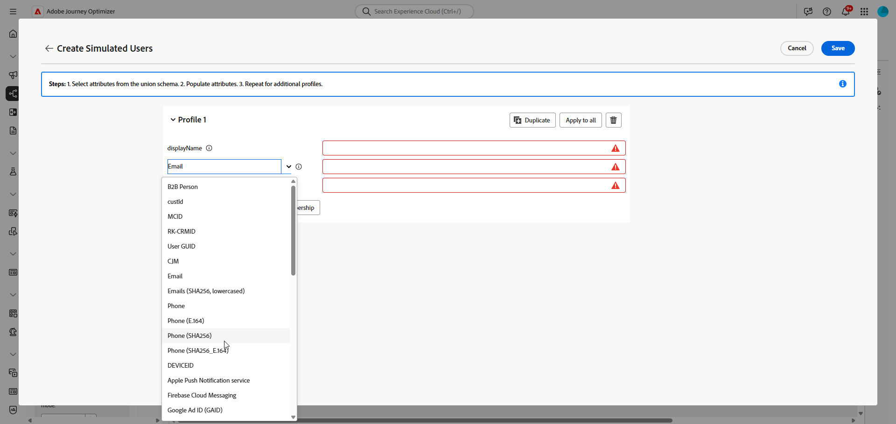
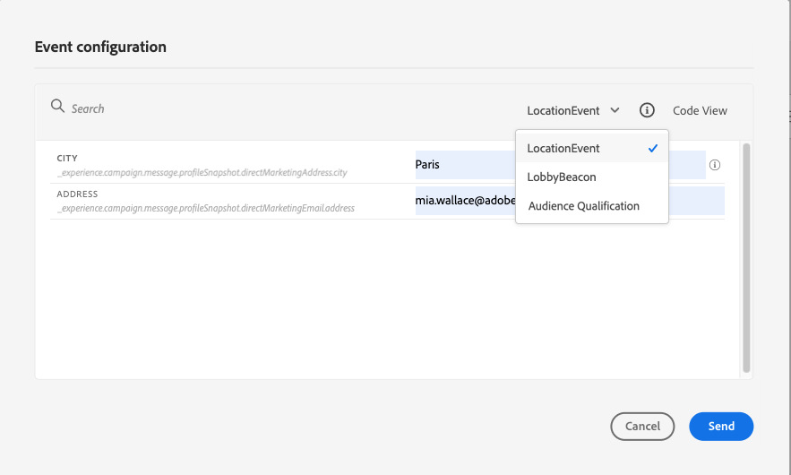
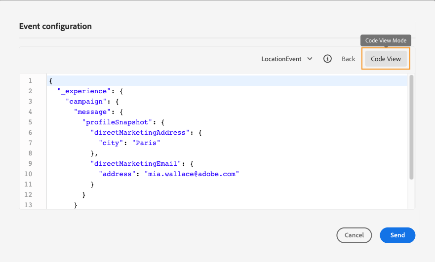
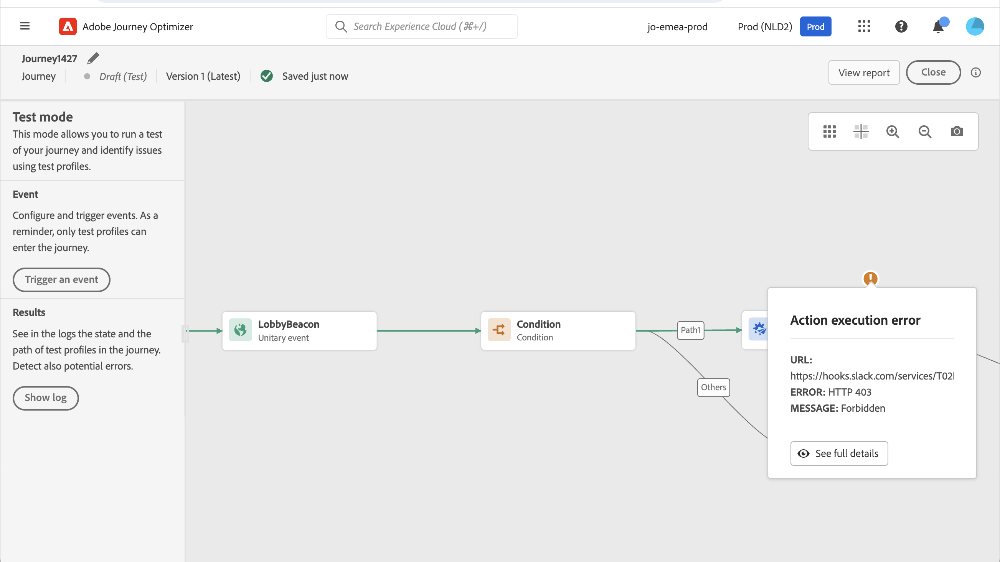
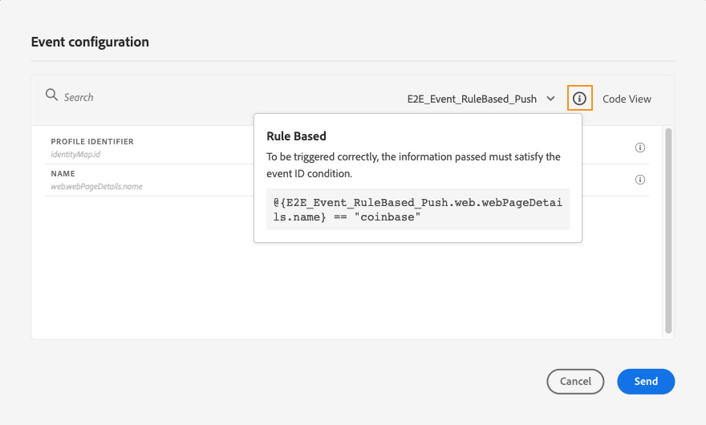
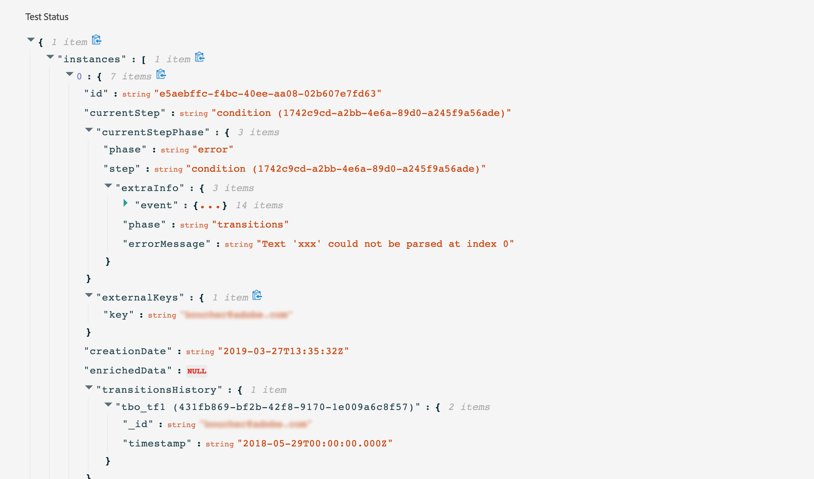

# Test your journey{#testing_the_journey}

>[!CONTEXTUALHELP]
>id="ajo_journey_test"
>title="Test your journey"
>abstract="Use test profiles to test your journey before publishing it. This allows you to analyze how individuals flow in the journey and troubleshoot before publication."
>additional-url="https://experienceleague.adobe.com/en/docs/journey-optimizer/using/orchestrate-journeys/create-journey/journey-dry-run" text="Journey Dry run"

Once you have built your journey, you can test it before publishing. Journey Optimizer offers "Test mode" as a way to view test profiles as they move along the journey, detecting potential errors before activation. Running quick tests allows you to check that journeys operate correctly so that you can publish them with confidence.

Only test profiles can enter a journey in test mode. You can either create new test profiles or turn existing profiles into test profiles. Learn more about test profiles in [this section](../audience/creating-test-profiles.md). 

>[!NOTE]
>
>Before testing your journey, you must resolve all errors if any. Learn how to check errors before testing in [this section](../building-journeys/troubleshooting.md). If test profiles fail to progress in test mode, see [troubleshooting test mode transitions](troubleshooting-execution.md#troubleshooting-test-transitions).

## Important notes {#important_notes}

Review these notes before running tests in your journey.

### General limitations

* **Test profiles only** - Only individuals flagged as "test profiles" in the Real-time Customer Profile Service can enter a journey in test mode. [Learn how to create test profiles](../audience/creating-test-profiles.md). 
* **Namespace requirement** - Test mode is available only for draft journeys that use a namespace. Test mode needs to check if a person entering the journey is a test profile or not and thus must be able to reach [!DNL Adobe Experience Platform].
* **Profile limit** - A maximum of 100 test profiles can enter a journey during a single test session.  
* **Event triggering** - Events can only be fired from the interface. Events cannot be fired from external systems using an API.
* **Custom upload audiences** - Journey test mode does not support [custom upload audience](../audience/custom-upload.md) attribute enrichment.

### Behavior during and after testing

* **Disabling test mode** - When you disable test mode, all profiles currently in or previously entered in the journey are removed, and reporting is cleared.  
* **Reactivation flexibility** - You can enable and disable test mode as many times as needed.  
* **Automatic deactivation** -  Journeys that remain inactive in test mode for **over a week** automatically revert to Draft status to optimize performance and prevent obsolete resource usage.
* **Editing and publishing** -  While test mode is active, you cannot modify the journey. You can, however, directly publish the journey, no need to deactivate the test mode before.  

### Execution

* **Split behavior** - When the journey reaches a split, the top branch is always selected. Reorder branches if you want a different path tested.  
* **Event timing** - If the journey includes*multiple events, trigger each event in sequences.Sending an event too early (before the first wait node finishes) or too late (after the configured timeout) will discard the event and send the profile to a timeout path. Always confirm any references to event payload fields remain valid by sending the payload within the defined window 
* **Active date window** -  Make sure the journey's configured choose [start and end dates/time](journey-properties.md#dates) window includes the current time when initiating test mode. Otherwise, triggered test events are silently discarded. Learn more about troubleshooting this issue [on this page](troubleshooting-execution.md#troubleshooting-test-transitions).
* **Reaction events** -  For reaction events with a timeout, the minimum and default wait time is 40 seconds.  
* **Test datasets** - Events triggered in test mode are stored in dedicated datasets labeled as follows: `JOtestmode - <schema of your event>`
* **Shared infrastructure** - Test Mode runs on the same infrastructure as production. During high traffic periods, you may notice delays in email sends or event processing. In this case, check platform traffic dashboards or retry your tests during off-peak hours.

<!--
* Fields from related entities are hidden from the test mode.
-->

## Activate the simulation

Adobe Journeys Optimizer offers two ways to test and validate your journey:

* **[Simulation](#simulated-users)**: Temporary profiles generated on-the-fly within the test mode interface. They are ideal for quick testing without the need to pre-create profiles in Adobe Experience Platform.

* **[Test mode](#test-profiles)**: Persistent profiles explicitly flagged as test profiles in Adobe Experience Platform. They can be reused across multiple test sessions. This method is recommended for testing with consistent, predefined profile data. [Learn how to create test profiles](../audience/creating-test-profiles.md).

Use the **[!UICONTROL Simulation]** method when you want to quickly test your journey without creating persistent test profiles in Adobe Experience Platform. You can generate temporary profiles on-the-fly directly in the test mode interface.

1. Click the **[!UICONTROL Simulate]** button and select **[!UICONTROL Simulation]**.

    

1. In the **[!UICONTROL Simulation settings]** panel, you can either select previously created simulated users or create new ones.
    
    Click **[!UICONTROL Create Simulated Users]** and select whether to create users from the UI or import them from a JSON file.

    

1. Choose one of the following options to create or select simulated users:

    * **Use existing simulated users**: Select from the list of simulated users that were previously created and saved.

    * +++ **Generate simulated user**: Automatically create a simulated user with random or default values.

        1. Click **[!UICONTROL Generate simulated user]**.

            

        1. Choose one of the following options:
            * **[!UICONTROL Specify Execution fields]**: Define specific values for the journey execution fields (such as identity fields required by the journey's entry event).
            * **[!UICONTROL Skip Execution fields]**: Generate a user with automatic default values.

            

        1. Click **[!UICONTROL Generate]** to create the simulated user.
        +++

    * +++ **Create simulated user**: Manually define a simulated user with custom attributes.

        1. 

        1. If creating from the UI, enter a **[!UICONTROL Display name]** to identify this simulated user.
        
        1. Select the attributes from the Union schema that you want to populate for this user.

            

        1. Click **[!UICONTROL Add attribute]** to include additional attributes as needed. You can also add **[!UICONTROL Audience membership]** to simulate segment memberships.

        1. Click **[!UICONTROL Add profile]** to create multiple simulated users in a single session.

        1. Click **[!UICONTROL Save]** to store the simulated user(s) for future use.
        
        +++

1. Once you have selected or created your simulated users, click **[!UICONTROL Trigger user entrance]** to send them into the journey. A `Simulated users entered the journey successfully.` confirmation message appears when the profiles successfully enter the journey.

1. Click the **[!UICONTROL Show log]** button to view the test results and verify the journey execution. See [View logs](#viewing_logs) for more details.

1. If any errors occur, deactivate test mode, modify your journey, and test again. Once testing is complete, you can publish your journey. See [Publish your journey](../building-journeys/publish-journey.md).

## Trigger your events {#firing_events}

>[!CONTEXTUALHELP]
>id="ajo_journey_test_configuration"
>title="Configure the test mode"
>abstract="If your journey contains several events, use the drop-down list to select an event. Then, for each event, configure the fields passed and the execution of the event sending."

Use the **[!UICONTROL Trigger an event]** button to configure an event that will make a person enter the journey.

### Prerequisites {#trigger-events-prerequisites}

As a prerequisite, you must know which profiles are flagged as test profiles in [!DNL Adobe Experience Platform]. Indeed, the test mode only allows these profiles in the journey.

The event must contain an ID. The expected ID depends on the event configuration. It can be an ECID or an email address for example. The value of this key needs to be added in the **Profile Identifier** field.  

If your journey fails to enable test mode with error `ERR_MODEL_RULES_16`, ensure the event used includes an [identity namespace](../audience/get-started-identity.md) when using a channel action.

The identity namespace is used to uniquely identify the test profiles. For example, if email is used to identify the test profiles, the identity namespace **Email** should be selected. If the unique identifier is the phone number, then the identity namespace **Phone** should be selected.

>[!NOTE]
>
>* When you trigger an event in test mode, a real event is generated, meaning it will also hit other journey listening to this event.
>
>* Ensure that each event in test mode is triggered in the correct order and within the configured waiting window. For example, if there is a 60-second wait, the second event must be triggered only after that 60-second wait has elapsed and before the timeout limit expires.
>

### Event configuration {#trigger-events-configuration}

If your journey contains several events, use the drop-down list to select an event. Then, for each event, configure the fields passed and the execution of the event sending. The interface helps you pass the right information in the event payload and make sure the information type is correct. The test mode saves the last parameters used in a test session for later use.

The interface allows you to pass simple event parameters. If you want to pass collections or other advanced objects in the event, you can select **[!UICONTROL Code View]** to see the entire code of the payload and modify it. For example, you can copy and paste event information prepared by a technical user.

A technical user can also use this interface to compose event payloads and trigger events without having to use a third-party tool.

When clicking the **[!UICONTROL Send]** button, the test begins. The progression of the individual in the journey is represented by a visual flow. The path progressively turns green as the individual moves across the journey. If an error occurs, a warning symbol is displayed on the corresponding step. You can place the cursor on it to display more information about the error and access full details (when available). 

When you select a different test profile in the event configuration screen and run the test again, the visual flow is cleared and shows the path of the new individual.

When opening a journey in test, the displayed path corresponds to the last test executed.

## Test mode for rule-based journeys {#test-rule-based}

The test mode is also available for journeys that use a rule-based event. For more information on rule-based events, refer to [this page](../event/about-events.md).

When triggering an event, the **Event configuration** screen allows you to define the event parameters to pass in the test. You can view the event ID condition by clicking the tooltip icon in the top right corner. A tooltip is also available next to each field that is part of the rule evaluation.

## Test mode for business events {#test-business}

When using a [business event](../event/about-events.md), use the test mode to trigger a single test profile entrance in the journey, simulate the event and pass the right profile ID. You have to pass the event parameters and the identifier of the test profile that will enter the journey in test. In test mode, there is no "Code view" mode available for journeys based on business events.

Note that when you first trigger a business event, you cannot change the business event definition in the same test session. You can only make the same individual or a different individual enter the journey passing the same or another identifier. If you want to change business event parameters, you must stop and start again test mode.

## View logs {#viewing_logs}

>[!CONTEXTUALHELP]
>id="ajo_journey_test_logs"
>title="Test mode logs"
>abstract="The **Show log** button displays test results in JSON format. These results display the number of individuals inside the journey and their status."

The **[!UICONTROL Show log]** button allows you to view the test results. This page displays the journey's current information in JSON format. A button allows you to copy entire nodes. You need to manually refresh the page to update the journey's test results.

>[!NOTE]
>
>In the test logs, in case of an error when calling a third-party system (data source or action), the error code and error response are displayed.

The number of individuals (technically they are called instances) currently inside the journey are displayed. Here is useful information that is displayed for each individual:

* _Id_: the individual's internal ID in the journey. This can be used for debugging purposes.
* _currentstep_: the step where the individual is at in the journey. We recommend adding labels to your activities to identify them more easily.
* _currentstep_ > phase: the status of the individual's journey (running, finished, error or timed out). See below for more information.
* _currentstep_ > _extraInfo_: description of the error and other contextual information.
* _currentstep_ > _fetchErrors_: information on fetch data errors that occurred during this step.
* _externalKeys_: the value for the key formula defined in the event.
* _enrichedData_: the data that the journey has retrieved if the journey uses data sources.
* _transitionHistory_: the list of steps that the individual followed. For events, the payload is displayed.
* _actionExecutionErrors_ : information on the errors that occurred.

Here are the different statuses of an individual's journey:

* _Running_: the individual is currently in the journey.
* _Finished_: the individual is at the end of the journey.
* _Error_: the individual is stopped in the journey because of an error.
* _Timed out_: the individual is stopped in the journey because of a step which took too much time.

When an event is triggered using the test mode, a dataset is automatically generated with the name of the source.

The test mode automatically creates an Experience Event and sends it to [!DNL Adobe Experience Platform]. The name of the source for this experience Event is "Journey Orchestration Test Events".

