# Simulate your journey {#simulate-journey}

>[!BEGINSHADEBOX]

**On this page:** Learn how to run Quick simulation and Manual simulation with simulated users to validate journey paths and review results before you publish.

>[!ENDSHADEBOX]

>[!IMPORTANT]
>
>* To use **[!UICONTROL Simulation]**, assign at least one permission from the **[!UICONTROL Journeys]** capability: **Simulate journeys**, **Publish journeys**, or **Approve and Publish journeys**. The same permissions let you create and manage simulated users, **[!UICONTROL Simulated Users]** permissions are not required. [Learn more](../administration/permissions.md)
>
>* To manage simulated users without **[!UICONTROL Simulation]**, assign **Manage Simulated Users** or **View Simulated Users** from the **[!UICONTROL Simulated Users]** capability.
>
>* For AI in simulation (**[!UICONTROL Quick simulation]**, AI-generated users, **[!UICONTROL Generate event values]**), assign **[!UICONTROL Generate Content]** from the **[!UICONTROL AI Assistant]** capability.

Use **[!UICONTROL Simulation]** to validate your journey with **simulated users** before you publish. This page walks you through **[!UICONTROL Quick simulation]** and **[!UICONTROL Manual simulation]**, creating and sending simulated users, triggering unitary events when your journey needs them, and reviewing the **[!UICONTROL Results]** log. 

For an overview by journey type, see [Get started with Journey simulation](simulate-journey-gs.md).

## Simulation types {#simulation-types}

After activation, batch journeys with read audience entry offer two ways to run a simulation:

* **[!UICONTROL Quick simulation]** runs end-to-end with generated users, generated event values, and default test settings, powered by the Journey Agent. It is a quick way to simulate a journey end to end with minimal intervention. Quick simulation starts as soon as you select this option.

* **[!UICONTROL Manual simulation]** lets you run a simulation step by step, manually. Create simulated users (manually or with the Journey Agent), trigger them into the journey, define event payloads (manually or with the Journey Agent), and override waits.

### Quick simulation {#quick-simulation}

On any journey in **[!UICONTROL Simulation]**, **[!UICONTROL Quick simulation]** runs the journey with generated users, event values and pre-filled settings.

1. Select **[!UICONTROL Quick simulation]**.

1. Review the fields Adobe Journey Optimizer gathered for the run. Click **[!UICONTROL Update values]** to change test settings and execution addresses, or continue without changes. 

    This step appears only if the journey uses Waits or Channels. You can adjust all Wait durations and execution addresses for simulated users, for example, use your own email so messages from the run go to your inbox.

    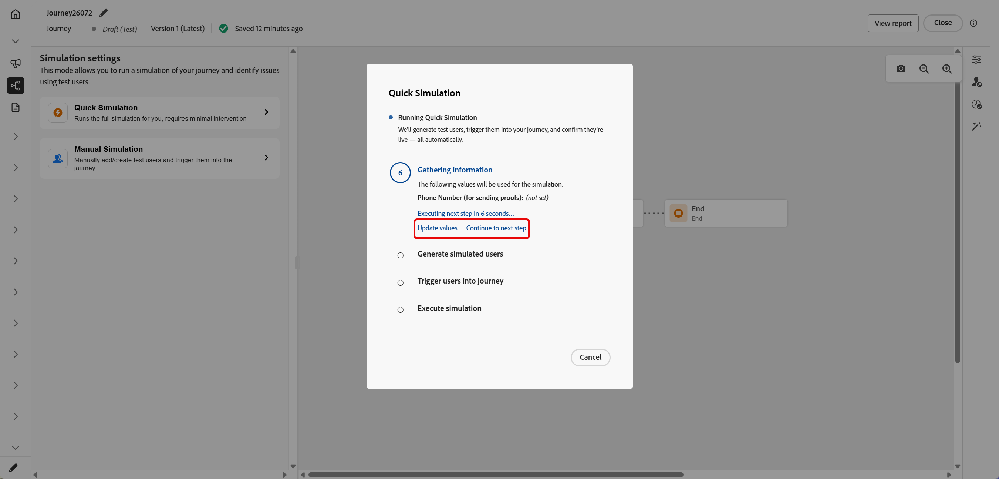
  
1. If you opened **[!UICONTROL Update values]**, edit the settings, for example, the address used for message proofs, then confirm to start the simulation.

    >[!NOTE]
    >
    >Pre-filled execution email and phone fields come from the email address and phone number on your Adobe IMS user profile.

    

1. The Journey Agent generates a set of simulated users from the journey definition.

    For journeys with an Email, SMS, or Push node, the Agent prompts you to confirm the email address, phone number, or push token to use. Simulated users are generated using those values. Once done, click **[!UICONTROL Generate]**.

1. When the run completes, click **[!UICONTROL View results]** to review paths, errors, and uncovered branches. See [View results](#viewing-results).

    

Quick simulation also supports event-triggered journeys and journeys that include event activities. Event values are set and fired automatically for every generated simulated user. Once a user enters the journey, each event is triggered as soon as they reach the corresponding Wait.

### Manual simulation {#manual-simulation}

Choose **[!UICONTROL Manual simulation]** when you need to pick each simulated user, control send order, configure event payloads, and override **[!UICONTROL Wait]** durations for the run.

Continue with [Create and manage simulated users](#test-users), [Trigger your events](#firing-events), and [View results](#viewing-results).

## Create and manage simulated users {#test-users}

Simulated users are temporary profile-like entities you define in **[!UICONTROL Simulation settings]**. This section covers how to create them, save them for reuse, adjust or remove them from the list, and send them into the journey.

1. Start by populating the **[!UICONTROL Test users]** list:

    +++ Generate users with AI
        
    Adobe Journey Optimizer generates a set of simulated users from the journey definition. 
        
    For journeys with an Email, Push or SMS node, the AI prompts you to confirm the email address or phone number to use. Simulated users will be generated using those defined values. Once done, click **[!UICONTROL Generate]**.

    >[!NOTE]
    >
    >The email and phone fields are pre-filled from your Adobe IMS user profile.

    

    +++

    +++ Browse inventory
        
    Choose **[!UICONTROL Browse inventory]** to add simulated users you already saved, for example, users you created from a form or JSON, or users you kept after an AI generation run.
        
    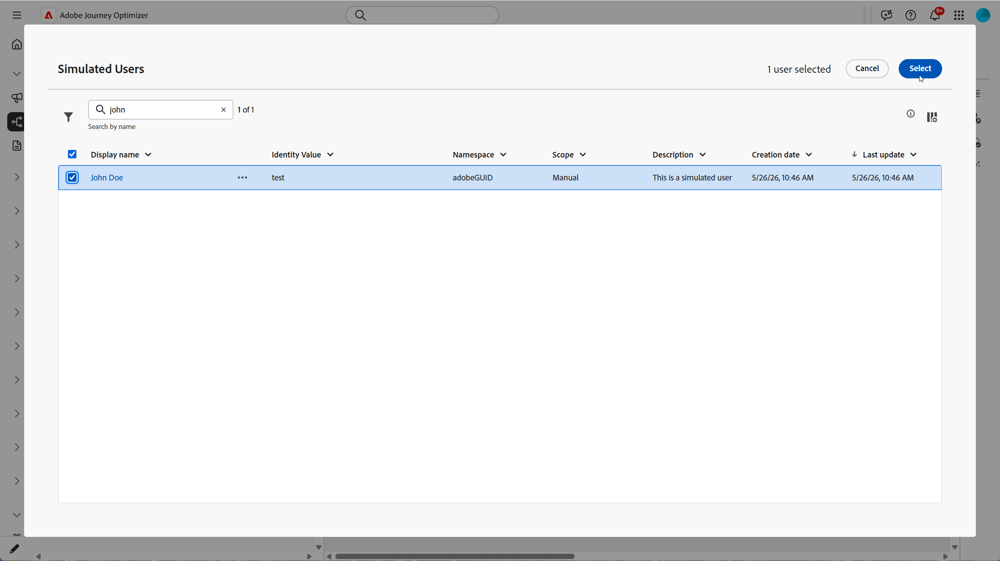

    +++

    +++ Create from form

    1. Enter a **[!UICONTROL Display name]**, **[!UICONTROL Identity namespace]** and **[!UICONTROL Description]** to identify this simulated user. 
            
        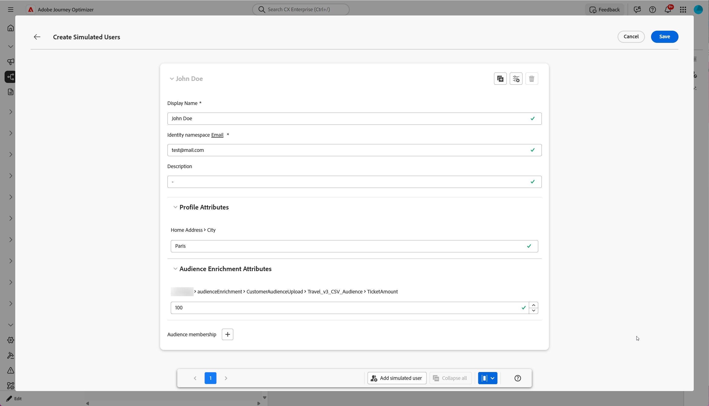

    1. Then, select the attributes from the Union schema that you want to populate for this user.

    1. Click **[!UICONTROL Add audience membership]** to simulate segment memberships.

    1. In the **[!UICONTROL Create Simulated Users]** window, click **[!UICONTROL Add simulated user]** to define several simulated users in one session.

        You can change how users are shown in the list, collapse every card in stacked view, or open a user's attribute metadata.
    
        

    1. From your Simulated user menu, use **[!UICONTROL Duplicate]** to copy a user, **[!UICONTROL Apply all attributes to other users]** to copy one user's attributes to every other user in the session, or **[!UICONTROL Delete]** to remove a user.

        

    1. Click **[!UICONTROL Save]** when you finish configuring users in this session.
        
    +++

    +++ Create from JSON

    In **[!UICONTROL Create Simulated Users]**, edit the JSON template to define users, then click **[!UICONTROL Format JSON]** and **[!UICONTROL Save]**.

    

    To reuse attribute values from a profile or [test profile](../audience/creating-test-profiles.md) in [!DNL Adobe Experience Platform]:

    1. Browse to the profile you want to use as a reference. On the profile detail page, click **[!UICONTROL View JSON]**. [Learn more](../audience/get-started-profiles.md)

        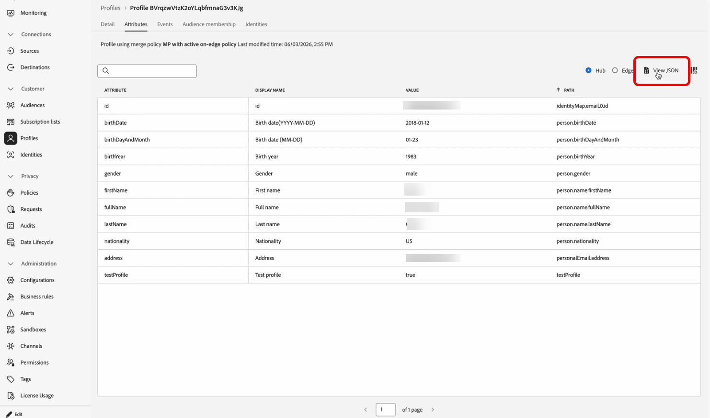

    1. Copy the JSON from the viewer.

    1. In the journey, open **[!UICONTROL Simulation settings]**, start **[!UICONTROL Create Simulated Users]**, and choose **Create from JSON**.

    1. Paste the JSON into the matching part of the simulated user template (for example, the attribute block for one user). Click **[!UICONTROL Format JSON]** to validate the structure.

        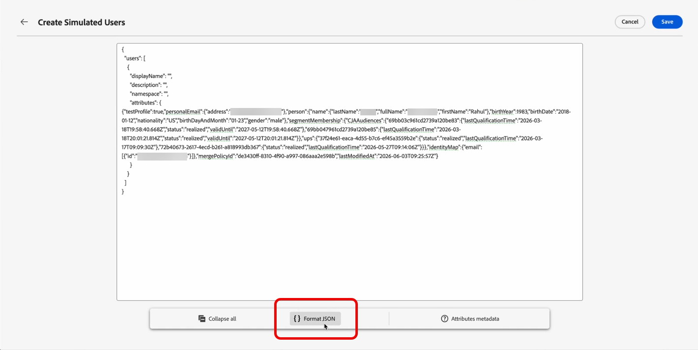

    1. Remove properties that exist on the [!DNL Adobe Experience Platform] profile only tied to the source profile, such as mergePolicyId or lastModifiedAt.

    1. Set the fields required by the simulated user template: **[!UICONTROL Display name]**, **[!UICONTROL Identity namespace]**, identity value, and channel execution addresses.

    1. Click **[!UICONTROL Save]**. Use  on the saved simulated user to review the data before you run **[!UICONTROL Simulation]**.

        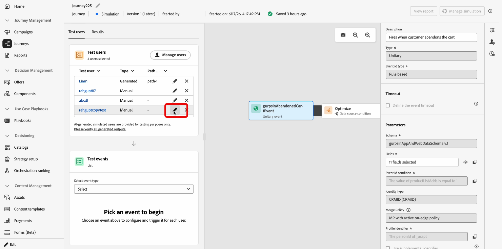

        >[!WARNING]
        >
        >If you paste profile JSON, remove or replace all production identifiers and contact points (email, phone, ECID, push token, and similar). Simulation will send messages using the data you provide.

    +++

1. The simulated users you created appear in the **[!UICONTROL Test users]** list. For each entry, select one of the following:

    * : Update the simulated user's details.
    * : Run the simulation for this simulated user only.
        
        This option is not available for journeys starting with an Event, as the simulated user entrance is triggered by the event being sent. [Learn more](#firing-events)

    * : Remove the user from this list. The simulated user is not deleted and remains available in the Simulated Users selection.

    

1. To change the list after your selection, click **[!UICONTROL Manage users]** to add more simulated users, from the inventory or by creating new ones. To remove every user from the **[!UICONTROL Test users]** list for this run, choose **[!UICONTROL Clear all users]**.

    

1. If your journey includes a **[!UICONTROL Wait]** activity, open the **[!UICONTROL Test settings]** tab to fine-tune how long that wait lasts during the simulation. For example, if the live **[!UICONTROL Wait]** activity is configured for several days, you can override it to 10 seconds so the simulated user only spends that long on the node before moving to the next activity.

1. Click **[!UICONTROL Send all]** to send every simulated user in the list into the journey, or click  on a row to send only that user. A `Simulated users have entered the journey successfully.` confirmation message appears when the simulated users successfully enter the journey.

    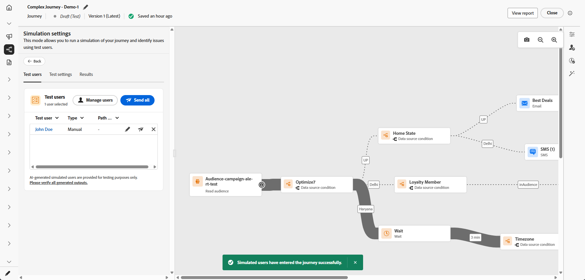

1. If the journey includes unitary events, you need to select the event to trigger. See [Trigger your events](#firing-events).

1. Access the **[!UICONTROL Results]** tab to open the execution log and review how each step ran. For more information, see [View results](#viewing-results).

1. When you finish testing, open the **[!UICONTROL Manage simulation]** menu:

    * **[!UICONTROL Close simulation]** to exit the current simulation session.
    * **[!UICONTROL Reset simulation]** to clear all data from the current run, selected simulated users, defined event values, and other test settings, so you can start a new simulation from scratch.

        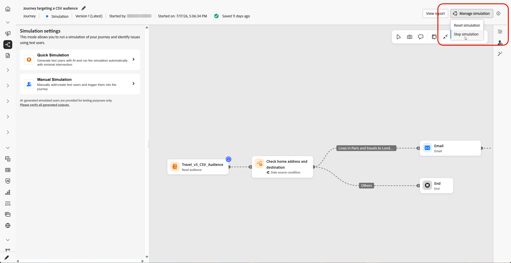

After you validate the journey in **[!UICONTROL Simulation]**, review the **[!UICONTROL Results]** log. If errors appear, leave **[!UICONTROL Simulation]**, apply the required changes to the journey, and run **[!UICONTROL Simulation]** again until the run looks correct. You can then publish the journey. See [Publish your journey](../building-journeys/publish-journey.md).

## Trigger your events {#firing-events}

If your journey includes one or more unitary events, you can trigger them while Simulation is active. For journeys not starting from an Event but containing one, this section will not be visible until a simulated user enters the journey.

1. In **[!UICONTROL Select event type]**, select the event to fire for this simulation.

    

1. To apply the same change to every user in the list, use the **[!UICONTROL Manage events]** option to:

    * **[!UICONTROL Generate event values]** to let the Journey Agent generate all payloads using AI. When values are generated, the user is marked **[!UICONTROL Ready to send]**.
    * **[!UICONTROL Edit event data]** to change the payload for every simulated user in the list.

    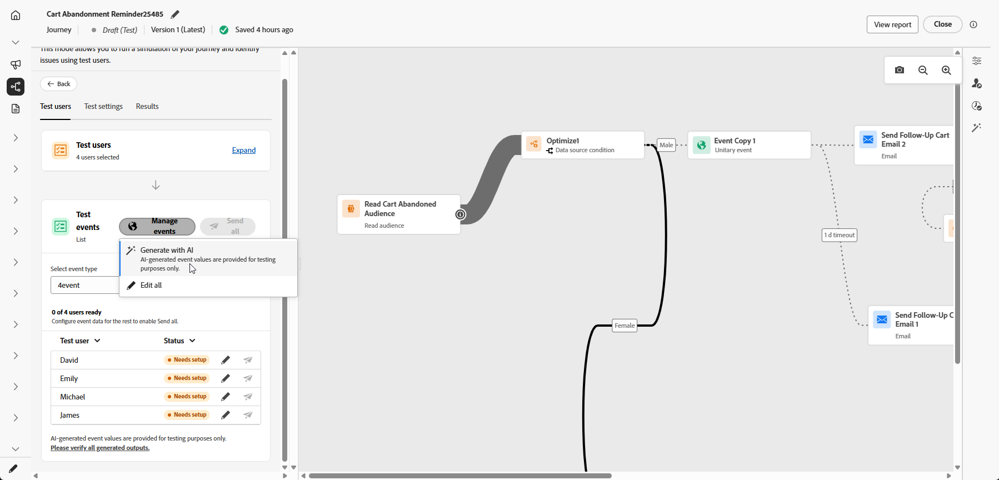

1. Configure the event payload for each user by clicking the  beside a user to:

    * **[!UICONTROL Generate event values]** to let the Journey Agent generate the payload using AI. When values are generated, the user is marked **[!UICONTROL Ready to send]**.
    * **[!UICONTROL Edit event data]** to change the payload for that simulated user only.

    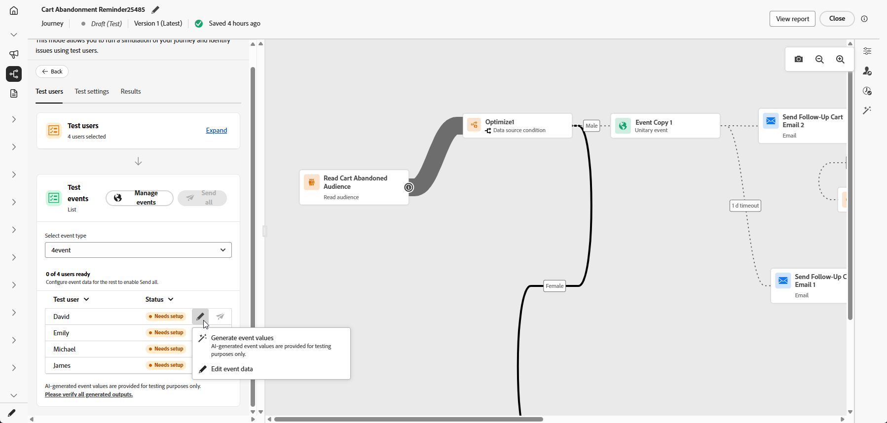

1. In **[!UICONTROL Test events]**, either select **[!UICONTROL Send all]** to send this event for all simulated users listed under **[!UICONTROL Test users]**, or select  for a single event to be triggered for that user only.

    

1. After events are fired, the canvas updates to reflect each user's progression.

1. Access the **[!UICONTROL Results]** tab to open the execution log and review how each step ran. For more information, see [View results](#viewing-results).

1. When you finish testing, open the **[!UICONTROL Manage simulation]** menu:

    * **[!UICONTROL Close simulation]** to exit the current simulation session.
    * **[!UICONTROL Reset simulation]** to clear all data from the current run, selected simulated users, defined event values, and other test settings, so you can start a new simulation from scratch.

        

## View results {#viewing-results}

The **[!UICONTROL Results]** tab allows you to view the test results. In the **[!UICONTROL Test user]** drop-down, select the simulated user whose execution you want to inspect. When you select a single simulated user, the canvas highlights the exact path that user followed through the journey, so you can confirm they entered the branch you expected.

Select **[!UICONTROL All]** to see results aggregated across every simulated user in the run. The canvas then shows every path covered by the run, which helps you compare coverage across profiles and scan the full simulation at a glance, including activities, outcomes, and errors, without picking a single simulated user first.

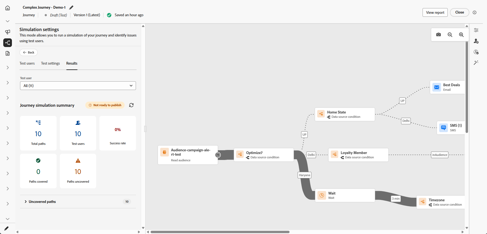

For each activity, the log can show whether the simulated user entered or exited the step, the timestamps and branch decisions for each step, and errors that occurred during the simulation.

For **Wait** activities, the log includes two duration-related values:

* **Defined duration**: The duration specified on the **Wait** activity for the published journey and applied once the journey is live. The log records whether Simulation applies an override from the test settings, for example 10 seconds, rather than relying solely on the value defined on the journey.
* **Actual duration**: The elapsed time the simulated user remained on the **Wait** activity. This value is set from the **[!UICONTROL Test settings]** tab.

When errors appear in the log, leave **Simulation**, apply the required changes to the journey, and run **Simulation** again. After validation succeeds, publish the journey. See [Publish your journey](../building-journeys/publish-journey.md).

+++ AI Knowledge Reference

This section contains structured knowledge intended to support interpretation, retrieval, and question answering related to this topic.

For complete understanding, this information should be combined with the documentation on this page. Neither source is intended to stand alone; the page describes the feature, while this section provides additional context that helps disambiguate terminology, intent, applicability, and constraints.

* **TL;DR:** This page provides step-by-step instructions for running Quick simulation and Manual simulation in Adobe Journey Optimizer, including how to create and manage simulated users, trigger unitary events, override Wait durations, and interpret the Results log.

**Intents:**
* Run a Quick simulation to validate a journey end-to-end with minimal manual input
* Set up Manual simulation to control simulated user creation, event payloads, and wait overrides
* Create simulated users via AI generation, inventory browse, form entry, or JSON
* Trigger unitary events for simulated users during an active simulation session
* Review the Results log to identify errors and uncovered branches after a simulation run
* Reset or close a simulation session to start fresh or exit

**Glossary:**
* **Quick simulation**: An automated simulation mode that generates users and event values using the Journey Agent and runs the full journey with minimal manual steps *(product-specific)*
* **Manual simulation**: A step-by-step simulation mode where practitioners control user creation, event payloads, and timing individually *(product-specific)*
* **Simulated users**: Temporary profile-like entities used in Simulation that do not persist in Adobe Experience Platform *(product-specific)*
* **Journey Agent**: The AI component that generates simulated users and event payloads during AI-assisted simulation *(product-specific)*
* **Test settings**: The Simulation panel tab where Wait durations and execution addresses (email, phone, push token) can be overridden for the simulation run *(product-specific)*
* **Results log**: The execution log accessible from the Results tab showing per-activity outcomes, durations, and errors for each simulated user *(product-specific)*

**Guardrails:**
* Requires at least one of: Simulate journeys, Publish journeys, or Approve and Publish journeys permissions
* AI features (Quick simulation, Generate with AI, Generate event values) require the Generate Content permission from the AI Assistant capability
* For event-triggered journeys, the per-user Send icon is not available; entry is triggered through the Test events section
* Wait duration overrides and execution address settings are only shown if the journey includes Wait or Channel activities
* Errors in the Results log require leaving Simulation, fixing the journey, and re-running before publishing

**Terminology:**
* Canonical name: Quick simulation — Acronym: none — variants: none
* Canonical name: Manual simulation — Acronym: none — variants: none
* Canonical name: Simulated users — Acronym: none — variants: test users (UI label in Test users list)
* Synonyms: "Send all" = trigger all listed simulated users into the journey simultaneously
* Do not confuse: "Reset simulation" ≠ "Close simulation" — Reset clears all data and settings; Close merely exits the current session

**FAQ:**
* **Q: What is the difference between Quick simulation and Manual simulation?** — Quick simulation runs the entire journey automatically using AI-generated users and events; Manual simulation lets you create users and events step by step with full control over payloads and timing.
* **Q: Can I reuse simulated users across simulation sessions?** — Yes. Users saved to the inventory can be retrieved via Browse inventory in subsequent sessions.
* **Q: How do I override Wait activity durations during simulation?** — Open the Test settings tab and set a shorter duration, for example 10 seconds, so simulated users move through Wait nodes quickly.
* **Q: How do I trigger a unitary event for a specific simulated user?** — In the Test events section, click the edit icon next to the user to configure the event payload, then click the send icon on that row to trigger only that user's event.
* **Q: What do the Defined duration and Actual duration fields mean in the Results log for Wait activities?** — Defined duration is the live journey's configured wait time; Actual duration is the overridden test duration the simulated user actually spent on the Wait node.
* **Q: What should I do when errors appear in the Results log?** — Leave Simulation, apply the required fixes to the journey, then re-run Simulation until the run shows no errors before publishing.

+++
