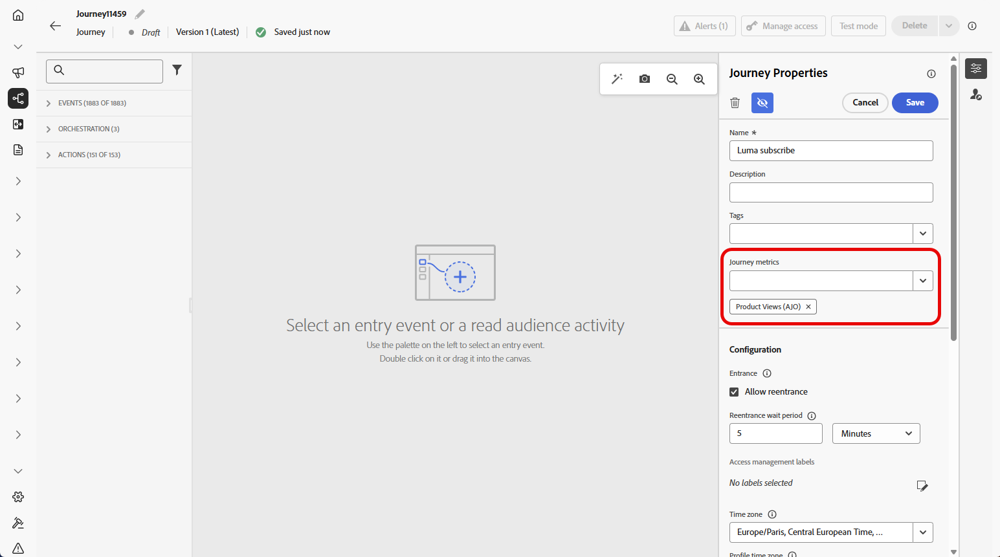
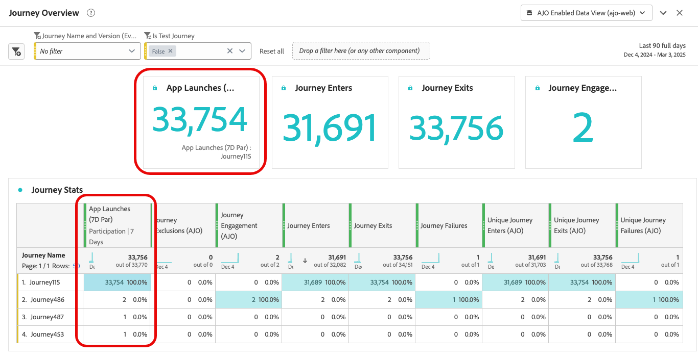

# Configure and track your journey metrics {#success-metrics}

>[!BEGINSHADEBOX]

**On this page:** Learn how to configure and assign journey metrics to track performance against your KPIs and measure the effectiveness of your customer journeys in real time.

>[!ENDSHADEBOX]

Gain clear visibility into the effectiveness of your customer journeys with journey metrics. This feature enables you to track performance against defined KPIs, uncover insights into what's working, and identify areas for optimization. By measuring impact in real time, you can drive continuous improvement and make data-informed decisions that elevate customer engagement.

## Prerequisites {#prerequisites}

Before using your journey metrics, you must add a dataset which includes the `Commerce Details`, `Web`, and `Mobile` [field groups](https://experienceleague.adobe.com/docs/experience-platform/xdm/tutorials/create-schema-ui.html#field-group){target="_blank"} under Configuration > Reporting in [!DNL Adobe Experience Platform].

These field groups must be selected from the built-in options, not from custom groups. Refer to the [Add datasets](../reports/reporting-configuration.md#add-datasets) section.

## Available metrics {#metrics}

The list of metrics varies depending on the [field groups](https://experienceleague.adobe.com/docs/experience-platform/xdm/tutorials/create-schema-ui.html#field-group){target="_blank"} included to your dataset. 

If your dataset is not configured, only the following metrics will be available: **[!UICONTROL Click]**, **[!UICONTROL Unique Click]**, **[!UICONTROL Clickthrough Rate]** and **[!UICONTROL Open Rate]**.

Note that with a Customer Journey Analytics license allows you to create custom success metrics. [Learn more](https://experienceleague.adobe.com/en/docs/analytics-platform/using/cja-components/cja-calcmetrics/cm-workflow/participation-metric)

|Metrics| Related field group |
|-|-|
|Clicks|No field group required|
|Unique clicks|No field group required|
|Clickthrough rate (CTR)|No field group required|
|Clickthrough open rate (CTOR)|No field group required|
|Page Views|Web field group|
|App Launches|Mobile field group|
|First App Launches|Mobile field group|
|App Installs|Mobile field group|
|App Upgrades|Mobile field group|
|Purchases|Commerce Details field group|
|Checkouts|Commerce Details field group|
|Cart Adds|Commerce Details field group|
|Cart Opens|Commerce Details field group|
|Cart Views|Commerce Details field group|
|Cart Removes|Commerce Details field group|
|Product Views|Commerce Details field group|
|Save For Laters|Commerce Details field group|

## Attribution {#attribution}

Each metric comes with a set attribution which determines which touchpoints or interactions contributed to a specific outcome.

* **Metrics attribution with Journey Optimizer license**:

    With Journey Optimizer license only, the maximum available lookback window for any selected metric is set to 7 days. For these metrics, the attribution model is set by default to **Last Touch**, i.e. the most recent interaction before conversion.

    For example, you can track whether a purchase was made after a customer interacted with your journey within the last 7 days.

* **Metrics attribution with Customer Journey Analytics license**:

    With both Journey Optimizer and Customer Journey Analytics licenses, you can create custom metrics with specific attribution settings or change the built-in metrics' attributions.
     
    Learn more about [Attribution models](https://experienceleague.adobe.com/en/docs/analytics-platform/using/cja-dataviews/component-settings/attribution#attribution-models)

## Assign your journey metrics {#assign}

>[!IMPORTANT]
>
>Only one journey metric is allowed per journey.

To begin tracking your journey metrics, follow the steps outlined below:

1. From your **[!UICONTROL Journeys]** menu, click **[!UICONTROL Create Journey]**.

1. Edit the journey's configuration pane to define the name of the journey and set its properties. Learn how to set your journey's properties on [this page](../building-journeys/journey-properties.md).

1. Choose your **[!UICONTROL Journey metrics]** which will be used to measure the effectiveness of your journey.

    Note that the metrics apply to the journey itself and are applicable across all elements of the journey.

    

1. Click **[!UICONTROL Save]**.

1. Design your journey with the necessary **[!UICONTROL Activities]**.

1. Test and publish your journey. 

1. Open your journey report to track the performance of your assigned success metrics.

    Your chosen metrics are displayed in the report's KPIs and Journey Stats table.

    

{{$include /help/_includes/do-not-localize/building-journeys/ai-augmented-success-metrics.md}}
