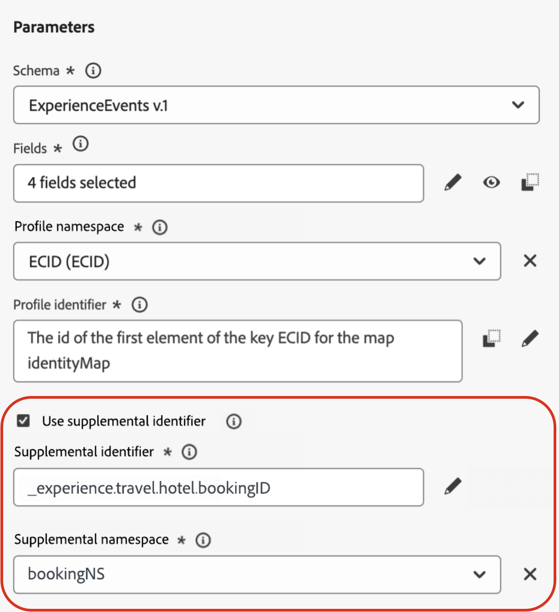
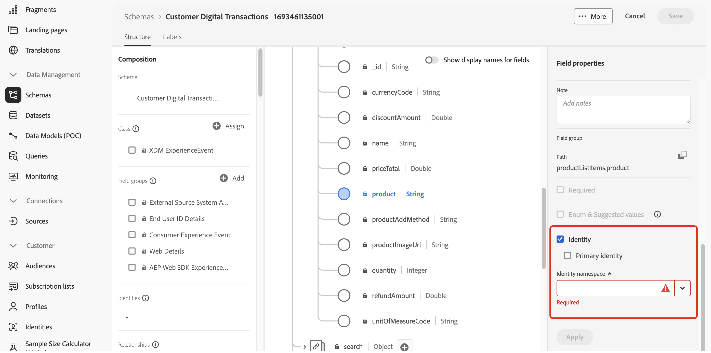
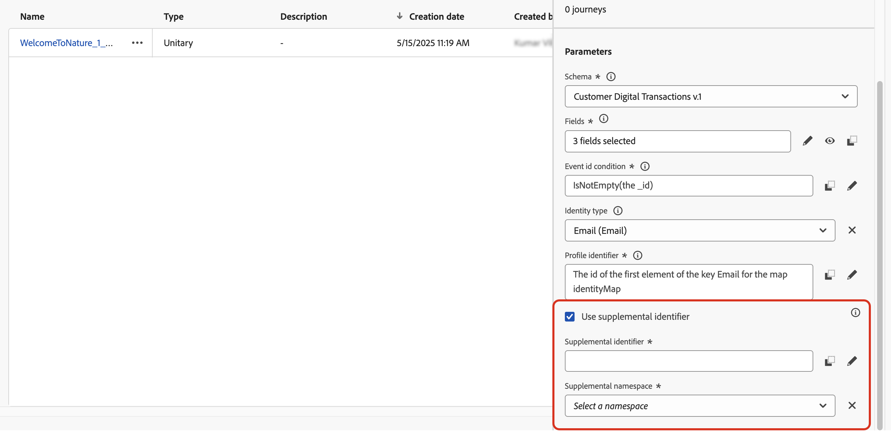
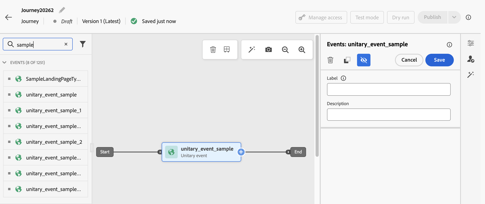
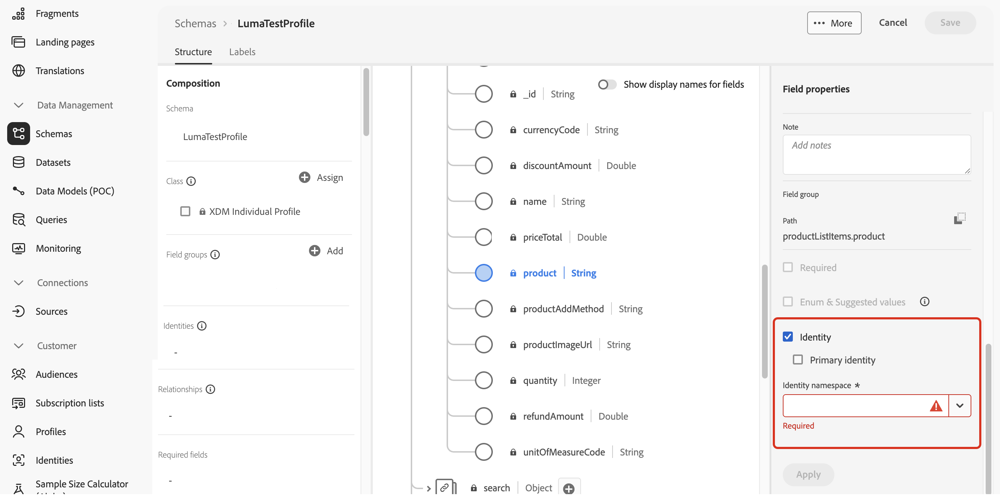
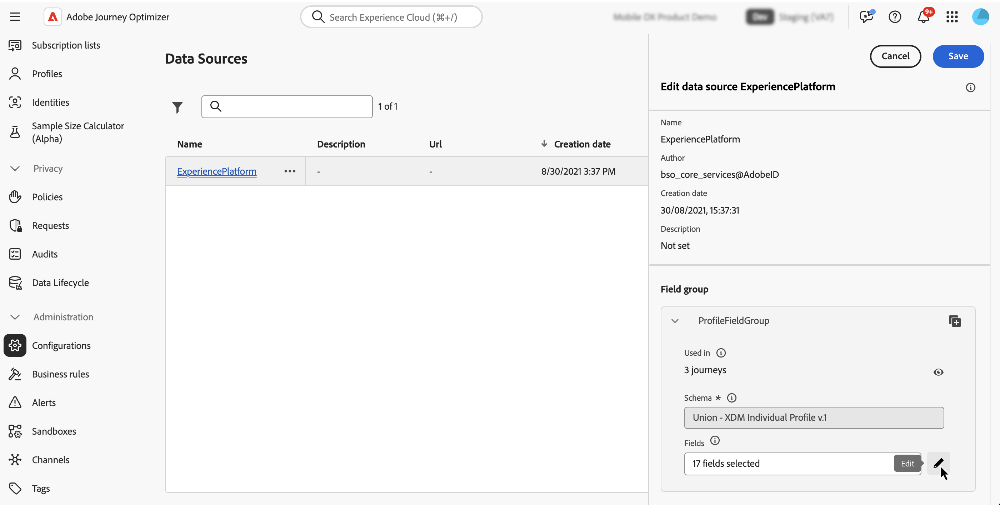
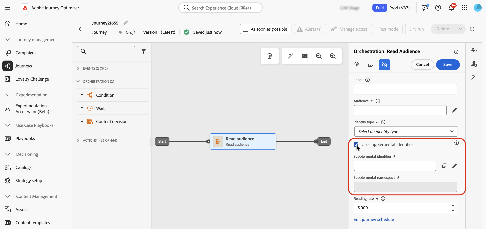
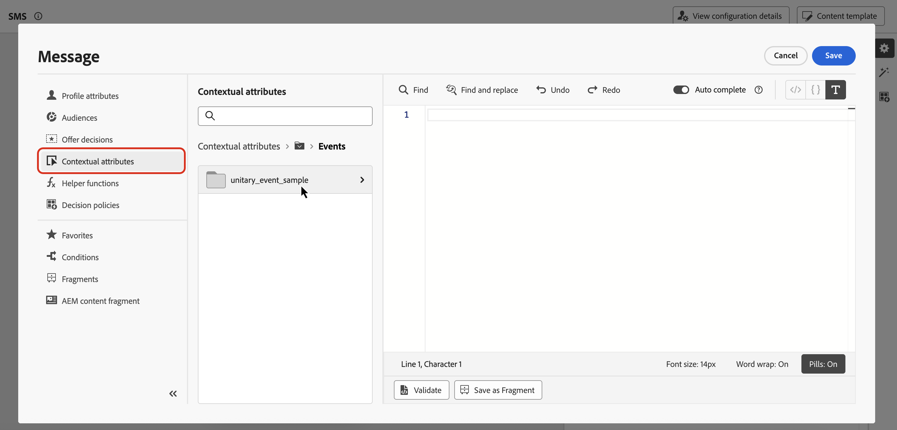

# Use supplemental identifiers in journeys {#supplemental-id}

>[!CONTEXTUALHELP]
>id="ajo_journey_parameters_supplemental_identifier"
>title="Use supplemental identifier"
>abstract="The supplemental identifier is a secondary identifier that provides additional context for the execution of a journey. To define it, select the field to be used as the supplemental identifier and choose a namespace to associate with it."

By default, journeys are executed in the context of a **profile ID**. This means that, as long as the profile is active in a given journey, it won't be able to re-enter another journey. To prevent this, [!DNL Journey Optimizer] allows you to capture a **supplemental identifier**, such as an order ID, subscription ID, prescription ID, in addition to the profile ID. 
In this example, we have added a booking ID as a supplemental identifier. 

{width=40% zoomable}

By doing so, journeys are executed in the context of the profile ID associated to the supplemental identifier (here, the booking ID). One instance of the journey is executed for each iteration of the supplemental identifier. This allows multiple entrances of the same profile ID in journeys if they have made different bookings. 

In addition, Journey Optimizer allows you to leverage attributes of the supplemental identifier (e.g., booking number, prescription renewal date, product type) for message customization, ensuring highly relevant communications. <!--Example: A healthcare provider can send renewal reminders for each prescription in a patient's profile.-->

➡️ [Discover this feature in video](#video)

## Guardrails & limitations {#guardrails}

* **Supported journeys**: For now, the use of supplemental identifiers is available for **event-triggered** and **Read audience** journeys. It is not available for Audience qualification journeys.

* **Concurrent instance limits**: Profiles cannot have more than 10 concurrent journey instances.

<!--* **Array depth**: Supplemental identifier objects can have a maximum depth of 3 levels (2 levels of nesting).

    +++Example

    ```
    [
    (level 1) "Atorvastatin" : {
    "description" : "used to lower cholesterol",
    "renewal_date" : "11/20/25",
    "dosage" : "10mg"
    (level 2) "ingredients" : [
    (level 3) "Atorvastatin calcium",
    "lactose monohydrate",
    "microcrystalline cellulose",
    "other" ]
    }
    ]
    ```

    +++
-->
* **Exit Criteria**: Exit criteria, if triggered, would exit all instances of the profile live in the journey at that moment. It would not be contextual to the profile ID + supplemental identifier combination.

* **Frequency rules**: Each journey instance created from supplemental identifier usage counts towards frequency capping, even if the use of supplement identifiers results in multiple journey instances.

* **Data type and schema structure**: The supplemental identifier must be of type `string`. It can be an independent string attribute or it can be a string attribute within an array of objects. The independent string attribute will result in a single journey instance, whereas the string attribute within an array of objects will result in a unique journey instance per iteration of the object array. String arrays and maps are not supported.

* **Journey reentrance**

  Journey reentrance behavior with supplemental identifiers follows the existing reentrance policy:

  * If the journey is non-reentrant, the same profile ID + supplemental ID combination cannot reenter the journey.
  * If the journey is reentrant with a time window, the same profile ID + supplemental ID combination can reenter after the defined time window.

* **Data Use Labelling and Enforcement (DULE)** - No DULE validation checks are performed on the supplemental ID. This means that this attribute will not be considered when the journey is looking for data governance policy violations.

* **Downstream events configuration**

  If you are using another event downstream in the journey, it must use the same supplemental ID and have the same ID namespace.

* **Read audience journeys**

  * Supplemental ID is disabled if you use a business event.

  * Supplemental ID must be a field from the profile (i.e., not an event/context field).

## Add a supplemental identifier and leverage it in a journey {#add}

>[!BEGINTABS]

>[!TAB Event-triggered journey]

To use a supplemental identifier in an event-triggered journey, follow these steps:

1. **Mark the attribute as an identifier in the event schema**

    1. Access the event schema and locate the attribute you want to use as a supplemental identifier (e.g., booking ID, subscription ID) and mark it as an ID. [Learn how to work with schemas](../data/get-started-schemas.md)

    1. Mark the identifier as an **[!UICONTROL Identity]**.

        

        >[!IMPORTANT]
        >
        >Make sure you do not mark the attribute as **Primary identity**.

    1. Select the namespace to associate with the supplemental ID. This must be a non-person identifier namespace.

1. **Add the supplemental ID to the event**

    1. Create or edit the desired event. [Learn how to configure a unitary event](../event/about-creating.md)

    1. In the event configuration screen, check the **[!UICONTROL Use supplemental identifier]** option.

        

    1. Use the expression editor to select the attribute you marked as the supplemental ID.

        >[!NOTE]
        >
        >Make sure you are using the expression editor in **[!UICONTROL Advanced mode]** to select the attribute.

    1. After selecting the supplemental ID, the associated namespace is displayed in the event configuration screen as read-only.

1. **Add the event to the journey**

    Drag the configured event onto the journey canvas. It will trigger journey entry based on both the profile ID and the supplemental ID.

      

>[!TAB Read audience journey]

To use a supplemental identifier in a Read audience journey, follow these steps:

1. **Mark the attribute as an identifier in the union/profile schema**

    1. Access the union/profile schema and locate the attribute you want to use as a supplemental identifier (e.g., booking ID, subscription ID) and mark it as an ID. [Learn how to work with schemas](../data/get-started-schemas.md)

    1. Mark the identifier as an **[!UICONTROL Identity]**.

        

        >[!IMPORTANT]
        >
        >Make sure you do not mark the attribute as **Primary identity**.

    1. Select the namespace to associate with the supplemental ID. This must be a non-person identifier namespace.

        >[!NOTE]
        >
        >After applying the non-person identity namespace to a schema, you must create a new event (for event-triggered journeys) or a new field group (for Read audience journeys) in order to use the supplemental identifier. Existing entities cannot be refreshed to recognize the new identifier.

<!--1. **Add the supplemental ID field to the data source**

    1. Navigate to the **[!UICONTROL Configuration]** / **[!UICONTROL Data Sources]** menu, then locate the "ExperiencePlatformDataSource" data source.

        

    1. Open the field selector then select the attribute you want to use as a supplemental identifier (e.g., booking ID, subscription ID).-->

1. **Add and configure a Read audience activity in the journey**

    1. Drag a **[!UICONTROL Read audience]** activity in your journey.

    1. In the activity properties pane, toggle on the **[!UICONTROL Use supplemental identifier]** option.

        

    1. In the **[!UICONTROL Supplement identifier]** field, use the expression editor to select the attribute you marked as the supplemental ID.

        >[!NOTE]
        >
        >Make sure you are using the expression editor in **[!UICONTROL Advanced mode]** to select the attribute.
  
    1. After selecting the supplemental ID, the associated namespace is displayed in the **[!UICONTROL Supplemental namespace]** field as read-only.

>[!ENDTABS]

## Leverage supplemental ID attributes

Use the expression editor and personalization editor to reference attributes of the supplemental identifier for personalization or conditional logic. Attributes are accessible from the **[!UICONTROL Contextual attributes]** menu.



For event-triggered journeys if you are working with arrays (e.g., multiple prescriptions or policies), use a formula to extract specific elements.

+++ See examples

In an object array with the supplemental ID as `bookingNum` and an attribute at the same level called `bookingCountry`, the journey will iterate through the array object based on the bookingNum and create a journey instance for each object.
    
* The following expression in the condition activity will iterate through the object array and check whether the value of `bookingCountry` is equal to "FR":

  ```
  @event{<event_name>.<object_path>.<object_array_name>.all(currentEventField.<attribute_path>.bookingNum==${supplementalId}).at(0).<attribute_path>.bookingCountry}=="FR"
  ```

* The following expression in the email personalization editor will iterate through the object array, pull out the `bookingCountry` applicable to the current journey instance, and display it in the content:

  ```
  {{#each context.journey.events.<event_ID>.<object_path>.<object_array_name> as |l|}} 

   {{l.<attribute_path>.bookingCountry}}  

  {{/each}}
  ```
      
* Example of the event used to trigger the journey:

  ```
  "bookingList": [
        {
            "bookingInfo": {
                "bookingNum": "x1",
                      "bookingCountry": "US"
            }
        },
        {
            "bookingInfo": {
                "bookingNum": "x2",
                "bookingCountry": "FR"
            }
        }
    ]
  ```

+++

## Example use cases

### **Policy Renewal Notifications**

* **Scenario**: An insurance provider sends renewal reminders for each active policy held by a customer.
* **Execution**:
  * Profile: "John".
  * Supplemental IDs: `"AutoPolicy123", "HomePolicy456"`.
  * Journey executes separately for each policy, with personalized renewal dates, coverage details, and premium information.

### **Subscription Management**

* **Scenario**: A subscription service sends tailored messages for each subscription when an event is triggered for that subscription.
* **Execution**:
  * Profile: "Jane".
  * Supplemental IDs: `"Luma Yoga Program ", "Luma Fitness Program"`.
  * Each event includes a subscription ID and details about that subscription. Journey executes separately for each event/subscription, allowing personalized renewal offers per subscription.

### **Product Recommendations**

* **Scenario**: An e-commerce platform sends recommendations based on specific products purchased by a customer.
* **Execution**:
  * Profile: "Alex".
  * Supplemental IDs: `"productID1234", "productID5678"`.
  * Journey executes separately for each product, with personalized upsell opportunities.

## How-to video {#video}

Learn how to enable and apply a supplemental identifier in [!DNL Adobe Journey Optimizer]. 

>[!VIDEO](https://video.tv.adobe.com/v/3464792?quality=12)
