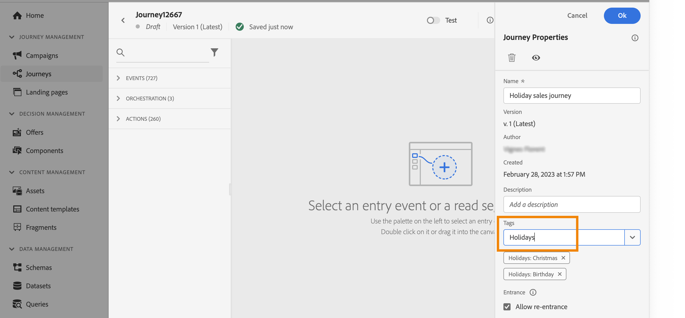
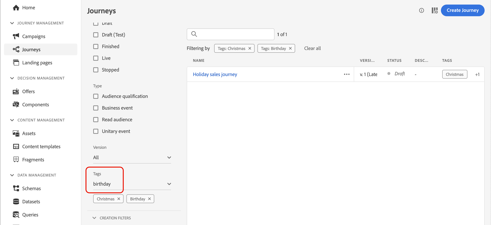
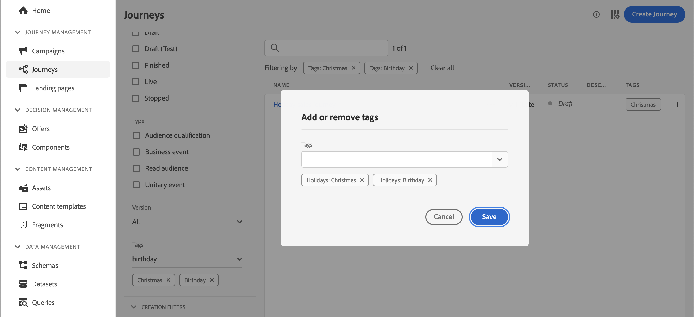

# Manage tags in journeys {#journey_tags}

As a Journey Optimizer practitioner, you can organize your journeys using tags. Tags are a quick and easy way of classifying objects to improve search.

## Tags vs. naming conventions {#tags-vs-naming}

Teams often rely on complex naming conventions to store metadata directly in journey names — for example: *Lifecycle Marketing – Education – Customer Onboarding V2 – App Education – Q3 2025*. While well-intentioned, this approach has a key weakness: as work scales across team members, the convention is rarely applied consistently, and journey lists become hard to navigate.

**Tag categories** in Journey Optimizer offer a better alternative. Instead of encoding metadata in the name, you attach categorized tags to each journey (e.g. team, objective, phase, quarter) and use filters to locate them. Journey names can then focus on what actually matters: the customer milestone being driven.

Benefits of tag categories over naming conventions:

* **Consistency** — tags are selected from a controlled list, not typed freely.
* **Filterability** — any combination of tag values can be used to slice the journey list instantly.
* **Clarity** — journey names stay short and milestone-focused.
* **Scalability** — adding a new metadata dimension means creating a new tag category, not rewriting a naming convention.

For a recommended setup workflow, see [Set up tag categories for journey management](#tags-setup) below.

## Add tags to a journey

The **Tags** field, in the journey properties, allows you to define tags for your journey. You can either select an existing tag, or create a new one. Start typing the name of the desired tag and select it from the list. If it is not available, click **Create** to create a new one and add it to your journey. You can define as many tags as needed.

The list of tags defined is displayed below the **Tags** field. 

>[!NOTE]
>
> Tags are case in-sensitive
> 
> If you duplicate or create a new version of a journey, tags are preserved.

## Filter on tags

The Journey list displays a dedicated column so you can easily visualize your tags. 

A filter is also available to only display journeys with certain tags.

You can add or remove tags from any type of journey (live, draft, etc). Click the **More actions** icon next to the journey, and select **Edit tags**. 

## Manage tags

Administrators can delete tags and organize them by categories using the **Tags** menu, under **ADMINISTRATION**. Refer to this [documentation](https://experienceleague.adobe.com/docs/experience-platform/administrative-tags/overview.html). 

>[!NOTE]
>
> Tags defined in journeys are added to the built-in "Uncategorized" category.

## Set up tag categories for journey management {#tags-setup}

Follow these steps to replace a complex naming convention with a tag-based approach across your team.

**Step 1 — Create tag categories (Admin)**

In **[!UICONTROL Administration]** > **[!UICONTROL Tags]**, create one category for each metadata attribute your team currently encodes in journey names — for example: *Team*, *Marketing objective*, *Campaign*, *Phase*, *Quarter*.

**Step 2 — Populate each category with tag values (Admin)**

Within each category, create the tags that represent all possible values. For example, the *Phase* category might contain: *Awareness*, *Onboarding*, *Retention*, *Win-back*.

**Step 3 — Apply tags when creating journeys (Practitioners)**

Each time a new journey is created, select the appropriate tag from each category in the journey properties. A journey will typically carry one tag per category.

**Step 4 — Name journeys for the milestone, filter by tags**

Keep the journey name focused on the customer milestone it drives (e.g. *First loyalty transaction*). Use tag filters in the journey list to locate journeys by any combination of metadata — without relying on name parsing.

>[!TIP]
>
>For a broader discussion of this approach and its benefits at scale, see [Best practices for advanced journeys in Journey Optimizer](https://experienceleague.adobe.com/en/perspectives/best-practices-for-advanced-journeys-in-journey-optimizer){target="_blank"}.
