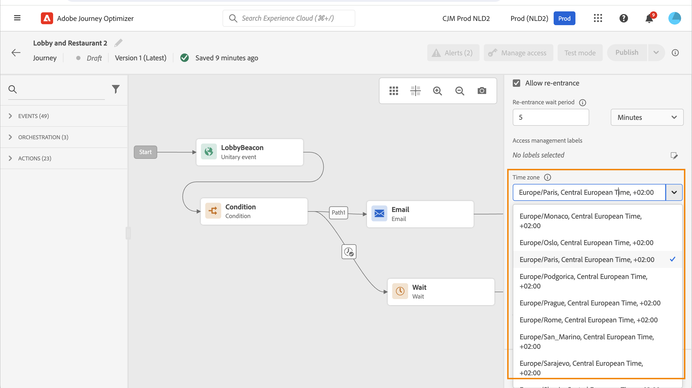
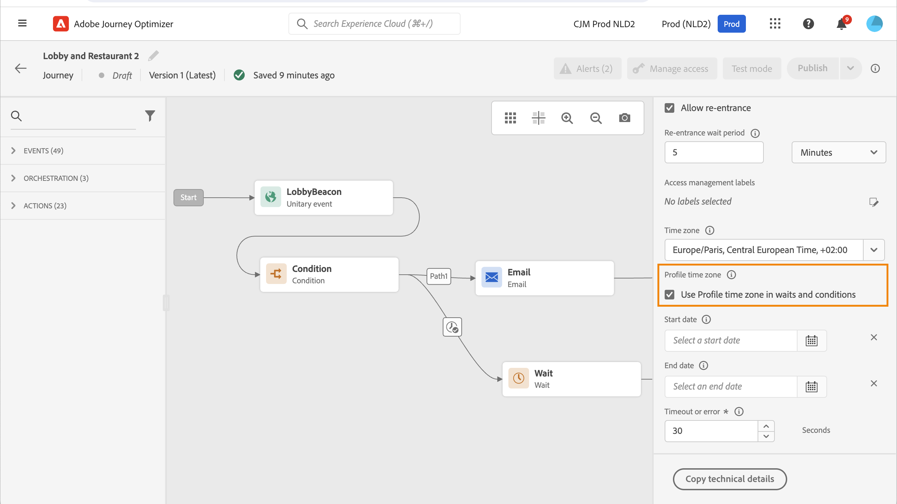

# Time zone management {#timezone_management}

>[!CONTEXTUALHELP]
>id="ajo_journey_properties_time_zone"
>title="Journey time zone"
>abstract="Select the journey's time zone. When using a fixed time zone, it is the same for all individuals entering the journey."

You can define a time zone in the [properties](../building-journeys/journey-properties.md#timezone) of your journey.

To access journey properties, select the pencil icon in the top-right of the screen.

This time zone will be used for every activity of the journey containing a time element such as:

* [Time condition](../building-journeys/conditions.md#time_condition)
* [Date condition](../building-journeys/conditions.md#date_condition)
* [Custom wait](../building-journeys/wait-activity.md#custom)

<!--
* [Fixed date wait](../building-journeys/wait-activity.md#fixed_date)
-->

You can select a [fixed time zone](#fixed-timezone) or choose to use the time zone [defined in the user profile](#timezone-from-profiles).

## Define a fixed time zone {#fixed-timezone}

The time zone can be fixed. Clear the pre-defined time zone and pick one from the drop-down list. If you use a fixed time zone, it will be the same for all individuals entering the journey.

To do so, in the **[!UICONTROL Journey Properties]** pane, select a time zone. 

## Use profile time zone {#timezone-from-profiles}

>[!CONTEXTUALHELP]
>id="ajo_journey_properties_profile_time_zone"
>title="Use profile time zone"
>abstract="Check this option to use the real-time profile time zone in **Wait** and **Condition** activities. If a time zone has been defined for a profile, it is retrieved and used in the journey. If not, the time zone is the one defined in the time zone field above."

If the entry event of the journey has a namespace, meaning that the journey can reach the Real-time Customer Profile service of [!DNL Adobe Experience Platform], you may want to use the time zone defined at the profile level. To do so, in **Properties**, check **Use Profile time zone in waits and conditions**. This option is not checked by default.

If a time zone has been defined for a profile, it is retrieved and used by the journey. If it hasn't, the time zone used is the one defined in the time zone field.

>[!NOTE]
>
>The profile time zone works with the **timeZone** field existing in the **Preference Details** field group.

## Use time zones in expressions {#timezone-in-expressions}

The start and end dates of a journey cannot be linked to a specific time zone. They are automatically associated to the instance's time zone.
