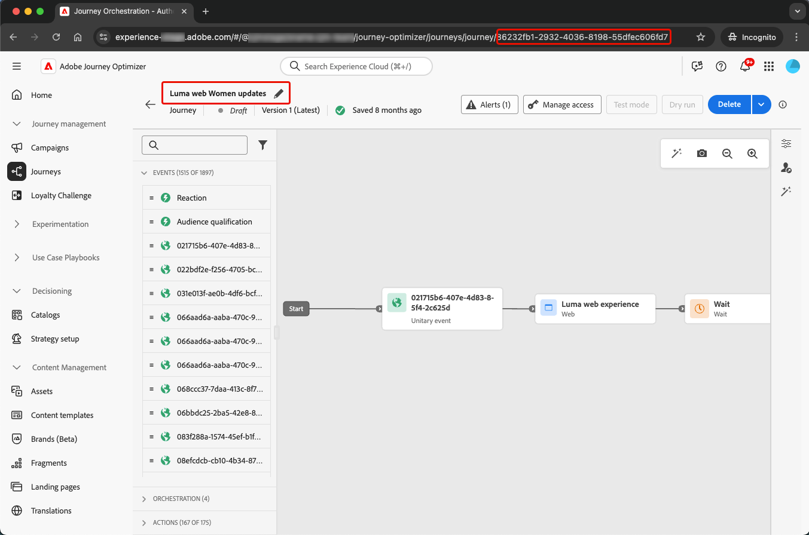
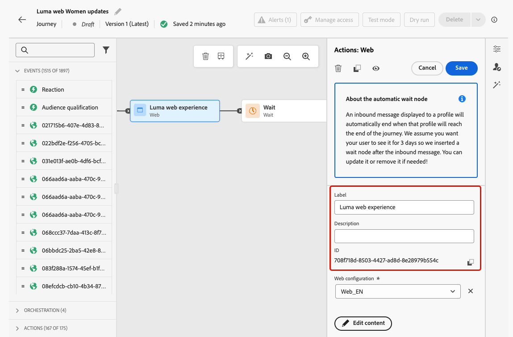
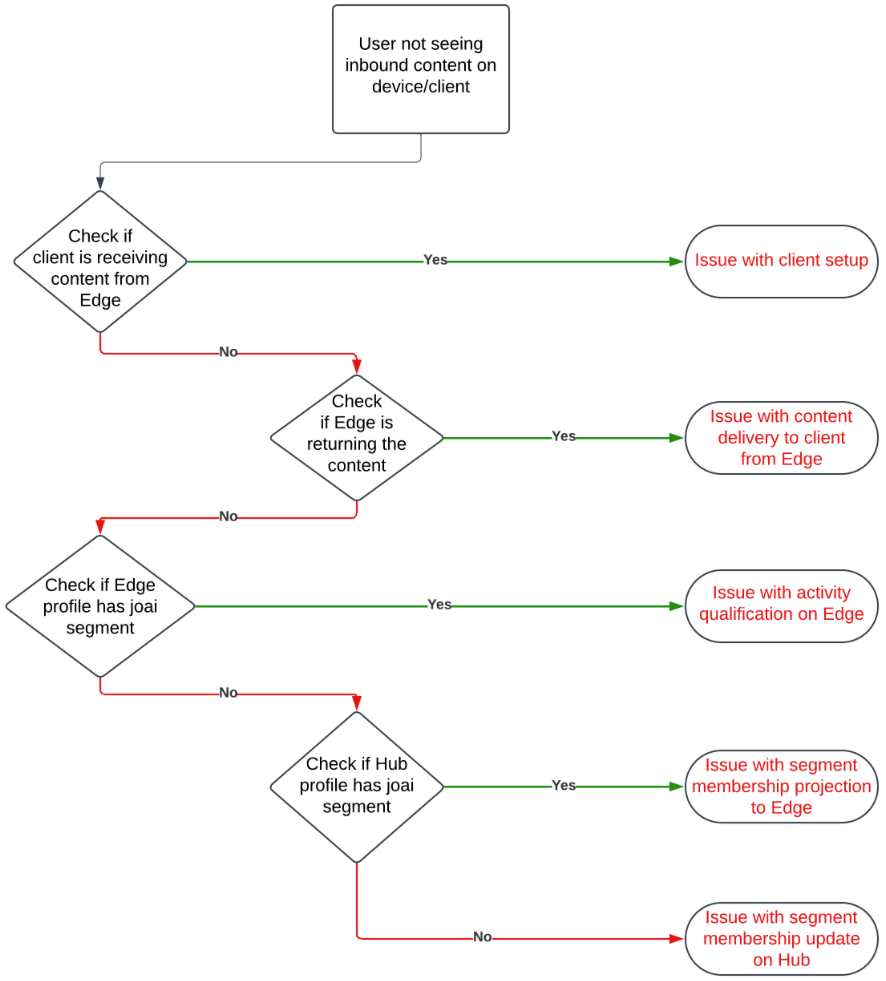
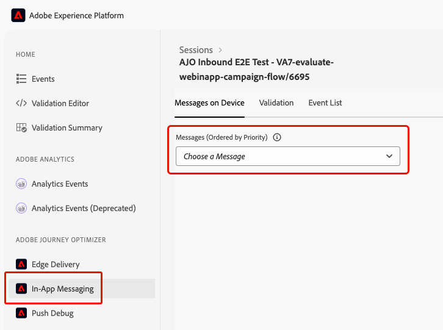
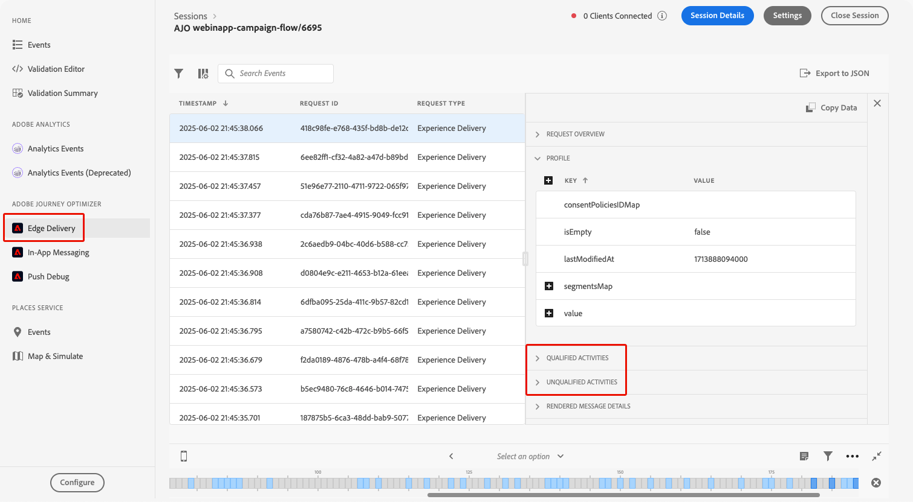
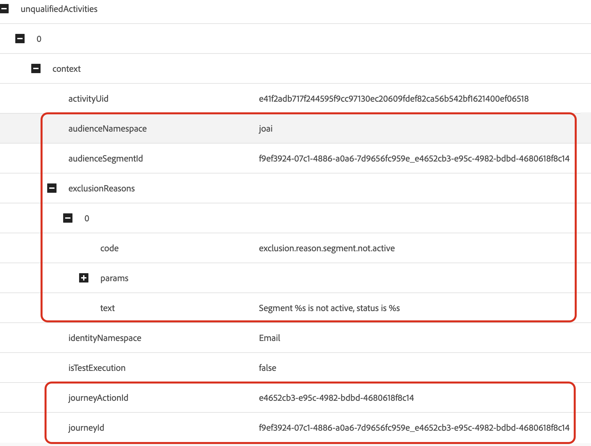
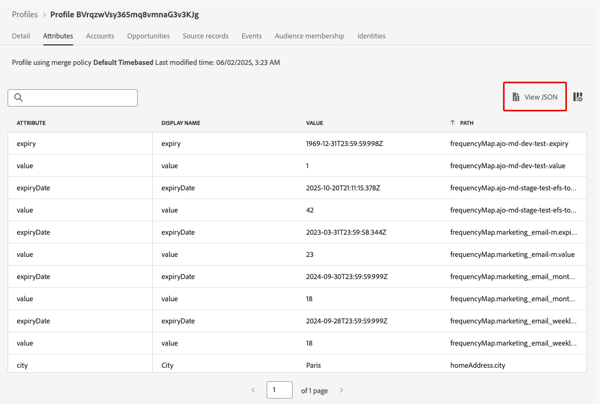
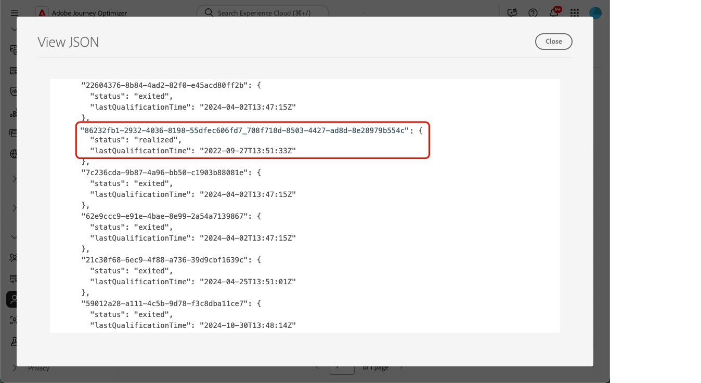

# Troubleshoot inbound actions in journeys {#troubleshooting-inbound-actions}

Inbound actions, such as In-app, web, and code-based experiences, are critical components of [!DNL Journey Optimizer] as they enable personalized engagement with users during their journey. However, unexpected behavior, such as missing inbound content, or continued delivery after a profile exits the journey, can occur.

This guide provides a step-by-step process to debug issues related to inbound actions in a journey, in order to help you identify and resolve them independently before reaching out to support.

<!--This guide addresses the two most common scenarios with inbound actions in a journey. They are as follows:

* A profile enters the inbound step, but the user does not receive the expected inbound content.
* A user continues to receive inbound content even after the profile exits the journey.
-->

## Prerequisites {#prerequisites}

Before you can start troubleshooting, ensure the following:

1. Set up an **Assurance** session. Learn how in the [Adobe Experience Platform Assurance documentation](https://experienceleague.adobe.com/en/docs/experience-platform/assurance/tutorials/using-assurance){target="_blank"}.

1. Navigate to the journey containing the inbound action to retrieve the journey name and version ID.

    >[!NOTE]
    >
    >The journey version ID can be found in the URL after 'journey/' (for example: *86232fb1-2932-4036-8198-55dfec606fd7*).

    

1. Click the inbound action to view its details. Retrieve the inbound action label and ID.

    

1. Get the profile namespace and ID to identify the profile encountering issues. Based on your configuration, the namespace can be ECID, email, or customer ID for example. Learn how to look up a profile in the [Experience Platform documentation](https://experienceleague.adobe.com/en/docs/experience-platform/profile/ui/user-guide#browse-identity){target="_blank"}.

## Scenario 1: The user hasn't received the inbound content {#scenario-1}

In this scenario, a profile has entered the inbound action in the journey, but even after 30 minutes, the corresponding inbound content is not showing up in the device/client at the setup trigger step.

### Pre-checks {#pre-checks}

1. **Journey Inbound dataset is enabled for profile ingestion**

    The inbound action uses the **Journey Inbound** dataset for the profile updates during execution. Ensure that the dataset is enabled for Profiles in the current sandbox. [Learn more on datasets](../data/get-started-datasets.md)

2. **'joai' identity defined in platform identities**

    The inbound action uses the **joai** namespace in the profile `segmentMembership` for activating the profile for the inbound step. Ensure it has been defined in Platform Identities for the sandbox. Learn more on [Experience Platform Identity Service](https://experienceleague.adobe.com/en/docs/experience-platform/identity/home){target="_blank"}

### Debugging Steps {#debugging-steps}

The chart below shows the sequence of debugging steps you can follow:

{width="70%" align="center"}

### Step 1: Check if the device/client is receiving the content from the Edge Network {#step-1}

Start by checking if the device/client is getting the expected content. 

>[!BEGINTABS]

>[!TAB In-app channel]

1. Go to the [Assurance](https://experienceleague.adobe.com/en/docs/experience-platform/assurance/tutorials/using-assurance){target="_blank"} session and select the **[!UICONTROL In-App Messaging]** section from the left panel.

1. In the **[!UICONTROL Messages on Device]** tab, click the **[!UICONTROL Messages]** drop-down list.

    {width="80%"}

1. Look for a message with the journey name followed by '- In-app message'. If present, it means the In-app message is present on the device/client and the issue might be related to the In-app trigger.

1. If the message is not found, the In-app message was not received by the device/client. <!--Go to the [next step](#step-2) for further debugging.-->

>[!TAB Web channel]

Visit the page and inspect the networking tab, or check the Edge response payload in the **[!UICONTROL Edge Delivery]** section of the [Assurance](https://experienceleague.adobe.com/en/docs/experience-platform/assurance/tutorials/using-assurance){target="_blank"} session.

>[!TAB Code-based experience channel]

Perform a curl request using [Adobe's API](https://developer.adobe.com/data-collection-apis/docs/api/) and check the Edge response payload in the **[!UICONTROL Edge Delivery]** section of the [Assurance](https://experienceleague.adobe.com/en/docs/experience-platform/assurance/tutorials/using-assurance){target="_blank"} session.

>[!ENDTABS]

### Step 2: Check if the Edge Network is returning the content {#step-2}

This step is to make sure the Edge Network is returning the expected inbound content to be rendered on the device/client.

When a profile enters an inbound action in a journey, it is automatically qualified into a special audience segment (in the **joai** namespace) corresponding to the inbound journey action.

When a client makes a request to the Edge Network for a given profile and surface, the profile qualifies to receive content for the inbound journey actions targeting that surface - only if the profile is currently a member of the corresponding **joai** segment.

To debug the Edge Network behavior, follow the steps below.

1. Open the **[!UICONTROL Edge Delivery]** view in the Assurance session. This view provides information about the execution of the inbound action on the Edge Network server. Learn more in the [Experience Platform documentation](https://experienceleague.adobe.com/en/docs/experience-platform/assurance/view/edge-delivery){target="_blank"}.

1. Verify if the Edge activity corresponding to the inbound action is listed in the **[!UICONTROL Qualified Activities]** or **[!UICONTROL Unqualified Activities]** sections.

    

    * If in the **Qualified Activities** section, the profile qualified for the inbound journey action, and the content should be returned.
    * If in the **Unqualified Activities** section, the profile did not qualify for the inbound journey action. See the exclusion reasons for more details.
    * If in **neither section**, either there was a problem with publishing the inbound journey action to the Edge Network, or the requested surface URI did not match the channel configuration settings for the inbound action.

    >[!NOTE]
    >
    >To find your Edge activity in the **Assurance** session, look for the activity where the **[!UICONTROL audienceNamespace]** is **joai** and the **[!UICONTROL audienceSegmentId]** is <*JourneyVersionID*>_<*JourneyActionID*> (for example: *86232fb1-2932-4036-8198-55dfec606fd7_708f718d-8503-4427-ad8d-8e28979b554c*).

    {width="70%"}

1. If your activity is in the **[!UICONTROL Unqualified Activities]** section and the exclusion reason is *'Segment is not active'*, it means the Edge Network delivery server does not think the profile is part of the relevant **joai** audience segment.

    You can double check whether the **joai** segment is present in the Edge Network delivery server's view of the profile by opening the **segmentsMap** element of the Profile section and looking for the presence of the **joai** segment ID.

1. If the Edge Network delivery server does not view the profile as being in the relevant **joai** segment, go to the next step.<!--use the Platform Profile viewer UI to check if the expected **joai** segment is in a realized state in the Edge profile. Learn more in the [Experience Platform Profile UI documentation](https://experienceleague.adobe.com/en/docs/experience-platform/profile/ui/user-guide){target="_blank"}-->

### Step 3: Check if the 'joai' audience membership has propagated to the Edge Network {#step-3}

This step is to verify that the Edge profile was correctly updated when the profile entered the inbound journey action and the profile was qualified into the corresponding **joai** segment.

When a profile is qualified into a **joai** segment, the profile is first updated on the Hub and then the segment membership is projected to the Edge Profile for use by the Edge Network delivery server.

>[!NOTE]
>
>The propagation from Hub to Edge can take up to 15-30 minutes from the moment the profile is updated on the Hub.

To check for the presence of the **joai** segment in the Edge profile's `segmentMembership` attribute, follow the steps below.

1. Navigate to the **[!UICONTROL Customer]** > **[!UICONTROL Profiles]** menu in the [!DNL Journey Optimizer] left navigation pane and browse to the profile using namespace and ID. Learn more on [Real-time Customer Profiles](../audience/get-started-profiles.md)

1. Select the **[!UICONTROL Attributes]** tab and choose the **[!UICONTROL Edge]** view.

1. Click **[!UICONTROL View JSON]** to open the JSON view for the profile.

    {width="80%"}

1. Go to the `segmentMembership` attribute and check if the segment ID <*JourneyVersionID>*_<*JourneyActionID*> is present in the **joai** namespace and if in **[!UICONTROL realized]** <!--or existing?-->status.

    {width="90%"}

    * If present, the **joai** segment corresponding to the inbound journey action was correctly propagated to the Edge profile.
  
    * If not displayed in the Edge Network delivery server's view of the profile, there might be a problem with how the delivery server is loading the Edge profile.

1. If the **joai** segment ID is not present or is in **[!UICONTROL exited]** state, it means it was not (yet) propagated to Edge.

    Wait 15 to 30 minutes for the `segmentMembership` values to be propagated from the Hub to the Edge. If still not present, go to the next step.

<!--The next step is to check whether the audience segment is present in the profile on the Hub.-->

### Step 4: Check if the 'joai' audience membership is present in the profile on the Hub {#step-4}

This step is to verify that the Hub profile was correctly updated when the profile entered the inbound journey action and the profile was qualified into the corresponding **joai** segment.

>[!NOTE]
>
>The ingestion of the **joai** segment membership into the Hub profile can take up to 15-30 minutes from the moment the profile entered the inbound journey action.

To check for the presence of the **joai** segment in the Hub profile's `segmentMembership` attribute, follow the steps below.

1. Navigate to the **[!UICONTROL Customer]** > **[!UICONTROL Profiles]** menu in the [!DNL Journey Optimizer] left navigation pane and browse to the profile using namespace and ID. Learn more on [Real-time Customer Profiles](../audience/get-started-profiles.md)

1. Select the **[!UICONTROL Attributes]** tab and choose the **[!UICONTROL Hub]** view.

1. Click **[!UICONTROL View JSON]** to open the JSON view for the profile.

1. Go to the **[!UICONTROL segmentMembership]** attribute and check if the segment ID <*JourneyVersionID>*_<*JourneyActionID*> is present in the **joai** namespace and if in **[!UICONTROL realized]** <!--or existing?-->status.

    * If present, the **joai** segment corresponding to the inbound journey action was correctly ingested in the Hub profile.
  
    * If not found in the Edge profile after at least 30 minutes, there might be a problem with the Edge projection system.

1. If the **joai** segment ID is not present or is in **[!UICONTROL exited]** state, it means the profile was not (yet) correctly qualified into the special **joai** audience segment upon entry into the corresponding inbound journey action.

    Wait 15 to 30 minutes for the `segmentMembership` values to be ingested into the profile on the Hub. If still not present, go to the next step.

### Step 5: If the client/device is still not getting the expected content {#step-5}

If you've gone through all the steps above and aren't seeing the expected behavior  after waiting 30 to 60 minutes for the segment membership to propagate to the Edge Network, contact Adobe Customer Care or your Adobe representative.

Include as much detail as you can from the debugging steps, such as:

* the step where you see the unexpected behavior;
* the journey version ID;
* the journey action ID;
* the full Assurance trace;
* the JSON view of Edge profile;
* the JSON view of Hub profile;
* etc.

## Scenario 2: The user is still receiving the inbound content {#scenario-2}

This scenario is the reverse of [Scenario 1](#scenario-1): the profile has exited the journey, but the user is still receving the inbound content.

However, when a profile exits a journey, it should no longer qualify for the **joai** audience segments corresponding to the inbound actions in the journey.

Go through the same debugging steps as for [Scenario 1](#debugging-steps) to check whether the Hub profile, Edge profile and Edge Network delivery server correctly reflect the segment membership status of the relevant **joai** segment, and whether the client is no longer receiving the inbound content.

<!--

## Reference Section {#reference-section}

- [Assurance Setup Guide](https://experienceleague.adobe.com/en/docs/experience-platform/assurance/tutorials/using-assurance)
- [Adobe Experience Platform Documentation](https://experienceleague.adobe.com/docs/experience-platform/home.html)
- [Streaming Ingestion APIs Troubleshooting](https://experienceleague.adobe.com/docs/experience-platform/ingestion/streaming/troubleshooting.html)

-->
