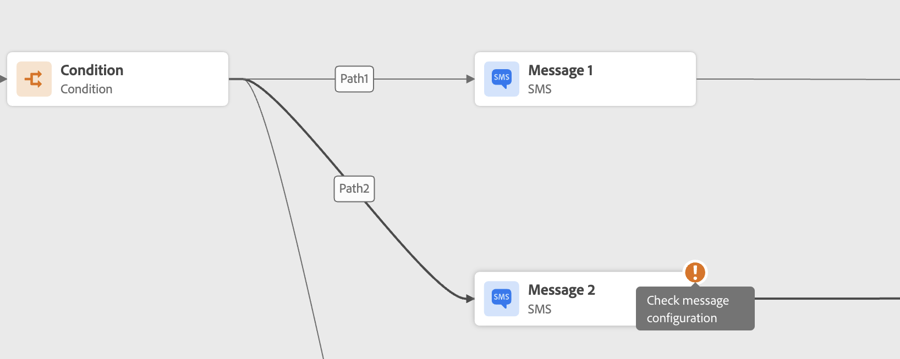
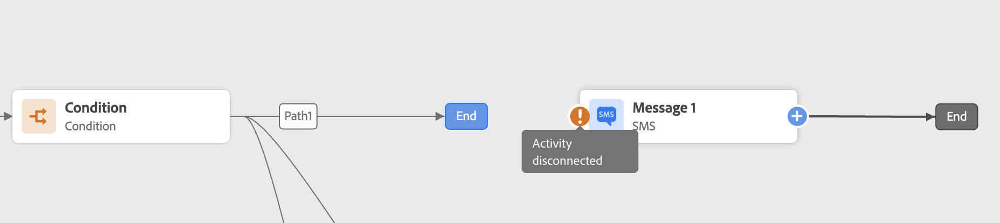
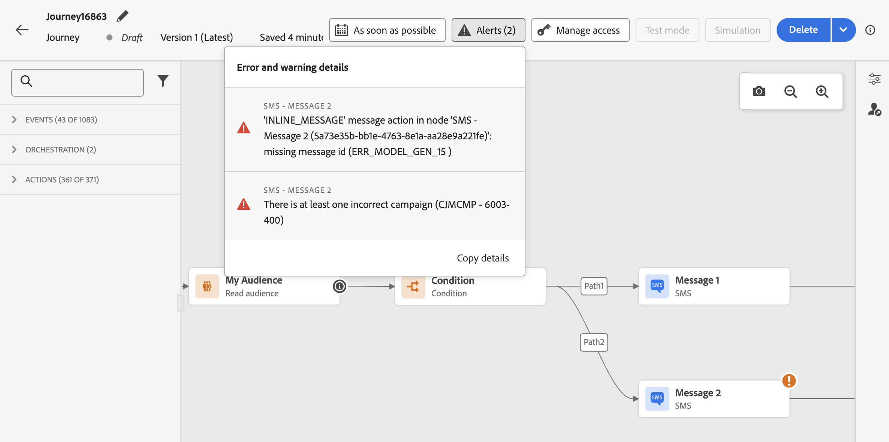

# Troubleshoot errors before testing your journey {#troubleshooting}

In this section, learn how to troubleshoot journeys before testing or publishing. All the checks listed below can be performed when the journey is in test mode or when the journey is live. The recommendation is to make all the checks below in test mode and then proceed to publication. Learn more about the test mode on [this page](../building-journeys/testing-the-journey.md).

Learn how to troubleshoot journey events, check if profiles entered your journey, how they navigate through it, and if messages are sent [on this page](troubleshooting-execution.md). If no profiles enter your event-based journey despite events being ingested, ensure the [event condition data types match the event schema](troubleshooting-execution.md#verify-event-identity-and-rule-data-types).

If you are using inbound actions, learn how to troubleshoot them [on this page](troubleshooting-inbound.md).

## Errors in activities {#activity-errors}

Before testing and publishing your journey, verify that all the activities are properly configured. You cannot perform tests or publications if errors are still detected by the system.

Errors appear with a warning symbol displayed on the activities themselves on the canvas. Place your cursor on the exclamation mark to display the error message. If you select the activity, you should see the line in error with a warning. For example:

* if a mandatory field is empty, an error will be displayed

    

* in the canvas, when two activities are disconnected, a warning is displayed

    

## Errors in the journey {#canvas-errors}

Errors are also visible from the **[!UICONTROL Alerts]** button, above the canvas. This button lets you see errors detected by the system and which prevent test mode activation or journey publication. 

The system detects two kinds of issues: **errors** and **warnings**. Errors block publication and test activation. Warnings indicate potential issues that are not blocking test activation or publication. You will see a description of the issue and an issue log ID of the type ERR_XXX_XXX. This can help identify the issue.

 

<!--Most of the time, errors detected by the system are linked to errors visible on the activities but they can also relate to other issues. In all cases, check alerts and resolve the issue using to the error description. If you cannot identify the issue, use the **[!UICONTROL Copy details]** button to store the alerts, and send them to your administrator.-->

Errors and warnings that are global to the journey appear first in the list. Error and warnings related to specific activities are listed after, by activity order or appearance in the journey from left to right. At the bottom of the list of alerts, the **[!UICONTROL Copy details]** button lets you copy technical information about the journey which are useful to troubleshoot the issues. For the list of copied fields <!-- DOCAC-14191 (including pause and resume information)-->, see [Copy technical details](journey-properties.md#access-properties) in journey properties.

## Add an alternative path {#canvas-add-path}

You can define a fallback action in case of an error for the following journey activities: **[!UICONTROL Optimize]** and **[!UICONTROL Action]**.

When an error occurs in an action or a condition, the journey of an individual stops. The only way to make it continue is to solve the issue. To avoid interrupting the journey, you can also check the option **[!UICONTROL Add an alternative path in case of a timeout or an error]** in the activity's properties. Learn more in [this section](../building-journeys/using-the-journey-designer.md#paths).
