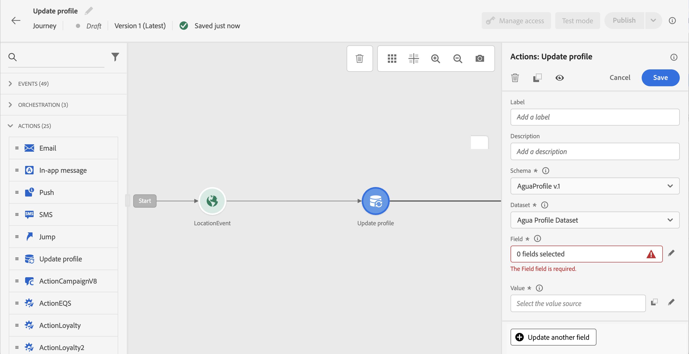
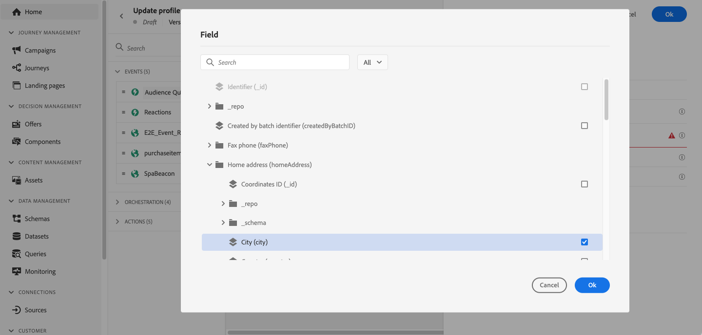
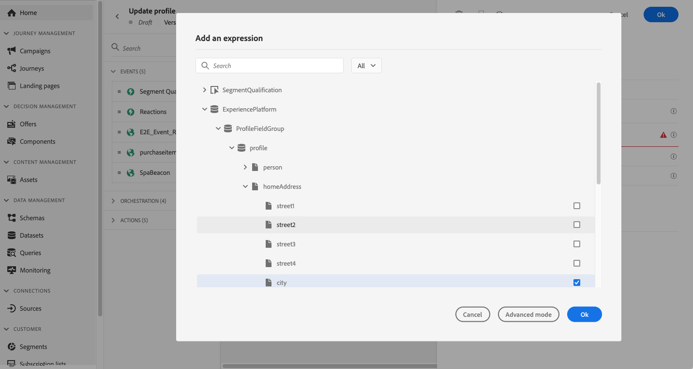
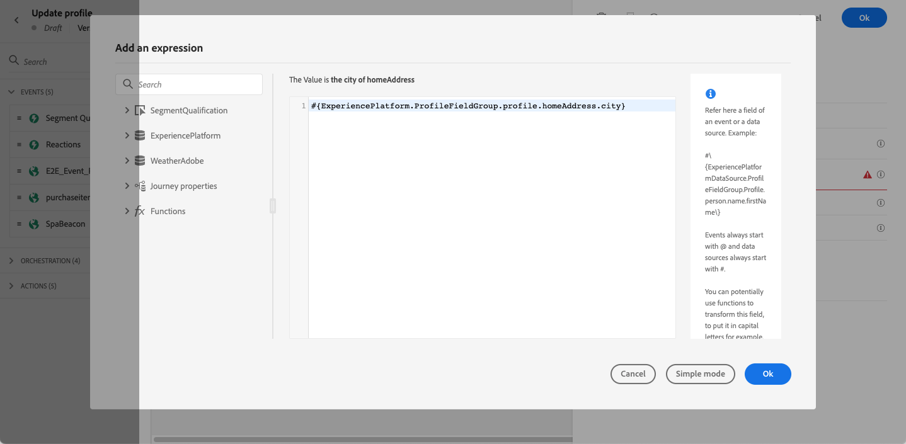
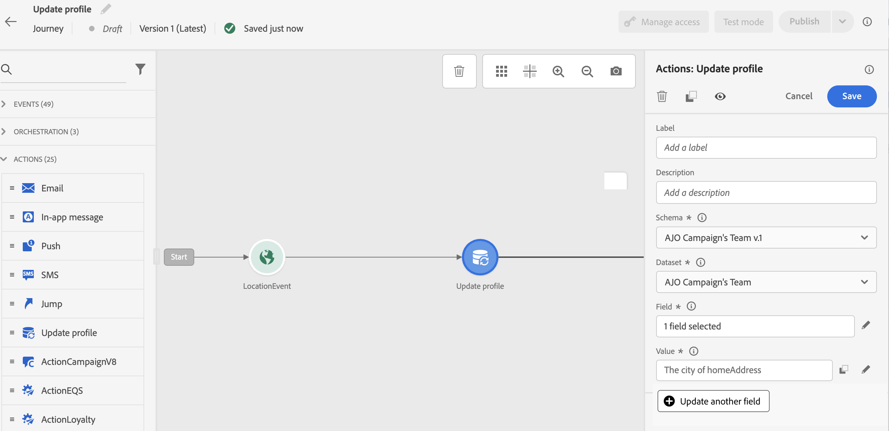

# Update Profile {#update-profile}

>[!CONTEXTUALHELP]
>id="ajo_journey_update_profiles"
>title="Update Profile activity"
>abstract="The Update Profile action activity allows you to update an existing [!DNL Adobe Experience Platform] profile with information coming from the event, a datasource or using a specific value."

Use the **[!UICONTROL Update Profile]** action activity to enrich or correct an existing [!DNL Adobe Experience Platform] profile as a customer progresses through a journey. You can set field values sourced from a journey event, a configured datasource, or a static value — enabling you to keep profile data accurate and actionable without leaving the journey canvas. Before configuring this activity, review the [guardrails and limitations](#guardrails) that apply.

## Dataset selection {#dataset-selection}

The **[!UICONTROL Update Profile]** activity requires a dedicated dataset to store updates. Since this activity only updates the [Profile Store](https://experienceleague.adobe.com/docs/experience-platform/profile/home.html#profile-data-store){target="_blank"} (not the Datalake), all updates should be saved in a [profile-enabled dataset](https://experienceleague.adobe.com/en/docs/experience-platform/catalog/datasets/user-guide#enable-profile){target="_blank"} specifically designated for **[!UICONTROL Update Profile]** actions.

>[!CAUTION]
>
>Do not use a dataset that is also used for batch or streaming ingestion. Other ingestion runs will overwrite the changes made by the **[!UICONTROL Update Profile]** action, causing profile attributes to disappear or revert to their previous values. If you observe this behavior, verify in Adobe Experience Platform that no other ingestion is writing to the same dataset. For troubleshooting steps, see [Resolving profile update failures in Adobe Journey Optimizer](https://experienceleague.adobe.com/en/docs/experience-cloud-kcs/kbarticles/ka-26352){target="_blank"}.

Additionally, the **[!UICONTROL Update Profile]** activity configuration does not require an [identity namespace](https://experienceleague.adobe.com/en/docs/experience-platform/identity/features/namespaces){target="_blank"}. As such, ensure that the selected dataset uses the same **[!UICONTROL Identity namespace]** that was used by the action that launched the journey as it is this namespace these updates will use. The identity map can also be used by the selected dataset. Failure to select a dataset with the correct identity namespace or one that uses identity map will cause the **[!UICONTROL Update Profile]** activity to fail.

## Configure the Update Profile activity {#use-profile-update}

Follow the steps below to configure the **[!UICONTROL Update Profile]** activity in your journey.

1. Start designing your journey. Learn more in [Create your first journey](../building-journeys/journey-gs.md).

1. In the **[!UICONTROL Action]** section of the palette, drop the **[!UICONTROL Update Profile]** activity into the canvas.

   

1. Select a schema from the list.

   >[!NOTE]
   >
   >Only fields that already exist in the selected XDM Profile schema are available for selection. If the field you need is not listed, add it to the schema in Adobe Experience Platform first.

1. Click on **[!UICONTROL Field]** to select the field you want to update.

   

1. Select a dataset from the list. 

   >[!NOTE]
   >
   >The **[!UICONTROL Update Profile]** action updates the profile data in realtime, but it does not update datasets. The dataset selection is needed as the profile is a record related to a dataset.

1. Click on the **[!UICONTROL Value]** field to define the value you want to use:

   * Using the simple expression editor, you can select a field from a data source or from the incoming event.

      

   * If you want to define a specific value or leverage advanced functions, select [**[!UICONTROL Advanced mode]**](expression/expressionadvanced.md).

      

1. To update additional profile attributes in the same action, click **[!UICONTROL Update another field]** and repeat the field and value selection. You can add up to five field/value pairs in a single **[!UICONTROL Update Profile]** action. See [Guardrails and limitations](#guardrails).

The **[!UICONTROL Update Profile]** activity is now configured.

## Test the profile update {#using-the-test-mode}

Be aware that in [test mode](testing-the-journey.md), profile updates take effect immediately on the test profile and are not simulated.

Only test profiles can enter a journey in test mode. You can either create a new test profile or convert an existing profile into a test profile. In [!DNL Adobe Experience Platform], profile attributes can be updated via a CSV file import or API calls. A quicker alternative is to use an **[!UICONTROL Update Profile]** activity within the journey itself to set the test profile boolean field to true.

For more information on how to turn an existing profile into a test profile, refer to this [section](../audience/creating-test-profiles.md#create-test-profiles-csv).

## Guardrails and limitations {#guardrails}

* The **[!UICONTROL Update Profile]** action can only be used in journeys that have a [namespace](../event/about-creating.md#select-the-namespace).
* The action only updates existing fields — it does not create new profile fields.
* The action only supports simple field types (string, number, boolean). XDM fields defined as enumerations, suggested values, object arrays, or complex collections (e.g. product lists) are not supported.
* You cannot use the **[!UICONTROL Update Profile]** action to generate [experience events](../event/about-events.md), such as a purchase.
* Like any other action, you can define an [alternative path in case of error or timeout](using-the-journey-designer.md#paths). Two actions cannot be placed in parallel.
* Profile updates are not guaranteed to be immediately available downstream in the same journey. Avoid placing an action that reads a field directly after the **[!UICONTROL Update Profile]** action that writes it, as the updated value may not yet be reflected.
* The **[!UICONTROL Update profile]** activity only updates the [Profile Store](https://experienceleague.adobe.com/docs/experience-platform/profile/home.html#profile-data-store){target="_blank"}, not the Data Lake.
* Up to five field/value pairs can be updated in a single **[!UICONTROL Update Profile]** action. Use the **[!UICONTROL Update another field]** button to add more pairs.
* For better performance, group multiple attribute updates into a single **[!UICONTROL Update Profile]** action rather than using one action per attribute.
