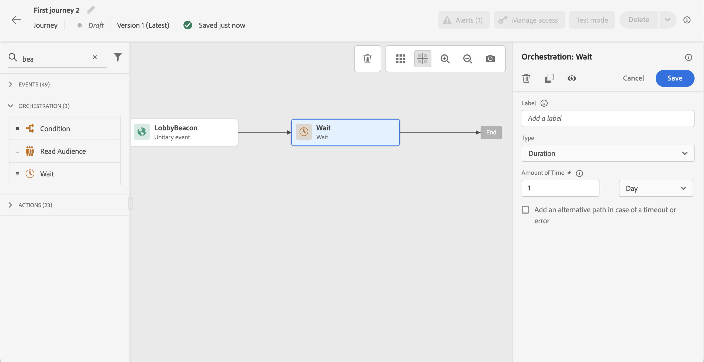
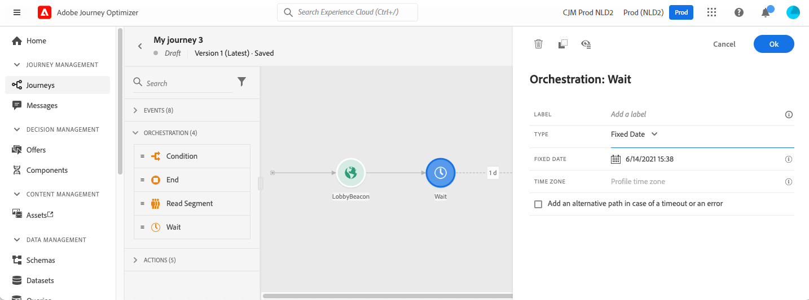
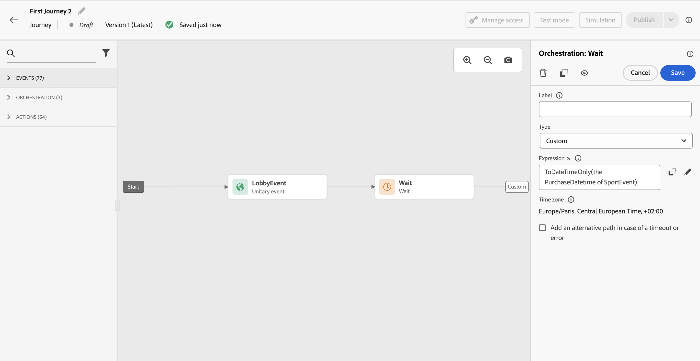

# Wait activity {#wait-activity}

>[!CONTEXTUALHELP]
>id="ajo_journey_wait"
>title="Wait activity"
>abstract="If you want to wait before executing the next activity in the path, you can use a Wait activity. It allows you to define the moment when the next activity will be executed. Two options are available: duration and custom."

You can use a **[!UICONTROL Wait]** activity to define a duration before executing the next activity.  The maximum wait duration is **90 days**. 

You can set two types of **Wait** activity:

* A wait based on a relative duration. [Learn more](#duration) 
* A custom date, using functions to calculate it. [Learn more](#custom) 

<!--
* [Email send time optimization](#email_send_time_optimization)
* [Fixed date](#fixed_date) 
-->

## Recommendations {#wait-recommendations}

### Multiple Wait activities {#multiple-wait-activities}

When using multiple **Wait** activities in a journey, be aware that the [global timeout](journey-properties.md#global_timeout) for journeys is 91 days, meaning that profiles are always drop out of the journey maximum 91 days after they entered it. Learn more on [this page](journey-properties.md#global_timeout).

An individual can enter a **Wait** activity only if they have enough time left in the journey to complete the wait duration before the 91 days journey timeout. 

### Wait and reentrance {#wait-reentrance}

A best practice to not use **Wait** activities to block reentrance. Instead, use the **Allow reentrance** option at the journey properties level. Learn more on [this page](../building-journeys/journey-properties.md#entrance).

### Wait and test mode {#wait-test-mode}

In test mode, the **[!UICONTROL Wait time in test]** parameter allows you to define the time that each **Wait** activity will last. The default time is 10 seconds. This will ensure that you get the test results quickly. Learn more on [this page](../building-journeys/testing-the-journey.md).

### Wait and mobile channels {#wait-mobile-channels}

If you want to show an [in-app message](../in-app/create-in-app.md) shortly after sending a [push notification](../../rp_landing_pages/push-landing-page.md), use a **Wait** activity to allow the in-app message payload time to propagate. Typically a 5–15 minute wait is recommended, but exact times can vary depending on payload complexity and personalization needs.

## Configuration {#wait-configuration}

### Duration wait {#duration}

Select the **Duration** type to set the relative duration of the wait before the execution of the next activity. The maximum duration is **90 days**.

<!--
## Fixed date wait{#fixed_date}

Select the date for the execution of the next activity.

-->

### Custom wait {#custom}

Select the **Custom** type to define a custom date, using an advanced expression based on a field coming from an event or a custom action response. You cannot define a relative duration directly, for example, 7 days, but you can use functions to calculate it if needed (eg: 2 days after purchase). 

The expression in the editor should provide a `dateTimeOnly` format. Refer to [this page](expression/expressionadvanced.md). For more information on dateTimeOnly format, refer to [this page](expression/data-types.md).

Best practice is to use custom dates that are specific to your profiles, and avoid using the same date for all. For example, do not define `toDateTimeOnly('2024-01-01T01:11:00Z')` but rather `toDateTimeOnly(@event{Event.productDeliveryDate})` which is specific to each profile. Be aware that using fixed dates can cause issues on your journey execution. Learn more about the impact of Wait activities on journey processing rate in [this section](entry-management.md#wait-activities-impact). 

>[!NOTE]
>
>You can leverage a `dateTimeOnly` expression or use a function to convert to a `dateTimeOnly`. For example: `toDateTimeOnly(@event{Event.offerOpened.activity.endTime})`, the field in the event being of the form 2023-08-12T09:46:06Z.
>
>The **time zone** is expected in the properties of your journey. As a result, from the user interface, it is not possible to directly point at a full ISO-8601 timestamp mixing time and time zone offset like 2023-08-12T09:46:06.982-05. [Learn more](../building-journeys/timezone-management.md).

>[!CAUTION]
>
>When creating a custom wait expression with `toDateTimeOnly()`, avoid appending 'Z' or any time zone offset (e.g., '-05:00') in the expression result. The expression must use valid ISO date/time syntax that references the journey's configured time zone without explicit time zone designators.
>
>**Correct example:** `toDateTimeOnly(concat(toString(toDateOnly(nowWithDelta(2, "days"))),"T10:00:00"))`
>
>**Incorrect example:** `toDateTimeOnly(concat(toString(toDateOnly(nowWithDelta(2, "days"))),"T10:00:00Z"))` ❌ (contains 'Z')
>
>Using unsupported time zone designators can cause profiles to remain stuck in the wait activity instead of advancing as expected.

To validate that the wait activity works as expected, you can use step events. [Learn more](../reports/query-examples.md#common-queries).

## Profile refresh after wait {#profile-refresh}

When a profile is parked at a **Wait** activity in a journey starting with a **Read Audience** activity, the journey automatically refreshes the profile's attributes from the Unified Profile Service (UPS) to fetch the latest available data.

* **At journey entry**: Profiles use attribute values from the audience snapshot that was evaluated when the journey started.
* **After a wait node**: The journey performs a lookup to retrieve the latest profile data from UPS, not the older snapshot data. This means profile attributes may have changed since the journey began.

This behavior ensures that downstream activities use current profile information after a wait period. However, it may produce unexpected results if you expect the journey to use only the original snapshot data throughout execution.

Example: If a profile qualifies for a "silver customer" audience at journey start, but upgrades to "gold customer" during a 3-day wait, activities after the wait will see the updated "gold customer" status.

## Automatic wait node  {#auto-wait-node}

>[!CONTEXTUALHELP]
>id="ajo_journey_auto_wait_node "
>title="About the automatic wait node"
>abstract="A **Wait** activity is automatically added after this activity. It is set for 3 days. You can remove it or configure it as needed."

Each inbound experience activity (In-app message, Code-based experience, or Card) comes with a 3-days **Wait** activity. As inbound messages automatically end when a profile reach out the end of the journey, we assume that you want your users to see it at least for 3 days. You can remove this **Wait** activity, or change its configuration if needed.
