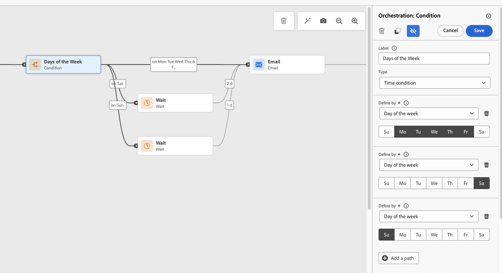

# Send emails only on weekdays {#send-emails-only-on-weekdays}

This use case demonstrates how to configure a journey in [!DNL Adobe Journey Optimizer] that sends emails only on weekdays (Monday through Friday). For profiles that enter the journey on weekends (Saturday or Sunday), emails are automatically queued and sent on Monday at a specified time. This ensures optimal engagement by delivering messages during the workweek.

## Use case overview

**The Challenge**: Ensuring that emails are only sent on weekdays, even though profiles may enter the journey on weekends. For weekend entries, emails should be queued and sent on Monday at a specific time.

**The Solution**: Use a condition activity to identify the day of the week. For weekend entries, Wait activities with custom formulas delay the email until Monday. Weekday entries proceed directly to the email send step.

This approach shows you how to use a condition activity to check if the current day is Saturday or Sunday, implement Wait activities with custom formulas for weekend entries, queue weekend emails for Monday delivery at a specific hour, and send emails immediately for weekday entries (Monday-Friday).

This approach is ideal for business-to-business (B2B) email campaigns, professional newsletters and communications, business-related announcements, work-related product updates, and any marketing campaign where weekend delivery is not desired.

>[!NOTE]
>
>To implement this use case, you need an active Adobe Journey Optimizer instance with a configured [email channel surface](../configuration/channel-surfaces.md), an [audience](../audience/about-audiences.md) or [event](../event/about-events.md) to trigger the journey, and a basic understanding of [journey conditions](conditions.md) and [expressions](expression/expressionadvanced.md).

## Implementation steps

Use these steps to build the weekday-only email flow.

### Step 1: Create your journey

1. Navigate to **[!UICONTROL Journey Management]** > **[!UICONTROL Journeys]** in [!DNL Adobe Journey Optimizer].

1. Click **[!UICONTROL Create Journey]** to [create a new journey](journey-gs.md).

1. Configure the [journey properties](journey-properties.md).

1. Choose your journey entry point:
   * **[Read Audience](read-audience.md)**: For batch campaigns targeting a specific audience
   * **[Event](../event/about-events.md)**: For real-time triggered journeys based on customer behavior

### Step 2: add a condition activity to check the day of the week

Right after the journey start, add a **[!UICONTROL Condition]** activity to check if the current day is Saturday or Sunday. This will branch the workflow accordingly.

1. Drag and drop an [**[!UICONTROL Optimize]** activity](optimize.md) onto the canvas after your entry point.

1. Click on the **[!UICONTROL Condition]** activity to open its configuration panel.

1. Select **[!UICONTROL Time condition]** as the condition type.

1. Select **[!UICONTROL Day of the week]** as the time filtering option.

1. For the **first path (Saturday)**, select **Saturday** only. Label this path as "Saturday".

1. Click **[!UICONTROL Add a path]** to create a second condition.

1. For the **second path (Sunday)**, select **[!UICONTROL Day of the week]** and choose **Sunday** only. Label this path as "Sunday".

   


1. Check **[!UICONTROL Show path for other cases than the one(s) above]** to create a path for weekday entries (Monday-Friday).

>[!NOTE]
>
>The time zone used for day of week evaluation is defined at the journey level in the journey properties, not at the condition level. The journey [timezone](timezone-management.md) used in the formula is the journey's configured timezone, not the recipient's.

### Step 3: configure wait activities for weekend entries

For profiles entering on Saturday or Sunday, use **[!UICONTROL Wait]** activities with custom formulas to delay the email until Monday at your desired hour.

In the **[!UICONTROL Wait]** activity, use the following formula:

```javascript
toDateTimeOnly(setHours(nowWithDelta(X, "days"), H))
```

Where:

* **X** is the number of days to wait:
   * Use **2** for Saturday (wait until Monday)
   * Use **1** for Sunday (wait until Monday)
* **H** is the hour you want to send (e.g., **9** for 9 AM)


**Example for Saturday:**

```javascript
toDateTimeOnly(setHours(nowWithDelta(2, "days"), 9))
```

**Example for Sunday:**

```javascript
toDateTimeOnly(setHours(nowWithDelta(1, "days"), 9))
```

To implement this in your journey:

1. On the **Saturday path**, add a **[!UICONTROL Wait]** activity after the condition.

1. Select **[!UICONTROL Duration]** as the wait type.

1. Click **[!UICONTROL Advanced mode]** to enter the custom formula.

1. Enter: `toDateTimeOnly(setHours(nowWithDelta(2, "days"), 9))`

   

1. Repeat the same steps for the **Sunday path**, using: `toDateTimeOnly(setHours(nowWithDelta(1, "days"), 9))`

>[!TIP]
>
>For more complex business hours (e.g., only send between 9 AM and 5 PM on weekdays), you can further enhance the formula and conditions.

### Step 4: Weekday branch

For profiles entering Monday to Friday, proceed to the email send step as usual.

1. On the **Weekday path** (the "other cases" path), proceed directly to add an **[!UICONTROL Email]** action activity. No **[!UICONTROL Wait]** activity is needed for weekday entries.

1. Configure your email message as needed.

### Step 5: Complete the journey flow

After the **[!UICONTROL Wait]** activities on both the Saturday and Sunday paths, all three paths (Saturday, Sunday, and weekdays) should flow to the same **[!UICONTROL Email]** action activity. Add an **[!UICONTROL End]** activity after the email.

### Visual workflow overview

The complete journey workflow follows this logic:

* **Start** → **[!UICONTROL Condition]**: Is it Saturday or Sunday?
   * **Yes (Saturday):** **[!UICONTROL Wait]** until Monday 9 AM → **[!UICONTROL Send email]**
   * **Yes (Sunday):** **[!UICONTROL Wait]** until Monday 9 AM → **[!UICONTROL Send email]**
   * **No (Monday-Friday):** **[!UICONTROL Send email]** immediately

This ensures that all emails are sent on weekdays only, with weekend entries automatically queued for Monday delivery.

### Step 6: Test your journey

Before publishing, thoroughly test your journey logic in [!DNL Adobe Journey Optimizer]'s Test Mode to confirm everything works as expected:

1. Click the **[!UICONTROL Test]** button in the top right corner.

1. Enable [test mode](testing-the-journey.md).

1. Create [test profiles](../audience/creating-test-profiles.md) with simulated entry times on different days of the week:
   * **Saturday entry**: Verify the profile follows the Saturday path, waits, and receives email on Monday at the specified hour
   * **Sunday entry**: Verify the profile follows the Sunday path, waits, and receives email on Monday at the specified hour  
   * **Monday-Friday entries**: Verify emails are sent immediately without any wait

1. Review the journey visualization to ensure profiles follow the correct conditional paths (Saturday, Sunday, or weekday).

1. Check for any [errors or warnings](troubleshooting.md) in the journey.

1. Verify that the Wait formulas calculate the correct duration for your desired Monday delivery time.

>[!IMPORTANT]
>
>Always test your journey logic in test mode to ensure the Wait activities behave as expected. Use Test Mode to simulate different entry scenarios and validate that weekend entries are correctly queued for Monday delivery. See [journey testing best practices](testing-the-journey.md) for more details.

### Step 7: Publish your journey

Once testing is complete:

1. Click **[!UICONTROL Publish]** in the top right corner.

1. Confirm the [publication](publish-journey.md).

1. Monitor the journey performance using [Journey reporting](report-journey.md) and [live reports](../reports/journey-live-report.md).


## Related topics

* [Optimize activities](optimize.md) - Learn how to create different paths in your journey
* [Use conditions in a journey](conditions.md) - Detailed guide on journey conditions
* [Wait activity](wait-activity.md) - Configure wait durations and formulas
* [Date functions](functions/date-functions.md) - Complete reference for date and time functions
* [Expression editor](expression/expressionadvanced.md) - Build complex expressions
* [Journey best practices](journey-gs.md#best-practices) - Recommended approaches for journey design
