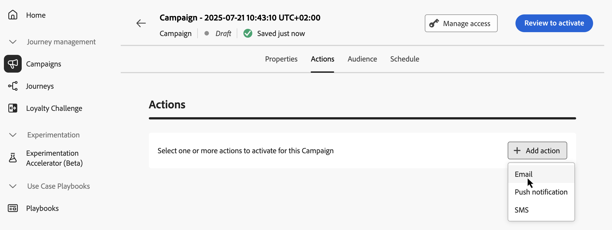
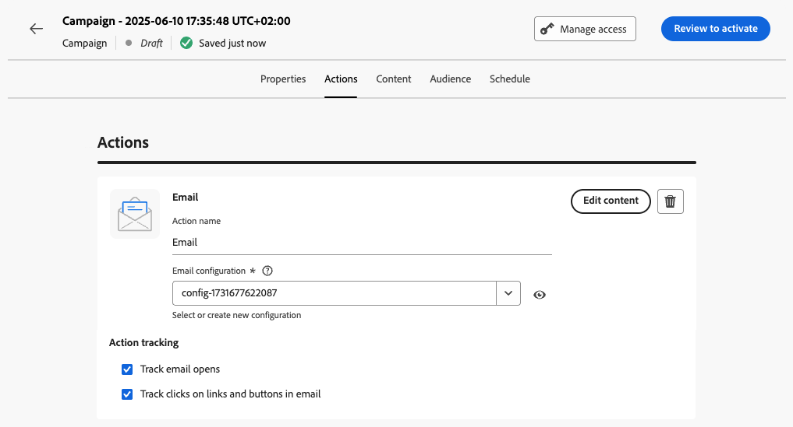

# Configure the API triggered campaign action {#api-action}

Use the **[!UICONTROL Actions]** tab to select a channel configuration for your message and configure additional settings such as tracking, content experiment, or multilingual content.

1. **Choose the channel**.

    Navigate to the **[!UICONTROL Actions]** tab, click the **[!UICONTROL Add action]** button and select the communication channel. 

    

    >[!NOTE]
    >
    >For more information on the supported channels, refer to the table in this section: [Channels in journeys & campaigns](../channels/gs-channels.md#channels). Available channels vary based on your licensing model and add-ons.
    >
    >High Throughput API triggered campaigns currently support the email channel only.

1. **Select a channel configuration**

    A configuration is defined by a [System Administrator](../start/path/administrator.md). It contains all the technical parameters for sending the message, such as header parameters, subdomain, mobile apps, etc. [Learn how to set up channel configurations](../configuration/channel-surfaces.md)
    
    

1. **Leverage Optimization**

    Use the **[!UICONTROL Message Optimization]** section to run content experiments, leverage targeting rules, or use advanced combinations of both experimentation and targeting. These different options and the steps to follow are detailed in this section: [Optimization in campaigns](../content-management/gs-message-optimization.md).

<!--
1. **Create a content experiment**

    Use the **[!UICONTROL Content experiment]** section to define multiple delivery treatments in order to measure which one performs best for your target audience. Click the **[!UICONTROL Create experiment]** button then follow the steps detailed in this section: [Create a content experiment](../content-management/content-experiment.md).
-->

1. **Add multilingual content**

    Use the **[!UICONTROL Languages]** section to create content in multiple languages within your campaign. To do so, click the **[!UICONTROL Add languages]** button and select the desired **[!UICONTROL Language settings]**. Detailed information on how to set up and use multilingual capabilities are available in this section: [Get started with multilingual content](../content-management/multilingual-gs.md)

Additional settings are available depending on the selected communication channel. Expand the sections below for more information.

+++**Apply capping rules** (Email, Push, SMS)

In the **[!UICONTROL Business rules]** drop-down list, select a rule set to apply capping rules to your campaign. Leveraging channel rule sets allows you to set frequency capping by communication type to prevent overloading customers with similar messages. [Learn how to work with rule sets](../conflict-prioritization/rule-sets.md)

+++

+++**Track engagement** (Email, SMS).

Use the **[!UICONTROL Action tracking]** section to track how your recipients react to your email or SMS deliveries. Tracking results are accessible from the campaign report once the campaign has been executed. [Learn more about campaign reports](../reports/campaign-global-report-cja.md)

+++

+++**Enable Rapid delivery mode** (Push).

Rapid delivery mode is a [!DNL Journey Optimizer] add-on that allows very fast push message sending in large volumes though campaigns. Rapid delivery is used when delay in message delivery is business-critical, when you want to send an urgent push alert on mobile phones, for example a breaking news to users who have installed your news channel app. Learn how to enable Rapid delivery mode for Push notifications [on this page](../push/create-push.md#rapid-delivery).

For more information on performances when using Rapid delivery mode, refer to [Adobe Journey Optimizer product description](https://helpx.adobe.com/legal/product-descriptions/adobe-journey-optimizer.html){target="_blank"}.

+++

## Next steps {#next}

Once your campaign configuration and content are ready, you can design its content. [Learn more](api-triggered-campaign-content.md)
