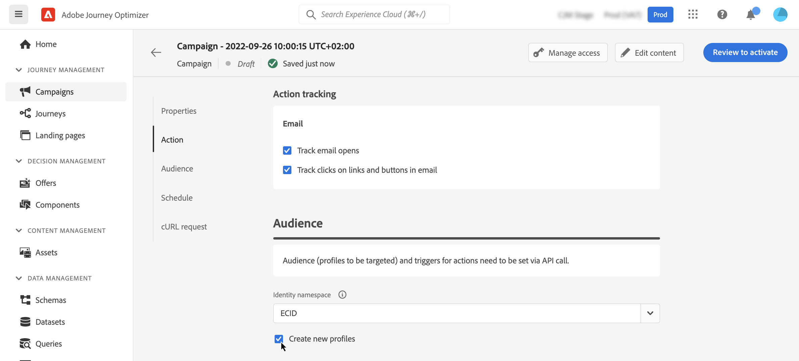
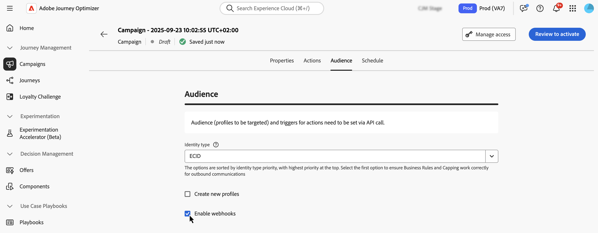

# Define the API triggered campaign audience {#api-audience}

>[!BEGINSHADEBOX]

**On this page:** Define the audience, identity type, automatic profile creation, and webhooks so your API triggered campaign reaches the right individuals and returns real-time delivery status.

>[!ENDSHADEBOX]

Use the **[!UICONTROL Audience]** tab to define the campaign audience.

## Select the audience

**For Marketing API triggered campaigns**, click the **[!UICONTROL Select audience]** button to display the list of available Adobe Experience Platform audiences. [Learn more about audiences](../audience/about-audiences.md).

>[!IMPORTANT]
>
>The use of audiences and attributes from [audience composition](../audience/get-started-audience-orchestration.md) is currently unavailable for use with Healthcare Shield or Privacy and Security Shield.

**For Transactional API triggered campaigns**, the targeted profiles need to be defined in the API call. A single API call supports up to 20 unique recipients. Each recipient must have a unique user ID, duplicate user IDs are not permitted. Learn more in the [Interactive Message Execution API documentation](https://developer.adobe.com/journey-optimizer-apis/references/messaging#operation/postIMUnitaryMessageExecution){target="_blank"}

## Select the identity type

In the **[!UICONTROL Identity type]** field, choose the type of key to use to identify the individuals from the selected audience. You can either use an existing identity type or create a new one using the Adobe Experience Platform Identity Service. Standard Identity namespaces are listed on [this page](https://experienceleague.adobe.com/en/docs/experience-platform/identity/features/namespaces#standard){target="_blank"}. 

Only one identity type is allowed per campaign. Individuals belonging to a segment that does not have the selected identity type among their different identities cannot be targeted by the campaign. Learn more about identity types and namespaces in the [Adobe Experience Platform documentation](https://experienceleague.adobe.com/docs/experience-platform/identity/home.html){target="_blank"}. 

## Activate profile creation at campaign execution

In some cases, you may need to send transactional messages to profiles that do not exist in the system. For example if an unknown user tries to reset password on your website. When a profile does not exist in the database, Journey Optimizer allows you to automatically create it when executing the campaign to allow sending the message to this profile.

To activate profile creation at campaign execution, toggle the **[!UICONTROL Create new profiles]** option on. If this option is disabled, unknown profiles will be rejected for any sending and the API call will fail.

>[!IMPORTANT]
>
>This option is provided for **very small volume profile creation** in a large volume transactional sending use case, with bulk of profiles already existing in platform.
>
>Unknown profiles are created in the **AJO Interactive Messaging Profile Dataset** dataset, in three default namespace (email, phone and ECID) respectively for each outbound channels (Email, SMS and Push). However, if you are using a custom namespace, the identity is created with the same custom namespace.
>
>Profile creation at execution is not available for [High Throughput campaigns](../campaigns/api-triggered-high-throughput.md), as this mode does not rely on Adobe profiles. The system will not check whether the profiles exist or not.

## Enable webhooks {#webhook}

For Transactional API triggered campaigns, you can enable webhooks to receive real-time feedback on the execution status of your messages. To do this, toggle the **[!UICONTROL Enable webhooks]** option to send delivery status events to a configured webhook.  

Webhook configurations are managed centrally in the **[!UICONTROL Administration]** / **[!UICONTROL Channels]** / **[!UICONTROL Feedback Webhook]** menu. From there, administrators can create and edit webhook endpoints. [Learn how to create Feedback Webhooks](../configuration/feedback-webhooks.md)

## Next steps {#next}

Once your campaign configuration and content are ready, you can schedule its execution. [Learn more](api-triggered-campaign-schedule.md)
