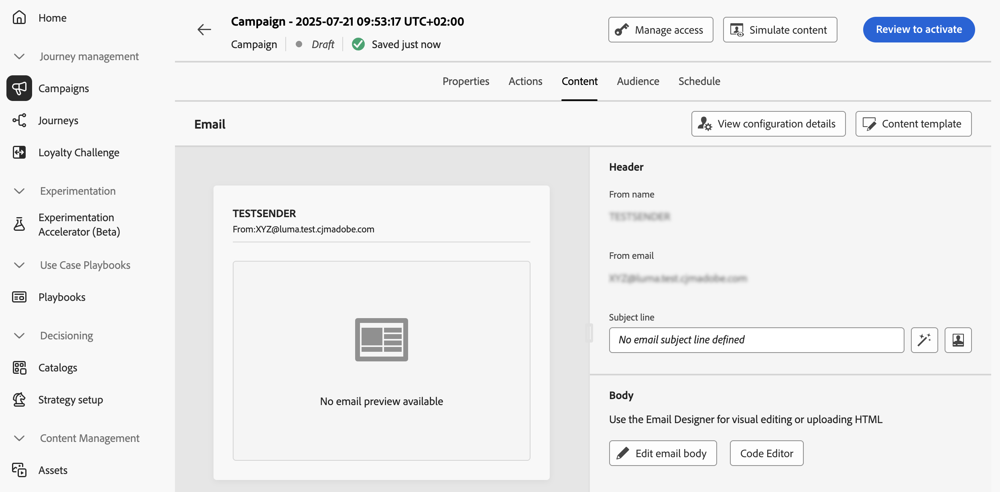
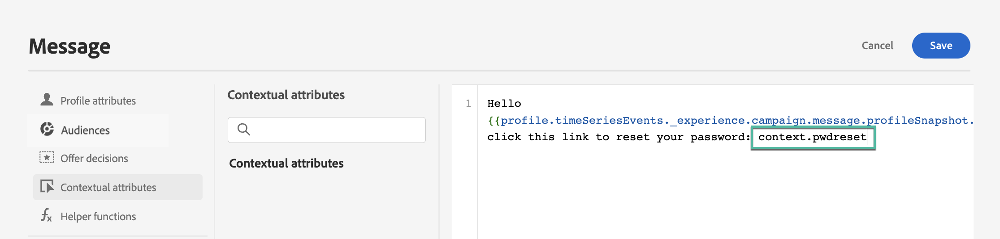
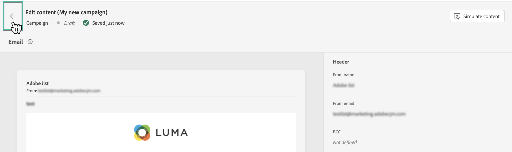

# Edit the API triggered campaign content {#api-content}

To configure the message content, navigate to the **[!UICONTROL Content]** tab or click the **[!UICONTROL Edit content]** button.

## Design the content {#design}

The content creation process depends on the channel you selected. Learn detailed steps to create your message content in the following pages:

<table style="table-layout:fixed"><tr style="border: 0;">
<td>

<a href="../email/create-email.md"><strong>Email</strong></a>
</td>
<td>

<a href="../sms/create-sms.md"><strong>SMS</strong></a>
</td>
<td>

<a href="../push/create-push.md"><strong>Push notification</strong></a>
</td>
</tr></table>

## Personalize content using contextual data {#contextual}

You can pass additional data into the API payload that you can leverage to personalize your message.

Let's take this example, where customers want to reset their password, and you want to send them a password reset URL that is generated in a third-party tool. With API-triggered campaigns, you can pass this generated URL into the API payload, and leverage it into the campaign to add it into the message.

To do this, you need to pass them into the API payload, and add them in your message using the personalization editor. Use the `{{context.<contextualAttribute>}}` syntax, where `<contextualAttribute>` should match the name of the variable in your API payload containing the data that you want to pass.

Note that, for now, no contextual attribute is available for use in the left rail menu. Attributes must be typed directly in your personalization expression, with no check being performed by [!DNL Journey Optimizer].

**Must read**

* The contextual attributes passed into the request cannot exceed 200kb and are always consider of type string.
* The `context.system` syntax is restricted to Adobe internal usage only, and should not be used to pass contextual attributes.
* Unlike profile-enabled events, the contextual data passed in the REST API is used for one-off communication and not stored against profile. At maximum, profile is created with the namespace details, if it was found missing.
* Using a large number or heavy contextual data in your content may impact performances.

## Test and check your content

Once your content is defined, use the **[!UICONTROL Simulate content]** button to preview and test your content with test profiles or sample input data uploaded from a CSV / JSON file, or added manually. [Learn how to preview and test content](../content-management/preview-test.md). To browse back to the campaign creation screen, click the left arrow.

## Next steps {#next}

Once your campaign configuration and content are ready, you can define the campaign audience. [Learn more](api-triggered-campaign-audience.md)
