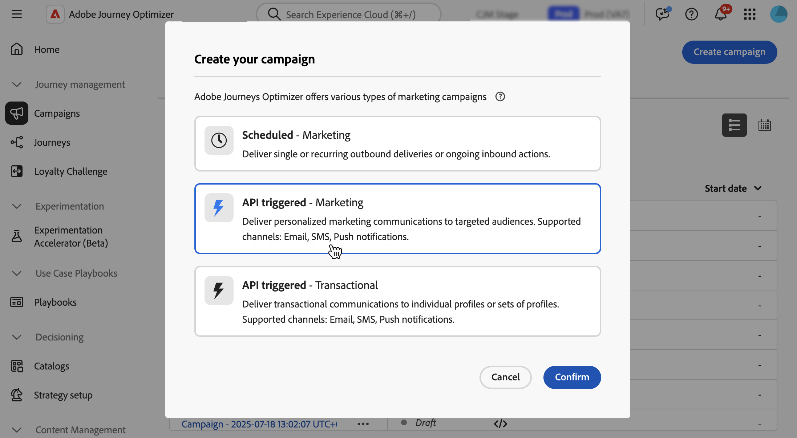
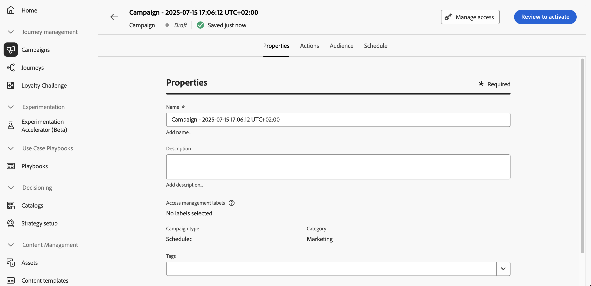

# Define the API triggered campaign properties {#api-properties}

To create a new API triggered campaign, follow these steps:

1. Browse to the **[!UICONTROL Campaigns]** menu and select the **[!UICONTROL API triggered]** tab.

1. Click the **[!UICONTROL Create campaign]** button and select the campaign type:

    * **[!UICONTROL API triggered - Marketing]** -  Select this type of API triggered campaign to send personalized marketing communications to targeted audiences.

    * **[!UICONTROL API triggered - Transactional]** - Transactional campaigns are aimed at sending transactional messags, i.e. messages sent out following an action performed by an individual: password reset request, cart purchase, etc.

    
 
1. In the **[!UICONTROL Properties]** tab, enter a name and a description for your campaign.

    

1. Use the **Tags** field to assign Adobe Experience Platform Unified Tags to your campaign. This allows you to easily classify them and improve search from the campaigns list. [Learn how to work with tags](../start/search-filter-categorize.md#tags).

1. You can limit the access to this campaign based on access labels. To add an access limitation, browse to the **[!UICONTROL Manage access]** button at the top of this page. Make sure to select only labels you have permission for. [Learn more about Object Level Access Control](../administration/object-based-access.md).

## Next steps {#next}

Once your campaign configuration and content are ready, you can configure its action. [Learn more](api-triggered-campaign-action.md)
