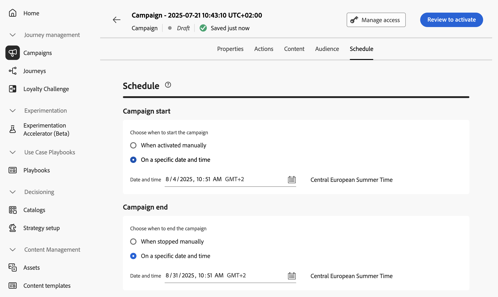

# Schedule the API triggered campaign {#api-schedule}

Use the **[!UICONTROL Schedule]** tab to define the campaign schedule.

## Set start and end dates

By default, API triggered campaigns start once they are triggered, and end as soon as the message has been sent once. If you do not want to execute your campaign right after it is triggered, you can specify a date and time at which the message should be sent using the **[!UICONTROL Campaign start]** option.

The **[!UICONTROL Campaign end]** option allows you to specify when a campaign should stop being executed. Outside of the specified dates, the campaign will not be executed.

>[!NOTE]
>
>When scheduling campaigns in [!DNL Adobe Journey Optimizer], ensure your start date/time aligns with the desired first delivery.

## Set rate control

[!DNL Journey Optimizer] allows you to enable rate control for outbound actions (Email, SMS, Push notifications).

This feature is particularly useful for preventing overload on downstream systems, such as landing pages or customer care platforms. For example, you can set a rate limit of 165 messages per second to ensure steady delivery without overwhelming downstream systems.

To set rate control, enable the **[!UICONTROL Throttle delivery]** option in the **[!UICONTROL Delivery settings]** section and specify the desired **[!UICONTROL Delivery rate]** per second.

* Minimum delivery rate supported: 1 per second.
* Maximum delivery rate supported: 2000 per second when the "Throttle delivery" option is enabled.

>[!IMPORTANT]
>
>When setting a delivery rate, the maximum timeframe for which campaign audience can execute is 12 hours. If the delivery rate is set to a value which does not allow all the audience to be sent the message in the 12 hour timeframe, then the remaining profiles would be excluded from the campaign. You can see the count of these excluded profiles in the campaign report.

## Next steps {#next}

Once your campaign configuration and content are ready, you can review and activate it. [Learn more](../campaigns/review-activate-api-triggered-campaign.md)
