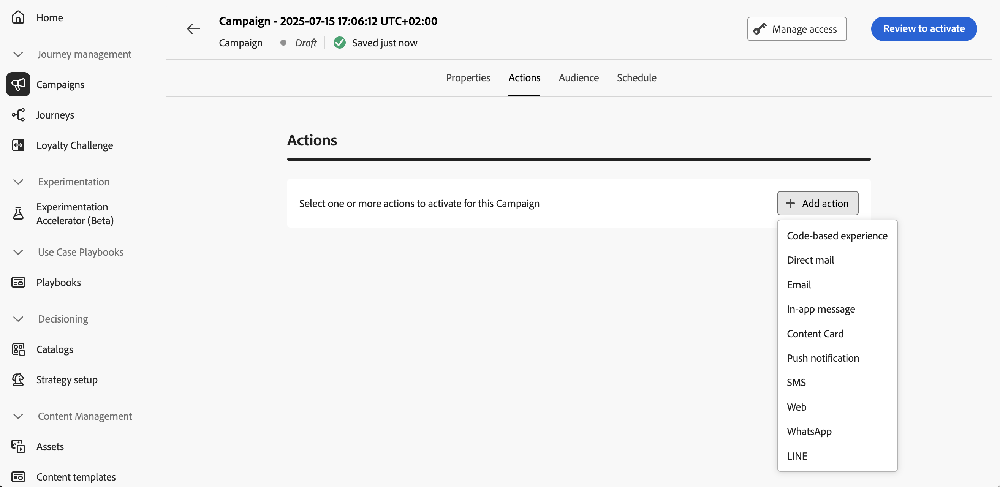
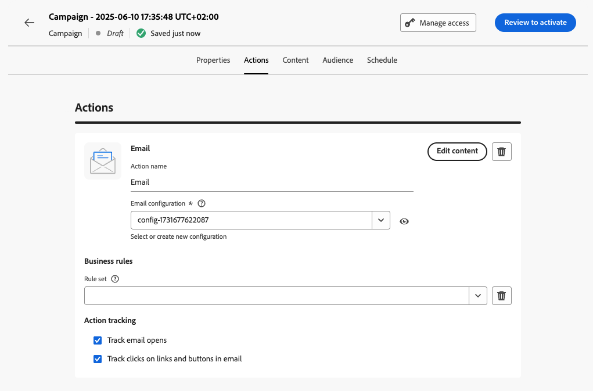
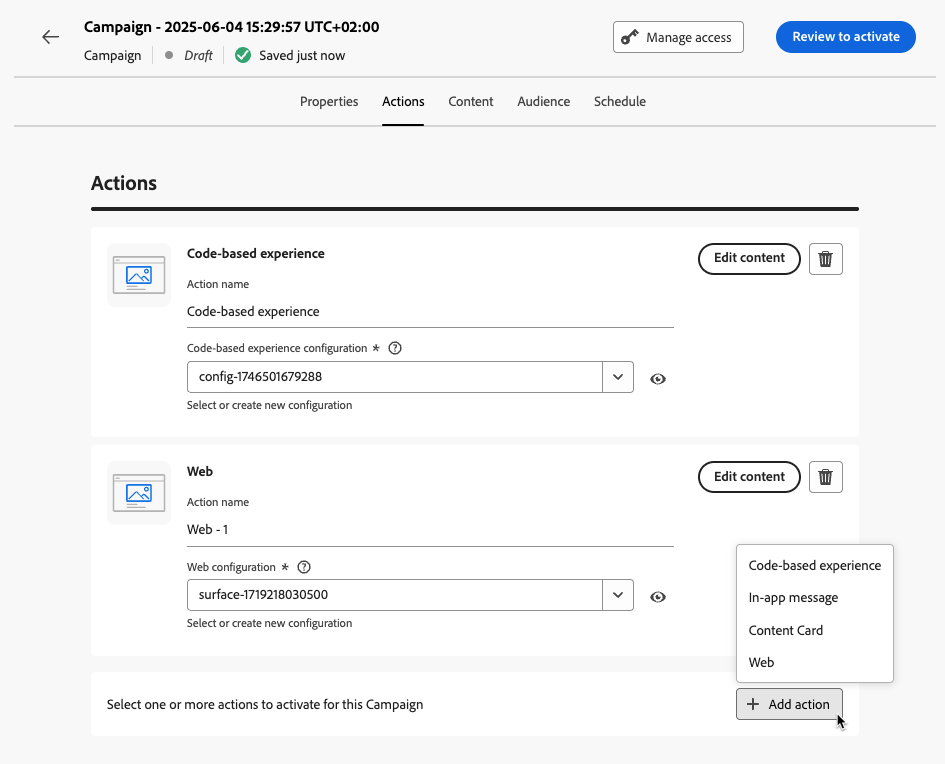

# Configure the campaign action {#action-campaign-action}

Use the **[!UICONTROL Actions]** tab to select a channel configuration for your message and configure additional settings such as tracking, content experiment, or multilingual content.

1. **Choose the channel**

    Navigate to the **[!UICONTROL Actions]** tab, click the **[!UICONTROL Add action]** button and select the communication channel. 

    

    >[!NOTE]
    >
    >Available channels vary based on your licensing model and add-ons.

    If you select an inbound channel (Code-based experience, In-app message, Content Card or Web action), you can add more inbound actions - for a total of up to 10 actions in a single campaign. [Learn how](#multi-action)

1. **Select a channel configuration**

    A configuration is defined by a [System Administrator](../start/path/administrator.md). It contains all the technical parameters for sending the message, such as header parameters, subdomain, mobile apps, etc. [Learn how to set up channel configurations](../configuration/channel-surfaces.md)
    
    

1. **Leverage Optimization**

    Use the **[!UICONTROL Message Optimization]** section to run content experiments, leverage targeting rules, or use advanced combinations of both experimentation and targeting. These different options and the steps to follow are detailed in this section: [Optimization in campaigns](campaigns-message-optimization.md).
<!--
1. **Create a content experiment**

    Use the **[!UICONTROL Content experiment]** section to define multiple delivery treatments in order to measure which one performs best for your target audience. Click the **[!UICONTROL Create experiment]** button then follow the steps detailed in this section: [Create a content experiment](../content-management/content-experiment.md).-->

1. **Add multilingual content**

    Use the **[!UICONTROL Languages]** section to create content in multiple languages within your campaign. To do so, click the **[!UICONTROL Add languages]** button and select the desired **[!UICONTROL Language settings]**. Detailed information on how to set up and use multilingual capabilities are available in this section: [Get started with multilingual content](../content-management/multilingual-gs.md).

Additional settings are available depending on the selected communication channel. Expand the sections below for more information.

+++**Apply capping rules** (Email, Direct mail, Push, SMS)

In the **[!UICONTROL Business rules]** drop-down list, select a rule set to apply capping rules to your campaign. Leveraging channel rule sets allows you you to set frequency capping by communication type to prevent overloading customers with similar messages. [Learn how to work with rule sets](../conflict-prioritization/rule-sets.md)

+++

+++**Track engagement** (Email, SMS).

Use the **[!UICONTROL Action tracking]** section to track how your recipients react to your email or SMS deliveries. Tracking results are accessible from the campaign report once the campaign has been executed. [Learn more about campaign reports](../reports/campaign-global-report-cja.md)

+++

+++**Enable Rapid delivery mode** (Push).

Rapid delivery mode is a [!DNL Journey Optimizer] add-on that allows very fast push message sending in large volumes though campaigns. Rapid delivery is used when delay in message delivery is business-critical, when you want to send an urgent push alert on mobile phones, for example a breaking news to users who have installed your news channel app. For more information on performances when using Rapid delivery mode, refer to [Adobe Journey Optimizer product description](https://helpx.adobe.com/legal/product-descriptions/adobe-journey-optimizer.html).

+++

+++**Assign priority scores** (Web, In-app, Code-based)

Assign a priority score to the campaign allows you to prioritize an inbou nd campaign when there is an imposed constraint such as a frequency cap. Enter a numeric value (from 0-100). Please note, the higher the number, the higher the priority. [Learn how to assign priority scores to journeys & campaigns](../conflict-prioritization/priority-scores.md)

+++

+++**Set additional delivery rules** (Content cards)

For content card campaigns, you can enable additional delivery rules to choose the event(s) and criteria which trigger your message. [Learn how to create content cards](../content-card/create-content-card.md)

+++

+++**Define triggers** (In-app)

For in-app messages, you can use the **[!UICONTROL Edit triggers]** button to choose the event(s) and criteria which trigger your message. [Learn how to create an In-app message](../in-app/create-in-app.md)

+++

## Add multiple inbound actions {#multi-action}

>[!CONTEXTUALHELP]
>id="ajo_multi_action"
>title="Add multiple inbound actions"
>abstract="You can select several inbound actions inside a single campaign. This capability enables you to deliver multiple Code-based experiences, In-app messages, Content Cards or Web actions to different locations at the same time, each action containing a specific content."

To simplify your campaign orchestration, you can define several inbound actions inside a single campaign, each action containing a specific content.

>[!NOTE]
>
>This capacity is only available for inbound channels. Currently outbound channels such as Email are not supported.

This capacity enables you to deliver various Code-based experiences, In-app messages, Content Cards or Web actions to different locations at the same time, without the need to create multiple campaigns. It makes the deployment of your campaign easier and allows for smoother reporting, with all the data consolidated into one single campaign.

For example, you can send a code-based experience to multiple endpoints with slightly different contents. To do this, create multiple code-based actions within the same campaign, each with a different endpoint configuration.

To define several inbound actions in a campaign, follow the steps below.

1. Select an inbound action (**Code-based experience**, **In-app message**, **Content Card** or **Web**) from the **[!UICONTROL Actions]** section.

1. Select the channel configuration and define a specific content for that action.

1. Use the **[!UICONTROL Add action]** button to select another inbound action from the drop-down list.

    {width="80%"}

1. Proceed similarly to add more actions. You can add up to 10 inbound actions in a campaign.

Once the campaign is [live](review-activate-campaign.md), all actions are activated simultaneously.

## Next steps {#next}

Once your campaign action is ready, you can design its content. [Learn more](campaign-content.md)
