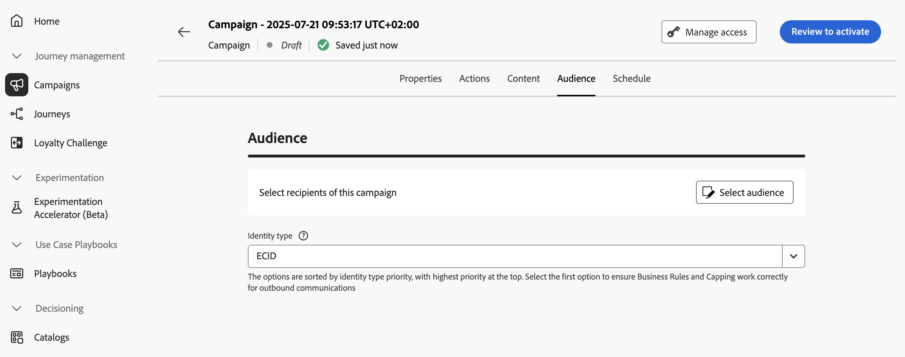

# Define the Action campaign audience {#action-campaign-audience}

Use the **[!UICONTROL Audience]** tab to define the campaign audience.

1. **Select the audience**

    For Marketing campaigns, click the **[!UICONTROL Select audience]** button to display the list of available Adobe Experience Platform audiences. [Learn more about audiences](../audience/about-audiences.md).

    >[!IMPORTANT]
    >
    >The use of audiences and attributes from [audience composition](../audience/get-started-audience-orchestration.md) is currently unavailable for use with Healthcare Shield or Privacy and Security Shield.

1. **Select the identity type**

    In the **[!UICONTROL Identity type]** field, choose the type of key to use to identify the individuals from the selected audience. You can either use an existing identity type or create a new one using the Adobe Experience Platform Identity Service. Standard Identity namespaces are listed on [this page](https://experienceleague.adobe.com/en/docs/experience-platform/identity/features/namespaces#standard){target="_blank"}. 

    Only one identity type is allowed per campaign. Individuals belonging to a segment that does not have the selected identity type among their different identities cannot be targeted by the campaign. Learn more about identity types and namespaces in the [Adobe Experience Platform documentation](https://experienceleague.adobe.com/docs/experience-platform/identity/home.html){target="_blank"}. 

## Next steps {#next}

Once the audience of your Action campaign is ready, you can schedule the campaign. [Learn more](campaign-schedule.md)
