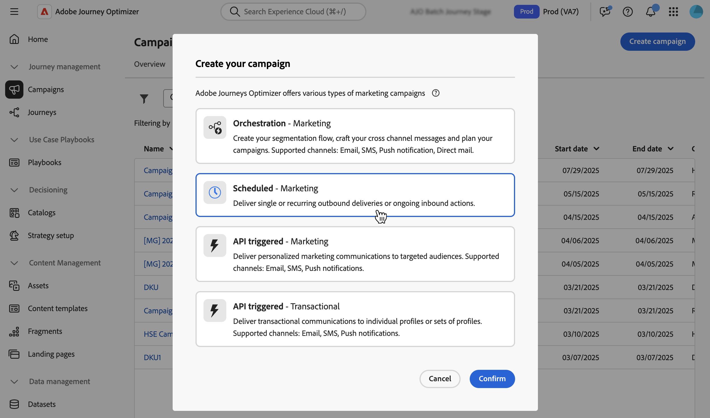

# Define the Action campaign properties {#action-campaign-properties}

To create an Action campaign and define its properties, follow these steps:

1. Browse to the **[!UICONTROL Campaigns]** menu and select the **[!UICONTROL Action]** tab.

1. Click the **[!UICONTROL Create campaign]** button and select the **[!UICONTROL Scheduled - Marketing]** campaign type.

    
 
1. In the **[!UICONTROL Properties]** tab, enter a name and a description for your campaign.

    

1. Use the **Tags** field to assign Adobe Experience Platform Unified Tags to your campaign. This allows you to easily classify them and improve search from the campaigns list. [Learn how to work with tags](../start/search-filter-categorize.md#tags).

1. You can limit the access to this campaign based on access labels. To add an access limitation, browse to the **[!UICONTROL Manage access]** button at the top of this page. Make sure to select only labels you have permission for. [Learn more about Object Level Access Control](../administration/object-based-access.md).

## Next steps {#next}

Once your Action campaign is created and configured, you can configure its action. [Learn more](campaign-action.md)
