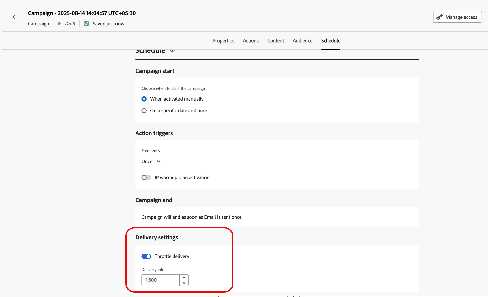
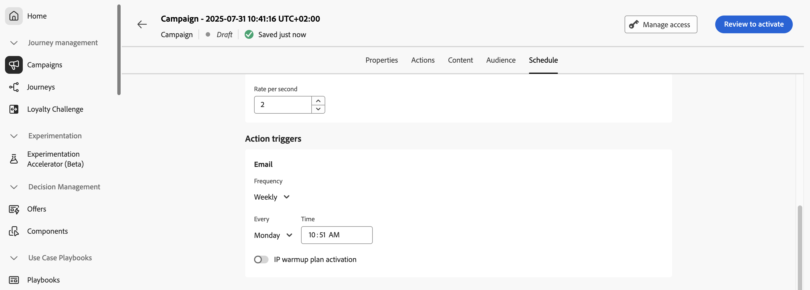

# Schedule the Action campaign {#action-campaign-schedule}

Use the **[!UICONTROL Schedule]** tab to define the campaign schedule.

## Set start and end dates

By default, Action campaigns start once they are activated manually, and end as soon as the message has been sent once. If you do not want to execute your campaign right after its activation, you can specify a date and time at which the message should be sent using the **[!UICONTROL Campaign start]** option.

The **[!UICONTROL Campaign end]** option allows you to specify when a campaign should stop being executed. Outside of the specified dates, the campaign will not be executed.

>[!NOTE]
>
>When scheduling campaigns in [!DNL Adobe Journey Optimizer], ensure your start date/time aligns with the desired first delivery. For recurring campaigns, if the initial scheduled time has already passed, the campaigns will roll over to the next available time slot according to their recurrence rules.

## Set rate control

[!DNL Journey Optimizer] allows you to enable rate control for outbound actions (Email, SMS, Push notifications).

This feature is particularly useful for preventing overload on downstream systems, such as landing pages or customer care platforms. For example, you can set a rate limit of 165 messages per second to ensure steady delivery without overwhelming downstream systems.

To set rate control, enable the **[!UICONTROL Throttle delivery]** option in the **[!UICONTROL Delivery settings]** section and specify the desired **[!UICONTROL Delivery rate]** per second.

* Minimum delivery rate supported: 1 per second.
* Maximum delivery rate supported: 2000 per second when the "Throttle delivery" option is enabled.

>[!IMPORTANT]
>
>When setting a delivery rate, the maximum timeframe for which campaign audience can execute is 12 hours. If the delivery rate is set to a value which does not allow all the audience to be sent the message in the 12 hour timeframe, then the remaining profiles would be excluded from the campaign. You can see the count of these excluded profiles in the campaign report.

## Set an execution frequency

For Email, SMS, and Push notification actions, you can define a frequency at which the campaign's message should be sent. To do this, use the **[!UICONTROL Action triggers]** options in the campaign creation screen to specify if the campaign should be executed daily, weekly, or monthly.

## Set IP warmup plans

For email actions, you can create specific IP warmup plan activation campaigns. The campaign schedule will be driven by the IP warmup plan it will be associated with, meaning that the schedule is not defined anymore in the campaign itself. [Learn how to create IP warmup campaigns](../configuration/ip-warmup-campaign.md).

## Next steps {#next}

Once your campaign schedule is ready, you can review and activate the campaign. [Learn more](review-activate-campaign.md)
