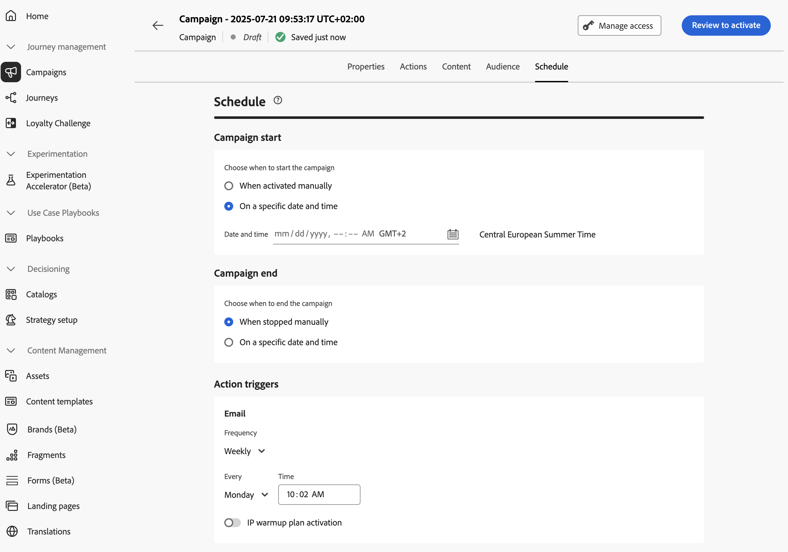

# Schedule the action campaign {#action-campaign-schedule}

Use the **[!UICONTROL Schedule]** tab to define the campaign schedule.

By default, action campaigns start once they are activated manually, and end as soon as the message has been sent once. If you do not want to execute your campaign right after its activation, you can specify a date and time at which the message should be sent using the **[!UICONTROL Campaign start]** option.

The **[!UICONTROL Campaign end]** option allows you to specify when a campaign should stop being executed. Outside of the specified dates, the campaign will not be executed.

>[!NOTE]
>
>When scheduling campaigns in [!DNL Adobe Journey Optimizer], ensure your start date/time aligns with the desired first delivery. For recurring campaigns, if the initial scheduled time has already passed, the campaigns will roll over to the next available time slot according to their recurrence rules.

Additional scheduling options are available based on the campaign channel:

* **Frequency** (Email, SMS, Push action)

    You can define a frequency at which the campaign's message should be sent. To do this, use the **[!UICONTROL Action triggers]** options in the campaign creation screen to specify if the campaign should be executed daily, weekly, or monthly.

* **IP warmup plan activation** (Email)

    For Email campaigns, you can create specific IP warmup plan activation campaigns. The campaign schedule will be driven by the IP warmup plan it will be associated with, meaning that the schedule is not defined anymore in the campaign itself. [Learn how to create IP warmup campaigns](../configuration/ip-warmup-campaign.md).

## Next steps {#next}

Once your campaign schedule is ready, you can review and activate the campaign. [Learn more](review-activate-campaign.md)
