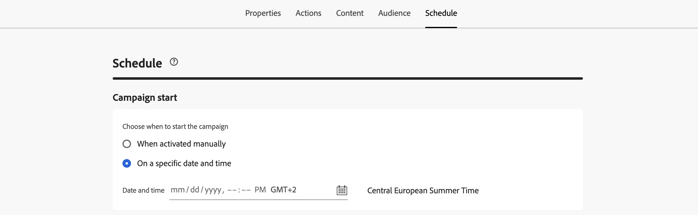
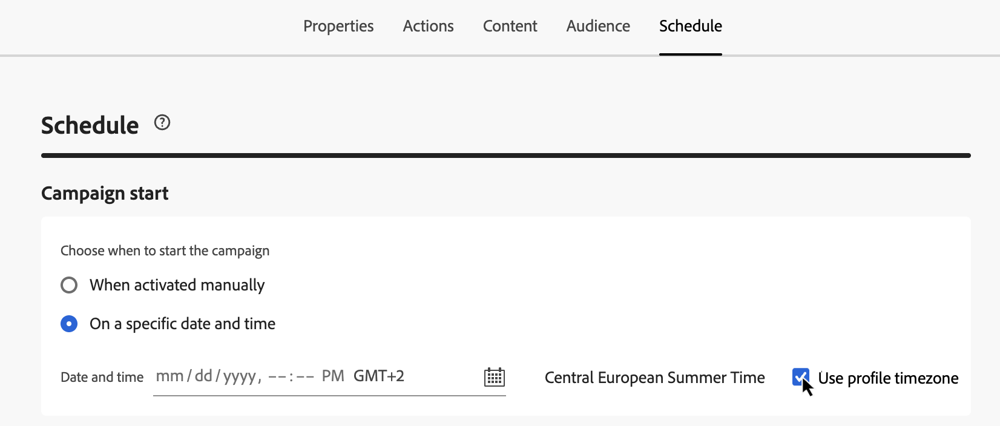
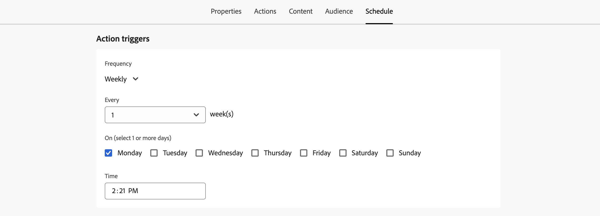
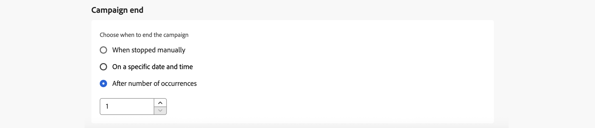

# Schedule the Action campaign {#action-campaign-schedule}

Use the **[!UICONTROL Schedule]** tab to define the campaign schedule.

## Set a campaign start date

By default, Action campaigns start once they are activated manually, and end as soon as the message has been sent once. If you do not want to execute your campaign right after its activation, you can specify a date and time at which the message should be sent in the **[!UICONTROL Campaign start]** section.

When scheduling campaigns in [!DNL Adobe Journey Optimizer], ensure your start date/time aligns with the desired first delivery. For recurring campaigns, if the initial scheduled time has already passed, the campaigns will roll over to the next available time slot according to their recurrence rules.

## Send at recipient's local time {#profile-timezone}

>[!CONTEXTUALHELP]
>id="ajo_campaigns_schedule_profile_timezone"
>title="Use profile timezone"
>abstract="Send messages based on each recipient's profile timezone. All recipients will receive the message at the same local time, regardless of their geographic location. The system uses the "timeZone" field from Adobe Experience Platform profiles, with the campaign creator's timezone as fallback."

When scheduling a campaign for a specific date and time, you can choose to send messages based on each recipient's profile timezone. This ensures that all recipients receive the message at the same local time, regardless of their geographic location.

For example, if you schedule a campaign to send at 9 AM using profile timezone, recipients in New York (ET) will receive it at 9 AM ET, while recipients in Los Angeles (PT) will receive it at 9 AM PT.

>[!AVAILABILITY]
>
>Scheduling using profile time zones is available for these outbound channels only: Email, Push, SMS, WhatsApp, and LINE.

To enable profile timezone scheduling:

1. In the **[!UICONTROL Campaign start]** section, specify the date and time when the message should be sent.

1. Enable the **[!UICONTROL Use profile timezone]** option.

   

**How it works:**

The system uses the `profile.timeZone` field from each recipient's Adobe Experience Platform profile to determine their local timezone. If a profile does not have a timezone value, the system uses the timezone in which the campaign was created as the fallback.

The campaign remains in **Live** status while messages are being delivered across all timezones. Once all timezones have been processed, the campaign status changes to **Completed**.

**Supported time zone identifiers:**

The `profile.timeZone` format can be either IANA naming or defined as UTC offsets. IANA naming is the preferred format, as it automatically adjusts for daylight-saving rules.

For IANA naming, the identifiers are case-sensitive and must match the official IANA naming. Offsets can change over time due to daylight-saving rules and historical updates. Refer to the [IANA Time Zone Database](https://www.iana.org/time-zones){_blank} for the official list of identifiers.

## Set an execution frequency

For **Email**, **SMS**, and **Push notification** actions, you can define a frequency at which the campaign's message should be sent. To do this, use the **[!UICONTROL Action triggers]** options in the campaign creation screen to specify if the campaign should be executed daily, weekly, or monthly.

>[!NOTE]
>
>For **email** actions, you can create specific IP warmup plan activation campaigns. The campaign schedule will be driven by the IP warmup plan it will be associated with, meaning that the schedule is not defined anymore in the campaign itself. [Learn how to create IP warmup campaigns](../configuration/ip-warmup-campaign.md).

## Set an end date

The **[!UICONTROL Campaign end]** section allows you to specify when a campaign should stop being executed. Outside of the specified dates, the campaign will not be executed.

## Set rate control

[!DNL Journey Optimizer] allows you to enable rate control for outbound actions (Email, SMS, Push notifications).

This feature is particularly useful for preventing overload on downstream systems, such as landing pages or customer care platforms. For example, you can set a rate limit of 165 messages per second to ensure steady delivery without overwhelming downstream systems.

To set rate control, enable the **[!UICONTROL Throttle delivery]** option in the **[!UICONTROL Delivery settings]** section and specify the desired **[!UICONTROL Delivery rate]** per second.

* Minimum delivery rate supported: 1 per second.
* Maximum delivery rate supported: 2000 per second when the "Throttle delivery" option is enabled.

>[!IMPORTANT]
>
>When setting a delivery rate, the maximum timeframe for which campaign audience can execute is 12 hours. If the delivery rate is set to a value which does not allow all the audience to be sent the message in the 12 hour timeframe, then the remaining profiles would be excluded from the campaign. You can see the count of these excluded profiles in the campaign report.

## Next steps {#next}

Once your campaign schedule is ready, you can review and activate the campaign. [Learn more](review-activate-campaign.md)
